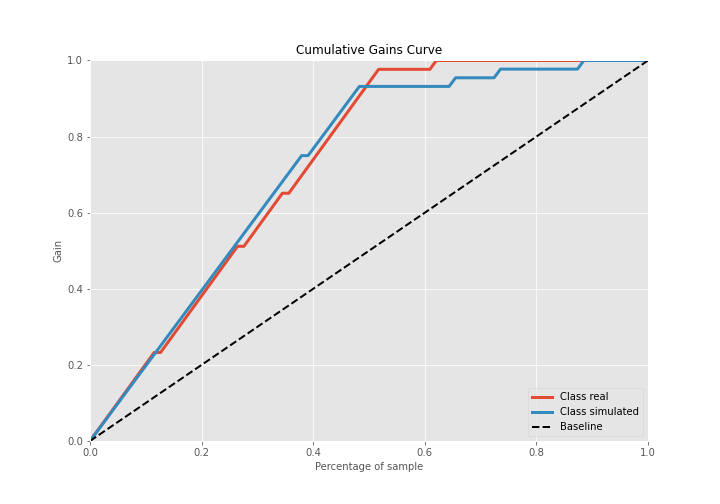

# Summary of 3_Linear

[<< Go back](../README.md)

## Logistic Regression (Linear)
- **n_jobs**: -1
- **explain_level**: 2

## Validation
 - **validation_type**: split
 - **train_ratio**: 0.75
 - **shuffle**: True
 - **stratify**: True

## Optimized metric
accuracy

## Training time

3.9 seconds

## Metric details
|           |    score |     threshold |
|:----------|---------:|--------------:|
| logloss   | 0.33193  | nan           |
| auc       | 0.959302 | nan           |
| f1        | 0.953488 |   0.678663    |
| accuracy  | 0.954023 |   0.678663    |
| precision | 1        |   0.918617    |
| recall    | 1        |   5.56832e-07 |
| mcc       | 0.909043 |   0.678663    |

## Confusion matrix (at threshold=0.678663)
|                      |   Predicted as real |   Predicted as simulated |
|:---------------------|--------------------:|-------------------------:|
| Labeled as real      |                  42 |                        1 |
| Labeled as simulated |                   3 |                       41 |

## Learning curves

## Coefficients
| feature                           |   Learner_1 |
|:----------------------------------|------------:|
| return_mean2                      |    1.70595  |
| sqreturn_correlation_ts1_lag_0    |    0.885162 |
| return_correlation_ts1_lag_0      |    0.885162 |
| return_autocorrelation_1_lag3     |    0.830741 |
| return_skew2                      |    0.777967 |
| return_autocorrelation_1_lag1     |    0.59342  |
| return_autocorrelation_1_lag2     |    0.562885 |
| return_skew1                      |    0.550088 |
| return_autocorrelation_2_lag3     |    0.539994 |
| return_correlation_ts1_lag_2      |    0.516429 |
| sqreturn_correlation_ts1_lag_2    |    0.516429 |
| sqreturn_correlation_ts2_lag_1    |    0.487544 |
| return_correlation_ts2_lag_1      |    0.487544 |
| sqreturn_correlation_ts2_lag_3    |    0.451171 |
| return_correlation_ts2_lag_3      |    0.451171 |
| return_autocorrelation_2_lag1     |    0.373521 |
| sqreturn_correlation_ts1_lag_1    |    0.372442 |
| return_correlation_ts1_lag_1      |    0.372442 |
| return_autocorrelation_2_lag2     |    0.328599 |
| sqreturn_correlation_ts1_lag_3    |    0.283206 |
| return_correlation_ts1_lag_3      |    0.283206 |
| return_sd2                        |    0.124062 |
| return_correlation_ts2_lag_2      |   -0.132319 |
| sqreturn_correlation_ts2_lag_2    |   -0.132319 |
| price1_granger_cause_price2       |   -0.134942 |
| return_sd1                        |   -0.201059 |
| intercept                         |   -0.29692  |
| return_kurtosis2                  |   -0.729017 |
| price2_granger_cause_price1       |   -1.19287  |
| sqreturn_autocorrelation_ts2_lag3 |   -1.21991  |
| sqreturn_autocorrelation_ts1_lag3 |   -1.291    |
| sqreturn_autocorrelation_ts2_lag2 |   -1.4141   |
| sqreturn_autocorrelation_ts1_lag2 |   -1.70421  |
| return_kurtosis1                  |   -1.77343  |
| sqreturn_autocorrelation_ts1_lag1 |   -1.96698  |
| return_mean1                      |   -1.99755  |
| sqreturn_autocorrelation_ts2_lag1 |   -2.40392  |

## Permutation-based Importance

## Confusion Matrix

## Normalized Confusion Matrix

## ROC Curve

## Kolmogorov-Smirnov Statistic

## Precision-Recall Curve

## Calibration Curve

## Cumulative Gains Curve

## Lift Curve

## SHAP Importance

## SHAP Dependence plots

### Dependence (Fold 1)

## SHAP Decision plots

### Top-10 Worst decisions for class 0 (Fold 1)

### Top-10 Best decisions for class 0 (Fold 1)

### Top-10 Worst decisions for class 1 (Fold 1)

### Top-10 Best decisions for class 1 (Fold 1)

[<< Go back](../README.md)
