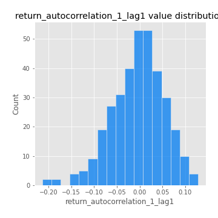

# Exploratory Data Analysis

[<< Go back](../README.md)
## Feature : target
- **Feature type** : categorical
- **Missing** : 0.0%
- **Unique** : 2
- **Count** :347
- **Unique** :2
- **Top** :simulated
- **Freq** :176

## Feature : return_mean1
- **Feature type** : continous
- **Missing** : 0.0%
- **Unique** : 347
- **Count** :347.0
- **Mean** :0.018737903573868092
- **Std** :0.10693605751054712
- **Min** :-0.361796804023381
- **25%th Percentile** : -0.040707248525205825
- **50%th Percentile** : 0.027904988081709176
- **75%th Percentile** : 0.0842939505845483
- **Max** :0.37175100008111034

## Feature : return_mean2
- **Feature type** : continous
- **Missing** : 0.0%
- **Unique** : 347
- **Count** :347.0
- **Mean** :0.10335920311184267
- **Std** :0.10103032139271825
- **Min** :-0.24205418062825398
- **25%th Percentile** : 0.0437677159325527
- **50%th Percentile** : 0.09771825469522993
- **75%th Percentile** : 0.16694783016777484
- **Max** :0.3852921902528559

## Feature : return_sd1
- **Feature type** : continous
- **Missing** : 0.0%
- **Unique** : 347
- **Count** :347.0
- **Mean** :1.748855895916497
- **Std** :0.5705221993995964
- **Min** :0.7470080772831957
- **25%th Percentile** : 1.548065762338169
- **50%th Percentile** : 1.6382884620895
- **75%th Percentile** : 1.756803102827581
- **Max** :6.495661311240861

## Feature : return_sd2
- **Feature type** : continous
- **Missing** : 0.0%
- **Unique** : 347
- **Count** :347.0
- **Mean** :1.8608151774102666
- **Std** :0.7190391480958533
- **Min** :0.8592887433004143
- **25%th Percentile** : 1.610454899981429
- **50%th Percentile** : 1.7637352298990345
- **75%th Percentile** : 1.8761833330016526
- **Max** :6.737618636746393

## Feature : return_skew1
- **Feature type** : continous
- **Missing** : 0.0%
- **Unique** : 347
- **Count** :347.0
- **Mean** :-0.041855158222670996
- **Std** :0.6192117828388244
- **Min** :-3.530116233761814
- **25%th Percentile** : -0.20901667657171455
- **50%th Percentile** : -0.01348054586559904
- **75%th Percentile** : 0.18998242032569013
- **Max** :2.5845963767725557

## Feature : return_skew2
- **Feature type** : continous
- **Missing** : 0.0%
- **Unique** : 347
- **Count** :347.0
- **Mean** :-0.1268194088238816
- **Std** :0.7099731005641421
- **Min** :-5.778144124281153
- **25%th Percentile** : -0.3543188612582411
- **50%th Percentile** : -0.053138485486596373
- **75%th Percentile** : 0.17482085851533136
- **Max** :2.242019525651531

## Feature : return_kurtosis1
- **Feature type** : continous
- **Missing** : 0.0%
- **Unique** : 347
- **Count** :347.0
- **Mean** :3.7926933145641004
- **Std** :5.776799163100791
- **Min** :-0.28236364091236377
- **25%th Percentile** : 0.7705100767601973
- **50%th Percentile** : 1.6972865672420103
- **75%th Percentile** : 3.9931867165732964
- **Max** :36.91113889081053

## Feature : return_kurtosis2
- **Feature type** : continous
- **Missing** : 0.0%
- **Unique** : 347
- **Count** :347.0
- **Mean** :4.473533674084126
- **Std** :6.590790720344235
- **Min** :-0.2556413613284434
- **25%th Percentile** : 1.1157826940398992
- **50%th Percentile** : 2.3354098866976387
- **75%th Percentile** : 4.971654114879836
- **Max** :71.39844769176813

## Feature : return_autocorrelation_1_lag1
- **Feature type** : continous
- **Missing** : 0.0%
- **Unique** : 347
- **Count** :347.0
- **Mean** :-0.003733430893074293
- **Std** :0.058063867646746925
- **Min** :-0.2135576224968752
- **25%th Percentile** : -0.038876360276508454
- **50%th Percentile** : 0.0021379971675636045
- **75%th Percentile** : 0.03554739303651501
- **Max** :0.12810656890648087

## Feature : return_autocorrelation_1_lag2
- **Feature type** : continous
- **Missing** : 0.0%
- **Unique** : 347
- **Count** :347.0
- **Mean** :0.001831903750951256
- **Std** :0.05018375305381063
- **Min** :-0.13309283796645122
- **25%th Percentile** : -0.031147903340021335
- **50%th Percentile** : 0.0036474418399249087
- **75%th Percentile** : 0.033007575754924315
- **Max** :0.1561488228015672

## Feature : return_autocorrelation_1_lag3
- **Feature type** : continous
- **Missing** : 0.0%
- **Unique** : 347
- **Count** :347.0
- **Mean** :0.0045741673993058155
- **Std** :0.05218717325470289
- **Min** :-0.1940836867390813
- **25%th Percentile** : -0.027411751660452326
- **50%th Percentile** : 0.0077211936287295896
- **75%th Percentile** : 0.03833972622272526
- **Max** :0.17805869530681923

## Feature : return_autocorrelation_2_lag1
- **Feature type** : continous
- **Missing** : 0.0%
- **Unique** : 347
- **Count** :347.0
- **Mean** :-0.00659610443397255
- **Std** :0.062047397884583216
- **Min** :-0.25075531010123286
- **25%th Percentile** : -0.03771239782327189
- **50%th Percentile** : -0.0007150581423045594
- **75%th Percentile** : 0.030909353589495148
- **Max** :0.31863413537898483

## Feature : return_autocorrelation_2_lag2
- **Feature type** : continous
- **Missing** : 0.0%
- **Unique** : 347
- **Count** :347.0
- **Mean** :-0.0010033817453303753
- **Std** :0.05319158496975519
- **Min** :-0.15472583251736052
- **25%th Percentile** : -0.03320959062915854
- **50%th Percentile** : -0.00346818367425317
- **75%th Percentile** : 0.03254436896925235
- **Max** :0.20974504043791217

## Feature : return_autocorrelation_2_lag3
- **Feature type** : continous
- **Missing** : 0.0%
- **Unique** : 347
- **Count** :347.0
- **Mean** :0.0005898393752055613
- **Std** :0.04979396192831241
- **Min** :-0.1344316177078651
- **25%th Percentile** : -0.03249196955787381
- **50%th Percentile** : 0.004172607979466221
- **75%th Percentile** : 0.03361169513870205
- **Max** :0.15001594130387869

## Feature : return_correlation_ts1_lag_0
- **Feature type** : continous
- **Missing** : 0.0%
- **Unique** : 347
- **Count** :347.0
- **Mean** :0.3392664450688228
- **Std** :0.11673261467655481
- **Min** :-0.027089510445801036
- **25%th Percentile** : 0.2800250495420903
- **50%th Percentile** : 0.3449748763921902
- **75%th Percentile** : 0.39716998787460134
- **Max** :0.7041861626832071

## Feature : return_correlation_ts1_lag_1
- **Feature type** : continous
- **Missing** : 0.0%
- **Unique** : 347
- **Count** :347.0
- **Mean** :-0.001518766164034148
- **Std** :0.05239520235577985
- **Min** :-0.16985510949917193
- **25%th Percentile** : -0.03752822531210838
- **50%th Percentile** : 0.0014913360691627712
- **75%th Percentile** : 0.036896487104859474
- **Max** :0.12528194948859256

## Feature : return_correlation_ts1_lag_2
- **Feature type** : continous
- **Missing** : 0.0%
- **Unique** : 347
- **Count** :347.0
- **Mean** :0.001918895993577619
- **Std** :0.04898855361619763
- **Min** :-0.21653581047581763
- **25%th Percentile** : -0.028150577281824938
- **50%th Percentile** : 0.0009685707217309875
- **75%th Percentile** : 0.037174413094446315
- **Max** :0.11888415648779874

## Feature : return_correlation_ts1_lag_3
- **Feature type** : continous
- **Missing** : 0.0%
- **Unique** : 347
- **Count** :347.0
- **Mean** :0.0028688132712319223
- **Std** :0.05059435358144796
- **Min** :-0.1270218498974763
- **25%th Percentile** : -0.03183984116802756
- **50%th Percentile** : 0.0006811362727924837
- **75%th Percentile** : 0.04034335644870113
- **Max** :0.1636773216468148

## Feature : return_correlation_ts2_lag_1
- **Feature type** : continous
- **Missing** : 0.0%
- **Unique** : 347
- **Count** :347.0
- **Mean** :-0.0014795048875214467
- **Std** :0.052740970499471185
- **Min** :-0.2081139431093261
- **25%th Percentile** : -0.03289570166082206
- **50%th Percentile** : -0.0004127633176453946
- **75%th Percentile** : 0.03655800045762543
- **Max** :0.17208763791364762

## Feature : return_correlation_ts2_lag_2
- **Feature type** : continous
- **Missing** : 0.0%
- **Unique** : 347
- **Count** :347.0
- **Mean** :0.0030022953964798735
- **Std** :0.04793946837982494
- **Min** :-0.11689832689418005
- **25%th Percentile** : -0.03152350104399079
- **50%th Percentile** : 0.0029611508281462496
- **75%th Percentile** : 0.03264885208092888
- **Max** :0.20772887392904255

## Feature : return_correlation_ts2_lag_3
- **Feature type** : continous
- **Missing** : 0.0%
- **Unique** : 347
- **Count** :347.0
- **Mean** :7.988633389307108e-05
- **Std** :0.05188251325453726
- **Min** :-0.17564076057312866
- **25%th Percentile** : -0.030211150419825215
- **50%th Percentile** : 0.0016080595009031686
- **75%th Percentile** : 0.0358978211082525
- **Max** :0.12827876559402182

## Feature : sqreturn_autocorrelation_ts1_lag1
- **Feature type** : continous
- **Missing** : 0.0%
- **Unique** : 347
- **Count** :347.0
- **Mean** :0.04862237503196613
- **Std** :0.09039615497601378
- **Min** :-0.09766032257328904
- **25%th Percentile** : -0.014433772219809637
- **50%th Percentile** : 0.02499641966225713
- **75%th Percentile** : 0.08155881368267934
- **Max** :0.4439086285737898

## Feature : sqreturn_autocorrelation_ts1_lag2
- **Feature type** : continous
- **Missing** : 0.0%
- **Unique** : 347
- **Count** :347.0
- **Mean** :0.04592350370209781
- **Std** :0.09473448328544494
- **Min** :-0.08837021679064444
- **25%th Percentile** : -0.01433959576434954
- **50%th Percentile** : 0.019026525573813947
- **75%th Percentile** : 0.06771142380041774
- **Max** :0.540735851444759

## Feature : sqreturn_autocorrelation_ts1_lag3
- **Feature type** : continous
- **Missing** : 0.0%
- **Unique** : 347
- **Count** :347.0
- **Mean** :0.034588451299038245
- **Std** :0.08222863203453899
- **Min** :-0.07903538248112114
- **25%th Percentile** : -0.017136350656199117
- **50%th Percentile** : 0.01106203088400828
- **75%th Percentile** : 0.05742600832193391
- **Max** :0.44755937369538146

## Feature : sqreturn_autocorrelation_ts2_lag1
- **Feature type** : continous
- **Missing** : 0.0%
- **Unique** : 347
- **Count** :347.0
- **Mean** :0.047260923097485606
- **Std** :0.08894952579794095
- **Min** :-0.08675157295144012
- **25%th Percentile** : -0.014280422485312028
- **50%th Percentile** : 0.024001793134355548
- **75%th Percentile** : 0.0844437327791894
- **Max** :0.4190090519891419

## Feature : sqreturn_autocorrelation_ts2_lag2
- **Feature type** : continous
- **Missing** : 0.0%
- **Unique** : 347
- **Count** :347.0
- **Mean** :0.04241552635840422
- **Std** :0.09197582198945049
- **Min** :-0.09912820460184293
- **25%th Percentile** : -0.012282483192242878
- **50%th Percentile** : 0.014126367459902492
- **75%th Percentile** : 0.062071961203342574
- **Max** :0.5373432415582473

## Feature : sqreturn_autocorrelation_ts2_lag3
- **Feature type** : continous
- **Missing** : 0.0%
- **Unique** : 347
- **Count** :347.0
- **Mean** :0.024137643121619805
- **Std** :0.07245386404731172
- **Min** :-0.08740889260973267
- **25%th Percentile** : -0.020189472276296305
- **50%th Percentile** : 0.0030819844838539073
- **75%th Percentile** : 0.043896678643169595
- **Max** :0.31225727797735664

## Feature : sqreturn_correlation_ts1_lag_0
- **Feature type** : continous
- **Missing** : 0.0%
- **Unique** : 347
- **Count** :347.0
- **Mean** :0.3392664450688228
- **Std** :0.11673261467655481
- **Min** :-0.027089510445801036
- **25%th Percentile** : 0.2800250495420903
- **50%th Percentile** : 0.3449748763921902
- **75%th Percentile** : 0.39716998787460134
- **Max** :0.7041861626832071

## Feature : sqreturn_correlation_ts1_lag_1
- **Feature type** : continous
- **Missing** : 0.0%
- **Unique** : 347
- **Count** :347.0
- **Mean** :-0.001518766164034148
- **Std** :0.05239520235577985
- **Min** :-0.16985510949917193
- **25%th Percentile** : -0.03752822531210838
- **50%th Percentile** : 0.0014913360691627712
- **75%th Percentile** : 0.036896487104859474
- **Max** :0.12528194948859256

## Feature : sqreturn_correlation_ts1_lag_2
- **Feature type** : continous
- **Missing** : 0.0%
- **Unique** : 347
- **Count** :347.0
- **Mean** :0.001918895993577619
- **Std** :0.04898855361619763
- **Min** :-0.21653581047581763
- **25%th Percentile** : -0.028150577281824938
- **50%th Percentile** : 0.0009685707217309875
- **75%th Percentile** : 0.037174413094446315
- **Max** :0.11888415648779874

## Feature : sqreturn_correlation_ts1_lag_3
- **Feature type** : continous
- **Missing** : 0.0%
- **Unique** : 347
- **Count** :347.0
- **Mean** :0.0028688132712319223
- **Std** :0.05059435358144796
- **Min** :-0.1270218498974763
- **25%th Percentile** : -0.03183984116802756
- **50%th Percentile** : 0.0006811362727924837
- **75%th Percentile** : 0.04034335644870113
- **Max** :0.1636773216468148

## Feature : sqreturn_correlation_ts2_lag_1
- **Feature type** : continous
- **Missing** : 0.0%
- **Unique** : 347
- **Count** :347.0
- **Mean** :-0.0014795048875214467
- **Std** :0.052740970499471185
- **Min** :-0.2081139431093261
- **25%th Percentile** : -0.03289570166082206
- **50%th Percentile** : -0.0004127633176453946
- **75%th Percentile** : 0.03655800045762543
- **Max** :0.17208763791364762

## Feature : sqreturn_correlation_ts2_lag_2
- **Feature type** : continous
- **Missing** : 0.0%
- **Unique** : 347
- **Count** :347.0
- **Mean** :0.0030022953964798735
- **Std** :0.04793946837982494
- **Min** :-0.11689832689418005
- **25%th Percentile** : -0.03152350104399079
- **50%th Percentile** : 0.0029611508281462496
- **75%th Percentile** : 0.03264885208092888
- **Max** :0.20772887392904255

## Feature : sqreturn_correlation_ts2_lag_3
- **Feature type** : continous
- **Missing** : 0.0%
- **Unique** : 347
- **Count** :347.0
- **Mean** :7.988633389307108e-05
- **Std** :0.05188251325453726
- **Min** :-0.17564076057312866
- **25%th Percentile** : -0.030211150419825215
- **50%th Percentile** : 0.0016080595009031686
- **75%th Percentile** : 0.0358978211082525
- **Max** :0.12827876559402182

## Feature : price2_granger_cause_price1
- **Feature type** : continous
- **Missing** : 0.0%
- **Unique** : 347
- **Count** :347.0
- **Mean** :0.25996876606301744
- **Std** :0.2955909862934278
- **Min** :1.7229693570684492e-08
- **25%th Percentile** : 0.008619598811984867
- **50%th Percentile** : 0.1195888330893423
- **75%th Percentile** : 0.47651280493748777
- **Max** :0.9918948072220608

## Feature : price1_granger_cause_price2
- **Feature type** : continous
- **Missing** : 0.0%
- **Unique** : 347
- **Count** :347.0
- **Mean** :0.326166496371952
- **Std** :0.2860894858572495
- **Min** :1.3814276243984922e-05
- **25%th Percentile** : 0.06190026643724762
- **50%th Percentile** : 0.25865993604004966
- **75%th Percentile** : 0.5493602657967954
- **Max** :0.9746250749400828

[<< Go back](../README.md)
