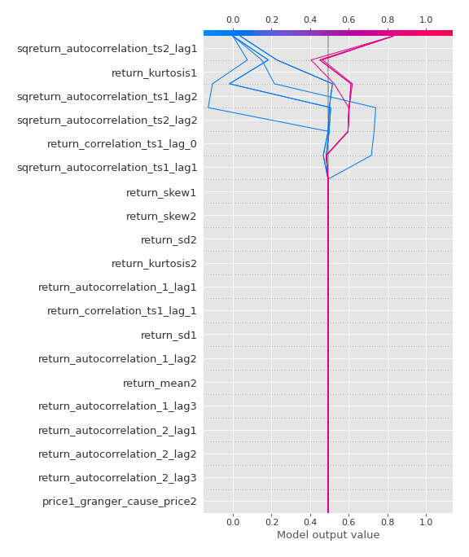
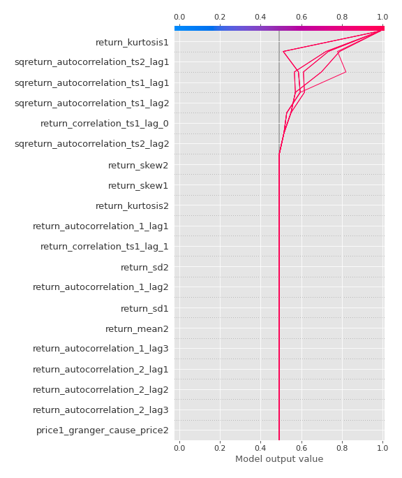

# Summary of 2_DecisionTree

[<< Go back](../README.md)

## Decision Tree
- **n_jobs**: -1
- **criterion**: gini
- **max_depth**: 3
- **explain_level**: 2

## Validation
 - **validation_type**: split
 - **train_ratio**: 0.75
 - **shuffle**: True
 - **stratify**: True

## Optimized metric
accuracy

## Training time

5.3 seconds

## Metric details
|           |    score |   threshold |
|:----------|---------:|------------:|
| logloss   | 0.912403 |  nan        |
| auc       | 0.84963  |  nan        |
| f1        | 0.891566 |    0.433865 |
| accuracy  | 0.896552 |    0.433865 |
| precision | 0.925    |    0.433865 |
| recall    | 0.906977 |    0        |
| mcc       | 0.794808 |    0.433865 |

## Confusion matrix (at threshold=0.433865)
|                      |   Predicted as real |   Predicted as simulated |
|:---------------------|--------------------:|-------------------------:|
| Labeled as real      |                  41 |                        3 |
| Labeled as simulated |                   6 |                       37 |

## Learning curves

## Decision Tree 

### Tree #1

### Rules

if (return_kurtosis1 > 1.192) and (sqreturn_autocorrelation_ts2_lag1 > 0.011) and (sqreturn_autocorrelation_ts1_lag1 > -0.033) then class: real (proba: 96.15%) | based on 104 samples

if (return_kurtosis1 <= 1.192) and (sqreturn_autocorrelation_ts1_lag2 <= 0.066) and (sqreturn_autocorrelation_ts2_lag2 <= 0.109) then class: simulated (proba: 98.81%) | based on 84 samples

if (return_kurtosis1 > 1.192) and (sqreturn_autocorrelation_ts2_lag1 <= 0.011) and (return_correlation_ts1_lag_0 > 0.296) then class: simulated (proba: 82.93%) | based on 41 samples

if (return_kurtosis1 > 1.192) and (sqreturn_autocorrelation_ts2_lag1 <= 0.011) and (return_correlation_ts1_lag_0 <= 0.296) then class: real (proba: 100.0%) | based on 13 samples

if (return_kurtosis1 <= 1.192) and (sqreturn_autocorrelation_ts1_lag2 > 0.066) and (sqreturn_autocorrelation_ts2_lag1 > -0.013) then class: real (proba: 100.0%) | based on 8 samples

if (return_kurtosis1 > 1.192) and (sqreturn_autocorrelation_ts2_lag1 > 0.011) and (sqreturn_autocorrelation_ts1_lag1 <= -0.033) then class: simulated (proba: 100.0%) | based on 4 samples

if (return_kurtosis1 <= 1.192) and (sqreturn_autocorrelation_ts1_lag2 > 0.066) and (sqreturn_autocorrelation_ts2_lag1 <= -0.013) then class: simulated (proba: 100.0%) | based on 3 samples

if (return_kurtosis1 <= 1.192) and (sqreturn_autocorrelation_ts1_lag2 <= 0.066) and (sqreturn_autocorrelation_ts2_lag2 > 0.109) then class: real (proba: 100.0%) | based on 3 samples

## Permutation-based Importance

## Confusion Matrix

## Normalized Confusion Matrix

## ROC Curve

## Kolmogorov-Smirnov Statistic

## Precision-Recall Curve

## Calibration Curve

## Cumulative Gains Curve

## Lift Curve

## SHAP Importance

## SHAP Dependence plots

### Dependence (Fold 1)

## SHAP Decision plots

### Top-10 Worst decisions for class 0 (Fold 1)

### Top-10 Best decisions for class 0 (Fold 1)

### Top-10 Worst decisions for class 1 (Fold 1)

### Top-10 Best decisions for class 1 (Fold 1)

[<< Go back](../README.md)
