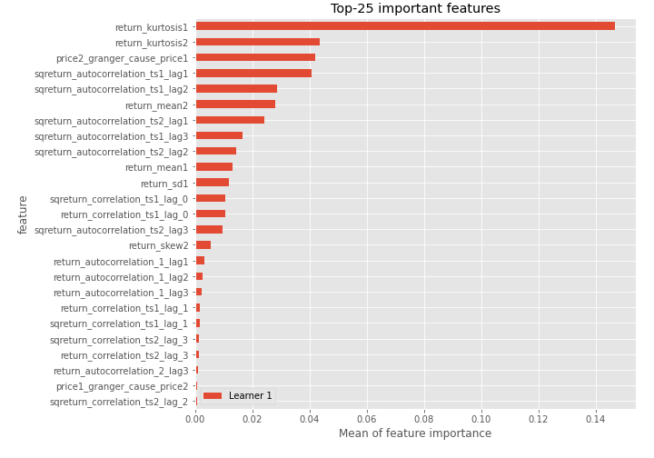

# Summary of 3_Linear

[<< Go back](../README.md)

## Logistic Regression (Linear)
- **n_jobs**: -1
- **explain_level**: 2

## Validation
 - **validation_type**: split
 - **train_ratio**: 0.75
 - **shuffle**: True
 - **stratify**: True

## Optimized metric
accuracy

## Training time

4.1 seconds

## Metric details
|           |    score |    threshold |
|:----------|---------:|-------------:|
| logloss   | 0.326134 | nan          |
| auc       | 0.970402 | nan          |
| f1        | 0.939759 |   0.658602   |
| accuracy  | 0.942529 |   0.658602   |
| precision | 1        |   0.78875    |
| recall    | 1        |   0.00298707 |
| mcc       | 0.887067 |   0.658602   |

## Confusion matrix (at threshold=0.658602)
|                      |   Predicted as real |   Predicted as simulated |
|:---------------------|--------------------:|-------------------------:|
| Labeled as real      |                  43 |                        1 |
| Labeled as simulated |                   4 |                       39 |

## Learning curves

## Coefficients
| feature                           |   Learner_1 |
|:----------------------------------|------------:|
| return_mean2                      |    1.48372  |
| return_correlation_ts1_lag_0      |    1.1146   |
| sqreturn_correlation_ts1_lag_0    |    1.1146   |
| return_autocorrelation_2_lag1     |    0.93471  |
| return_autocorrelation_1_lag1     |    0.797543 |
| sqreturn_correlation_ts1_lag_1    |    0.728528 |
| return_correlation_ts1_lag_1      |    0.728528 |
| return_correlation_ts2_lag_1      |    0.67184  |
| sqreturn_correlation_ts2_lag_1    |    0.67184  |
| return_autocorrelation_1_lag2     |    0.604673 |
| return_autocorrelation_1_lag3     |    0.489372 |
| return_correlation_ts1_lag_2      |    0.388506 |
| sqreturn_correlation_ts1_lag_2    |    0.388506 |
| return_autocorrelation_2_lag3     |    0.346758 |
| return_autocorrelation_2_lag2     |    0.329815 |
| sqreturn_correlation_ts2_lag_3    |    0.29921  |
| return_correlation_ts2_lag_3      |    0.29921  |
| sqreturn_correlation_ts2_lag_2    |    0.196321 |
| return_correlation_ts2_lag_2      |    0.196321 |
| return_sd2                        |    0.171695 |
| sqreturn_correlation_ts1_lag_3    |    0.163292 |
| return_correlation_ts1_lag_3      |    0.163292 |
| return_skew2                      |    0.109759 |
| price1_granger_cause_price2       |   -0.1324   |
| return_sd1                        |   -0.243587 |
| intercept                         |   -0.251779 |
| return_skew1                      |   -0.272756 |
| return_kurtosis2                  |   -0.733356 |
| return_kurtosis1                  |   -1.11571  |
| sqreturn_autocorrelation_ts2_lag3 |   -1.38578  |
| sqreturn_autocorrelation_ts1_lag3 |   -1.49527  |
| sqreturn_autocorrelation_ts2_lag2 |   -1.49695  |
| price2_granger_cause_price1       |   -1.74967  |
| sqreturn_autocorrelation_ts1_lag2 |   -1.93261  |
| return_mean1                      |   -2.2155   |
| sqreturn_autocorrelation_ts2_lag1 |   -2.39578  |
| sqreturn_autocorrelation_ts1_lag1 |   -2.43193  |

## Permutation-based Importance

## Confusion Matrix

## Normalized Confusion Matrix

## ROC Curve

## Kolmogorov-Smirnov Statistic

## Precision-Recall Curve

## Calibration Curve

## Cumulative Gains Curve

## Lift Curve

## SHAP Importance

## SHAP Dependence plots

### Dependence (Fold 1)

## SHAP Decision plots

### Top-10 Worst decisions for class 0 (Fold 1)

### Top-10 Best decisions for class 0 (Fold 1)

### Top-10 Worst decisions for class 1 (Fold 1)

### Top-10 Best decisions for class 1 (Fold 1)

[<< Go back](../README.md)
