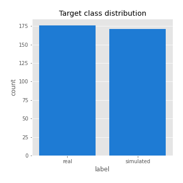
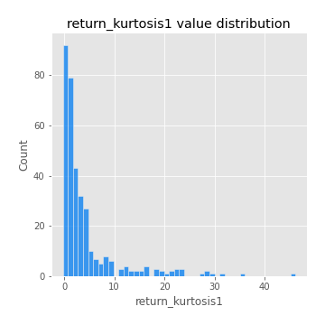
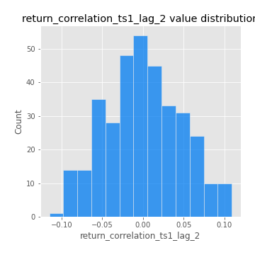

# Exploratory Data Analysis

[<< Go back](../README.md)
## Feature : target
- **Feature type** : categorical
- **Missing** : 0.0%
- **Unique** : 2
- **Count** :347
- **Unique** :2
- **Top** :real
- **Freq** :176

## Feature : return_mean1
- **Feature type** : continous
- **Missing** : 0.0%
- **Unique** : 347
- **Count** :347.0
- **Mean** :0.013519638658186728
- **Std** :0.10138606555214721
- **Min** :-0.3327232481141808
- **25%th Percentile** : -0.04638917928623133
- **50%th Percentile** : 0.019055383819537412
- **75%th Percentile** : 0.08245433956834214
- **Max** :0.37175100008111034

## Feature : return_mean2
- **Feature type** : continous
- **Missing** : 0.0%
- **Unique** : 347
- **Count** :347.0
- **Mean** :0.09993736264354322
- **Std** :0.09752384714655157
- **Min** :-0.24205418062825398
- **25%th Percentile** : 0.047603235189892144
- **50%th Percentile** : 0.09532297247540264
- **75%th Percentile** : 0.16330943909183848
- **Max** :0.37616608147096464

## Feature : return_sd1
- **Feature type** : continous
- **Missing** : 0.0%
- **Unique** : 347
- **Count** :347.0
- **Mean** :1.80124769862966
- **Std** :0.7655656301099241
- **Min** :0.7470080772831957
- **25%th Percentile** : 1.5515627517870443
- **50%th Percentile** : 1.6309962488751153
- **75%th Percentile** : 1.7768697975099133
- **Max** :9.236766377527575

## Feature : return_sd2
- **Feature type** : continous
- **Missing** : 0.0%
- **Unique** : 347
- **Count** :347.0
- **Mean** :1.8785348336070957
- **Std** :0.747860699649845
- **Min** :0.8455946193085045
- **25%th Percentile** : 1.6116837386782858
- **50%th Percentile** : 1.7746726140132019
- **75%th Percentile** : 1.8869119692707828
- **Max** :6.737618636746393

## Feature : return_skew1
- **Feature type** : continous
- **Missing** : 0.0%
- **Unique** : 347
- **Count** :347.0
- **Mean** :-0.0892389127010087
- **Std** :0.6690953408010327
- **Min** :-3.530116233761814
- **25%th Percentile** : -0.2622346071254166
- **50%th Percentile** : -0.07152046950841208
- **75%th Percentile** : 0.16078479984618538
- **Max** :2.5845963767725557

## Feature : return_skew2
- **Feature type** : continous
- **Missing** : 0.0%
- **Unique** : 347
- **Count** :347.0
- **Mean** :-0.16891265142102976
- **Std** :0.9210866628033755
- **Min** :-8.801502855292393
- **25%th Percentile** : -0.4250532549058502
- **50%th Percentile** : -0.07611238786286971
- **75%th Percentile** : 0.15638723246076397
- **Max** :3.7806341746303183

## Feature : return_kurtosis1
- **Feature type** : continous
- **Missing** : 0.0%
- **Unique** : 347
- **Count** :347.0
- **Mean** :4.173816478322431
- **Std** :6.403539961270061
- **Min** :-0.2730118703826405
- **25%th Percentile** : 0.6991981354415318
- **50%th Percentile** : 1.7848228379851991
- **75%th Percentile** : 4.240577539853005
- **Max** :46.07507808162177

## Feature : return_kurtosis2
- **Feature type** : continous
- **Missing** : 0.0%
- **Unique** : 347
- **Count** :347.0
- **Mean** :5.391804910645636
- **Std** :10.608646914377273
- **Min** :-0.29089470431583386
- **25%th Percentile** : 1.2439311083924665
- **50%th Percentile** : 2.5343380765013497
- **75%th Percentile** : 5.249005196825407
- **Max** :143.10871011533666

## Feature : return_autocorrelation_1_lag1
- **Feature type** : continous
- **Missing** : 0.0%
- **Unique** : 347
- **Count** :347.0
- **Mean** :-0.0029528877493552427
- **Std** :0.05842305570105698
- **Min** :-0.19339575314049967
- **25%th Percentile** : -0.03325632173375294
- **50%th Percentile** : 0.0037628498935065612
- **75%th Percentile** : 0.03749637244845186
- **Max** :0.16670691588666584

## Feature : return_autocorrelation_1_lag2
- **Feature type** : continous
- **Missing** : 0.0%
- **Unique** : 347
- **Count** :347.0
- **Mean** :-0.0035306129284092182
- **Std** :0.05129810417366367
- **Min** :-0.13309283796645122
- **25%th Percentile** : -0.03733367077534049
- **50%th Percentile** : -0.0013611677808529404
- **75%th Percentile** : 0.03023235600881216
- **Max** :0.1561488228015672

## Feature : return_autocorrelation_1_lag3
- **Feature type** : continous
- **Missing** : 0.0%
- **Unique** : 347
- **Count** :347.0
- **Mean** :0.008683415105187404
- **Std** :0.04956146943447821
- **Min** :-0.15117275786205733
- **25%th Percentile** : -0.021802672821759503
- **50%th Percentile** : 0.008891986566639754
- **75%th Percentile** : 0.038163529362000445
- **Max** :0.17805869530681923

## Feature : return_autocorrelation_2_lag1
- **Feature type** : continous
- **Missing** : 0.0%
- **Unique** : 347
- **Count** :347.0
- **Mean** :-0.00888862998983266
- **Std** :0.06253512358377943
- **Min** :-0.25075531010123286
- **25%th Percentile** : -0.041894561854829766
- **50%th Percentile** : -0.004580481152468063
- **75%th Percentile** : 0.03148114025690275
- **Max** :0.31863413537898483

## Feature : return_autocorrelation_2_lag2
- **Feature type** : continous
- **Missing** : 0.0%
- **Unique** : 347
- **Count** :347.0
- **Mean** :-0.00456293098690579
- **Std** :0.05288081781730835
- **Min** :-0.15323211089747296
- **25%th Percentile** : -0.03898563966953032
- **50%th Percentile** : -0.007135619047321472
- **75%th Percentile** : 0.02762904516715727
- **Max** :0.20974504043791217

## Feature : return_autocorrelation_2_lag3
- **Feature type** : continous
- **Missing** : 0.0%
- **Unique** : 347
- **Count** :347.0
- **Mean** :-0.005120003630218256
- **Std** :0.04858745815346357
- **Min** :-0.14200107169559698
- **25%th Percentile** : -0.03410853309928408
- **50%th Percentile** : -0.004934189333883819
- **75%th Percentile** : 0.026897574789436433
- **Max** :0.1419999376914021

## Feature : return_correlation_ts1_lag_0
- **Feature type** : continous
- **Missing** : 0.0%
- **Unique** : 347
- **Count** :347.0
- **Mean** :0.3337026122149309
- **Std** :0.11600886769668335
- **Min** :-0.027089510445801036
- **25%th Percentile** : 0.2737066719273822
- **50%th Percentile** : 0.3426768832784505
- **75%th Percentile** : 0.3936191279448714
- **Max** :0.7041861626832071

## Feature : return_correlation_ts1_lag_1
- **Feature type** : continous
- **Missing** : 0.0%
- **Unique** : 347
- **Count** :347.0
- **Mean** :0.0018090661823094894
- **Std** :0.050777732110963314
- **Min** :-0.15776193292681923
- **25%th Percentile** : -0.029816120180797483
- **50%th Percentile** : 0.005400496995372647
- **75%th Percentile** : 0.035076728089368105
- **Max** :0.15499424718508623

## Feature : return_correlation_ts1_lag_2
- **Feature type** : continous
- **Missing** : 0.0%
- **Unique** : 347
- **Count** :347.0
- **Mean** :2.79449895052438e-05
- **Std** :0.04641823573252461
- **Min** :-0.11523251525020971
- **25%th Percentile** : -0.03082770550069481
- **50%th Percentile** : -0.0014821773109522122
- **75%th Percentile** : 0.033437061863394256
- **Max** :0.10925794766608564

## Feature : return_correlation_ts1_lag_3
- **Feature type** : continous
- **Missing** : 0.0%
- **Unique** : 347
- **Count** :347.0
- **Mean** :0.0038405710048761005
- **Std** :0.04848551071131915
- **Min** :-0.1270218498974763
- **25%th Percentile** : -0.028379828234286246
- **50%th Percentile** : 0.004414965208631991
- **75%th Percentile** : 0.035667042049329745
- **Max** :0.1636773216468148

## Feature : return_correlation_ts2_lag_1
- **Feature type** : continous
- **Missing** : 0.0%
- **Unique** : 347
- **Count** :347.0
- **Mean** :-0.0015359198749211004
- **Std** :0.0546287717910458
- **Min** :-0.20093919236581337
- **25%th Percentile** : -0.03574866208214947
- **50%th Percentile** : 0.0003194355382549905
- **75%th Percentile** : 0.03732086229703252
- **Max** :0.11662420329505123

## Feature : return_correlation_ts2_lag_2
- **Feature type** : continous
- **Missing** : 0.0%
- **Unique** : 347
- **Count** :347.0
- **Mean** :-0.00047198399295766887
- **Std** :0.048697809406809095
- **Min** :-0.15299951737180204
- **25%th Percentile** : -0.032862697191375564
- **50%th Percentile** : -0.001189145577825543
- **75%th Percentile** : 0.028303318592543092
- **Max** :0.20772887392904255

## Feature : return_correlation_ts2_lag_3
- **Feature type** : continous
- **Missing** : 0.0%
- **Unique** : 347
- **Count** :347.0
- **Mean** :0.0015735612776219612
- **Std** :0.05073874839779717
- **Min** :-0.17564076057312866
- **25%th Percentile** : -0.026998909057446417
- **50%th Percentile** : 0.0037246356906820727
- **75%th Percentile** : 0.03634268089759096
- **Max** :0.13128380114518473

## Feature : sqreturn_autocorrelation_ts1_lag1
- **Feature type** : continous
- **Missing** : 0.0%
- **Unique** : 347
- **Count** :347.0
- **Mean** :0.0459705155509536
- **Std** :0.08947931865339215
- **Min** :-0.08835928635581208
- **25%th Percentile** : -0.010012918971317949
- **50%th Percentile** : 0.023102393654911572
- **75%th Percentile** : 0.07640446982154142
- **Max** :0.4439086285737898

## Feature : sqreturn_autocorrelation_ts1_lag2
- **Feature type** : continous
- **Missing** : 0.0%
- **Unique** : 347
- **Count** :347.0
- **Mean** :0.03971004140564857
- **Std** :0.08338882317292239
- **Min** :-0.09826192704324614
- **25%th Percentile** : -0.012408608591441127
- **50%th Percentile** : 0.015272211200579837
- **75%th Percentile** : 0.06559144137208814
- **Max** :0.4522162366773919

## Feature : sqreturn_autocorrelation_ts1_lag3
- **Feature type** : continous
- **Missing** : 0.0%
- **Unique** : 347
- **Count** :347.0
- **Mean** :0.03164779611907347
- **Std** :0.07162118033643271
- **Min** :-0.0813918566167826
- **25%th Percentile** : -0.01621591719630256
- **50%th Percentile** : 0.013348222130521998
- **75%th Percentile** : 0.06044043934709788
- **Max** :0.41030914918857014

## Feature : sqreturn_autocorrelation_ts2_lag1
- **Feature type** : continous
- **Missing** : 0.0%
- **Unique** : 347
- **Count** :347.0
- **Mean** :0.05085697553282522
- **Std** :0.08683582237986205
- **Min** :-0.07963460035575831
- **25%th Percentile** : -0.006080352713670984
- **50%th Percentile** : 0.022529642572539425
- **75%th Percentile** : 0.08343447905876857
- **Max** :0.510085647437958

## Feature : sqreturn_autocorrelation_ts2_lag2
- **Feature type** : continous
- **Missing** : 0.0%
- **Unique** : 347
- **Count** :347.0
- **Mean** :0.03838242177933557
- **Std** :0.08741968690499016
- **Min** :-0.08715544330434247
- **25%th Percentile** : -0.01197283770094137
- **50%th Percentile** : 0.012728648183241015
- **75%th Percentile** : 0.05633977268270404
- **Max** :0.45676817892778204

## Feature : sqreturn_autocorrelation_ts2_lag3
- **Feature type** : continous
- **Missing** : 0.0%
- **Unique** : 347
- **Count** :347.0
- **Mean** :0.0256540852323553
- **Std** :0.0721771023463144
- **Min** :-0.09900344948671044
- **25%th Percentile** : -0.018615940168943204
- **50%th Percentile** : 0.004207597878294141
- **75%th Percentile** : 0.049026496883853035
- **Max** :0.31225727797735664

## Feature : sqreturn_correlation_ts1_lag_0
- **Feature type** : continous
- **Missing** : 0.0%
- **Unique** : 347
- **Count** :347.0
- **Mean** :0.3337026122149309
- **Std** :0.11600886769668335
- **Min** :-0.027089510445801036
- **25%th Percentile** : 0.2737066719273822
- **50%th Percentile** : 0.3426768832784505
- **75%th Percentile** : 0.3936191279448714
- **Max** :0.7041861626832071

## Feature : sqreturn_correlation_ts1_lag_1
- **Feature type** : continous
- **Missing** : 0.0%
- **Unique** : 347
- **Count** :347.0
- **Mean** :0.0018090661823094894
- **Std** :0.050777732110963314
- **Min** :-0.15776193292681923
- **25%th Percentile** : -0.029816120180797483
- **50%th Percentile** : 0.005400496995372647
- **75%th Percentile** : 0.035076728089368105
- **Max** :0.15499424718508623

## Feature : sqreturn_correlation_ts1_lag_2
- **Feature type** : continous
- **Missing** : 0.0%
- **Unique** : 347
- **Count** :347.0
- **Mean** :2.79449895052438e-05
- **Std** :0.04641823573252461
- **Min** :-0.11523251525020971
- **25%th Percentile** : -0.03082770550069481
- **50%th Percentile** : -0.0014821773109522122
- **75%th Percentile** : 0.033437061863394256
- **Max** :0.10925794766608564

## Feature : sqreturn_correlation_ts1_lag_3
- **Feature type** : continous
- **Missing** : 0.0%
- **Unique** : 347
- **Count** :347.0
- **Mean** :0.0038405710048761005
- **Std** :0.04848551071131915
- **Min** :-0.1270218498974763
- **25%th Percentile** : -0.028379828234286246
- **50%th Percentile** : 0.004414965208631991
- **75%th Percentile** : 0.035667042049329745
- **Max** :0.1636773216468148

## Feature : sqreturn_correlation_ts2_lag_1
- **Feature type** : continous
- **Missing** : 0.0%
- **Unique** : 347
- **Count** :347.0
- **Mean** :-0.0015359198749211004
- **Std** :0.0546287717910458
- **Min** :-0.20093919236581337
- **25%th Percentile** : -0.03574866208214947
- **50%th Percentile** : 0.0003194355382549905
- **75%th Percentile** : 0.03732086229703252
- **Max** :0.11662420329505123

## Feature : sqreturn_correlation_ts2_lag_2
- **Feature type** : continous
- **Missing** : 0.0%
- **Unique** : 347
- **Count** :347.0
- **Mean** :-0.00047198399295766887
- **Std** :0.048697809406809095
- **Min** :-0.15299951737180204
- **25%th Percentile** : -0.032862697191375564
- **50%th Percentile** : -0.001189145577825543
- **75%th Percentile** : 0.028303318592543092
- **Max** :0.20772887392904255

## Feature : sqreturn_correlation_ts2_lag_3
- **Feature type** : continous
- **Missing** : 0.0%
- **Unique** : 347
- **Count** :347.0
- **Mean** :0.0015735612776219612
- **Std** :0.05073874839779717
- **Min** :-0.17564076057312866
- **25%th Percentile** : -0.026998909057446417
- **50%th Percentile** : 0.0037246356906820727
- **75%th Percentile** : 0.03634268089759096
- **Max** :0.13128380114518473

## Feature : price2_granger_cause_price1
- **Feature type** : continous
- **Missing** : 0.0%
- **Unique** : 347
- **Count** :347.0
- **Mean** :0.24368480010190624
- **Std** :0.2818692323278753
- **Min** :3.057821202743409e-11
- **25%th Percentile** : 0.007328158905356568
- **50%th Percentile** : 0.10542133182148436
- **75%th Percentile** : 0.42032683240112084
- **Max** :0.9885712803689185

## Feature : price1_granger_cause_price2
- **Feature type** : continous
- **Missing** : 0.0%
- **Unique** : 347
- **Count** :347.0
- **Mean** :0.3281579853750177
- **Std** :0.2838514972360134
- **Min** :8.178724792570031e-05
- **25%th Percentile** : 0.06692777868864244
- **50%th Percentile** : 0.25651807981838853
- **75%th Percentile** : 0.557664556380572
- **Max** :0.9995385060649923

[<< Go back](../README.md)
