# Summary of 2_DecisionTree

[<< Go back](../README.md)

## Decision Tree
- **n_jobs**: -1
- **criterion**: gini
- **max_depth**: 3
- **explain_level**: 2

## Validation
 - **validation_type**: split
 - **train_ratio**: 0.75
 - **shuffle**: True
 - **stratify**: True

## Optimized metric
accuracy

## Training time

5.7 seconds

## Metric details
|           |    score |   threshold |
|:----------|---------:|------------:|
| logloss   | 1.10083  | nan         |
| auc       | 0.823545 | nan         |
| f1        | 0.822222 |   0.0114943 |
| accuracy  | 0.816092 |   0.0114943 |
| precision | 1        |   0.967742  |
| recall    | 0.911111 |   0         |
| mcc       | 0.639561 |   0.489618  |

## Confusion matrix (at threshold=0.011494)
|                      |   Predicted as real |   Predicted as simulated |
|:---------------------|--------------------:|-------------------------:|
| Labeled as real      |                  34 |                        8 |
| Labeled as simulated |                   8 |                       37 |

## Learning curves
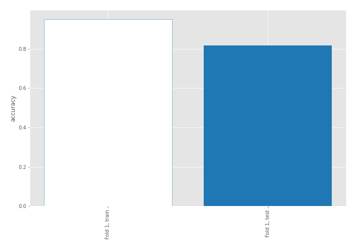

## Decision Tree 

### Tree #1
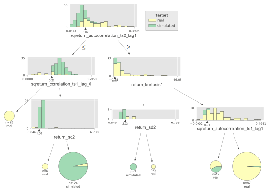

### Rules

if (sqreturn_autocorrelation_ts2_lag1 <= 0.024) and (sqreturn_correlation_ts1_lag_0 > 0.266) and (return_sd2 > 1.561) then class: simulated (proba: 96.77%) | based on 124 samples

if (sqreturn_autocorrelation_ts2_lag1 > 0.024) and (return_kurtosis1 > 0.67) and (sqreturn_autocorrelation_ts1_lag1 > 0.007) then class: real (proba: 98.85%) | based on 87 samples

if (sqreturn_autocorrelation_ts2_lag1 > 0.024) and (return_kurtosis1 > 0.67) and (sqreturn_autocorrelation_ts1_lag1 <= 0.007) then class: real (proba: 57.89%) | based on 19 samples

if (sqreturn_autocorrelation_ts2_lag1 <= 0.024) and (sqreturn_correlation_ts1_lag_0 <= 0.266) then class: real (proba: 100.0%) | based on 15 samples

if (sqreturn_autocorrelation_ts2_lag1 > 0.024) and (return_kurtosis1 <= 0.67) and (return_sd2 <= 2.027) then class: simulated (proba: 100.0%) | based on 7 samples

if (sqreturn_autocorrelation_ts2_lag1 <= 0.024) and (sqreturn_correlation_ts1_lag_0 > 0.266) and (return_sd2 <= 1.561) then class: real (proba: 100.0%) | based on 6 samples

if (sqreturn_autocorrelation_ts2_lag1 > 0.024) and (return_kurtosis1 <= 0.67) and (return_sd2 > 2.027) then class: real (proba: 100.0%) | based on 2 samples

## Permutation-based Importance
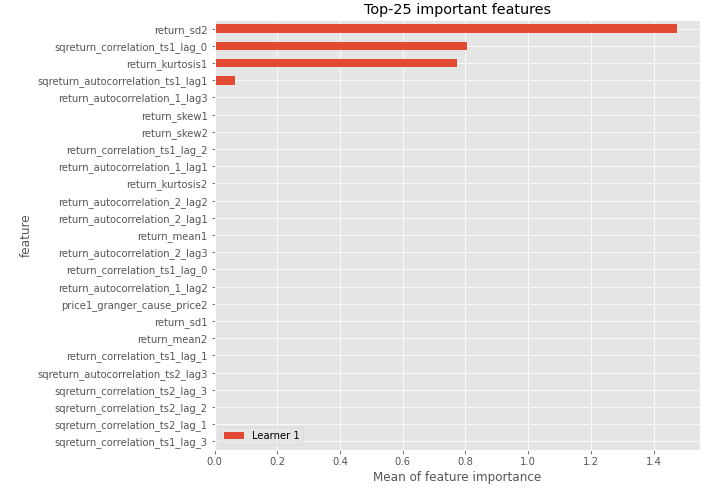
## Confusion Matrix

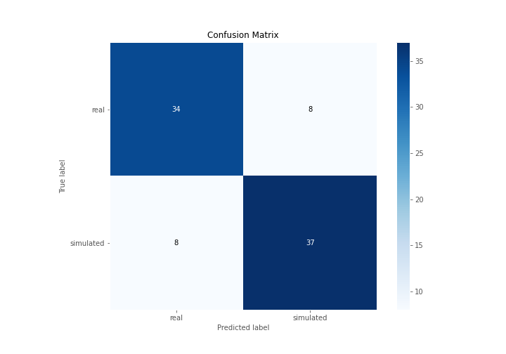

## Normalized Confusion Matrix

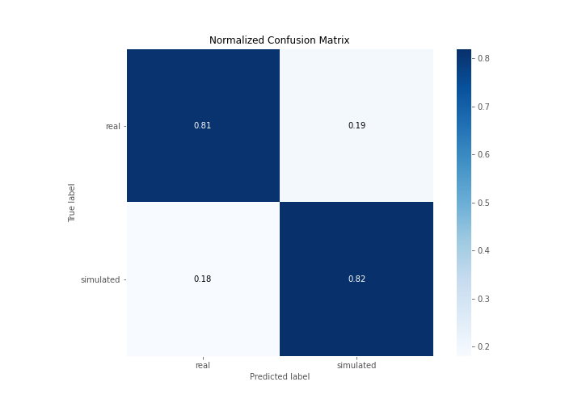

## ROC Curve

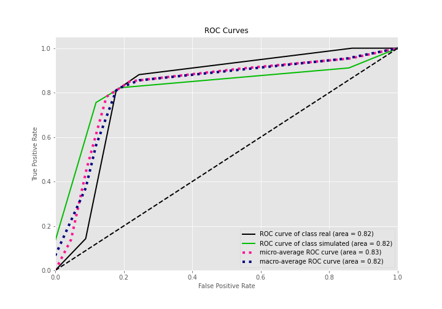

## Kolmogorov-Smirnov Statistic

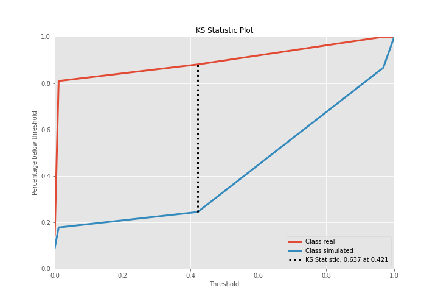

## Precision-Recall Curve

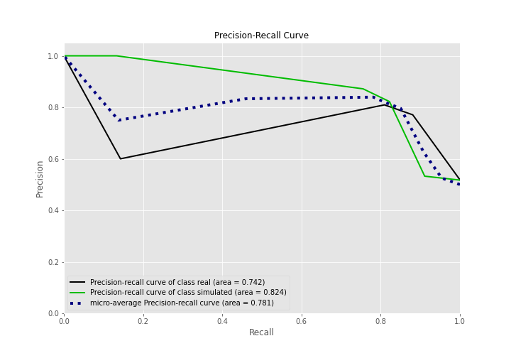

## Calibration Curve

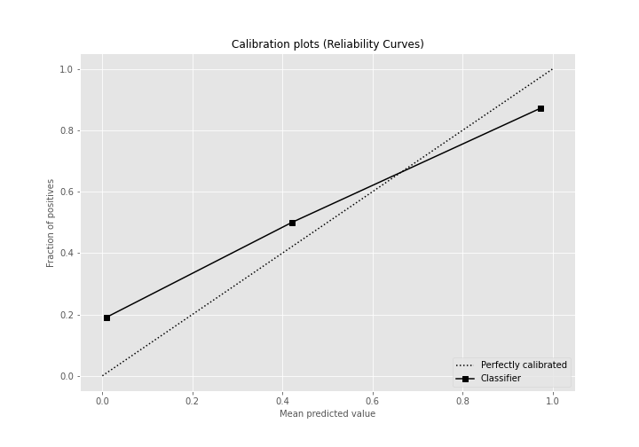

## Cumulative Gains Curve

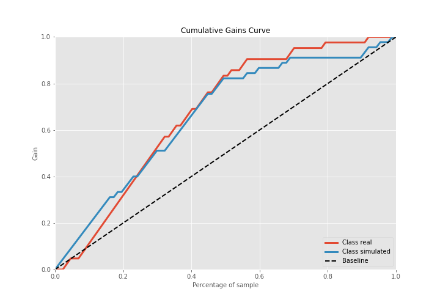

## Lift Curve

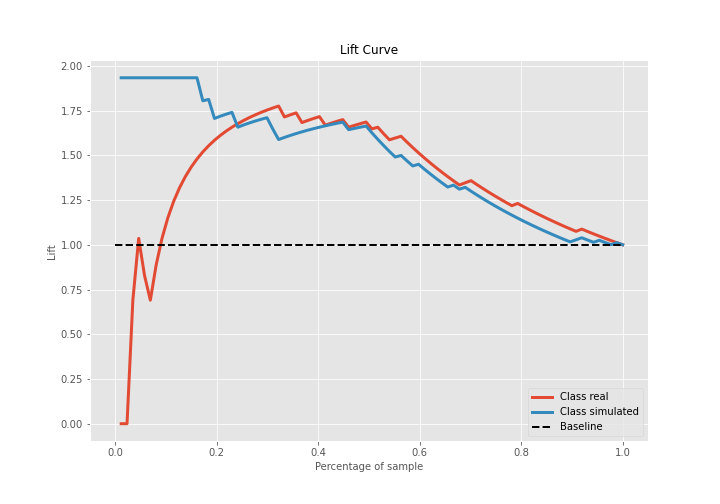

## SHAP Importance
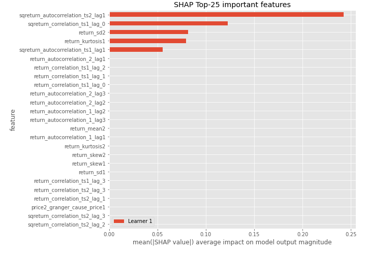

## SHAP Dependence plots

### Dependence (Fold 1)
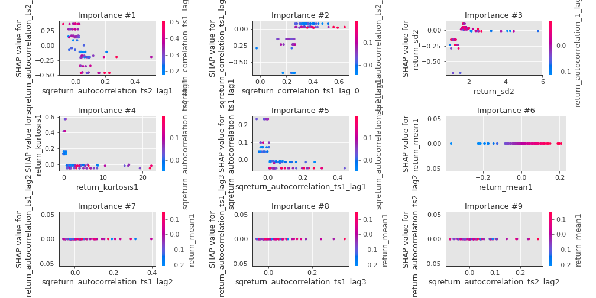

## SHAP Decision plots

### Top-10 Worst decisions for class 0 (Fold 1)
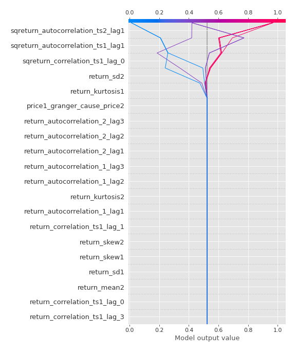
### Top-10 Best decisions for class 0 (Fold 1)
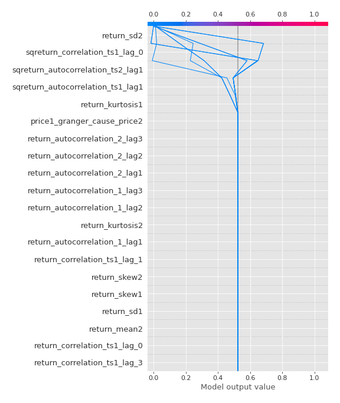
### Top-10 Worst decisions for class 1 (Fold 1)
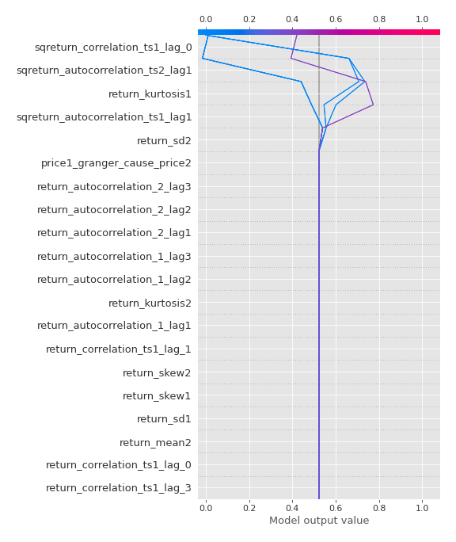
### Top-10 Best decisions for class 1 (Fold 1)
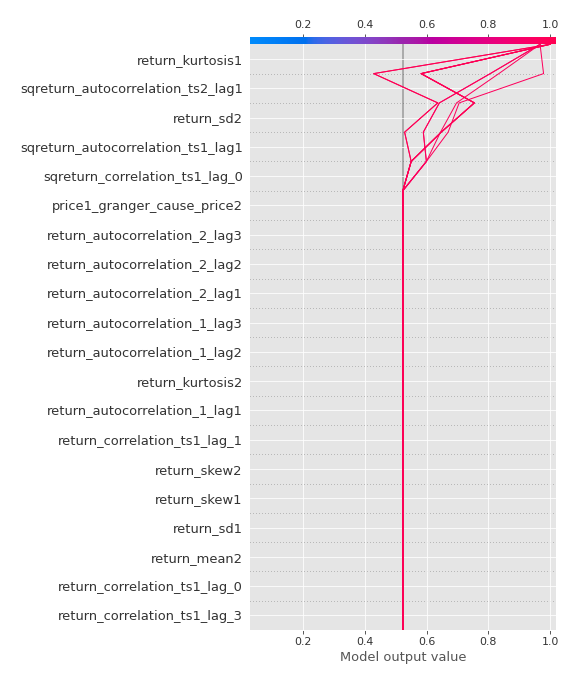

[<< Go back](../README.md)
