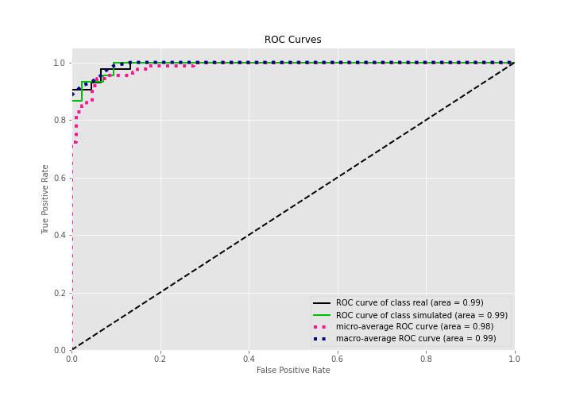
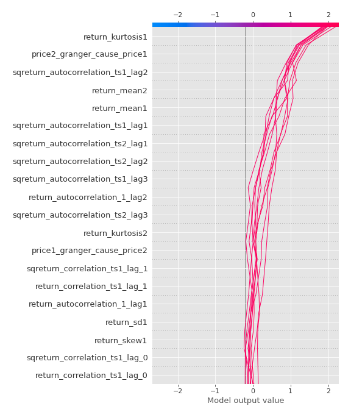

# Summary of 3_Linear

[<< Go back](../README.md)

## Logistic Regression (Linear)
- **n_jobs**: -1
- **explain_level**: 2

## Validation
 - **validation_type**: split
 - **train_ratio**: 0.75
 - **shuffle**: True
 - **stratify**: True

## Optimized metric
accuracy

## Training time

4.6 seconds

## Metric details
|           |    score |    threshold |
|:----------|---------:|-------------:|
| logloss   | 0.288209 | nan          |
| auc       | 0.992593 | nan          |
| f1        | 0.957447 |   0.511566   |
| accuracy  | 0.954023 |   0.644849   |
| precision | 1        |   0.794154   |
| recall    | 1        |   0.00361551 |
| mcc       | 0.911539 |   0.511566   |

## Confusion matrix (at threshold=0.644849)
|                      |   Predicted as real |   Predicted as simulated |
|:---------------------|--------------------:|-------------------------:|
| Labeled as real      |                  41 |                        1 |
| Labeled as simulated |                   3 |                       42 |

## Learning curves

## Coefficients
| feature                           |   Learner_1 |
|:----------------------------------|------------:|
| return_mean2                      |  2.20396    |
| return_correlation_ts1_lag_0      |  1.23053    |
| sqreturn_correlation_ts1_lag_0    |  1.23053    |
| return_autocorrelation_1_lag1     |  1.1349     |
| return_autocorrelation_1_lag2     |  1.07048    |
| return_correlation_ts1_lag_1      |  0.961385   |
| sqreturn_correlation_ts1_lag_1    |  0.961385   |
| return_autocorrelation_1_lag3     |  0.653903   |
| sqreturn_correlation_ts2_lag_2    |  0.634737   |
| return_correlation_ts2_lag_2      |  0.634737   |
| sqreturn_correlation_ts2_lag_3    |  0.599466   |
| return_correlation_ts2_lag_3      |  0.599466   |
| sqreturn_correlation_ts1_lag_2    |  0.569391   |
| return_correlation_ts1_lag_2      |  0.569391   |
| return_autocorrelation_2_lag1     |  0.499676   |
| return_correlation_ts2_lag_1      |  0.435443   |
| sqreturn_correlation_ts2_lag_1    |  0.435443   |
| return_autocorrelation_2_lag3     |  0.396096   |
| return_autocorrelation_2_lag2     |  0.378114   |
| return_skew1                      |  0.159132   |
| return_skew2                      |  0.0940072  |
| return_sd2                        | -0.00326097 |
| return_kurtosis2                  | -0.109664   |
| sqreturn_correlation_ts1_lag_3    | -0.14037    |
| return_correlation_ts1_lag_3      | -0.14037    |
| return_sd1                        | -0.195283   |
| price1_granger_cause_price2       | -0.216912   |
| intercept                         | -0.317907   |
| price2_granger_cause_price1       | -1.08368    |
| return_kurtosis1                  | -1.12848    |
| sqreturn_autocorrelation_ts2_lag3 | -1.29406    |
| sqreturn_autocorrelation_ts1_lag3 | -1.6709     |
| sqreturn_autocorrelation_ts2_lag2 | -1.76558    |
| return_mean1                      | -2.05261    |
| sqreturn_autocorrelation_ts1_lag2 | -2.10023    |
| sqreturn_autocorrelation_ts1_lag1 | -2.35227    |
| sqreturn_autocorrelation_ts2_lag1 | -2.54732    |

## Permutation-based Importance

## Confusion Matrix

## Normalized Confusion Matrix

## ROC Curve

## Kolmogorov-Smirnov Statistic

## Precision-Recall Curve

## Calibration Curve

## Cumulative Gains Curve

## Lift Curve

## SHAP Importance

## SHAP Dependence plots

### Dependence (Fold 1)

## SHAP Decision plots

### Top-10 Worst decisions for class 0 (Fold 1)

### Top-10 Best decisions for class 0 (Fold 1)

### Top-10 Worst decisions for class 1 (Fold 1)

### Top-10 Best decisions for class 1 (Fold 1)

[<< Go back](../README.md)
