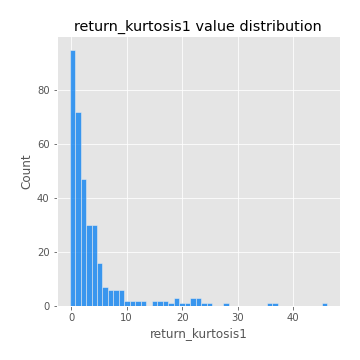
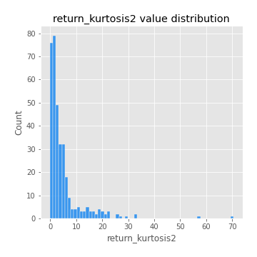
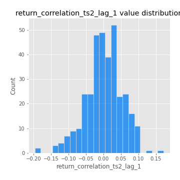
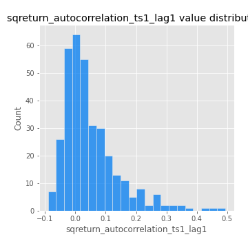

# Exploratory Data Analysis

[<< Go back](../README.md)
## Feature : target
- **Feature type** : categorical
- **Missing** : 0.0%
- **Unique** : 2
- **Count** :347
- **Unique** :2
- **Top** :simulated
- **Freq** :181

## Feature : return_mean1
- **Feature type** : continous
- **Missing** : 0.0%
- **Unique** : 347
- **Count** :347.0
- **Mean** :0.012435853171589625
- **Std** :0.11003908600707127
- **Min** :-0.3691258907308189
- **25%th Percentile** : -0.0438477471454226
- **50%th Percentile** : 0.02357415262435322
- **75%th Percentile** : 0.07837834366109853
- **Max** :0.37175100008111034

## Feature : return_mean2
- **Feature type** : continous
- **Missing** : 0.0%
- **Unique** : 347
- **Count** :347.0
- **Mean** :0.10687322633659797
- **Std** :0.09608685854169756
- **Min** :-0.24205418062825398
- **25%th Percentile** : 0.047246051781540385
- **50%th Percentile** : 0.10265428792173426
- **75%th Percentile** : 0.1684127232288561
- **Max** :0.37616608147096464

## Feature : return_sd1
- **Feature type** : continous
- **Missing** : 0.0%
- **Unique** : 347
- **Count** :347.0
- **Mean** :1.8085045957190964
- **Std** :0.7735373949987543
- **Min** :0.7470080772831957
- **25%th Percentile** : 1.5583766688097813
- **50%th Percentile** : 1.6468769793613707
- **75%th Percentile** : 1.7641858076369923
- **Max** :9.236766377527575

## Feature : return_sd2
- **Feature type** : continous
- **Missing** : 0.0%
- **Unique** : 347
- **Count** :347.0
- **Mean** :1.8921732064440537
- **Std** :0.7177975924524115
- **Min** :0.8455946193085045
- **25%th Percentile** : 1.649234344715472
- **50%th Percentile** : 1.7728209489740205
- **75%th Percentile** : 1.90028100185007
- **Max** :6.737618636746393

## Feature : return_skew1
- **Feature type** : continous
- **Missing** : 0.0%
- **Unique** : 347
- **Count** :347.0
- **Mean** :-0.09682913506216702
- **Std** :0.6611806039412448
- **Min** :-3.453087436558107
- **25%th Percentile** : -0.2893074264004005
- **50%th Percentile** : -0.041280207940351955
- **75%th Percentile** : 0.15421935875562123
- **Max** :2.5845963767725557

## Feature : return_skew2
- **Feature type** : continous
- **Missing** : 0.0%
- **Unique** : 347
- **Count** :347.0
- **Mean** :-0.14387288729659417
- **Std** :0.7422556320476653
- **Min** :-4.994997580450564
- **25%th Percentile** : -0.37085473080721665
- **50%th Percentile** : -0.08712383654476313
- **75%th Percentile** : 0.16110695731702712
- **Max** :2.600920595309984

## Feature : return_kurtosis1
- **Feature type** : continous
- **Missing** : 0.0%
- **Unique** : 347
- **Count** :347.0
- **Mean** :3.875824701946903
- **Std** :6.012112731757798
- **Min** :-0.27652982961395756
- **25%th Percentile** : 0.6260873449462983
- **50%th Percentile** : 1.7894544158477044
- **75%th Percentile** : 4.1487022518862675
- **Max** :46.07507808162177

## Feature : return_kurtosis2
- **Feature type** : continous
- **Missing** : 0.0%
- **Unique** : 347
- **Count** :347.0
- **Mean** :4.88893754100036
- **Std** :7.302431198435039
- **Min** :-0.21239310412604517
- **25%th Percentile** : 1.1380103338491994
- **50%th Percentile** : 2.4178781477989646
- **75%th Percentile** : 5.2757793659776855
- **Max** :70.50171960343638

## Feature : return_autocorrelation_1_lag1
- **Feature type** : continous
- **Missing** : 0.0%
- **Unique** : 347
- **Count** :347.0
- **Mean** :0.002003258516982957
- **Std** :0.0640676032145676
- **Min** :-0.2135576224968752
- **25%th Percentile** : -0.032365867265331194
- **50%th Percentile** : 0.009216604178177193
- **75%th Percentile** : 0.04333536346721878
- **Max** :0.14220275004914326

## Feature : return_autocorrelation_1_lag2
- **Feature type** : continous
- **Missing** : 0.0%
- **Unique** : 347
- **Count** :347.0
- **Mean** :0.00035585090612576427
- **Std** :0.05049090193516207
- **Min** :-0.13309283796645122
- **25%th Percentile** : -0.033206717412408826
- **50%th Percentile** : 0.0013652155019176293
- **75%th Percentile** : 0.03418351702816156
- **Max** :0.1561488228015672

## Feature : return_autocorrelation_1_lag3
- **Feature type** : continous
- **Missing** : 0.0%
- **Unique** : 347
- **Count** :347.0
- **Mean** :0.004588462199921189
- **Std** :0.05244855195652789
- **Min** :-0.1940836867390813
- **25%th Percentile** : -0.026607363253822375
- **50%th Percentile** : 0.0051172960348250295
- **75%th Percentile** : 0.03748704621951214
- **Max** :0.17805869530681923

## Feature : return_autocorrelation_2_lag1
- **Feature type** : continous
- **Missing** : 0.0%
- **Unique** : 347
- **Count** :347.0
- **Mean** :-0.007602034236465407
- **Std** :0.059306935828804565
- **Min** :-0.24590087874039124
- **25%th Percentile** : -0.040920181329551115
- **50%th Percentile** : -0.0033554743681213834
- **75%th Percentile** : 0.030150184328019296
- **Max** :0.16349871797309318

## Feature : return_autocorrelation_2_lag2
- **Feature type** : continous
- **Missing** : 0.0%
- **Unique** : 347
- **Count** :347.0
- **Mean** :-0.0027980444326121093
- **Std** :0.050815926768611325
- **Min** :-0.1495113937562178
- **25%th Percentile** : -0.03876601245229384
- **50%th Percentile** : -0.004841489320884519
- **75%th Percentile** : 0.033388399386792375
- **Max** :0.1735398560230086

## Feature : return_autocorrelation_2_lag3
- **Feature type** : continous
- **Missing** : 0.0%
- **Unique** : 347
- **Count** :347.0
- **Mean** :-0.00029198880883152066
- **Std** :0.05028053745384025
- **Min** :-0.14200107169559698
- **25%th Percentile** : -0.030349969663719164
- **50%th Percentile** : 0.00019674528063989133
- **75%th Percentile** : 0.030418584012767275
- **Max** :0.1419999376914021

## Feature : return_correlation_ts1_lag_0
- **Feature type** : continous
- **Missing** : 0.0%
- **Unique** : 347
- **Count** :347.0
- **Mean** :0.3397234769331707
- **Std** :0.11228230407088022
- **Min** :-0.027089510445801036
- **25%th Percentile** : 0.2800436310895267
- **50%th Percentile** : 0.3427590383189276
- **75%th Percentile** : 0.39751749632045036
- **Max** :0.6949986865664105

## Feature : return_correlation_ts1_lag_1
- **Feature type** : continous
- **Missing** : 0.0%
- **Unique** : 347
- **Count** :347.0
- **Mean** :-0.0026748866064260587
- **Std** :0.05125970802957139
- **Min** :-0.16985510949917193
- **25%th Percentile** : -0.035362603527673786
- **50%th Percentile** : 0.003272410204487029
- **75%th Percentile** : 0.03600107519304352
- **Max** :0.15499424718508623

## Feature : return_correlation_ts1_lag_2
- **Feature type** : continous
- **Missing** : 0.0%
- **Unique** : 347
- **Count** :347.0
- **Mean** :0.00011841440523380385
- **Std** :0.04849511147802741
- **Min** :-0.21653581047581763
- **25%th Percentile** : -0.031655999736934726
- **50%th Percentile** : -0.0016206719473887113
- **75%th Percentile** : 0.036672539994774225
- **Max** :0.15546883335881048

## Feature : return_correlation_ts1_lag_3
- **Feature type** : continous
- **Missing** : 0.0%
- **Unique** : 347
- **Count** :347.0
- **Mean** :0.002667848593700609
- **Std** :0.05203370054390453
- **Min** :-0.1270218498974763
- **25%th Percentile** : -0.033484238272945756
- **50%th Percentile** : 0.0002771635037402559
- **75%th Percentile** : 0.03722076130467044
- **Max** :0.1422809271770942

## Feature : return_correlation_ts2_lag_1
- **Feature type** : continous
- **Missing** : 0.0%
- **Unique** : 347
- **Count** :347.0
- **Mean** :0.001409001920118666
- **Std** :0.05211906991829318
- **Min** :-0.19671969155495325
- **25%th Percentile** : -0.027532662238646373
- **50%th Percentile** : 0.0027892070330118495
- **75%th Percentile** : 0.033760353477008474
- **Max** :0.17208763791364762

## Feature : return_correlation_ts2_lag_2
- **Feature type** : continous
- **Missing** : 0.0%
- **Unique** : 347
- **Count** :347.0
- **Mean** :0.004668817229145687
- **Std** :0.051761511943037984
- **Min** :-0.23751835475804678
- **25%th Percentile** : -0.029341123222125124
- **50%th Percentile** : 0.0033849547410201714
- **75%th Percentile** : 0.03666833351133632
- **Max** :0.20772887392904255

## Feature : return_correlation_ts2_lag_3
- **Feature type** : continous
- **Missing** : 0.0%
- **Unique** : 347
- **Count** :347.0
- **Mean** :0.006636394554192554
- **Std** :0.052538002052479264
- **Min** :-0.17564076057312866
- **25%th Percentile** : -0.021789451003863425
- **50%th Percentile** : 0.006586569104790801
- **75%th Percentile** : 0.04014031843948451
- **Max** :0.1470641017660601

## Feature : sqreturn_autocorrelation_ts1_lag1
- **Feature type** : continous
- **Missing** : 0.0%
- **Unique** : 347
- **Count** :347.0
- **Mean** :0.048893042864071395
- **Std** :0.09147635382482167
- **Min** :-0.0902455029461957
- **25%th Percentile** : -0.012282930351806286
- **50%th Percentile** : 0.024672051494299494
- **75%th Percentile** : 0.08341213207279383
- **Max** :0.49414293176447355

## Feature : sqreturn_autocorrelation_ts1_lag2
- **Feature type** : continous
- **Missing** : 0.0%
- **Unique** : 347
- **Count** :347.0
- **Mean** :0.03756394616658551
- **Std** :0.08978079558488085
- **Min** :-0.08436631661625286
- **25%th Percentile** : -0.01563472508923271
- **50%th Percentile** : 0.010043662039587672
- **75%th Percentile** : 0.060863141616427884
- **Max** :0.540735851444759

## Feature : sqreturn_autocorrelation_ts1_lag3
- **Feature type** : continous
- **Missing** : 0.0%
- **Unique** : 347
- **Count** :347.0
- **Mean** :0.02873171337612034
- **Std** :0.07601958515301607
- **Min** :-0.12072332834063272
- **25%th Percentile** : -0.020047447624953883
- **50%th Percentile** : 0.009111740274450856
- **75%th Percentile** : 0.05608811939756421
- **Max** :0.41030914918857014

## Feature : sqreturn_autocorrelation_ts2_lag1
- **Feature type** : continous
- **Missing** : 0.0%
- **Unique** : 347
- **Count** :347.0
- **Mean** :0.04423496429106997
- **Std** :0.0869193394525244
- **Min** :-0.09129325826572508
- **25%th Percentile** : -0.010089472050423057
- **50%th Percentile** : 0.01853273084412962
- **75%th Percentile** : 0.07394764919296465
- **Max** :0.510085647437958

## Feature : sqreturn_autocorrelation_ts2_lag2
- **Feature type** : continous
- **Missing** : 0.0%
- **Unique** : 347
- **Count** :347.0
- **Mean** :0.038541276586256876
- **Std** :0.08543759802932989
- **Min** :-0.08016264540260584
- **25%th Percentile** : -0.011400436858891375
- **50%th Percentile** : 0.01550679318377916
- **75%th Percentile** : 0.05771424240641625
- **Max** :0.45676817892778204

## Feature : sqreturn_autocorrelation_ts2_lag3
- **Feature type** : continous
- **Missing** : 0.0%
- **Unique** : 347
- **Count** :347.0
- **Mean** :0.02746227741596496
- **Std** :0.06999756808345518
- **Min** :-0.08958737767008923
- **25%th Percentile** : -0.01663906458229472
- **50%th Percentile** : 0.007509965118999769
- **75%th Percentile** : 0.048834090991789286
- **Max** :0.31225727797735664

## Feature : sqreturn_correlation_ts1_lag_0
- **Feature type** : continous
- **Missing** : 0.0%
- **Unique** : 347
- **Count** :347.0
- **Mean** :0.3397234769331707
- **Std** :0.11228230407088022
- **Min** :-0.027089510445801036
- **25%th Percentile** : 0.2800436310895267
- **50%th Percentile** : 0.3427590383189276
- **75%th Percentile** : 0.39751749632045036
- **Max** :0.6949986865664105

## Feature : sqreturn_correlation_ts1_lag_1
- **Feature type** : continous
- **Missing** : 0.0%
- **Unique** : 347
- **Count** :347.0
- **Mean** :-0.0026748866064260587
- **Std** :0.05125970802957139
- **Min** :-0.16985510949917193
- **25%th Percentile** : -0.035362603527673786
- **50%th Percentile** : 0.003272410204487029
- **75%th Percentile** : 0.03600107519304352
- **Max** :0.15499424718508623

## Feature : sqreturn_correlation_ts1_lag_2
- **Feature type** : continous
- **Missing** : 0.0%
- **Unique** : 347
- **Count** :347.0
- **Mean** :0.00011841440523380385
- **Std** :0.04849511147802741
- **Min** :-0.21653581047581763
- **25%th Percentile** : -0.031655999736934726
- **50%th Percentile** : -0.0016206719473887113
- **75%th Percentile** : 0.036672539994774225
- **Max** :0.15546883335881048

## Feature : sqreturn_correlation_ts1_lag_3
- **Feature type** : continous
- **Missing** : 0.0%
- **Unique** : 347
- **Count** :347.0
- **Mean** :0.002667848593700609
- **Std** :0.05203370054390453
- **Min** :-0.1270218498974763
- **25%th Percentile** : -0.033484238272945756
- **50%th Percentile** : 0.0002771635037402559
- **75%th Percentile** : 0.03722076130467044
- **Max** :0.1422809271770942

## Feature : sqreturn_correlation_ts2_lag_1
- **Feature type** : continous
- **Missing** : 0.0%
- **Unique** : 347
- **Count** :347.0
- **Mean** :0.001409001920118666
- **Std** :0.05211906991829318
- **Min** :-0.19671969155495325
- **25%th Percentile** : -0.027532662238646373
- **50%th Percentile** : 0.0027892070330118495
- **75%th Percentile** : 0.033760353477008474
- **Max** :0.17208763791364762

## Feature : sqreturn_correlation_ts2_lag_2
- **Feature type** : continous
- **Missing** : 0.0%
- **Unique** : 347
- **Count** :347.0
- **Mean** :0.004668817229145687
- **Std** :0.051761511943037984
- **Min** :-0.23751835475804678
- **25%th Percentile** : -0.029341123222125124
- **50%th Percentile** : 0.0033849547410201714
- **75%th Percentile** : 0.03666833351133632
- **Max** :0.20772887392904255

## Feature : sqreturn_correlation_ts2_lag_3
- **Feature type** : continous
- **Missing** : 0.0%
- **Unique** : 347
- **Count** :347.0
- **Mean** :0.006636394554192554
- **Std** :0.052538002052479264
- **Min** :-0.17564076057312866
- **25%th Percentile** : -0.021789451003863425
- **50%th Percentile** : 0.006586569104790801
- **75%th Percentile** : 0.04014031843948451
- **Max** :0.1470641017660601

## Feature : price2_granger_cause_price1
- **Feature type** : continous
- **Missing** : 0.0%
- **Unique** : 347
- **Count** :347.0
- **Mean** :0.24543122874595294
- **Std** :0.29108978558974646
- **Min** :7.925778593966819e-10
- **25%th Percentile** : 0.00688958795767286
- **50%th Percentile** : 0.10414977934617022
- **75%th Percentile** : 0.4375583329586512
- **Max** :0.9853666024514321

## Feature : price1_granger_cause_price2
- **Feature type** : continous
- **Missing** : 0.0%
- **Unique** : 347
- **Count** :347.0
- **Mean** :0.3234226347958568
- **Std** :0.2879240479545214
- **Min** :1.1767235407030197e-07
- **25%th Percentile** : 0.05872338612297212
- **50%th Percentile** : 0.25911355233688016
- **75%th Percentile** : 0.5215529939390289
- **Max** :0.9951398266867577

[<< Go back](../README.md)
