# Summary of 3_Linear

[<< Go back](../README.md)

## Logistic Regression (Linear)
- **n_jobs**: -1
- **explain_level**: 2

## Validation
 - **validation_type**: split
 - **train_ratio**: 0.75
 - **shuffle**: True
 - **stratify**: True

## Optimized metric
accuracy

## Training time

6.7 seconds

## Metric details
|           |    score |     threshold |
|:----------|---------:|--------------:|
| logloss   | 0.245568 | nan           |
| auc       | 0.980423 | nan           |
| f1        | 0.917647 |   0.469686    |
| accuracy  | 0.91954  |   0.469686    |
| precision | 1        |   0.930261    |
| recall    | 1        |   3.88118e-10 |
| mcc       | 0.839239 |   0.469686    |

## Confusion matrix (at threshold=0.469686)
|                      |   Predicted as real |   Predicted as simulated |
|:---------------------|--------------------:|-------------------------:|
| Labeled as real      |                  41 |                        4 |
| Labeled as simulated |                   3 |                       39 |

## Learning curves
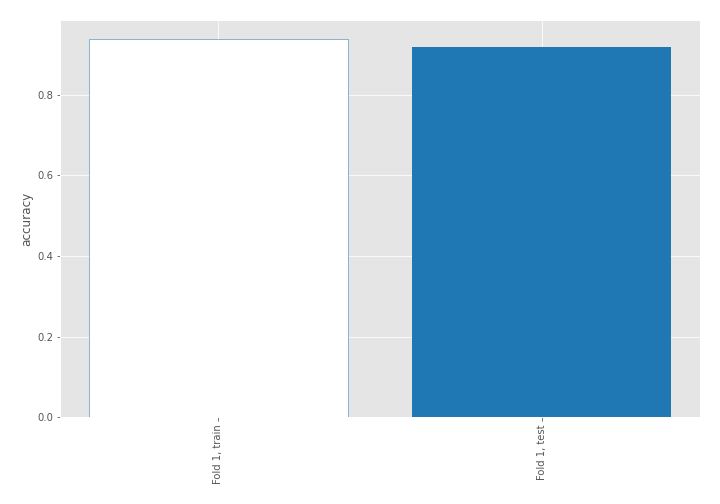

## Coefficients
| feature                           |   Learner_1 |
|:----------------------------------|------------:|
| return_mean2                      |   1.74913   |
| return_correlation_ts1_lag_0      |   0.984641  |
| sqreturn_correlation_ts1_lag_0    |   0.984641  |
| return_skew1                      |   0.982285  |
| return_autocorrelation_1_lag1     |   0.863957  |
| return_autocorrelation_1_lag2     |   0.812652  |
| return_autocorrelation_1_lag3     |   0.70235   |
| return_skew2                      |   0.656234  |
| return_correlation_ts1_lag_1      |   0.57298   |
| sqreturn_correlation_ts1_lag_1    |   0.57298   |
| return_autocorrelation_2_lag3     |   0.514905  |
| return_autocorrelation_2_lag2     |   0.458025  |
| return_correlation_ts2_lag_1      |   0.456326  |
| sqreturn_correlation_ts2_lag_1    |   0.456326  |
| return_correlation_ts2_lag_3      |   0.390308  |
| sqreturn_correlation_ts2_lag_3    |   0.390308  |
| sqreturn_correlation_ts1_lag_2    |   0.373807  |
| return_correlation_ts1_lag_2      |   0.373807  |
| return_autocorrelation_2_lag1     |   0.371609  |
| return_sd2                        |   0.295606  |
| sqreturn_correlation_ts1_lag_3    |   0.252669  |
| return_correlation_ts1_lag_3      |   0.252669  |
| return_correlation_ts2_lag_2      |   0.235226  |
| sqreturn_correlation_ts2_lag_2    |   0.235226  |
| price1_granger_cause_price2       |  -0.0327692 |
| return_sd1                        |  -0.321187  |
| intercept                         |  -0.513483  |
| return_kurtosis2                  |  -0.845819  |
| sqreturn_autocorrelation_ts2_lag3 |  -0.910752  |
| sqreturn_autocorrelation_ts2_lag2 |  -1.1345    |
| sqreturn_autocorrelation_ts1_lag3 |  -1.24232   |
| return_kurtosis1                  |  -1.51557   |
| price2_granger_cause_price1       |  -1.98392   |
| return_mean1                      |  -2.04907   |
| sqreturn_autocorrelation_ts1_lag2 |  -2.11009   |
| sqreturn_autocorrelation_ts1_lag1 |  -2.14503   |
| sqreturn_autocorrelation_ts2_lag1 |  -2.30189   |

## Permutation-based Importance
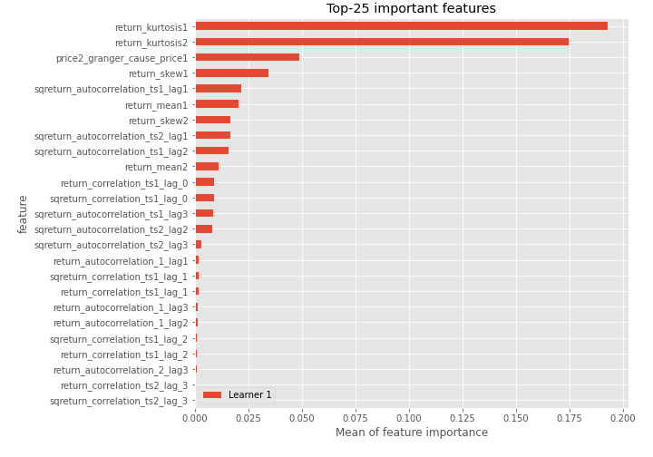
## Confusion Matrix

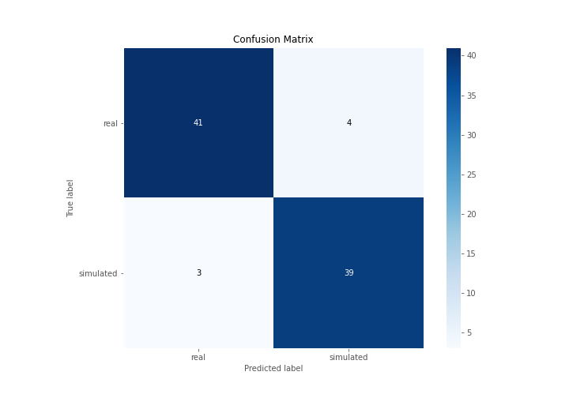

## Normalized Confusion Matrix

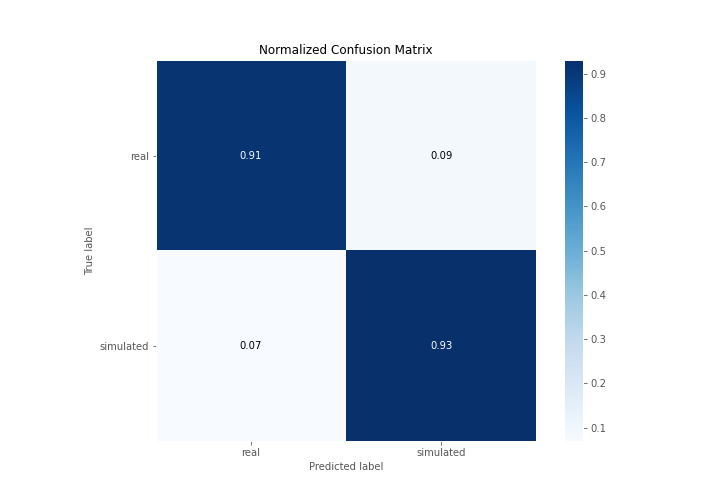

## ROC Curve

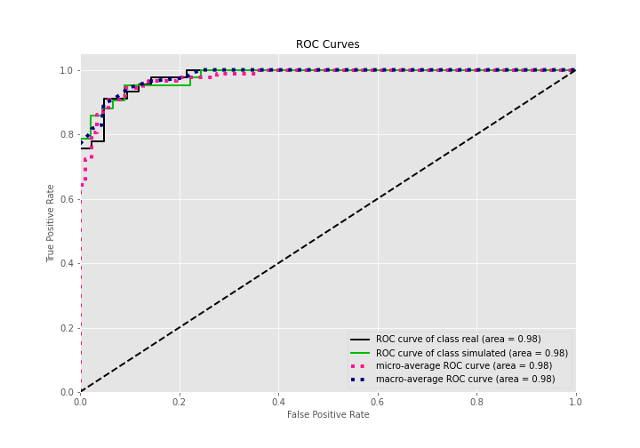

## Kolmogorov-Smirnov Statistic

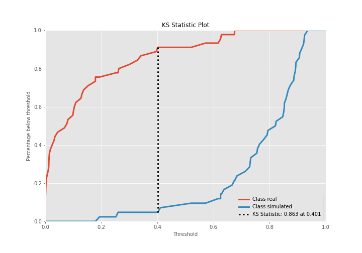

## Precision-Recall Curve

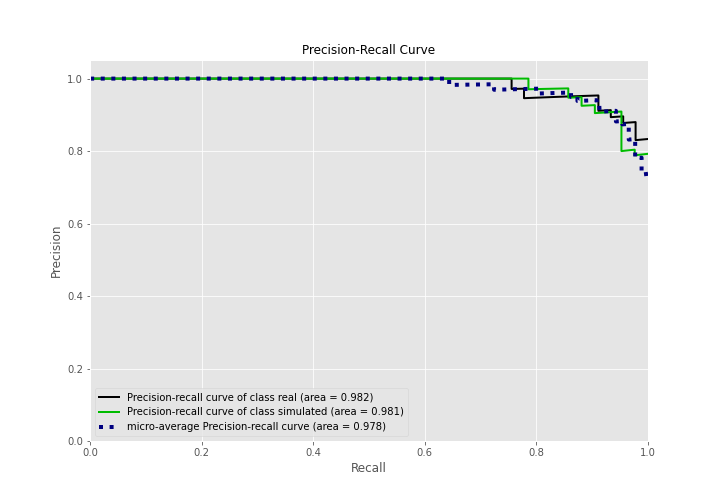

## Calibration Curve

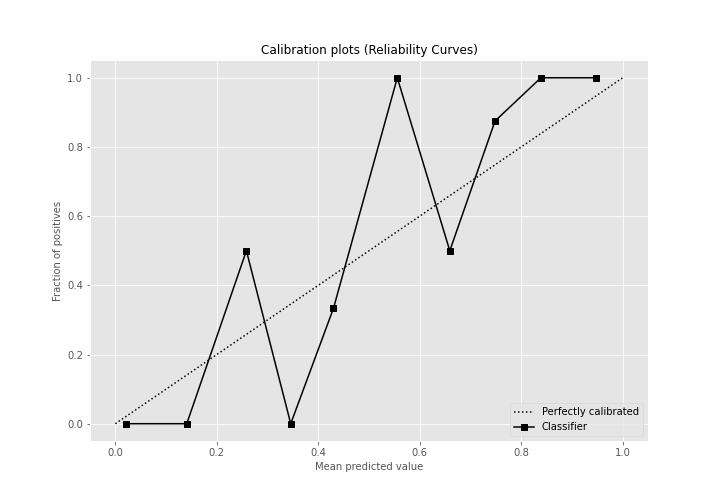

## Cumulative Gains Curve

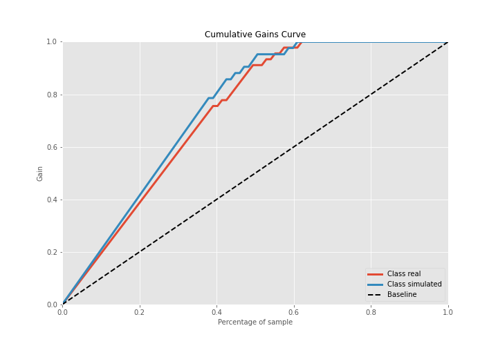

## Lift Curve

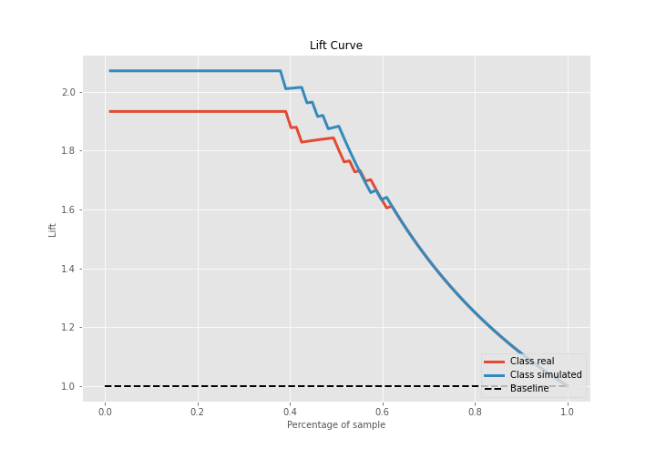

## SHAP Importance
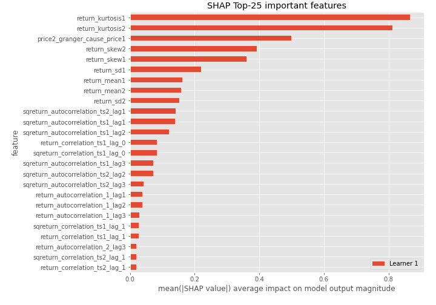

## SHAP Dependence plots

### Dependence (Fold 1)
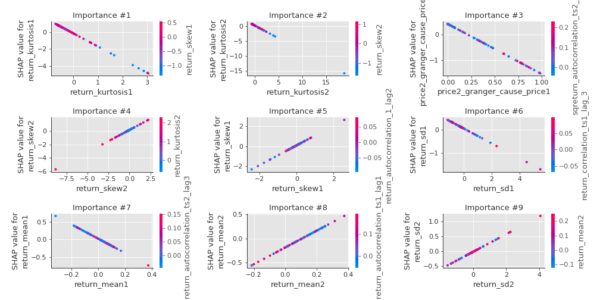

## SHAP Decision plots

### Top-10 Worst decisions for class 0 (Fold 1)
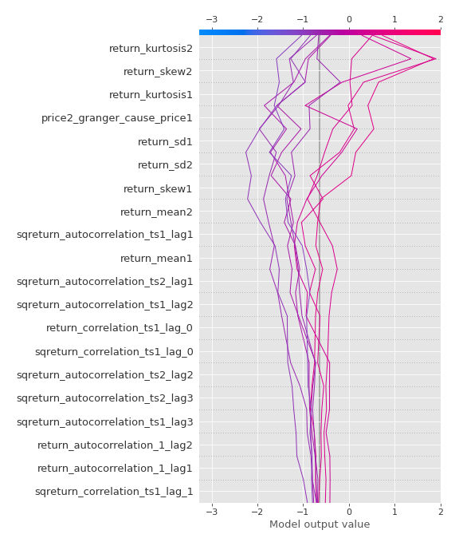
### Top-10 Best decisions for class 0 (Fold 1)
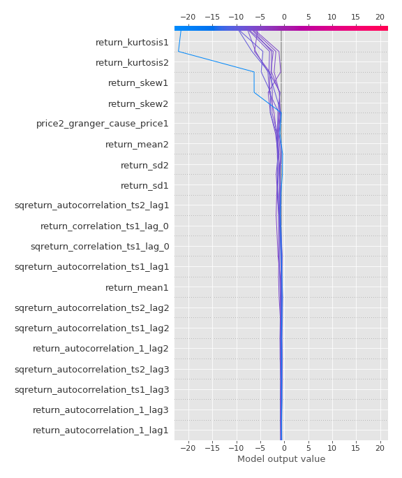
### Top-10 Worst decisions for class 1 (Fold 1)
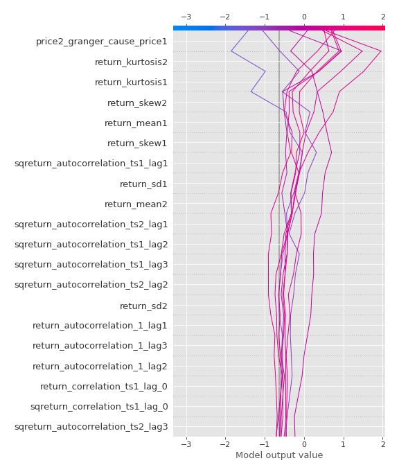
### Top-10 Best decisions for class 1 (Fold 1)
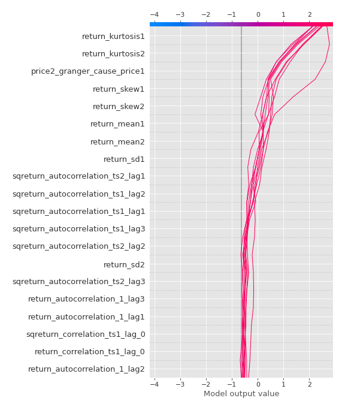

[<< Go back](../README.md)
