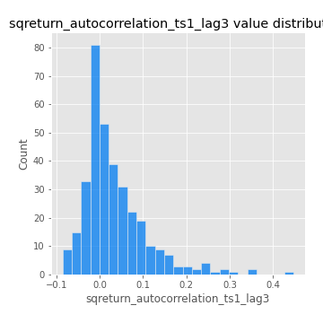

# Exploratory Data Analysis

[<< Go back](../README.md)
## Feature : target
- **Feature type** : categorical
- **Missing** : 0.0%
- **Unique** : 2
- **Count** :347
- **Unique** :2
- **Top** :real
- **Freq** :178

## Feature : return_mean1
- **Feature type** : continous
- **Missing** : 0.0%
- **Unique** : 347
- **Count** :347.0
- **Mean** :0.015429708401693441
- **Std** :0.10063371296369102
- **Min** :-0.31632561686244426
- **25%th Percentile** : -0.04491829019160319
- **50%th Percentile** : 0.0256419719772878
- **75%th Percentile** : 0.08130826976675778
- **Max** :0.37175100008111034

## Feature : return_mean2
- **Feature type** : continous
- **Missing** : 0.0%
- **Unique** : 347
- **Count** :347.0
- **Mean** :0.10383219154475071
- **Std** :0.10437214042082436
- **Min** :-0.21818165578778434
- **25%th Percentile** : 0.04594073577004101
- **50%th Percentile** : 0.09434191780146914
- **75%th Percentile** : 0.17274518257250726
- **Max** :0.3956199294142034

## Feature : return_sd1
- **Feature type** : continous
- **Missing** : 0.0%
- **Unique** : 347
- **Count** :347.0
- **Mean** :1.7805780774812947
- **Std** :0.7654183400771385
- **Min** :0.7620831696941981
- **25%th Percentile** : 1.5328451219559567
- **50%th Percentile** : 1.6417321051593978
- **75%th Percentile** : 1.7463967703475651
- **Max** :9.236766377527575

## Feature : return_sd2
- **Feature type** : continous
- **Missing** : 0.0%
- **Unique** : 347
- **Count** :347.0
- **Mean** :1.8467710534725368
- **Std** :0.6124722496361922
- **Min** :0.8455946193085045
- **25%th Percentile** : 1.614287673603096
- **50%th Percentile** : 1.7687213806932567
- **75%th Percentile** : 1.8827576247208033
- **Max** :5.642692356880054

## Feature : return_skew1
- **Feature type** : continous
- **Missing** : 0.0%
- **Unique** : 347
- **Count** :347.0
- **Mean** :-0.07488654562933537
- **Std** :0.6395474849731551
- **Min** :-3.453087436558107
- **25%th Percentile** : -0.2832068624071784
- **50%th Percentile** : -0.029307370702691855
- **75%th Percentile** : 0.18760601737174115
- **Max** :2.5845963767725557

## Feature : return_skew2
- **Feature type** : continous
- **Missing** : 0.0%
- **Unique** : 347
- **Count** :347.0
- **Mean** :-0.15180255347370886
- **Std** :0.9053404190035388
- **Min** :-8.801502855292393
- **25%th Percentile** : -0.3603280347535872
- **50%th Percentile** : -0.05514544038244297
- **75%th Percentile** : 0.18510135177316742
- **Max** :2.4393589837260956

## Feature : return_kurtosis1
- **Feature type** : continous
- **Missing** : 0.0%
- **Unique** : 347
- **Count** :347.0
- **Mean** :3.9265693474283156
- **Std** :5.917923414643597
- **Min** :-0.4119591298273675
- **25%th Percentile** : 0.7400980632010685
- **50%th Percentile** : 1.8276007356323176
- **75%th Percentile** : 4.1487022518862675
- **Max** :46.07507808162177

## Feature : return_kurtosis2
- **Feature type** : continous
- **Missing** : 0.0%
- **Unique** : 347
- **Count** :347.0
- **Mean** :5.341366534906478
- **Std** :10.470540302547413
- **Min** :-0.27026249282394765
- **25%th Percentile** : 1.0898013932341932
- **50%th Percentile** : 2.503890139162944
- **75%th Percentile** : 5.223162665085413
- **Max** :143.10871011533666

## Feature : return_autocorrelation_1_lag1
- **Feature type** : continous
- **Missing** : 0.0%
- **Unique** : 347
- **Count** :347.0
- **Mean** :-0.004877093167443681
- **Std** :0.06072331574126716
- **Min** :-0.2135576224968752
- **25%th Percentile** : -0.035924516683293745
- **50%th Percentile** : 0.00391039217045615
- **75%th Percentile** : 0.034146785172393376
- **Max** :0.12810656890648087

## Feature : return_autocorrelation_1_lag2
- **Feature type** : continous
- **Missing** : 0.0%
- **Unique** : 347
- **Count** :347.0
- **Mean** :0.004556834243383459
- **Std** :0.0527073917981268
- **Min** :-0.12172858720259
- **25%th Percentile** : -0.028953185401402702
- **50%th Percentile** : 0.004917189763717587
- **75%th Percentile** : 0.039267000531555823
- **Max** :0.14833921435143357

## Feature : return_autocorrelation_1_lag3
- **Feature type** : continous
- **Missing** : 0.0%
- **Unique** : 347
- **Count** :347.0
- **Mean** :0.007577724770702763
- **Std** :0.05329720104739598
- **Min** :-0.1940836867390813
- **25%th Percentile** : -0.025273194916942424
- **50%th Percentile** : 0.008932678805496343
- **75%th Percentile** : 0.04447129264857348
- **Max** :0.13645514352684052

## Feature : return_autocorrelation_2_lag1
- **Feature type** : continous
- **Missing** : 0.0%
- **Unique** : 347
- **Count** :347.0
- **Mean** :-0.006276544341998246
- **Std** :0.06146292134249626
- **Min** :-0.24265814531706406
- **25%th Percentile** : -0.039370937101523215
- **50%th Percentile** : -0.00014486808129350365
- **75%th Percentile** : 0.029373626580146
- **Max** :0.31863413537898483

## Feature : return_autocorrelation_2_lag2
- **Feature type** : continous
- **Missing** : 0.0%
- **Unique** : 347
- **Count** :347.0
- **Mean** :0.00031553686116615157
- **Std** :0.051086072014467965
- **Min** :-0.15323211089747296
- **25%th Percentile** : -0.031863046304821493
- **50%th Percentile** : -8.180695967968901e-05
- **75%th Percentile** : 0.03257648016918591
- **Max** :0.20974504043791217

## Feature : return_autocorrelation_2_lag3
- **Feature type** : continous
- **Missing** : 0.0%
- **Unique** : 347
- **Count** :347.0
- **Mean** :0.0001567302085855689
- **Std** :0.050029745824989924
- **Min** :-0.14200107169559698
- **25%th Percentile** : -0.03359758422790835
- **50%th Percentile** : -0.00034851136339246924
- **75%th Percentile** : 0.03300956780044745
- **Max** :0.1419999376914021

## Feature : return_correlation_ts1_lag_0
- **Feature type** : continous
- **Missing** : 0.0%
- **Unique** : 347
- **Count** :347.0
- **Mean** :0.33173103728322545
- **Std** :0.11085006523973549
- **Min** :-0.027089510445801036
- **25%th Percentile** : 0.2724865105910905
- **50%th Percentile** : 0.34123645893432186
- **75%th Percentile** : 0.39342601102960717
- **Max** :0.7028422087350163

## Feature : return_correlation_ts1_lag_1
- **Feature type** : continous
- **Missing** : 0.0%
- **Unique** : 347
- **Count** :347.0
- **Mean** :-0.0011599189390187185
- **Std** :0.05519257019044614
- **Min** :-0.16985510949917193
- **25%th Percentile** : -0.035158658963848705
- **50%th Percentile** : 0.0014855754062759131
- **75%th Percentile** : 0.03470430025484378
- **Max** :0.16172328341100975

## Feature : return_correlation_ts1_lag_2
- **Feature type** : continous
- **Missing** : 0.0%
- **Unique** : 347
- **Count** :347.0
- **Mean** :0.007385831692031008
- **Std** :0.049901720574627564
- **Min** :-0.21653581047581763
- **25%th Percentile** : -0.02807117768657853
- **50%th Percentile** : 0.006932522837678447
- **75%th Percentile** : 0.045347549678309146
- **Max** :0.13213427351981638

## Feature : return_correlation_ts1_lag_3
- **Feature type** : continous
- **Missing** : 0.0%
- **Unique** : 347
- **Count** :347.0
- **Mean** :0.0038468347943792255
- **Std** :0.051212050870297336
- **Min** :-0.12306593817498207
- **25%th Percentile** : -0.030238565564003804
- **50%th Percentile** : 0.00014447257410069473
- **75%th Percentile** : 0.03701811121193981
- **Max** :0.1636773216468148

## Feature : return_correlation_ts2_lag_1
- **Feature type** : continous
- **Missing** : 0.0%
- **Unique** : 347
- **Count** :347.0
- **Mean** :-0.0026565496236344746
- **Std** :0.056347014280197394
- **Min** :-0.2081139431093261
- **25%th Percentile** : -0.03462491683286509
- **50%th Percentile** : -0.0009936502863695511
- **75%th Percentile** : 0.034904752884661404
- **Max** :0.17208763791364762

## Feature : return_correlation_ts2_lag_2
- **Feature type** : continous
- **Missing** : 0.0%
- **Unique** : 347
- **Count** :347.0
- **Mean** :0.006153839034950631
- **Std** :0.050619104188550715
- **Min** :-0.23751835475804678
- **25%th Percentile** : -0.027619474457301767
- **50%th Percentile** : 0.003485453752017087
- **75%th Percentile** : 0.03955927479865544
- **Max** :0.15388933426238696

## Feature : return_correlation_ts2_lag_3
- **Feature type** : continous
- **Missing** : 0.0%
- **Unique** : 347
- **Count** :347.0
- **Mean** :0.00763220500563044
- **Std** :0.05226989157602013
- **Min** :-0.1603001201932561
- **25%th Percentile** : -0.02305880182590516
- **50%th Percentile** : 0.005205566517259729
- **75%th Percentile** : 0.04417599601380624
- **Max** :0.13334847467853866

## Feature : sqreturn_autocorrelation_ts1_lag1
- **Feature type** : continous
- **Missing** : 0.0%
- **Unique** : 347
- **Count** :347.0
- **Mean** :0.04620851791711725
- **Std** :0.08831005990994298
- **Min** :-0.09551761114136578
- **25%th Percentile** : -0.013430925996379808
- **50%th Percentile** : 0.020270486563599897
- **75%th Percentile** : 0.08389693547723884
- **Max** :0.49414293176447355

## Feature : sqreturn_autocorrelation_ts1_lag2
- **Feature type** : continous
- **Missing** : 0.0%
- **Unique** : 347
- **Count** :347.0
- **Mean** :0.0397404974477629
- **Std** :0.08648057502125571
- **Min** :-0.08893418917098538
- **25%th Percentile** : -0.013593166527593892
- **50%th Percentile** : 0.015272211200579837
- **75%th Percentile** : 0.06370830133280704
- **Max** :0.42719220751700526

## Feature : sqreturn_autocorrelation_ts1_lag3
- **Feature type** : continous
- **Missing** : 0.0%
- **Unique** : 347
- **Count** :347.0
- **Mean** :0.033655082182646234
- **Std** :0.07559187436497514
- **Min** :-0.08607101965350265
- **25%th Percentile** : -0.013709928357077886
- **50%th Percentile** : 0.012593715022244586
- **75%th Percentile** : 0.06302625843491666
- **Max** :0.44755937369538146

## Feature : sqreturn_autocorrelation_ts2_lag1
- **Feature type** : continous
- **Missing** : 0.0%
- **Unique** : 347
- **Count** :347.0
- **Mean** :0.04537899804984495
- **Std** :0.08900080500471849
- **Min** :-0.0873252128692687
- **25%th Percentile** : -0.014388904577460292
- **50%th Percentile** : 0.020506770996497344
- **75%th Percentile** : 0.07416764381043656
- **Max** :0.510085647437958

## Feature : sqreturn_autocorrelation_ts2_lag2
- **Feature type** : continous
- **Missing** : 0.0%
- **Unique** : 347
- **Count** :347.0
- **Mean** :0.03547160819407973
- **Std** :0.08345629915209664
- **Min** :-0.07662127659916923
- **25%th Percentile** : -0.012227083633217197
- **50%th Percentile** : 0.01162085636483385
- **75%th Percentile** : 0.050343449664861
- **Max** :0.5373432415582473

## Feature : sqreturn_autocorrelation_ts2_lag3
- **Feature type** : continous
- **Missing** : 0.0%
- **Unique** : 347
- **Count** :347.0
- **Mean** :0.02675968893109266
- **Std** :0.06750843519174295
- **Min** :-0.08206354511987698
- **25%th Percentile** : -0.017058460366603773
- **50%th Percentile** : 0.009207583984403573
- **75%th Percentile** : 0.047028593954002634
- **Max** :0.30256115637327263

## Feature : sqreturn_correlation_ts1_lag_0
- **Feature type** : continous
- **Missing** : 0.0%
- **Unique** : 347
- **Count** :347.0
- **Mean** :0.33173103728322545
- **Std** :0.11085006523973549
- **Min** :-0.027089510445801036
- **25%th Percentile** : 0.2724865105910905
- **50%th Percentile** : 0.34123645893432186
- **75%th Percentile** : 0.39342601102960717
- **Max** :0.7028422087350163

## Feature : sqreturn_correlation_ts1_lag_1
- **Feature type** : continous
- **Missing** : 0.0%
- **Unique** : 347
- **Count** :347.0
- **Mean** :-0.0011599189390187185
- **Std** :0.05519257019044614
- **Min** :-0.16985510949917193
- **25%th Percentile** : -0.035158658963848705
- **50%th Percentile** : 0.0014855754062759131
- **75%th Percentile** : 0.03470430025484378
- **Max** :0.16172328341100975

## Feature : sqreturn_correlation_ts1_lag_2
- **Feature type** : continous
- **Missing** : 0.0%
- **Unique** : 347
- **Count** :347.0
- **Mean** :0.007385831692031008
- **Std** :0.049901720574627564
- **Min** :-0.21653581047581763
- **25%th Percentile** : -0.02807117768657853
- **50%th Percentile** : 0.006932522837678447
- **75%th Percentile** : 0.045347549678309146
- **Max** :0.13213427351981638

## Feature : sqreturn_correlation_ts1_lag_3
- **Feature type** : continous
- **Missing** : 0.0%
- **Unique** : 347
- **Count** :347.0
- **Mean** :0.0038468347943792255
- **Std** :0.051212050870297336
- **Min** :-0.12306593817498207
- **25%th Percentile** : -0.030238565564003804
- **50%th Percentile** : 0.00014447257410069473
- **75%th Percentile** : 0.03701811121193981
- **Max** :0.1636773216468148

## Feature : sqreturn_correlation_ts2_lag_1
- **Feature type** : continous
- **Missing** : 0.0%
- **Unique** : 347
- **Count** :347.0
- **Mean** :-0.0026565496236344746
- **Std** :0.056347014280197394
- **Min** :-0.2081139431093261
- **25%th Percentile** : -0.03462491683286509
- **50%th Percentile** : -0.0009936502863695511
- **75%th Percentile** : 0.034904752884661404
- **Max** :0.17208763791364762

## Feature : sqreturn_correlation_ts2_lag_2
- **Feature type** : continous
- **Missing** : 0.0%
- **Unique** : 347
- **Count** :347.0
- **Mean** :0.006153839034950631
- **Std** :0.050619104188550715
- **Min** :-0.23751835475804678
- **25%th Percentile** : -0.027619474457301767
- **50%th Percentile** : 0.003485453752017087
- **75%th Percentile** : 0.03955927479865544
- **Max** :0.15388933426238696

## Feature : sqreturn_correlation_ts2_lag_3
- **Feature type** : continous
- **Missing** : 0.0%
- **Unique** : 347
- **Count** :347.0
- **Mean** :0.00763220500563044
- **Std** :0.05226989157602013
- **Min** :-0.1603001201932561
- **25%th Percentile** : -0.02305880182590516
- **50%th Percentile** : 0.005205566517259729
- **75%th Percentile** : 0.04417599601380624
- **Max** :0.13334847467853866

## Feature : price2_granger_cause_price1
- **Feature type** : continous
- **Missing** : 0.0%
- **Unique** : 347
- **Count** :347.0
- **Mean** :0.2286095643424541
- **Std** :0.2724465751411797
- **Min** :5.700706402544319e-09
- **25%th Percentile** : 0.0076728057320276585
- **50%th Percentile** : 0.09618302401758365
- **75%th Percentile** : 0.38897471576885506
- **Max** :0.9853666024514321

## Feature : price1_granger_cause_price2
- **Feature type** : continous
- **Missing** : 0.0%
- **Unique** : 347
- **Count** :347.0
- **Mean** :0.31310410858002913
- **Std** :0.29163593535971066
- **Min** :1.042981733105001e-06
- **25%th Percentile** : 0.0495496801033168
- **50%th Percentile** : 0.22683679100372495
- **75%th Percentile** : 0.5522146834512071
- **Max** :0.9951398266867577

[<< Go back](../README.md)
