# Exploratory Data Analysis

[<< Go back](../README.md)
## Feature : target
- **Feature type** : categorical
- **Missing** : 0.0%
- **Unique** : 2
- **Count** :347
- **Unique** :2
- **Top** :real
- **Freq** :178

## Feature : return_mean1
- **Feature type** : continous
- **Missing** : 0.0%
- **Unique** : 347
- **Count** :347.0
- **Mean** :0.013385461165223555
- **Std** :0.10602381379671137
- **Min** :-0.33396215433247645
- **25%th Percentile** : -0.040559830121171835
- **50%th Percentile** : 0.020791065331283814
- **75%th Percentile** : 0.08057034349595446
- **Max** :0.36728797156055987

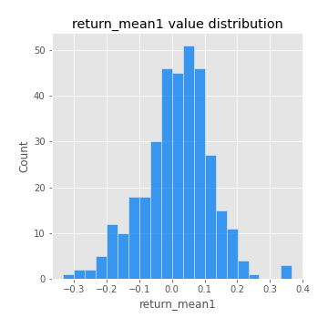
## Feature : return_mean2
- **Feature type** : continous
- **Missing** : 0.0%
- **Unique** : 347
- **Count** :347.0
- **Mean** :0.101953643266668
- **Std** :0.10230084937437764
- **Min** :-0.24205418062825398
- **25%th Percentile** : 0.0437677159325527
- **50%th Percentile** : 0.09822058238526712
- **75%th Percentile** : 0.16352712838324396
- **Max** :0.37616608147096464

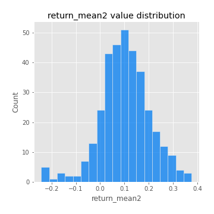
## Feature : return_sd1
- **Feature type** : continous
- **Missing** : 0.0%
- **Unique** : 347
- **Count** :347.0
- **Mean** :1.7945615558317203
- **Std** :0.7427714455821398
- **Min** :0.7470080772831957
- **25%th Percentile** : 1.5589489080418844
- **50%th Percentile** : 1.6560570948786808
- **75%th Percentile** : 1.767083439943149
- **Max** :9.236766377527575

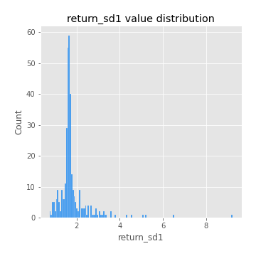
## Feature : return_sd2
- **Feature type** : continous
- **Missing** : 0.0%
- **Unique** : 347
- **Count** :347.0
- **Mean** :1.9036360377788621
- **Std** :0.7071190281526176
- **Min** :0.8592887433004143
- **25%th Percentile** : 1.6527951235236915
- **50%th Percentile** : 1.7828904803775092
- **75%th Percentile** : 1.9253733638653394
- **Max** :6.737618636746393

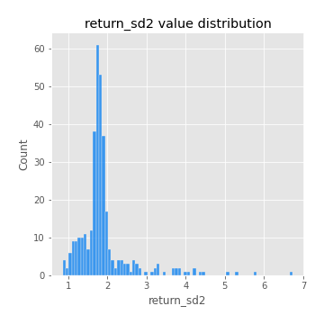
## Feature : return_skew1
- **Feature type** : continous
- **Missing** : 0.0%
- **Unique** : 347
- **Count** :347.0
- **Mean** :-0.0740959946810936
- **Std** :0.5994918910253085
- **Min** :-2.817259764925239
- **25%th Percentile** : -0.2759012561014177
- **50%th Percentile** : -0.06119596623236936
- **75%th Percentile** : 0.16816062219568628
- **Max** :2.5845963767725557

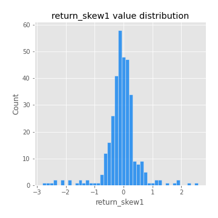
## Feature : return_skew2
- **Feature type** : continous
- **Missing** : 0.0%
- **Unique** : 347
- **Count** :347.0
- **Mean** :-0.13469623279975348
- **Std** :0.8495742148239696
- **Min** :-8.801502855292393
- **25%th Percentile** : -0.36929559134840095
- **50%th Percentile** : -0.0612530463144089
- **75%th Percentile** : 0.19580326780004426
- **Max** :2.2606839051517187

## Feature : return_kurtosis1
- **Feature type** : continous
- **Missing** : 0.0%
- **Unique** : 347
- **Count** :347.0
- **Mean** :3.781509968154022
- **Std** :5.527064457116666
- **Min** :-0.17553050635166523
- **25%th Percentile** : 0.8366381540820089
- **50%th Percentile** : 1.8428602658734907
- **75%th Percentile** : 4.056004471660783
- **Max** :36.91113889081053

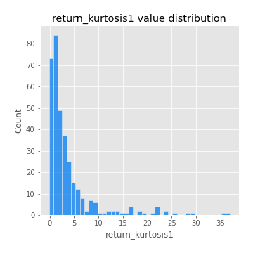
## Feature : return_kurtosis2
- **Feature type** : continous
- **Missing** : 0.0%
- **Unique** : 347
- **Count** :347.0
- **Mean** :5.001217555070609
- **Std** :9.998056987147903
- **Min** :-0.12141561330006345
- **25%th Percentile** : 1.215208166934434
- **50%th Percentile** : 2.5779227404744405
- **75%th Percentile** : 4.630933919070996
- **Max** :143.10871011533666

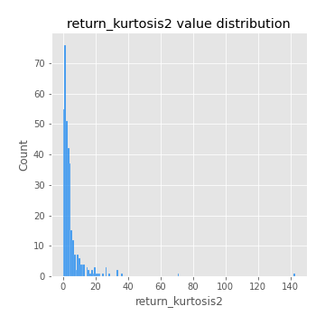
## Feature : return_autocorrelation_1_lag1
- **Feature type** : continous
- **Missing** : 0.0%
- **Unique** : 347
- **Count** :347.0
- **Mean** :-0.0028155289768088043
- **Std** :0.06193460774902605
- **Min** :-0.2135576224968752
- **25%th Percentile** : -0.035924516683293745
- **50%th Percentile** : 0.003119530371708991
- **75%th Percentile** : 0.035917362929334326
- **Max** :0.162183688007226

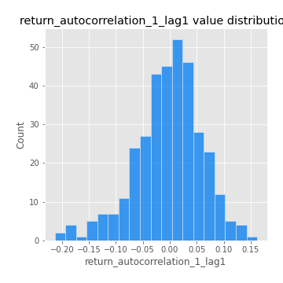
## Feature : return_autocorrelation_1_lag2
- **Feature type** : continous
- **Missing** : 0.0%
- **Unique** : 347
- **Count** :347.0
- **Mean** :0.0012541142826371454
- **Std** :0.05122434948826025
- **Min** :-0.13309283796645122
- **25%th Percentile** : -0.028543276208422532
- **50%th Percentile** : 0.0027468042230478548
- **75%th Percentile** : 0.03374943431787939
- **Max** :0.1561488228015672

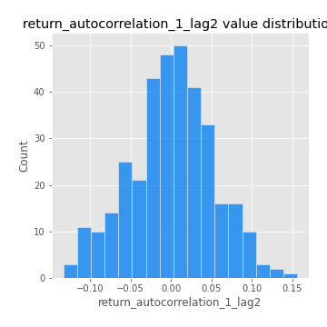
## Feature : return_autocorrelation_1_lag3
- **Feature type** : continous
- **Missing** : 0.0%
- **Unique** : 347
- **Count** :347.0
- **Mean** :0.00360785945719508
- **Std** :0.054382837023318656
- **Min** :-0.1940836867390813
- **25%th Percentile** : -0.029269536532889648
- **50%th Percentile** : 0.006151538576525067
- **75%th Percentile** : 0.03750396303857202
- **Max** :0.17805869530681923

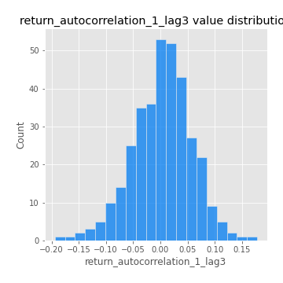
## Feature : return_autocorrelation_2_lag1
- **Feature type** : continous
- **Missing** : 0.0%
- **Unique** : 347
- **Count** :347.0
- **Mean** :-0.004639057353358391
- **Std** :0.06001155060291433
- **Min** :-0.24590087874039124
- **25%th Percentile** : -0.034118382524382526
- **50%th Percentile** : 0.0007346489414504101
- **75%th Percentile** : 0.03301597669385119
- **Max** :0.31863413537898483

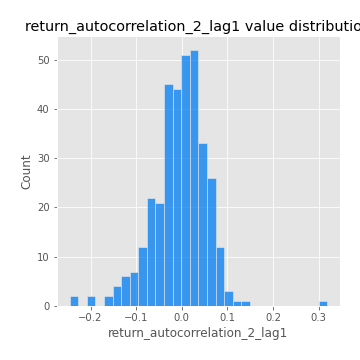
## Feature : return_autocorrelation_2_lag2
- **Feature type** : continous
- **Missing** : 0.0%
- **Unique** : 347
- **Count** :347.0
- **Mean** :-0.0017391958344860617
- **Std** :0.05141793552007796
- **Min** :-0.15323211089747296
- **25%th Percentile** : -0.035836711570165006
- **50%th Percentile** : -0.0034670824892446316
- **75%th Percentile** : 0.030555147667991868
- **Max** :0.20974504043791217

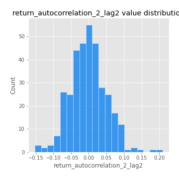
## Feature : return_autocorrelation_2_lag3
- **Feature type** : continous
- **Missing** : 0.0%
- **Unique** : 347
- **Count** :347.0
- **Mean** :-0.005414549885827189
- **Std** :0.04761018310943748
- **Min** :-0.14200107169559698
- **25%th Percentile** : -0.031915714830197325
- **50%th Percentile** : -0.004553860409471424
- **75%th Percentile** : 0.025937137287336466
- **Max** :0.12103978207043897

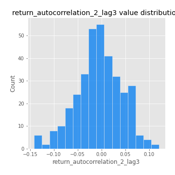
## Feature : return_correlation_ts1_lag_0
- **Feature type** : continous
- **Missing** : 0.0%
- **Unique** : 347
- **Count** :347.0
- **Mean** :0.3452926477632437
- **Std** :0.11246216439668705
- **Min** :-0.027089510445801036
- **25%th Percentile** : 0.2800250495420903
- **50%th Percentile** : 0.3534079476044055
- **75%th Percentile** : 0.40048683296402504
- **Max** :0.7028422087350163

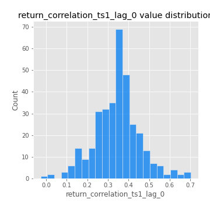
## Feature : return_correlation_ts1_lag_1
- **Feature type** : continous
- **Missing** : 0.0%
- **Unique** : 347
- **Count** :347.0
- **Mean** :-0.0006817257897900738
- **Std** :0.053022000024073805
- **Min** :-0.16985510949917193
- **25%th Percentile** : -0.035158658963848705
- **50%th Percentile** : 0.006760673513257809
- **75%th Percentile** : 0.03762047200401461
- **Max** :0.15499424718508623

## Feature : return_correlation_ts1_lag_2
- **Feature type** : continous
- **Missing** : 0.0%
- **Unique** : 347
- **Count** :347.0
- **Mean** :0.006166001434257342
- **Std** :0.05009762077232674
- **Min** :-0.21653581047581763
- **25%th Percentile** : -0.02659406135660889
- **50%th Percentile** : 0.006932522837678447
- **75%th Percentile** : 0.039926577105939234
- **Max** :0.12744768202203863

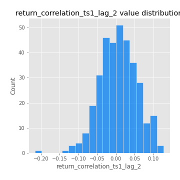
## Feature : return_correlation_ts1_lag_3
- **Feature type** : continous
- **Missing** : 0.0%
- **Unique** : 347
- **Count** :347.0
- **Mean** :0.0047179500886883555
- **Std** :0.052397318311945044
- **Min** :-0.1270218498974763
- **25%th Percentile** : -0.030505206301461675
- **50%th Percentile** : 0.005795509608942123
- **75%th Percentile** : 0.03792718973501405
- **Max** :0.1636773216468148

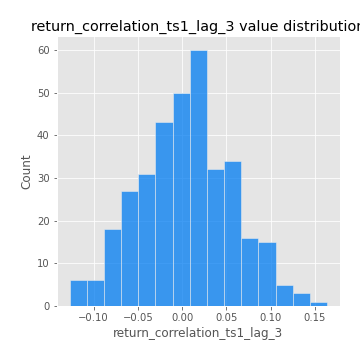
## Feature : return_correlation_ts2_lag_1
- **Feature type** : continous
- **Missing** : 0.0%
- **Unique** : 347
- **Count** :347.0
- **Mean** :0.00021344246335021935
- **Std** :0.05765558890606303
- **Min** :-0.2081139431093261
- **25%th Percentile** : -0.03154288251341745
- **50%th Percentile** : -0.0050514227174079055
- **75%th Percentile** : 0.040323255878308324
- **Max** :0.18093508401423972

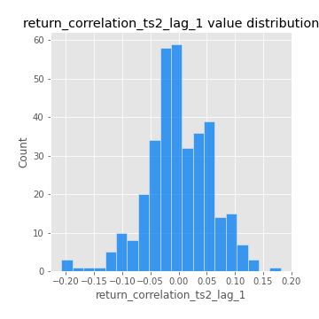
## Feature : return_correlation_ts2_lag_2
- **Feature type** : continous
- **Missing** : 0.0%
- **Unique** : 347
- **Count** :347.0
- **Mean** :0.00429893830688908
- **Std** :0.051156987350675386
- **Min** :-0.23751835475804678
- **25%th Percentile** : -0.029693476411794272
- **50%th Percentile** : 0.004624144408871608
- **75%th Percentile** : 0.03754646418214945
- **Max** :0.20772887392904255

## Feature : return_correlation_ts2_lag_3
- **Feature type** : continous
- **Missing** : 0.0%
- **Unique** : 347
- **Count** :347.0
- **Mean** :0.001123482656835366
- **Std** :0.05444169028180537
- **Min** :-0.17564076057312866
- **25%th Percentile** : -0.029615076841798395
- **50%th Percentile** : -0.0010017617579265372
- **75%th Percentile** : 0.0399638948762161
- **Max** :0.12578577770423086

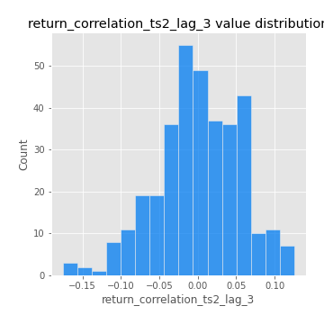
## Feature : sqreturn_autocorrelation_ts1_lag1
- **Feature type** : continous
- **Missing** : 0.0%
- **Unique** : 347
- **Count** :347.0
- **Mean** :0.05393003648450336
- **Std** :0.09591143187995098
- **Min** :-0.09318536270372944
- **25%th Percentile** : -0.013155698470006819
- **50%th Percentile** : 0.02633647625872019
- **75%th Percentile** : 0.08808965261429583
- **Max** :0.49414293176447355

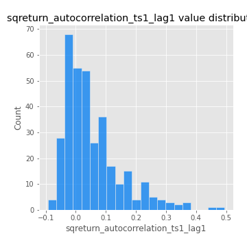
## Feature : sqreturn_autocorrelation_ts1_lag2
- **Feature type** : continous
- **Missing** : 0.0%
- **Unique** : 347
- **Count** :347.0
- **Mean** :0.045171205165049445
- **Std** :0.09786429392645311
- **Min** :-0.09243442579101241
- **25%th Percentile** : -0.017485215983249147
- **50%th Percentile** : 0.015318186524706843
- **75%th Percentile** : 0.07286748544939903
- **Max** :0.540735851444759

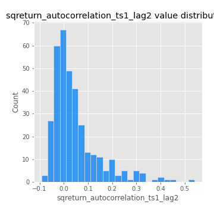
## Feature : sqreturn_autocorrelation_ts1_lag3
- **Feature type** : continous
- **Missing** : 0.0%
- **Unique** : 347
- **Count** :347.0
- **Mean** :0.036414079546457014
- **Std** :0.07973335228587954
- **Min** :-0.09656421453553381
- **25%th Percentile** : -0.014597331309441457
- **50%th Percentile** : 0.014269743043924777
- **75%th Percentile** : 0.06269104546144452
- **Max** :0.41030914918857014

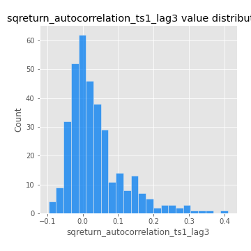
## Feature : sqreturn_autocorrelation_ts2_lag1
- **Feature type** : continous
- **Missing** : 0.0%
- **Unique** : 347
- **Count** :347.0
- **Mean** :0.052208587337586036
- **Std** :0.08923142321752339
- **Min** :-0.09219202962629457
- **25%th Percentile** : -0.007388211430805263
- **50%th Percentile** : 0.026888777106574537
- **75%th Percentile** : 0.08880025948412462
- **Max** :0.510085647437958

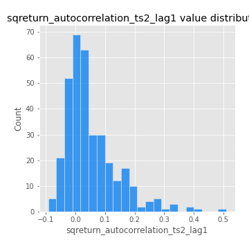
## Feature : sqreturn_autocorrelation_ts2_lag2
- **Feature type** : continous
- **Missing** : 0.0%
- **Unique** : 347
- **Count** :347.0
- **Mean** :0.04108210709443744
- **Std** :0.09394403872249264
- **Min** :-0.09815010004748496
- **25%th Percentile** : -0.01457863023312543
- **50%th Percentile** : 0.012367098888812732
- **75%th Percentile** : 0.058131052258635366
- **Max** :0.5373432415582473

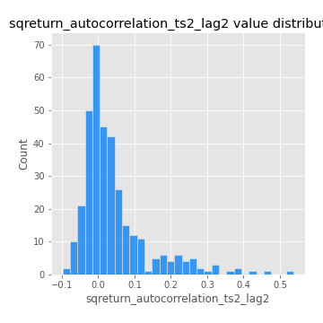
## Feature : sqreturn_autocorrelation_ts2_lag3
- **Feature type** : continous
- **Missing** : 0.0%
- **Unique** : 347
- **Count** :347.0
- **Mean** :0.02858133163096892
- **Std** :0.07151415308853937
- **Min** :-0.10630998362091316
- **25%th Percentile** : -0.019735755557191287
- **50%th Percentile** : 0.010674848682306184
- **75%th Percentile** : 0.05866544286124031
- **Max** :0.31225727797735664

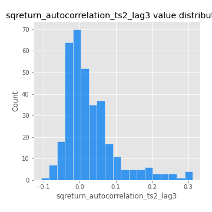
## Feature : sqreturn_correlation_ts1_lag_0
- **Feature type** : continous
- **Missing** : 0.0%
- **Unique** : 347
- **Count** :347.0
- **Mean** :0.3452926477632437
- **Std** :0.11246216439668705
- **Min** :-0.027089510445801036
- **25%th Percentile** : 0.2800250495420903
- **50%th Percentile** : 0.3534079476044055
- **75%th Percentile** : 0.40048683296402504
- **Max** :0.7028422087350163

## Feature : sqreturn_correlation_ts1_lag_1
- **Feature type** : continous
- **Missing** : 0.0%
- **Unique** : 347
- **Count** :347.0
- **Mean** :-0.0006817257897900738
- **Std** :0.053022000024073805
- **Min** :-0.16985510949917193
- **25%th Percentile** : -0.035158658963848705
- **50%th Percentile** : 0.006760673513257809
- **75%th Percentile** : 0.03762047200401461
- **Max** :0.15499424718508623

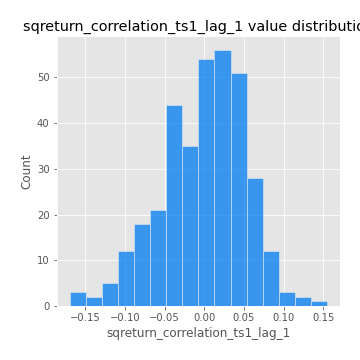
## Feature : sqreturn_correlation_ts1_lag_2
- **Feature type** : continous
- **Missing** : 0.0%
- **Unique** : 347
- **Count** :347.0
- **Mean** :0.006166001434257342
- **Std** :0.05009762077232674
- **Min** :-0.21653581047581763
- **25%th Percentile** : -0.02659406135660889
- **50%th Percentile** : 0.006932522837678447
- **75%th Percentile** : 0.039926577105939234
- **Max** :0.12744768202203863

## Feature : sqreturn_correlation_ts1_lag_3
- **Feature type** : continous
- **Missing** : 0.0%
- **Unique** : 347
- **Count** :347.0
- **Mean** :0.0047179500886883555
- **Std** :0.052397318311945044
- **Min** :-0.1270218498974763
- **25%th Percentile** : -0.030505206301461675
- **50%th Percentile** : 0.005795509608942123
- **75%th Percentile** : 0.03792718973501405
- **Max** :0.1636773216468148

## Feature : sqreturn_correlation_ts2_lag_1
- **Feature type** : continous
- **Missing** : 0.0%
- **Unique** : 347
- **Count** :347.0
- **Mean** :0.00021344246335021935
- **Std** :0.05765558890606303
- **Min** :-0.2081139431093261
- **25%th Percentile** : -0.03154288251341745
- **50%th Percentile** : -0.0050514227174079055
- **75%th Percentile** : 0.040323255878308324
- **Max** :0.18093508401423972

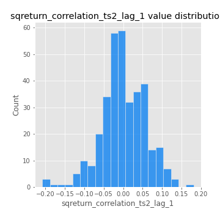
## Feature : sqreturn_correlation_ts2_lag_2
- **Feature type** : continous
- **Missing** : 0.0%
- **Unique** : 347
- **Count** :347.0
- **Mean** :0.00429893830688908
- **Std** :0.051156987350675386
- **Min** :-0.23751835475804678
- **25%th Percentile** : -0.029693476411794272
- **50%th Percentile** : 0.004624144408871608
- **75%th Percentile** : 0.03754646418214945
- **Max** :0.20772887392904255

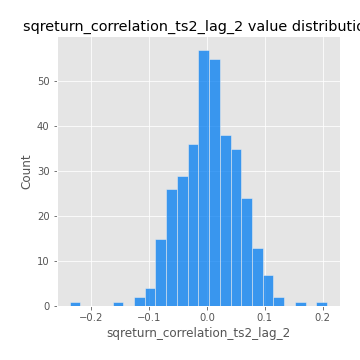
## Feature : sqreturn_correlation_ts2_lag_3
- **Feature type** : continous
- **Missing** : 0.0%
- **Unique** : 347
- **Count** :347.0
- **Mean** :0.001123482656835366
- **Std** :0.05444169028180537
- **Min** :-0.17564076057312866
- **25%th Percentile** : -0.029615076841798395
- **50%th Percentile** : -0.0010017617579265372
- **75%th Percentile** : 0.0399638948762161
- **Max** :0.12578577770423086

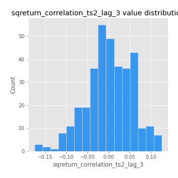
## Feature : price2_granger_cause_price1
- **Feature type** : continous
- **Missing** : 0.0%
- **Unique** : 347
- **Count** :347.0
- **Mean** :0.25784684798311175
- **Std** :0.2869405139269667
- **Min** :3.398919736929358e-09
- **25%th Percentile** : 0.00966627031168149
- **50%th Percentile** : 0.12241981454452583
- **75%th Percentile** : 0.4683228782972585
- **Max** :0.9885712803689185

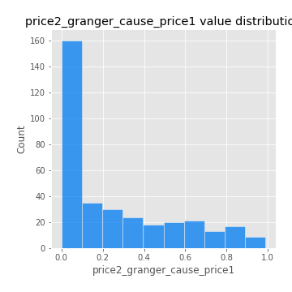
## Feature : price1_granger_cause_price2
- **Feature type** : continous
- **Missing** : 0.0%
- **Unique** : 347
- **Count** :347.0
- **Mean** :0.3347809735864521
- **Std** :0.290997409062692
- **Min** :1.1512382550896504e-07
- **25%th Percentile** : 0.0740755740355312
- **50%th Percentile** : 0.2647443963188926
- **75%th Percentile** : 0.5567382274811699
- **Max** :0.9951398266867577

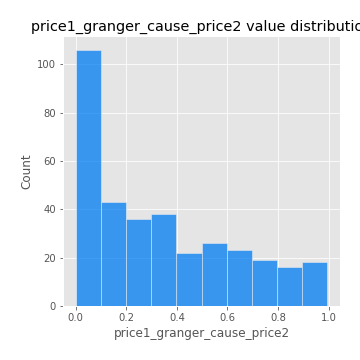

[<< Go back](../README.md)
