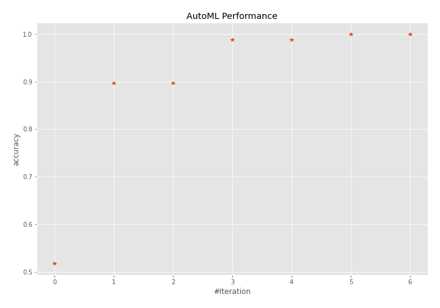
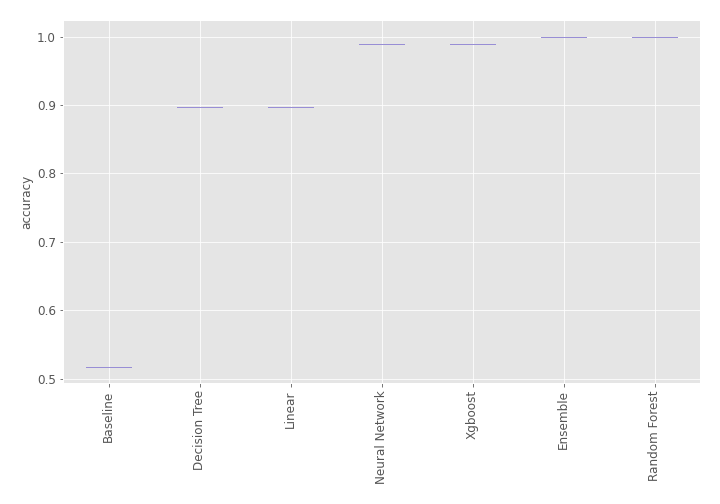
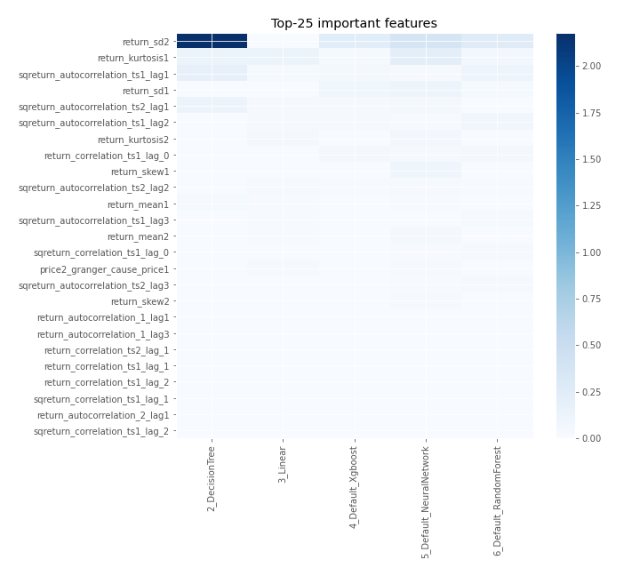
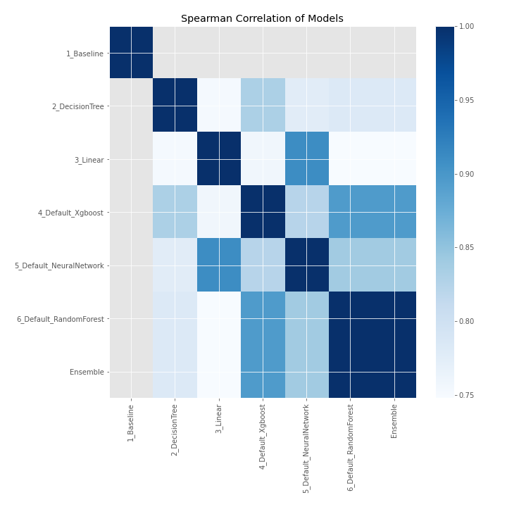

# AutoML Leaderboard

| Best model   | name                                                         | model_type     | metric_type   |   metric_value |   train_time |
|:-------------|:-------------------------------------------------------------|:---------------|:--------------|---------------:|-------------:|
|              | [1_Baseline](1_Baseline/README.md)                           | Baseline       | accuracy      |       0.517241 |         5.29 |
|              | [2_DecisionTree](2_DecisionTree/README.md)                   | Decision Tree  | accuracy      |       0.896552 |         9.21 |
|              | [3_Linear](3_Linear/README.md)                               | Linear         | accuracy      |       0.896552 |         8.41 |
|              | [4_Default_Xgboost](4_Default_Xgboost/README.md)             | Xgboost        | accuracy      |       0.988506 |         8.72 |
|              | [5_Default_NeuralNetwork](5_Default_NeuralNetwork/README.md) | Neural Network | accuracy      |       0.988506 |         8.77 |
| **the best** | [6_Default_RandomForest](6_Default_RandomForest/README.md)   | Random Forest  | accuracy      |       1        |        13.93 |
|              | [Ensemble](Ensemble/README.md)                               | Ensemble       | accuracy      |       1        |         0.33 |

### AutoML Performance

### AutoML Performance Boxplot

### Features Importance

### Spearman Correlation of Models

