# Summary of 3_Linear

[<< Go back](../README.md)

## Logistic Regression (Linear)
- **n_jobs**: -1
- **explain_level**: 2

## Validation
 - **validation_type**: split
 - **train_ratio**: 0.75
 - **shuffle**: True
 - **stratify**: True

## Optimized metric
accuracy

## Training time

7.5 seconds

## Metric details
|           |    score |     threshold |
|:----------|---------:|--------------:|
| logloss   | 0.364645 | nan           |
| auc       | 0.93883  | nan           |
| f1        | 0.891304 |   0.537213    |
| accuracy  | 0.885057 |   0.572846    |
| precision | 1        |   0.691962    |
| recall    | 1        |   1.82505e-06 |
| mcc       | 0.785183 |   0.624624    |

## Confusion matrix (at threshold=0.572846)
|                      |   Predicted as real |   Predicted as simulated |
|:---------------------|--------------------:|-------------------------:|
| Labeled as real      |                  38 |                        2 |
| Labeled as simulated |                   8 |                       39 |

## Learning curves
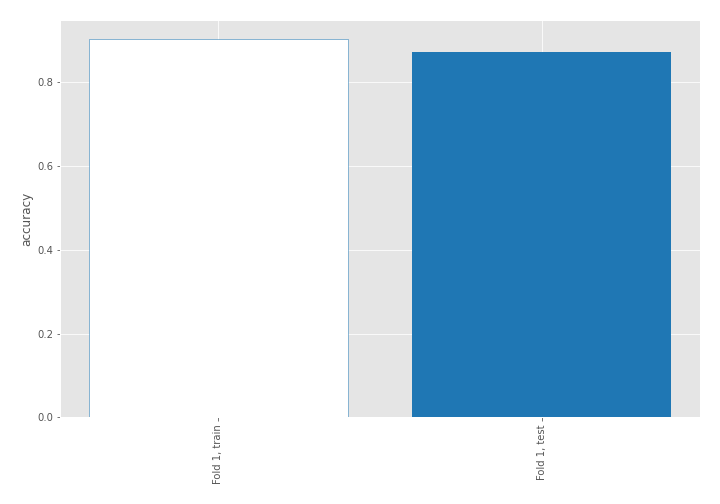

## Coefficients
| feature                           |   Learner_1 |
|:----------------------------------|------------:|
| return_mean2                      |   1.76961   |
| return_correlation_ts1_lag_0      |   1.24419   |
| sqreturn_correlation_ts1_lag_0    |   1.24419   |
| return_autocorrelation_1_lag2     |   1.03085   |
| return_autocorrelation_1_lag1     |   0.85525   |
| sqreturn_correlation_ts1_lag_2    |   0.690523  |
| return_correlation_ts1_lag_2      |   0.690523  |
| sqreturn_correlation_ts1_lag_1    |   0.613685  |
| return_correlation_ts1_lag_1      |   0.613685  |
| return_correlation_ts2_lag_1      |   0.560777  |
| sqreturn_correlation_ts2_lag_1    |   0.560777  |
| return_skew1                      |   0.515711  |
| return_autocorrelation_2_lag2     |   0.493943  |
| return_autocorrelation_1_lag3     |   0.453148  |
| return_autocorrelation_2_lag3     |   0.416986  |
| return_autocorrelation_2_lag1     |   0.393354  |
| return_skew2                      |   0.331782  |
| sqreturn_correlation_ts2_lag_2    |   0.313281  |
| return_correlation_ts2_lag_2      |   0.313281  |
| return_correlation_ts2_lag_3      |   0.295121  |
| sqreturn_correlation_ts2_lag_3    |   0.295121  |
| sqreturn_correlation_ts1_lag_3    |   0.2167    |
| return_correlation_ts1_lag_3      |   0.2167    |
| return_sd2                        |   0.116274  |
| intercept                         |  -0.0761662 |
| return_sd1                        |  -0.29216   |
| return_kurtosis2                  |  -0.461446  |
| price1_granger_cause_price2       |  -0.492201  |
| sqreturn_autocorrelation_ts2_lag3 |  -0.93171   |
| return_kurtosis1                  |  -1.09665   |
| price2_granger_cause_price1       |  -1.36091   |
| sqreturn_autocorrelation_ts2_lag2 |  -1.47114   |
| sqreturn_autocorrelation_ts1_lag3 |  -1.64972   |
| sqreturn_autocorrelation_ts1_lag2 |  -1.77852   |
| return_mean1                      |  -2.15938   |
| sqreturn_autocorrelation_ts1_lag1 |  -2.23126   |
| sqreturn_autocorrelation_ts2_lag1 |  -2.44258   |

## Permutation-based Importance
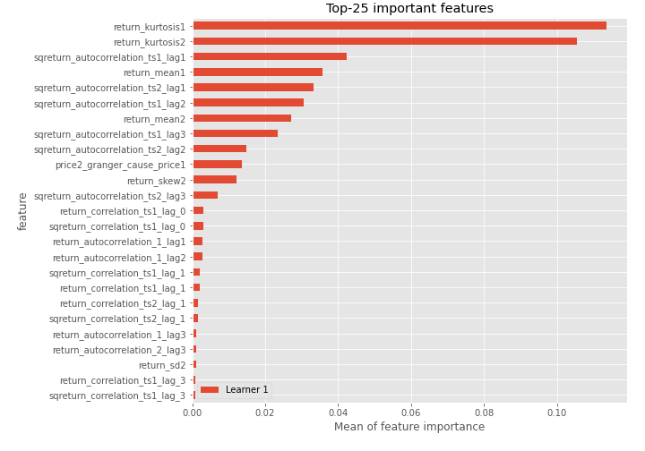
## Confusion Matrix

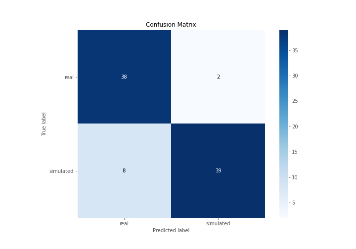

## Normalized Confusion Matrix

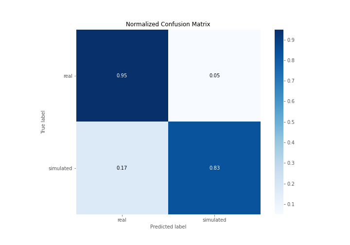

## ROC Curve

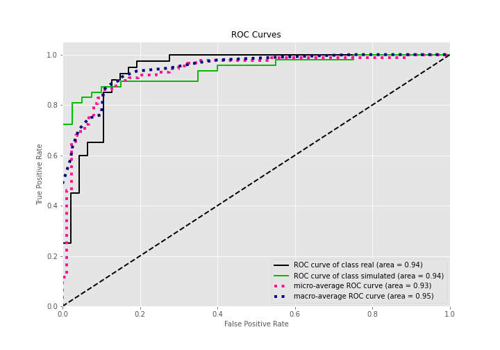

## Kolmogorov-Smirnov Statistic

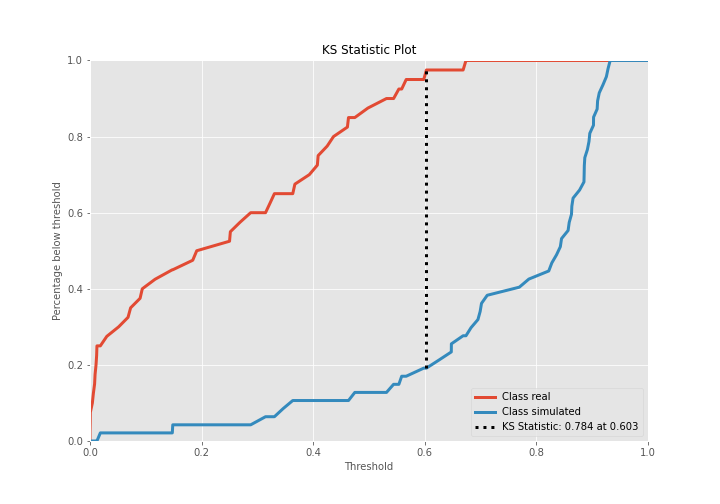

## Precision-Recall Curve

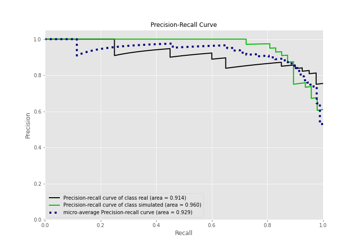

## Calibration Curve

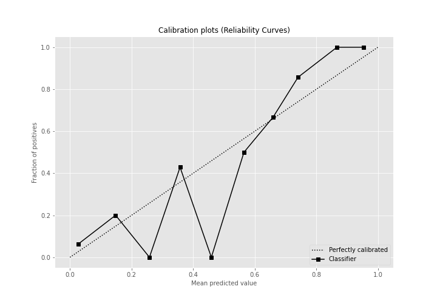

## Cumulative Gains Curve

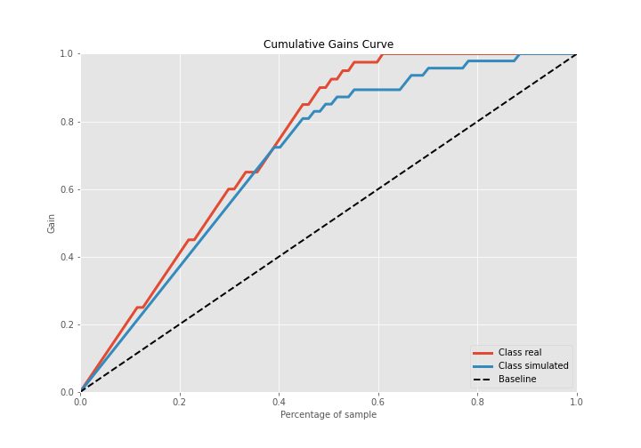

## Lift Curve

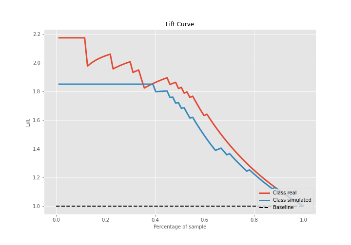

## SHAP Importance
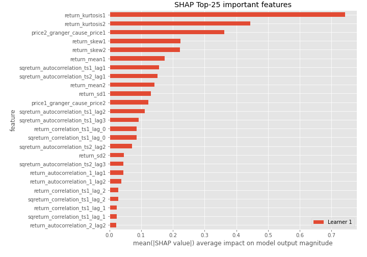

## SHAP Dependence plots

### Dependence (Fold 1)
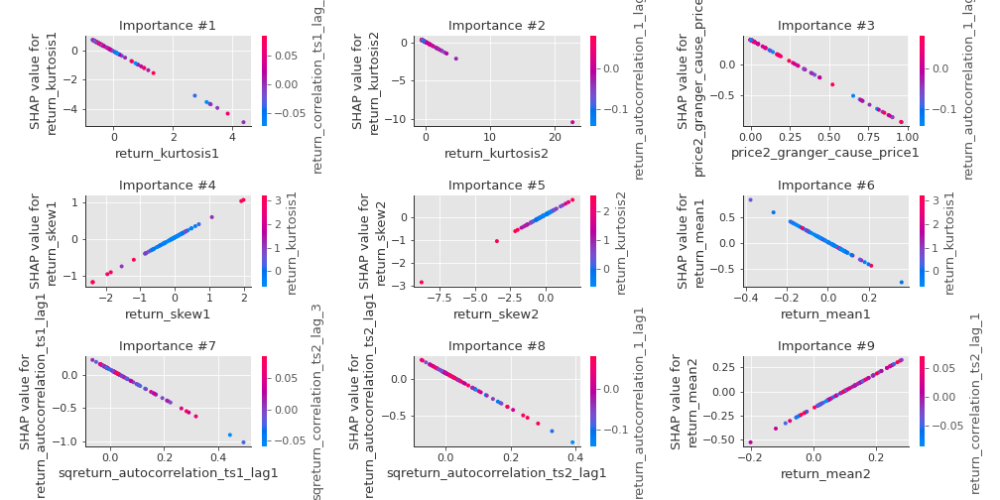

## SHAP Decision plots

### Top-10 Worst decisions for class 0 (Fold 1)
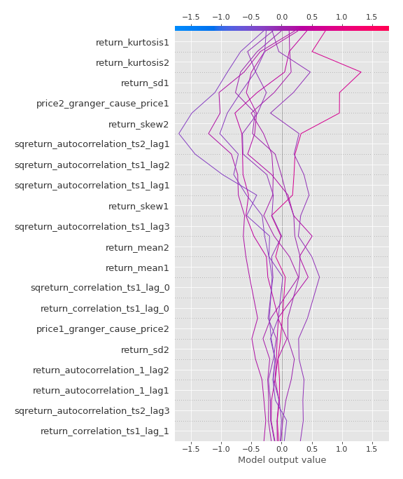
### Top-10 Best decisions for class 0 (Fold 1)
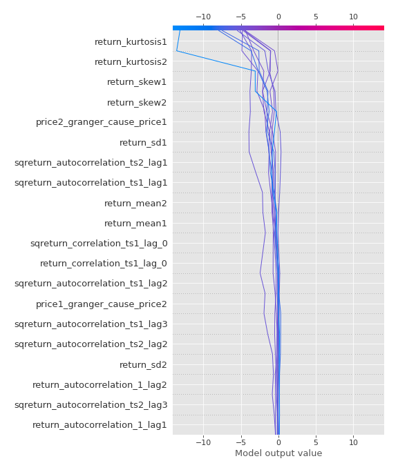
### Top-10 Worst decisions for class 1 (Fold 1)
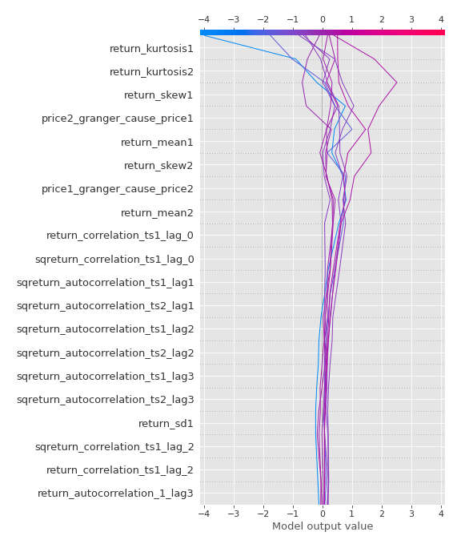
### Top-10 Best decisions for class 1 (Fold 1)
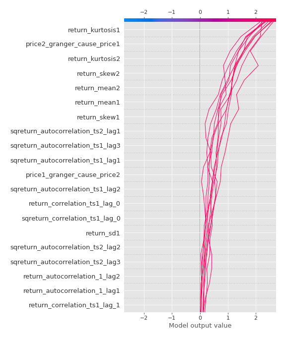

[<< Go back](../README.md)
