# Exploratory Data Analysis

[<< Go back](../README.md)
## Feature : target
- **Feature type** : categorical
- **Missing** : 0.0%
- **Unique** : 2
- **Count** :347
- **Unique** :2
- **Top** :simulated
- **Freq** :186

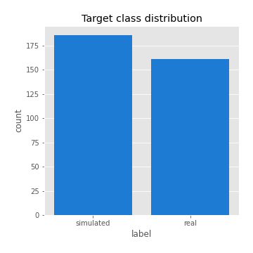
## Feature : return_mean1
- **Feature type** : continous
- **Missing** : 0.0%
- **Unique** : 347
- **Count** :347.0
- **Mean** :0.01609105743683241
- **Std** :0.11005816931543345
- **Min** :-0.37823313207936127
- **25%th Percentile** : -0.04266665537985101
- **50%th Percentile** : 0.021526694616427915
- **75%th Percentile** : 0.08258210191696233
- **Max** :0.41432399209153836

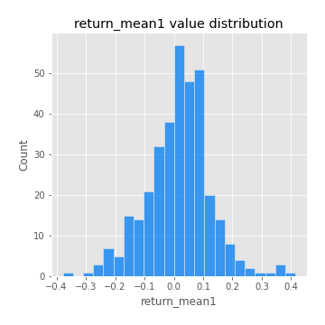
## Feature : return_mean2
- **Feature type** : continous
- **Missing** : 0.0%
- **Unique** : 347
- **Count** :347.0
- **Mean** :0.10210714149838061
- **Std** :0.09977402821247311
- **Min** :-0.24205418062825398
- **25%th Percentile** : 0.04167918596463484
- **50%th Percentile** : 0.09756489023491552
- **75%th Percentile** : 0.17022768926607262
- **Max** :0.3594467092644672

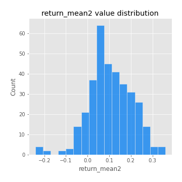
## Feature : return_sd1
- **Feature type** : continous
- **Missing** : 0.0%
- **Unique** : 347
- **Count** :347.0
- **Mean** :1.766759338280875
- **Std** :0.6091411824341729
- **Min** :0.7470080772831957
- **25%th Percentile** : 1.5660343684507831
- **50%th Percentile** : 1.6507364000704106
- **75%th Percentile** : 1.7587768949084452
- **Max** :6.495661311240861

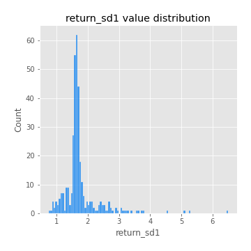
## Feature : return_sd2
- **Feature type** : continous
- **Missing** : 0.0%
- **Unique** : 347
- **Count** :347.0
- **Mean** :1.836927374622517
- **Std** :0.6149785449605355
- **Min** :0.8592887433004143
- **25%th Percentile** : 1.628733314149978
- **50%th Percentile** : 1.7760594971867607
- **75%th Percentile** : 1.8919295692086378
- **Max** :5.762808157208253

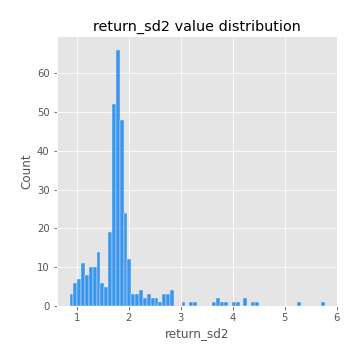
## Feature : return_skew1
- **Feature type** : continous
- **Missing** : 0.0%
- **Unique** : 347
- **Count** :347.0
- **Mean** :-0.07896042697315722
- **Std** :0.647455291608967
- **Min** :-2.817259764925239
- **25%th Percentile** : -0.2988060542616881
- **50%th Percentile** : -0.043588993343797455
- **75%th Percentile** : 0.18763116579081818
- **Max** :2.5845963767725557

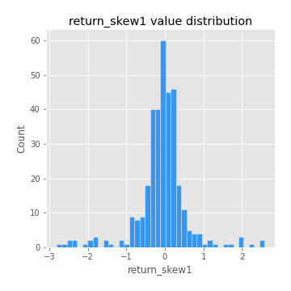
## Feature : return_skew2
- **Feature type** : continous
- **Missing** : 0.0%
- **Unique** : 347
- **Count** :347.0
- **Mean** :-0.1680502914359083
- **Std** :0.8527864661135265
- **Min** :-8.801502855292393
- **25%th Percentile** : -0.43983755469985486
- **50%th Percentile** : -0.09159534238463106
- **75%th Percentile** : 0.18814004762745226
- **Max** :4.006924440746564

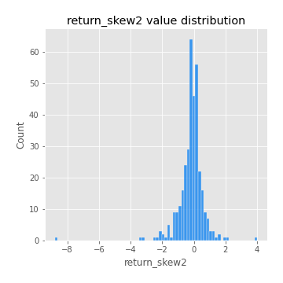
## Feature : return_kurtosis1
- **Feature type** : continous
- **Missing** : 0.0%
- **Unique** : 347
- **Count** :347.0
- **Mean** :3.940618036779936
- **Std** :5.74474361876101
- **Min** :-0.272993915487433
- **25%th Percentile** : 0.8198838642472506
- **50%th Percentile** : 1.7400183513931657
- **75%th Percentile** : 4.028030879417009
- **Max** :36.91113889081053

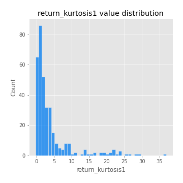
## Feature : return_kurtosis2
- **Feature type** : continous
- **Missing** : 0.0%
- **Unique** : 347
- **Count** :347.0
- **Mean** :4.959771501659775
- **Std** :9.657379591947736
- **Min** :-0.09144978776190094
- **25%th Percentile** : 1.1873690955764165
- **50%th Percentile** : 2.4205627004730714
- **75%th Percentile** : 5.027987486644339
- **Max** :143.10871011533666

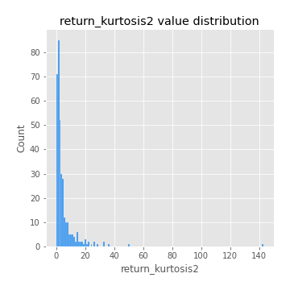
## Feature : return_autocorrelation_1_lag1
- **Feature type** : continous
- **Missing** : 0.0%
- **Unique** : 347
- **Count** :347.0
- **Mean** :-0.00038299672138444803
- **Std** :0.05978193566773323
- **Min** :-0.2135576224968752
- **25%th Percentile** : -0.030387172186081664
- **50%th Percentile** : 0.00575615748854897
- **75%th Percentile** : 0.03595271762115654
- **Max** :0.17923588348129454

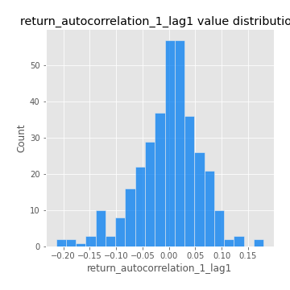
## Feature : return_autocorrelation_1_lag2
- **Feature type** : continous
- **Missing** : 0.0%
- **Unique** : 347
- **Count** :347.0
- **Mean** :0.003977809722042093
- **Std** :0.05029307998634527
- **Min** :-0.13309283796645122
- **25%th Percentile** : -0.02717337113946986
- **50%th Percentile** : 0.005758890262909656
- **75%th Percentile** : 0.03877468168916366
- **Max** :0.1561488228015672

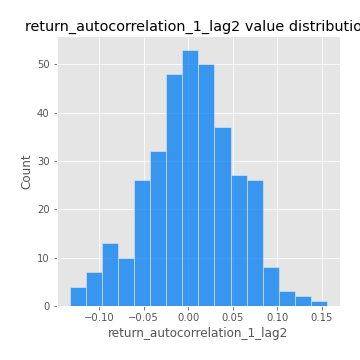
## Feature : return_autocorrelation_1_lag3
- **Feature type** : continous
- **Missing** : 0.0%
- **Unique** : 347
- **Count** :347.0
- **Mean** :0.007297013160540348
- **Std** :0.0532753338795368
- **Min** :-0.1940836867390813
- **25%th Percentile** : -0.02506650342263315
- **50%th Percentile** : 0.01114445256577549
- **75%th Percentile** : 0.04553130492752349
- **Max** :0.17805869530681923

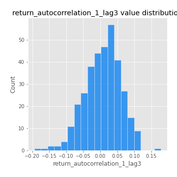
## Feature : return_autocorrelation_2_lag1
- **Feature type** : continous
- **Missing** : 0.0%
- **Unique** : 347
- **Count** :347.0
- **Mean** :-0.007705461013728144
- **Std** :0.05942206436868252
- **Min** :-0.25075531010123286
- **25%th Percentile** : -0.03879187801408564
- **50%th Percentile** : -0.003720713210341832
- **75%th Percentile** : 0.027327033694431124
- **Max** :0.16349871797309318

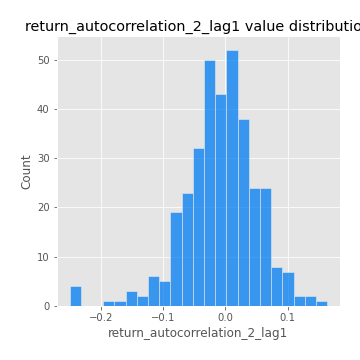
## Feature : return_autocorrelation_2_lag2
- **Feature type** : continous
- **Missing** : 0.0%
- **Unique** : 347
- **Count** :347.0
- **Mean** :0.0018618180134457522
- **Std** :0.05136180441227826
- **Min** :-0.15323211089747296
- **25%th Percentile** : -0.0325873709517399
- **50%th Percentile** : 0.0018785238113544211
- **75%th Percentile** : 0.03486093178746624
- **Max** :0.1735398560230086

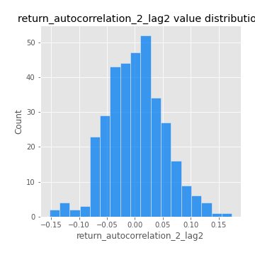
## Feature : return_autocorrelation_2_lag3
- **Feature type** : continous
- **Missing** : 0.0%
- **Unique** : 347
- **Count** :347.0
- **Mean** :-0.0021814567607829206
- **Std** :0.05100885769382872
- **Min** :-0.14200107169559698
- **25%th Percentile** : -0.03290996652584601
- **50%th Percentile** : -0.001992969453947655
- **75%th Percentile** : 0.0338957814654654
- **Max** :0.1419999376914021

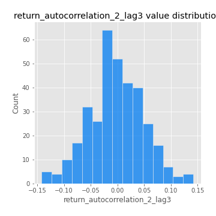
## Feature : return_correlation_ts1_lag_0
- **Feature type** : continous
- **Missing** : 0.0%
- **Unique** : 347
- **Count** :347.0
- **Mean** :0.3353153145297823
- **Std** :0.10782882807726606
- **Min** :-0.027089510445801036
- **25%th Percentile** : 0.2825577399473467
- **50%th Percentile** : 0.34939948654648023
- **75%th Percentile** : 0.39202060738212374
- **Max** :0.7041861626832071

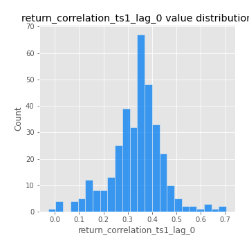
## Feature : return_correlation_ts1_lag_1
- **Feature type** : continous
- **Missing** : 0.0%
- **Unique** : 347
- **Count** :347.0
- **Mean** :-0.0013856117724322984
- **Std** :0.04936655454435911
- **Min** :-0.16985510949917193
- **25%th Percentile** : -0.03176740611648174
- **50%th Percentile** : 0.0038028354485767123
- **75%th Percentile** : 0.028888328753070576
- **Max** :0.13880629203460662

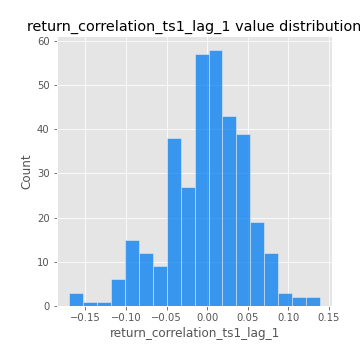
## Feature : return_correlation_ts1_lag_2
- **Feature type** : continous
- **Missing** : 0.0%
- **Unique** : 347
- **Count** :347.0
- **Mean** :0.006245916753897224
- **Std** :0.0509156349725462
- **Min** :-0.21653581047581763
- **25%th Percentile** : -0.02833674206832082
- **50%th Percentile** : 0.004806597142107318
- **75%th Percentile** : 0.04231687924768096
- **Max** :0.12977747016901506

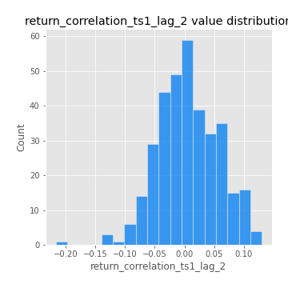
## Feature : return_correlation_ts1_lag_3
- **Feature type** : continous
- **Missing** : 0.0%
- **Unique** : 347
- **Count** :347.0
- **Mean** :0.002446406499498065
- **Std** :0.05294026416224206
- **Min** :-0.1270218498974763
- **25%th Percentile** : -0.03312911319463009
- **50%th Percentile** : 0.001280208503997066
- **75%th Percentile** : 0.03450664505736821
- **Max** :0.1636773216468148

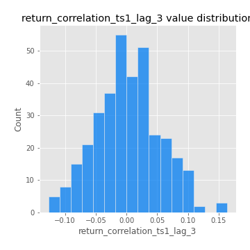
## Feature : return_correlation_ts2_lag_1
- **Feature type** : continous
- **Missing** : 0.0%
- **Unique** : 347
- **Count** :347.0
- **Mean** :0.0014492139282183724
- **Std** :0.05204575649427342
- **Min** :-0.20093919236581337
- **25%th Percentile** : -0.026151198466869877
- **50%th Percentile** : 0.0020083980962039144
- **75%th Percentile** : 0.034276040684135534
- **Max** :0.17208763791364762

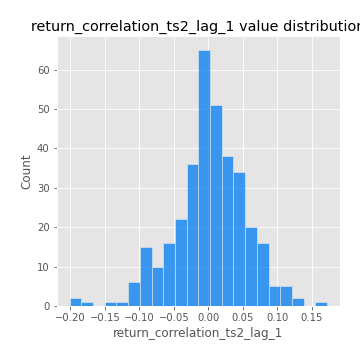
## Feature : return_correlation_ts2_lag_2
- **Feature type** : continous
- **Missing** : 0.0%
- **Unique** : 347
- **Count** :347.0
- **Mean** :0.008639221293207142
- **Std** :0.047735617334375875
- **Min** :-0.11701735111763815
- **25%th Percentile** : -0.024582474046840816
- **50%th Percentile** : 0.007231819339039351
- **75%th Percentile** : 0.03937800149358571
- **Max** :0.20772887392904255

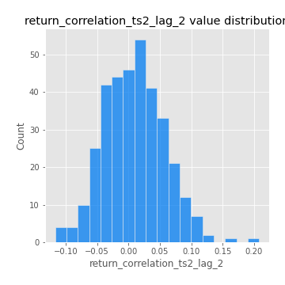
## Feature : return_correlation_ts2_lag_3
- **Feature type** : continous
- **Missing** : 0.0%
- **Unique** : 347
- **Count** :347.0
- **Mean** :0.001312659566943807
- **Std** :0.051827627651290294
- **Min** :-0.17564076057312866
- **25%th Percentile** : -0.02659312751760127
- **50%th Percentile** : 0.0019175667288213862
- **75%th Percentile** : 0.0374624930137037
- **Max** :0.12578577770423086

## Feature : sqreturn_autocorrelation_ts1_lag1
- **Feature type** : continous
- **Missing** : 0.0%
- **Unique** : 347
- **Count** :347.0
- **Mean** :0.04681619129395231
- **Std** :0.09429152553233847
- **Min** :-0.11378530110044974
- **25%th Percentile** : -0.01682480808060132
- **50%th Percentile** : 0.020650911581772145
- **75%th Percentile** : 0.08228098637191111
- **Max** :0.49414293176447355

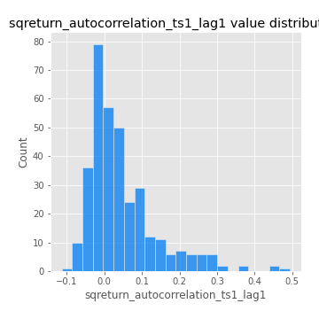
## Feature : sqreturn_autocorrelation_ts1_lag2
- **Feature type** : continous
- **Missing** : 0.0%
- **Unique** : 347
- **Count** :347.0
- **Mean** :0.03902535270988614
- **Std** :0.08700944445012856
- **Min** :-0.10102130824619944
- **25%th Percentile** : -0.01404409554659444
- **50%th Percentile** : 0.011264793850215527
- **75%th Percentile** : 0.060863141616427884
- **Max** :0.4522162366773919

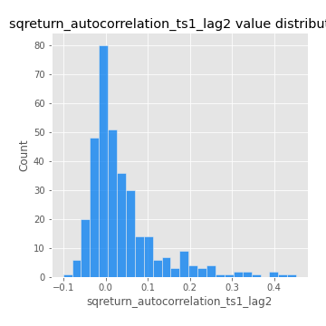
## Feature : sqreturn_autocorrelation_ts1_lag3
- **Feature type** : continous
- **Missing** : 0.0%
- **Unique** : 347
- **Count** :347.0
- **Mean** :0.032288036263375494
- **Std** :0.07983602988543446
- **Min** :-0.08302988993322585
- **25%th Percentile** : -0.017470816383737757
- **50%th Percentile** : 0.009320274181519395
- **75%th Percentile** : 0.05749776855083442
- **Max** :0.41030914918857014

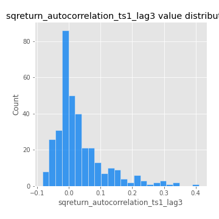
## Feature : sqreturn_autocorrelation_ts2_lag1
- **Feature type** : continous
- **Missing** : 0.0%
- **Unique** : 347
- **Count** :347.0
- **Mean** :0.04432570901829258
- **Std** :0.08784665823603471
- **Min** :-0.08520586663750691
- **25%th Percentile** : -0.011439729093186746
- **50%th Percentile** : 0.017341237130858087
- **75%th Percentile** : 0.0815160872287723
- **Max** :0.510085647437958

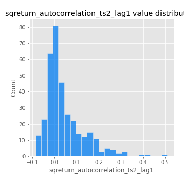
## Feature : sqreturn_autocorrelation_ts2_lag2
- **Feature type** : continous
- **Missing** : 0.0%
- **Unique** : 347
- **Count** :347.0
- **Mean** :0.03294879534735625
- **Std** :0.08342685211321671
- **Min** :-0.0845525097833027
- **25%th Percentile** : -0.01627112419374912
- **50%th Percentile** : 0.008043057478158998
- **75%th Percentile** : 0.046949248488572425
- **Max** :0.45676817892778204

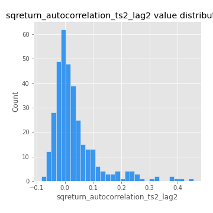
## Feature : sqreturn_autocorrelation_ts2_lag3
- **Feature type** : continous
- **Missing** : 0.0%
- **Unique** : 347
- **Count** :347.0
- **Mean** :0.023658787295611404
- **Std** :0.06673497420178313
- **Min** :-0.09561631552699726
- **25%th Percentile** : -0.016257480675391546
- **50%th Percentile** : 0.0062024965243815105
- **75%th Percentile** : 0.04108927457484188
- **Max** :0.31225727797735664

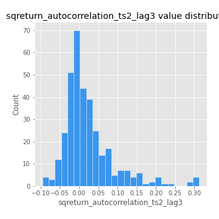
## Feature : sqreturn_correlation_ts1_lag_0
- **Feature type** : continous
- **Missing** : 0.0%
- **Unique** : 347
- **Count** :347.0
- **Mean** :0.3353153145297823
- **Std** :0.10782882807726606
- **Min** :-0.027089510445801036
- **25%th Percentile** : 0.2825577399473467
- **50%th Percentile** : 0.34939948654648023
- **75%th Percentile** : 0.39202060738212374
- **Max** :0.7041861626832071

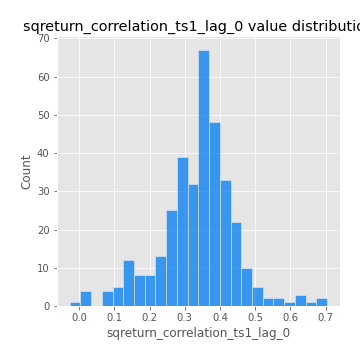
## Feature : sqreturn_correlation_ts1_lag_1
- **Feature type** : continous
- **Missing** : 0.0%
- **Unique** : 347
- **Count** :347.0
- **Mean** :-0.0013856117724322984
- **Std** :0.04936655454435911
- **Min** :-0.16985510949917193
- **25%th Percentile** : -0.03176740611648174
- **50%th Percentile** : 0.0038028354485767123
- **75%th Percentile** : 0.028888328753070576
- **Max** :0.13880629203460662

## Feature : sqreturn_correlation_ts1_lag_2
- **Feature type** : continous
- **Missing** : 0.0%
- **Unique** : 347
- **Count** :347.0
- **Mean** :0.006245916753897224
- **Std** :0.0509156349725462
- **Min** :-0.21653581047581763
- **25%th Percentile** : -0.02833674206832082
- **50%th Percentile** : 0.004806597142107318
- **75%th Percentile** : 0.04231687924768096
- **Max** :0.12977747016901506

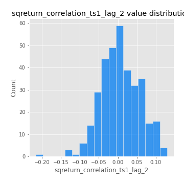
## Feature : sqreturn_correlation_ts1_lag_3
- **Feature type** : continous
- **Missing** : 0.0%
- **Unique** : 347
- **Count** :347.0
- **Mean** :0.002446406499498065
- **Std** :0.05294026416224206
- **Min** :-0.1270218498974763
- **25%th Percentile** : -0.03312911319463009
- **50%th Percentile** : 0.001280208503997066
- **75%th Percentile** : 0.03450664505736821
- **Max** :0.1636773216468148

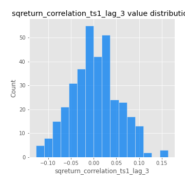
## Feature : sqreturn_correlation_ts2_lag_1
- **Feature type** : continous
- **Missing** : 0.0%
- **Unique** : 347
- **Count** :347.0
- **Mean** :0.0014492139282183724
- **Std** :0.05204575649427342
- **Min** :-0.20093919236581337
- **25%th Percentile** : -0.026151198466869877
- **50%th Percentile** : 0.0020083980962039144
- **75%th Percentile** : 0.034276040684135534
- **Max** :0.17208763791364762

## Feature : sqreturn_correlation_ts2_lag_2
- **Feature type** : continous
- **Missing** : 0.0%
- **Unique** : 347
- **Count** :347.0
- **Mean** :0.008639221293207142
- **Std** :0.047735617334375875
- **Min** :-0.11701735111763815
- **25%th Percentile** : -0.024582474046840816
- **50%th Percentile** : 0.007231819339039351
- **75%th Percentile** : 0.03937800149358571
- **Max** :0.20772887392904255

## Feature : sqreturn_correlation_ts2_lag_3
- **Feature type** : continous
- **Missing** : 0.0%
- **Unique** : 347
- **Count** :347.0
- **Mean** :0.001312659566943807
- **Std** :0.051827627651290294
- **Min** :-0.17564076057312866
- **25%th Percentile** : -0.02659312751760127
- **50%th Percentile** : 0.0019175667288213862
- **75%th Percentile** : 0.0374624930137037
- **Max** :0.12578577770423086

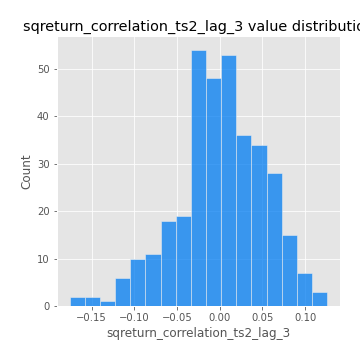
## Feature : price2_granger_cause_price1
- **Feature type** : continous
- **Missing** : 0.0%
- **Unique** : 347
- **Count** :347.0
- **Mean** :0.2570666170670502
- **Std** :0.2984757042228586
- **Min** :1.8519431164586123e-09
- **25%th Percentile** : 0.007869961479398427
- **50%th Percentile** : 0.12722146327159695
- **75%th Percentile** : 0.4345957248770688
- **Max** :0.9885712803689185

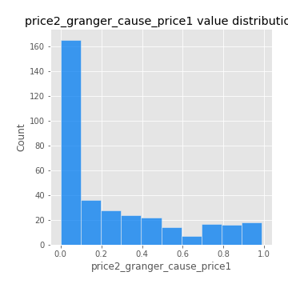
## Feature : price1_granger_cause_price2
- **Feature type** : continous
- **Missing** : 0.0%
- **Unique** : 347
- **Count** :347.0
- **Mean** :0.3088647213523296
- **Std** :0.27723040587246134
- **Min** :3.868174549600279e-05
- **25%th Percentile** : 0.05615583726184635
- **50%th Percentile** : 0.23950700298234634
- **75%th Percentile** : 0.5454361967172952
- **Max** :0.9677499172353743

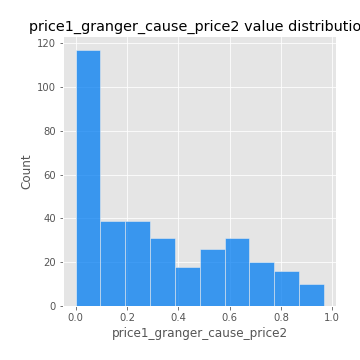

[<< Go back](../README.md)
