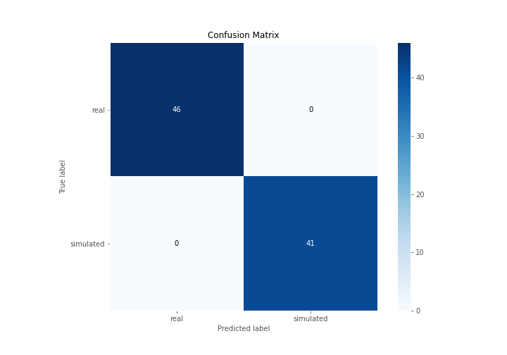
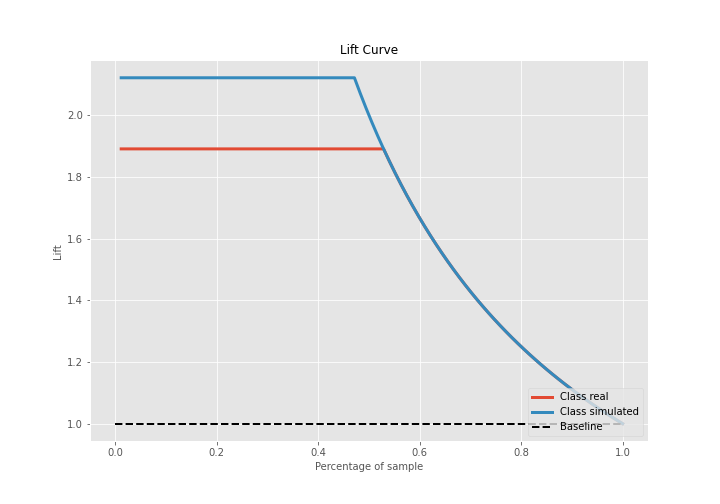

# Summary of 3_Linear

[<< Go back](../README.md)

## Logistic Regression (Linear)
- **n_jobs**: -1
- **explain_level**: 2

## Validation
 - **validation_type**: split
 - **train_ratio**: 0.75
 - **shuffle**: True
 - **stratify**: True

## Optimized metric
accuracy

## Training time

3.4 seconds

## Metric details
|           |    score |    threshold |
|:----------|---------:|-------------:|
| logloss   | 0.120337 | nan          |
| auc       | 1        | nan          |
| f1        | 1        |   0.690358   |
| accuracy  | 1        |   0.690358   |
| precision | 1        |   0.89479    |
| recall    | 1        |   9.6681e-15 |
| mcc       | 1        |   0.690358   |

## Confusion matrix (at threshold=0.690358)
|                      |   Predicted as real |   Predicted as simulated |
|:---------------------|--------------------:|-------------------------:|
| Labeled as real      |                  46 |                        0 |
| Labeled as simulated |                   0 |                       41 |

## Learning curves

## Coefficients
| feature                           |   Learner_1 |
|:----------------------------------|------------:|
| return_skew2                      |   0.633081  |
| return_autocorrelation_2_lag1     |   0.469156  |
| return_sd1                        |   0.363147  |
| sqreturn_correlation_ts1_lag_0    |   0.28302   |
| return_correlation_ts1_lag_0      |   0.28302   |
| return_autocorrelation_2_lag3     |   0.281811  |
| return_autocorrelation_1_lag2     |   0.27728   |
| sqreturn_correlation_ts1_lag_2    |   0.270613  |
| return_correlation_ts1_lag_2      |   0.270613  |
| sqreturn_correlation_ts1_lag_1    |   0.230736  |
| return_correlation_ts1_lag_1      |   0.230736  |
| return_autocorrelation_1_lag1     |   0.226103  |
| sqreturn_correlation_ts2_lag_3    |   0.214877  |
| return_correlation_ts2_lag_3      |   0.214877  |
| return_correlation_ts2_lag_1      |   0.214051  |
| sqreturn_correlation_ts2_lag_1    |   0.214051  |
| return_correlation_ts1_lag_3      |   0.212896  |
| sqreturn_correlation_ts1_lag_3    |   0.212896  |
| return_autocorrelation_1_lag3     |   0.163129  |
| return_autocorrelation_2_lag2     |   0.112049  |
| return_skew1                      |   0.0651056 |
| return_correlation_ts2_lag_2      |   0.0547831 |
| sqreturn_correlation_ts2_lag_2    |   0.0547831 |
| price1_granger_cause_price2       |  -0.130373  |
| return_mean1                      |  -0.209324  |
| return_mean2                      |  -0.225348  |
| price2_granger_cause_price1       |  -0.459769  |
| return_sd2                        |  -0.552656  |
| sqreturn_autocorrelation_ts2_lag3 |  -0.553372  |
| sqreturn_autocorrelation_ts1_lag2 |  -0.720613  |
| sqreturn_autocorrelation_ts1_lag1 |  -0.722418  |
| sqreturn_autocorrelation_ts1_lag3 |  -0.760082  |
| sqreturn_autocorrelation_ts2_lag2 |  -0.831015  |
| sqreturn_autocorrelation_ts2_lag1 |  -0.936708  |
| intercept                         |  -2.15125   |
| return_kurtosis2                  |  -3.65374   |
| return_kurtosis1                  |  -3.81893   |

## Permutation-based Importance

## Confusion Matrix

## Normalized Confusion Matrix

## ROC Curve

## Kolmogorov-Smirnov Statistic

## Precision-Recall Curve

## Calibration Curve

## Cumulative Gains Curve

## Lift Curve

## SHAP Importance

## SHAP Dependence plots

### Dependence (Fold 1)

## SHAP Decision plots

### Top-10 Worst decisions for class 0 (Fold 1)

### Top-10 Best decisions for class 0 (Fold 1)

### Top-10 Worst decisions for class 1 (Fold 1)

### Top-10 Best decisions for class 1 (Fold 1)

[<< Go back](../README.md)
