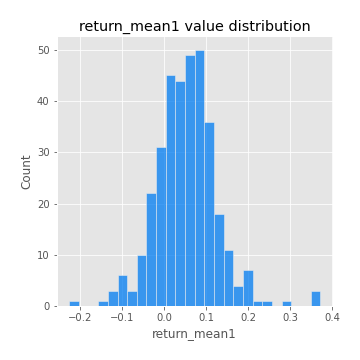
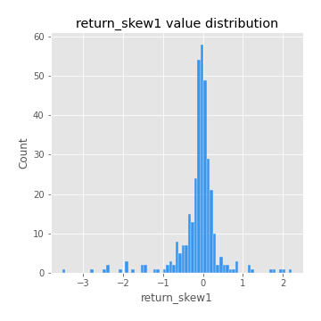

# Exploratory Data Analysis

[<< Go back](../README.md)
## Feature : target
- **Feature type** : categorical
- **Missing** : 0.0%
- **Unique** : 2
- **Count** :347
- **Unique** :2
- **Top** :real
- **Freq** :183

## Feature : return_mean1
- **Feature type** : continous
- **Missing** : 0.0%
- **Unique** : 347
- **Count** :347.0
- **Mean** :0.052889190672357485
- **Std** :0.0731164811706084
- **Min** :-0.22632637961920957
- **25%th Percentile** : 0.009502465970515291
- **50%th Percentile** : 0.0523343403511941
- **75%th Percentile** : 0.09250234664967316
- **Max** :0.37175100008111034

## Feature : return_mean2
- **Feature type** : continous
- **Missing** : 0.0%
- **Unique** : 347
- **Count** :347.0
- **Mean** :0.05580604227055614
- **Std** :0.0911481248126199
- **Min** :-0.24205418062825398
- **25%th Percentile** : 0.0064460812795849795
- **50%th Percentile** : 0.051791541171511926
- **75%th Percentile** : 0.10344586385486901
- **Max** :0.3991923177459164

## Feature : return_sd1
- **Feature type** : continous
- **Missing** : 0.0%
- **Unique** : 347
- **Count** :347.0
- **Mean** :1.7614779861180576
- **Std** :0.7531436093553592
- **Min** :0.7470080772831957
- **25%th Percentile** : 1.5271102726802943
- **50%th Percentile** : 1.6020437461801766
- **75%th Percentile** : 1.6902017658202082
- **Max** :9.236766377527575

## Feature : return_sd2
- **Feature type** : continous
- **Missing** : 0.0%
- **Unique** : 347
- **Count** :347.0
- **Mean** :1.7977231650714836
- **Std** :0.7802983258077827
- **Min** :0.8592887433004143
- **25%th Percentile** : 1.5149444763225683
- **50%th Percentile** : 1.5948742900236659
- **75%th Percentile** : 1.6938353494177436
- **Max** :6.737618636746393

## Feature : return_skew1
- **Feature type** : continous
- **Missing** : 0.0%
- **Unique** : 347
- **Count** :347.0
- **Mean** :-0.10321933364456494
- **Std** :0.5725909870218664
- **Min** :-3.530116233761814
- **25%th Percentile** : -0.1887555992189927
- **50%th Percentile** : -0.041074629078840366
- **75%th Percentile** : 0.09086964082104548
- **Max** :2.224942816365292

## Feature : return_skew2
- **Feature type** : continous
- **Missing** : 0.0%
- **Unique** : 347
- **Count** :347.0
- **Mean** :-0.09028557090742931
- **Std** :0.5730357232994538
- **Min** :-2.5169062744473636
- **25%th Percentile** : -0.20601218153119272
- **50%th Percentile** : -0.041344102196059156
- **75%th Percentile** : 0.09973624900652145
- **Max** :2.2606839051517187

## Feature : return_kurtosis1
- **Feature type** : continous
- **Missing** : 0.0%
- **Unique** : 347
- **Count** :347.0
- **Mean** :3.297027189352628
- **Std** :6.0134145723835655
- **Min** :-0.44840193302723774
- **25%th Percentile** : 0.01027165420775722
- **50%th Percentile** : 0.8951508960829169
- **75%th Percentile** : 3.9672030656784054
- **Max** :36.91113889081053

## Feature : return_kurtosis2
- **Feature type** : continous
- **Missing** : 0.0%
- **Unique** : 347
- **Count** :347.0
- **Mean** :3.4644758888795035
- **Std** :5.828438529818228
- **Min** :-0.5526269429346025
- **25%th Percentile** : -0.005387580812342696
- **50%th Percentile** : 1.0180535884625033
- **75%th Percentile** : 4.3840343020263415
- **Max** :36.023880269969645

## Feature : return_autocorrelation_1_lag1
- **Feature type** : continous
- **Missing** : 0.0%
- **Unique** : 347
- **Count** :347.0
- **Mean** :-0.012281395468306793
- **Std** :0.058460958621244535
- **Min** :-0.20673896439036124
- **25%th Percentile** : -0.04504180127011271
- **50%th Percentile** : -0.006705998406642586
- **75%th Percentile** : 0.025555151620343566
- **Max** :0.155381291294825

## Feature : return_autocorrelation_1_lag2
- **Feature type** : continous
- **Missing** : 0.0%
- **Unique** : 347
- **Count** :347.0
- **Mean** :-0.005828444334482504
- **Std** :0.05108341975936868
- **Min** :-0.13309283796645122
- **25%th Percentile** : -0.03758480969436911
- **50%th Percentile** : -0.006060582394393613
- **75%th Percentile** : 0.028189805687473892
- **Max** :0.13553587149024285

## Feature : return_autocorrelation_1_lag3
- **Feature type** : continous
- **Missing** : 0.0%
- **Unique** : 347
- **Count** :347.0
- **Mean** :-0.00394430926280823
- **Std** :0.04895022012070049
- **Min** :-0.1940836867390813
- **25%th Percentile** : -0.03474718067381804
- **50%th Percentile** : -0.005187774305168985
- **75%th Percentile** : 0.0298392277985694
- **Max** :0.11028973727744579

## Feature : return_autocorrelation_2_lag1
- **Feature type** : continous
- **Missing** : 0.0%
- **Unique** : 347
- **Count** :347.0
- **Mean** :-0.008788124440260833
- **Std** :0.05944584735295002
- **Min** :-0.25075531010123286
- **25%th Percentile** : -0.039030031661190664
- **50%th Percentile** : -0.0020017432637488243
- **75%th Percentile** : 0.02883561750751935
- **Max** :0.16349871797309318

## Feature : return_autocorrelation_2_lag2
- **Feature type** : continous
- **Missing** : 0.0%
- **Unique** : 347
- **Count** :347.0
- **Mean** :-0.002236498990646275
- **Std** :0.0515714371017845
- **Min** :-0.15323211089747296
- **25%th Percentile** : -0.039916620378061776
- **50%th Percentile** : -0.005244479046351908
- **75%th Percentile** : 0.033863244092590096
- **Max** :0.1735398560230086

## Feature : return_autocorrelation_2_lag3
- **Feature type** : continous
- **Missing** : 0.0%
- **Unique** : 347
- **Count** :347.0
- **Mean** :-0.0034492759754046775
- **Std** :0.04769213258703633
- **Min** :-0.14200107169559698
- **25%th Percentile** : -0.03430618820395268
- **50%th Percentile** : -0.004101317810487607
- **75%th Percentile** : 0.02883522440975273
- **Max** :0.1419999376914021

## Feature : return_correlation_ts1_lag_0
- **Feature type** : continous
- **Missing** : 0.0%
- **Unique** : 347
- **Count** :347.0
- **Mean** :0.3187027758548937
- **Std** :0.10963624054230742
- **Min** :-0.027089510445801036
- **25%th Percentile** : 0.26653436800391184
- **50%th Percentile** : 0.31448258568793946
- **75%th Percentile** : 0.36429020830607517
- **Max** :0.6949986865664105

## Feature : return_correlation_ts1_lag_1
- **Feature type** : continous
- **Missing** : 0.0%
- **Unique** : 347
- **Count** :347.0
- **Mean** :-0.005494311208274285
- **Std** :0.052290032644138486
- **Min** :-0.15776193292681923
- **25%th Percentile** : -0.03750497371042061
- **50%th Percentile** : -0.004548319928274045
- **75%th Percentile** : 0.03317548884556066
- **Max** :0.15499424718508623

## Feature : return_correlation_ts1_lag_2
- **Feature type** : continous
- **Missing** : 0.0%
- **Unique** : 347
- **Count** :347.0
- **Mean** :-0.00013131628199195377
- **Std** :0.04742858586611723
- **Min** :-0.12864410180561703
- **25%th Percentile** : -0.03241219057174867
- **50%th Percentile** : 0.001146803135765006
- **75%th Percentile** : 0.03531995409295187
- **Max** :0.10916944041387708

## Feature : return_correlation_ts1_lag_3
- **Feature type** : continous
- **Missing** : 0.0%
- **Unique** : 347
- **Count** :347.0
- **Mean** :-0.0033516910248294124
- **Std** :0.051934961733470744
- **Min** :-0.13434085557782324
- **25%th Percentile** : -0.039055907836756346
- **50%th Percentile** : -0.005185937248734316
- **75%th Percentile** : 0.031650804409083744
- **Max** :0.1636773216468148

## Feature : return_correlation_ts2_lag_1
- **Feature type** : continous
- **Missing** : 0.0%
- **Unique** : 347
- **Count** :347.0
- **Mean** :-0.004448290291031364
- **Std** :0.054447072588434856
- **Min** :-0.2081139431093261
- **25%th Percentile** : -0.036115746177533714
- **50%th Percentile** : -0.0032447833002069897
- **75%th Percentile** : 0.02973260782848567
- **Max** :0.17208763791364762

## Feature : return_correlation_ts2_lag_2
- **Feature type** : continous
- **Missing** : 0.0%
- **Unique** : 347
- **Count** :347.0
- **Mean** :0.0007919810793746901
- **Std** :0.051380108885035566
- **Min** :-0.23751835475804678
- **25%th Percentile** : -0.03152264484752843
- **50%th Percentile** : 0.0018815406597969967
- **75%th Percentile** : 0.034463720910647255
- **Max** :0.15388933426238696

## Feature : return_correlation_ts2_lag_3
- **Feature type** : continous
- **Missing** : 0.0%
- **Unique** : 347
- **Count** :347.0
- **Mean** :0.0002795057411662979
- **Std** :0.051248352942656665
- **Min** :-0.16212823605110202
- **25%th Percentile** : -0.029940011493644055
- **50%th Percentile** : -0.0011263914179240767
- **75%th Percentile** : 0.03656136675747018
- **Max** :0.12578577770423086

## Feature : sqreturn_autocorrelation_ts1_lag1
- **Feature type** : continous
- **Missing** : 0.0%
- **Unique** : 347
- **Count** :347.0
- **Mean** :0.055221918382663014
- **Std** :0.09216562288465853
- **Min** :-0.11962588745068063
- **25%th Percentile** : -0.005970284864357231
- **50%th Percentile** : 0.034435124607755566
- **75%th Percentile** : 0.08808965261429583
- **Max** :0.49414293176447355

## Feature : sqreturn_autocorrelation_ts1_lag2
- **Feature type** : continous
- **Missing** : 0.0%
- **Unique** : 347
- **Count** :347.0
- **Mean** :0.04700289370074521
- **Std** :0.08779418263156263
- **Min** :-0.13672316113796806
- **25%th Percentile** : -0.005802783741623838
- **50%th Percentile** : 0.02299773418208078
- **75%th Percentile** : 0.07094213139199904
- **Max** :0.540735851444759

## Feature : sqreturn_autocorrelation_ts1_lag3
- **Feature type** : continous
- **Missing** : 0.0%
- **Unique** : 347
- **Count** :347.0
- **Mean** :0.03367121269491463
- **Std** :0.08042059135496134
- **Min** :-0.0907634194908008
- **25%th Percentile** : -0.018966276133549897
- **50%th Percentile** : 0.012890775116327727
- **75%th Percentile** : 0.0659445030691515
- **Max** :0.44755937369538146

## Feature : sqreturn_autocorrelation_ts2_lag1
- **Feature type** : continous
- **Missing** : 0.0%
- **Unique** : 347
- **Count** :347.0
- **Mean** :0.04697803259113882
- **Std** :0.08699714254859242
- **Min** :-0.09192456415454424
- **25%th Percentile** : -0.008950879900901789
- **50%th Percentile** : 0.025846093772086427
- **75%th Percentile** : 0.08140222936649993
- **Max** :0.510085647437958

## Feature : sqreturn_autocorrelation_ts2_lag2
- **Feature type** : continous
- **Missing** : 0.0%
- **Unique** : 347
- **Count** :347.0
- **Mean** :0.03980288200126538
- **Std** :0.08854508475965649
- **Min** :-0.10310248433808283
- **25%th Percentile** : -0.01100818368146893
- **50%th Percentile** : 0.01814012081111259
- **75%th Percentile** : 0.057033099923109336
- **Max** :0.5373432415582473

## Feature : sqreturn_autocorrelation_ts2_lag3
- **Feature type** : continous
- **Missing** : 0.0%
- **Unique** : 347
- **Count** :347.0
- **Mean** :0.027475557080210388
- **Std** :0.07095471981659256
- **Min** :-0.09982208257989701
- **25%th Percentile** : -0.016116609576100824
- **50%th Percentile** : 0.013958450696508277
- **75%th Percentile** : 0.049408355406461546
- **Max** :0.30256115637327263

## Feature : sqreturn_correlation_ts1_lag_0
- **Feature type** : continous
- **Missing** : 0.0%
- **Unique** : 347
- **Count** :347.0
- **Mean** :0.3187027758548937
- **Std** :0.10963624054230742
- **Min** :-0.027089510445801036
- **25%th Percentile** : 0.26653436800391184
- **50%th Percentile** : 0.31448258568793946
- **75%th Percentile** : 0.36429020830607517
- **Max** :0.6949986865664105

## Feature : sqreturn_correlation_ts1_lag_1
- **Feature type** : continous
- **Missing** : 0.0%
- **Unique** : 347
- **Count** :347.0
- **Mean** :-0.005494311208274285
- **Std** :0.052290032644138486
- **Min** :-0.15776193292681923
- **25%th Percentile** : -0.03750497371042061
- **50%th Percentile** : -0.004548319928274045
- **75%th Percentile** : 0.03317548884556066
- **Max** :0.15499424718508623

## Feature : sqreturn_correlation_ts1_lag_2
- **Feature type** : continous
- **Missing** : 0.0%
- **Unique** : 347
- **Count** :347.0
- **Mean** :-0.00013131628199195377
- **Std** :0.04742858586611723
- **Min** :-0.12864410180561703
- **25%th Percentile** : -0.03241219057174867
- **50%th Percentile** : 0.001146803135765006
- **75%th Percentile** : 0.03531995409295187
- **Max** :0.10916944041387708

## Feature : sqreturn_correlation_ts1_lag_3
- **Feature type** : continous
- **Missing** : 0.0%
- **Unique** : 347
- **Count** :347.0
- **Mean** :-0.0033516910248294124
- **Std** :0.051934961733470744
- **Min** :-0.13434085557782324
- **25%th Percentile** : -0.039055907836756346
- **50%th Percentile** : -0.005185937248734316
- **75%th Percentile** : 0.031650804409083744
- **Max** :0.1636773216468148

## Feature : sqreturn_correlation_ts2_lag_1
- **Feature type** : continous
- **Missing** : 0.0%
- **Unique** : 347
- **Count** :347.0
- **Mean** :-0.004448290291031364
- **Std** :0.054447072588434856
- **Min** :-0.2081139431093261
- **25%th Percentile** : -0.036115746177533714
- **50%th Percentile** : -0.0032447833002069897
- **75%th Percentile** : 0.02973260782848567
- **Max** :0.17208763791364762

## Feature : sqreturn_correlation_ts2_lag_2
- **Feature type** : continous
- **Missing** : 0.0%
- **Unique** : 347
- **Count** :347.0
- **Mean** :0.0007919810793746901
- **Std** :0.051380108885035566
- **Min** :-0.23751835475804678
- **25%th Percentile** : -0.03152264484752843
- **50%th Percentile** : 0.0018815406597969967
- **75%th Percentile** : 0.034463720910647255
- **Max** :0.15388933426238696

## Feature : sqreturn_correlation_ts2_lag_3
- **Feature type** : continous
- **Missing** : 0.0%
- **Unique** : 347
- **Count** :347.0
- **Mean** :0.0002795057411662979
- **Std** :0.051248352942656665
- **Min** :-0.16212823605110202
- **25%th Percentile** : -0.029940011493644055
- **50%th Percentile** : -0.0011263914179240767
- **75%th Percentile** : 0.03656136675747018
- **Max** :0.12578577770423086

## Feature : price2_granger_cause_price1
- **Feature type** : continous
- **Missing** : 0.0%
- **Unique** : 347
- **Count** :347.0
- **Mean** :0.3280644464837594
- **Std** :0.2959006809521037
- **Min** :3.812622463160417e-06
- **25%th Percentile** : 0.056813914089501066
- **50%th Percentile** : 0.2708570031066488
- **75%th Percentile** : 0.5365327423726576
- **Max** :0.9974806657461848

## Feature : price1_granger_cause_price2
- **Feature type** : continous
- **Missing** : 0.0%
- **Unique** : 347
- **Count** :347.0
- **Mean** :0.29321200878102754
- **Std** :0.28998200148261566
- **Min** :8.555834934915135e-06
- **25%th Percentile** : 0.03658665977084834
- **50%th Percentile** : 0.20913344716418222
- **75%th Percentile** : 0.49261880283290244
- **Max** :0.9994812151271518

[<< Go back](../README.md)
