# Exploratory Data Analysis

[<< Go back](../README.md)
## Feature : target
- **Feature type** : categorical
- **Missing** : 0.0%
- **Unique** : 2
- **Count** :347
- **Unique** :2
- **Top** :simulated
- **Freq** :177

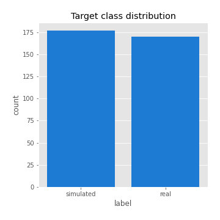
## Feature : return_mean1
- **Feature type** : continous
- **Missing** : 0.0%
- **Unique** : 347
- **Count** :347.0
- **Mean** :0.018930973590494653
- **Std** :0.10767030624497635
- **Min** :-0.4162014705463913
- **25%th Percentile** : -0.03622445636255983
- **50%th Percentile** : 0.029700224992778478
- **75%th Percentile** : 0.08415767992563075
- **Max** :0.37175100008111034

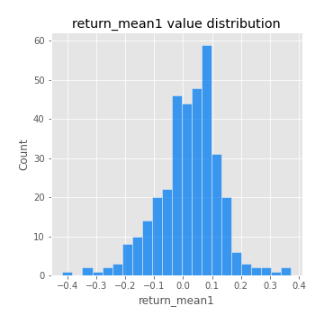
## Feature : return_mean2
- **Feature type** : continous
- **Missing** : 0.0%
- **Unique** : 347
- **Count** :347.0
- **Mean** :0.09871502316485263
- **Std** :0.09694594903927858
- **Min** :-0.24205418062825398
- **25%th Percentile** : 0.04167918596463484
- **50%th Percentile** : 0.09903139991537083
- **75%th Percentile** : 0.16399469029309727
- **Max** :0.35467233975026907

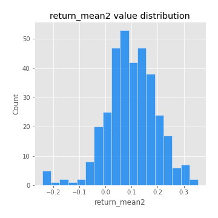
## Feature : return_sd1
- **Feature type** : continous
- **Missing** : 0.0%
- **Unique** : 347
- **Count** :347.0
- **Mean** :1.7925302295469216
- **Std** :0.7686164770944369
- **Min** :0.7470080772831957
- **25%th Percentile** : 1.5480121981143176
- **50%th Percentile** : 1.6274081778786902
- **75%th Percentile** : 1.7683773444140596
- **Max** :9.236766377527575

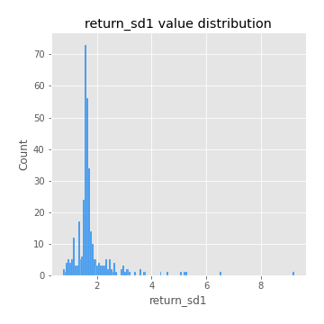
## Feature : return_sd2
- **Feature type** : continous
- **Missing** : 0.0%
- **Unique** : 347
- **Count** :347.0
- **Mean** :1.884808440825662
- **Std** :0.7595206988998722
- **Min** :0.8455946193085045
- **25%th Percentile** : 1.6359368736648017
- **50%th Percentile** : 1.7756091219664056
- **75%th Percentile** : 1.896070769796622
- **Max** :6.737618636746393

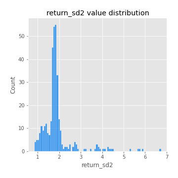
## Feature : return_skew1
- **Feature type** : continous
- **Missing** : 0.0%
- **Unique** : 347
- **Count** :347.0
- **Mean** :-0.13241457491683775
- **Std** :0.6433255121085418
- **Min** :-3.530116233761814
- **25%th Percentile** : -0.26918509714847605
- **50%th Percentile** : -0.06458656373723669
- **75%th Percentile** : 0.12666271268521395
- **Max** :2.5845963767725557

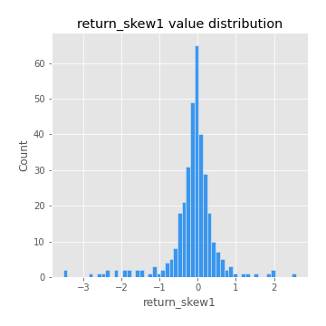
## Feature : return_skew2
- **Feature type** : continous
- **Missing** : 0.0%
- **Unique** : 347
- **Count** :347.0
- **Mean** :-0.19409361924389407
- **Std** :0.8815119515819371
- **Min** :-8.801502855292393
- **25%th Percentile** : -0.4194835800432835
- **50%th Percentile** : -0.08766773795087492
- **75%th Percentile** : 0.18336742653481597
- **Max** :2.000927615865152

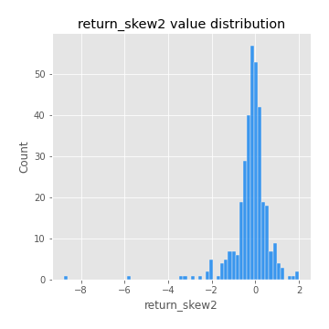
## Feature : return_kurtosis1
- **Feature type** : continous
- **Missing** : 0.0%
- **Unique** : 347
- **Count** :347.0
- **Mean** :3.9734027934203313
- **Std** :6.463845324753942
- **Min** :-0.2207295679340362
- **25%th Percentile** : 0.6802279950577486
- **50%th Percentile** : 1.7546761781394067
- **75%th Percentile** : 3.94463869306265
- **Max** :46.07507808162177

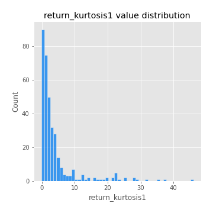
## Feature : return_kurtosis2
- **Feature type** : continous
- **Missing** : 0.0%
- **Unique** : 347
- **Count** :347.0
- **Mean** :5.327666386212071
- **Std** :10.361482340197506
- **Min** :-0.015793629360055572
- **25%th Percentile** : 1.296734601667262
- **50%th Percentile** : 2.651235750991558
- **75%th Percentile** : 5.088494131219826
- **Max** :143.10871011533666

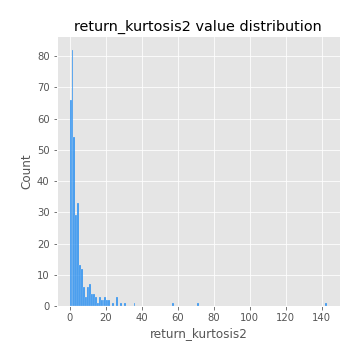
## Feature : return_autocorrelation_1_lag1
- **Feature type** : continous
- **Missing** : 0.0%
- **Unique** : 347
- **Count** :347.0
- **Mean** :0.0003959441936876759
- **Std** :0.060121613367418336
- **Min** :-0.2135576224968752
- **25%th Percentile** : -0.03302600606084645
- **50%th Percentile** : 0.005244663443265499
- **75%th Percentile** : 0.040307912897415435
- **Max** :0.14456928179783993

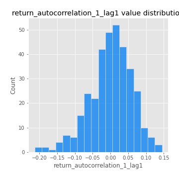
## Feature : return_autocorrelation_1_lag2
- **Feature type** : continous
- **Missing** : 0.0%
- **Unique** : 347
- **Count** :347.0
- **Mean** :0.004698203845545683
- **Std** :0.05187190226871449
- **Min** :-0.13309283796645122
- **25%th Percentile** : -0.027202053701008696
- **50%th Percentile** : 0.002292348506365526
- **75%th Percentile** : 0.03703822425661086
- **Max** :0.1561488228015672

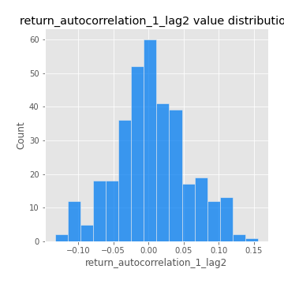
## Feature : return_autocorrelation_1_lag3
- **Feature type** : continous
- **Missing** : 0.0%
- **Unique** : 347
- **Count** :347.0
- **Mean** :0.007339466808245166
- **Std** :0.054003093883149604
- **Min** :-0.1940836867390813
- **25%th Percentile** : -0.025117755088765018
- **50%th Percentile** : 0.0072994438482062085
- **75%th Percentile** : 0.04186895165013673
- **Max** :0.17805869530681923

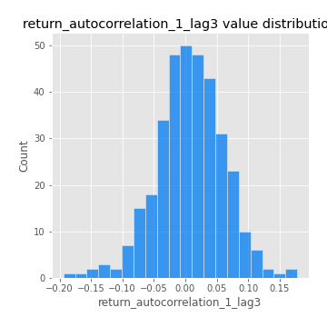
## Feature : return_autocorrelation_2_lag1
- **Feature type** : continous
- **Missing** : 0.0%
- **Unique** : 347
- **Count** :347.0
- **Mean** :-0.0071233636893541655
- **Std** :0.06000301274547604
- **Min** :-0.24590087874039124
- **25%th Percentile** : -0.03727703724371159
- **50%th Percentile** : -0.0013947385982922458
- **75%th Percentile** : 0.02921270341728598
- **Max** :0.31863413537898483

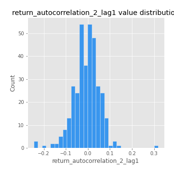
## Feature : return_autocorrelation_2_lag2
- **Feature type** : continous
- **Missing** : 0.0%
- **Unique** : 347
- **Count** :347.0
- **Mean** :0.0004566967853618695
- **Std** :0.050554290664787005
- **Min** :-0.15323211089747296
- **25%th Percentile** : -0.03277412507027677
- **50%th Percentile** : -0.0034670824892446316
- **75%th Percentile** : 0.034467890741132046
- **Max** :0.20974504043791217

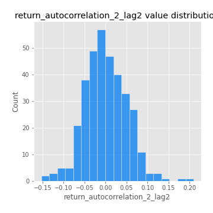
## Feature : return_autocorrelation_2_lag3
- **Feature type** : continous
- **Missing** : 0.0%
- **Unique** : 347
- **Count** :347.0
- **Mean** :-0.0028319922701406713
- **Std** :0.049183278224576965
- **Min** :-0.1710454989014976
- **25%th Percentile** : -0.03221715174046989
- **50%th Percentile** : -0.001992969453947655
- **75%th Percentile** : 0.03200393972814832
- **Max** :0.1419999376914021

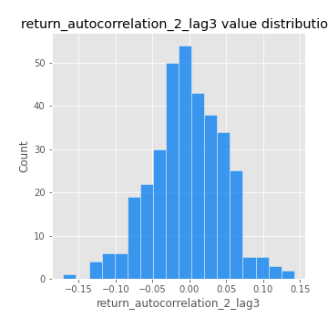
## Feature : return_correlation_ts1_lag_0
- **Feature type** : continous
- **Missing** : 0.0%
- **Unique** : 347
- **Count** :347.0
- **Mean** :0.3365954467058601
- **Std** :0.11391926780111204
- **Min** :-0.027089510445801036
- **25%th Percentile** : 0.27744035500571296
- **50%th Percentile** : 0.34019914287896924
- **75%th Percentile** : 0.3991246189099894
- **Max** :0.7041861626832071

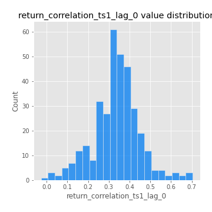
## Feature : return_correlation_ts1_lag_1
- **Feature type** : continous
- **Missing** : 0.0%
- **Unique** : 347
- **Count** :347.0
- **Mean** :-0.0004641261499130236
- **Std** :0.05301257608521193
- **Min** :-0.16985510949917193
- **25%th Percentile** : -0.035089093105066756
- **50%th Percentile** : 0.0021467364529310497
- **75%th Percentile** : 0.036878437841774796
- **Max** :0.15499424718508623

## Feature : return_correlation_ts1_lag_2
- **Feature type** : continous
- **Missing** : 0.0%
- **Unique** : 347
- **Count** :347.0
- **Mean** :0.0029008804585626217
- **Std** :0.05002721964514586
- **Min** :-0.21653581047581763
- **25%th Percentile** : -0.03126101149718206
- **50%th Percentile** : 0.001146803135765006
- **75%th Percentile** : 0.038770139964563605
- **Max** :0.14156380045015016

## Feature : return_correlation_ts1_lag_3
- **Feature type** : continous
- **Missing** : 0.0%
- **Unique** : 347
- **Count** :347.0
- **Mean** :0.0062077149837290934
- **Std** :0.05158773420354989
- **Min** :-0.1270218498974763
- **25%th Percentile** : -0.02746204406242548
- **50%th Percentile** : 0.00642903341324523
- **75%th Percentile** : 0.042769372822279654
- **Max** :0.1636773216468148

## Feature : return_correlation_ts2_lag_1
- **Feature type** : continous
- **Missing** : 0.0%
- **Unique** : 347
- **Count** :347.0
- **Mean** :-0.001047684212459494
- **Std** :0.05260222557215985
- **Min** :-0.2081139431093261
- **25%th Percentile** : -0.02947428890529604
- **50%th Percentile** : -0.0004432134184070975
- **75%th Percentile** : 0.02812515328576547
- **Max** :0.17208763791364762

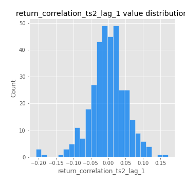
## Feature : return_correlation_ts2_lag_2
- **Feature type** : continous
- **Missing** : 0.0%
- **Unique** : 347
- **Count** :347.0
- **Mean** :0.003641251331835921
- **Std** :0.04716877415194661
- **Min** :-0.15299951737180204
- **25%th Percentile** : -0.025714117652421493
- **50%th Percentile** : 0.00453971823147874
- **75%th Percentile** : 0.02908039899721884
- **Max** :0.20772887392904255

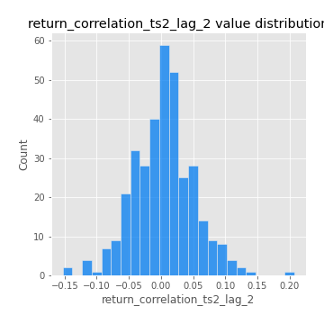
## Feature : return_correlation_ts2_lag_3
- **Feature type** : continous
- **Missing** : 0.0%
- **Unique** : 347
- **Count** :347.0
- **Mean** :0.0005227644678575746
- **Std** :0.052791474837603596
- **Min** :-0.17564076057312866
- **25%th Percentile** : -0.029262364321505432
- **50%th Percentile** : -0.0007795654705965068
- **75%th Percentile** : 0.03602988402426241
- **Max** :0.12502781355851633

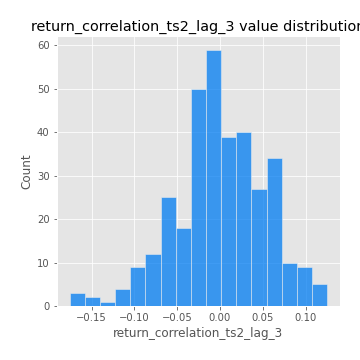
## Feature : sqreturn_autocorrelation_ts1_lag1
- **Feature type** : continous
- **Missing** : 0.0%
- **Unique** : 347
- **Count** :347.0
- **Mean** :0.05013883214735238
- **Std** :0.09155166047307908
- **Min** :-0.07564334704807149
- **25%th Percentile** : -0.010583798234146517
- **50%th Percentile** : 0.02646910530292259
- **75%th Percentile** : 0.08322313800975853
- **Max** :0.4439086285737898

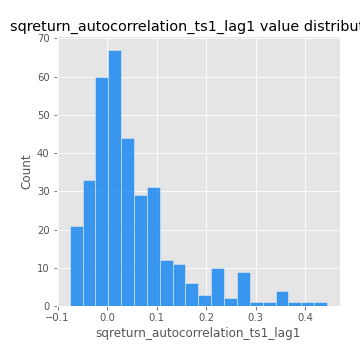
## Feature : sqreturn_autocorrelation_ts1_lag2
- **Feature type** : continous
- **Missing** : 0.0%
- **Unique** : 347
- **Count** :347.0
- **Mean** :0.04361406117165724
- **Std** :0.0935489957376389
- **Min** :-0.11676059331671647
- **25%th Percentile** : -0.013761209674481502
- **50%th Percentile** : 0.015077075207766322
- **75%th Percentile** : 0.06747271324392673
- **Max** :0.540735851444759

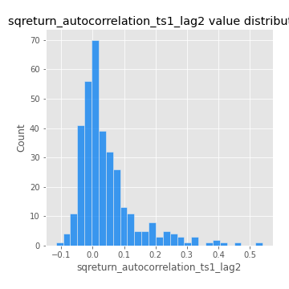
## Feature : sqreturn_autocorrelation_ts1_lag3
- **Feature type** : continous
- **Missing** : 0.0%
- **Unique** : 347
- **Count** :347.0
- **Mean** :0.036443092756758735
- **Std** :0.08145842502024683
- **Min** :-0.09815565902206971
- **25%th Percentile** : -0.013613150600159406
- **50%th Percentile** : 0.012885014751173963
- **75%th Percentile** : 0.06302625843491666
- **Max** :0.44755937369538146

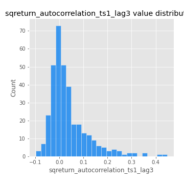
## Feature : sqreturn_autocorrelation_ts2_lag1
- **Feature type** : continous
- **Missing** : 0.0%
- **Unique** : 347
- **Count** :347.0
- **Mean** :0.04297928676844158
- **Std** :0.08627714667740732
- **Min** :-0.09701931268962811
- **25%th Percentile** : -0.016259968786956163
- **50%th Percentile** : 0.020890313633460743
- **75%th Percentile** : 0.07451000048836894
- **Max** :0.4190090519891419

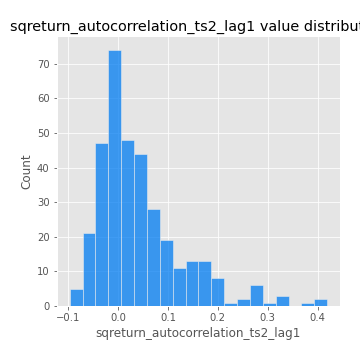
## Feature : sqreturn_autocorrelation_ts2_lag2
- **Feature type** : continous
- **Missing** : 0.0%
- **Unique** : 347
- **Count** :347.0
- **Mean** :0.033214154070523194
- **Std** :0.08518522130381724
- **Min** :-0.07403350501991336
- **25%th Percentile** : -0.0157060402548981
- **50%th Percentile** : 0.006971518174974694
- **75%th Percentile** : 0.0516471701297326
- **Max** :0.45676817892778204

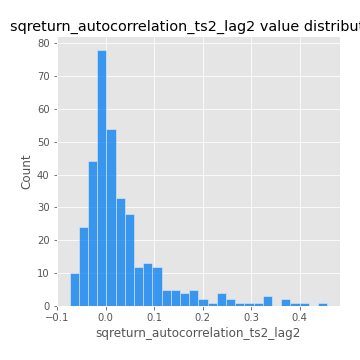
## Feature : sqreturn_autocorrelation_ts2_lag3
- **Feature type** : continous
- **Missing** : 0.0%
- **Unique** : 347
- **Count** :347.0
- **Mean** :0.026274972519542122
- **Std** :0.06722022311111187
- **Min** :-0.0908472152906089
- **25%th Percentile** : -0.017581065177970593
- **50%th Percentile** : 0.0078072299510273885
- **75%th Percentile** : 0.051143389268337475
- **Max** :0.31225727797735664

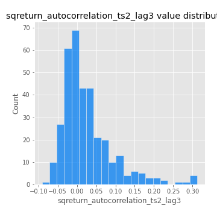
## Feature : sqreturn_correlation_ts1_lag_0
- **Feature type** : continous
- **Missing** : 0.0%
- **Unique** : 347
- **Count** :347.0
- **Mean** :0.3365954467058601
- **Std** :0.11391926780111204
- **Min** :-0.027089510445801036
- **25%th Percentile** : 0.27744035500571296
- **50%th Percentile** : 0.34019914287896924
- **75%th Percentile** : 0.3991246189099894
- **Max** :0.7041861626832071

## Feature : sqreturn_correlation_ts1_lag_1
- **Feature type** : continous
- **Missing** : 0.0%
- **Unique** : 347
- **Count** :347.0
- **Mean** :-0.0004641261499130236
- **Std** :0.05301257608521193
- **Min** :-0.16985510949917193
- **25%th Percentile** : -0.035089093105066756
- **50%th Percentile** : 0.0021467364529310497
- **75%th Percentile** : 0.036878437841774796
- **Max** :0.15499424718508623

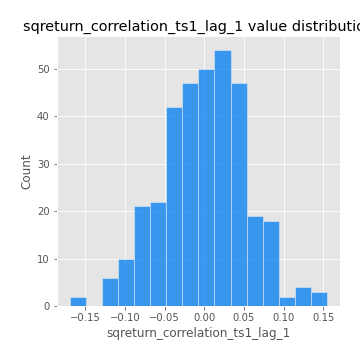
## Feature : sqreturn_correlation_ts1_lag_2
- **Feature type** : continous
- **Missing** : 0.0%
- **Unique** : 347
- **Count** :347.0
- **Mean** :0.0029008804585626217
- **Std** :0.05002721964514586
- **Min** :-0.21653581047581763
- **25%th Percentile** : -0.03126101149718206
- **50%th Percentile** : 0.001146803135765006
- **75%th Percentile** : 0.038770139964563605
- **Max** :0.14156380045015016

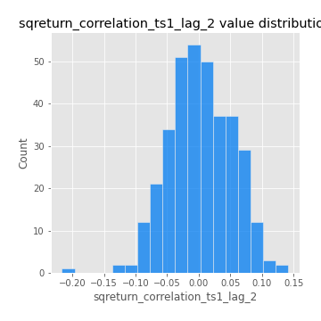
## Feature : sqreturn_correlation_ts1_lag_3
- **Feature type** : continous
- **Missing** : 0.0%
- **Unique** : 347
- **Count** :347.0
- **Mean** :0.0062077149837290934
- **Std** :0.05158773420354989
- **Min** :-0.1270218498974763
- **25%th Percentile** : -0.02746204406242548
- **50%th Percentile** : 0.00642903341324523
- **75%th Percentile** : 0.042769372822279654
- **Max** :0.1636773216468148

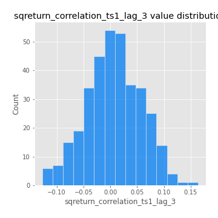
## Feature : sqreturn_correlation_ts2_lag_1
- **Feature type** : continous
- **Missing** : 0.0%
- **Unique** : 347
- **Count** :347.0
- **Mean** :-0.001047684212459494
- **Std** :0.05260222557215985
- **Min** :-0.2081139431093261
- **25%th Percentile** : -0.02947428890529604
- **50%th Percentile** : -0.0004432134184070975
- **75%th Percentile** : 0.02812515328576547
- **Max** :0.17208763791364762

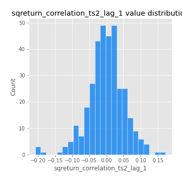
## Feature : sqreturn_correlation_ts2_lag_2
- **Feature type** : continous
- **Missing** : 0.0%
- **Unique** : 347
- **Count** :347.0
- **Mean** :0.003641251331835921
- **Std** :0.04716877415194661
- **Min** :-0.15299951737180204
- **25%th Percentile** : -0.025714117652421493
- **50%th Percentile** : 0.00453971823147874
- **75%th Percentile** : 0.02908039899721884
- **Max** :0.20772887392904255

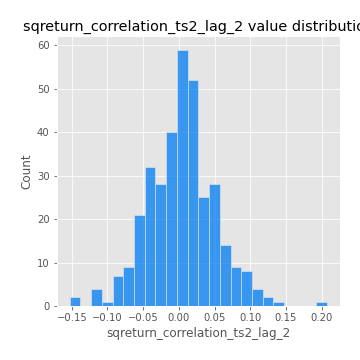
## Feature : sqreturn_correlation_ts2_lag_3
- **Feature type** : continous
- **Missing** : 0.0%
- **Unique** : 347
- **Count** :347.0
- **Mean** :0.0005227644678575746
- **Std** :0.052791474837603596
- **Min** :-0.17564076057312866
- **25%th Percentile** : -0.029262364321505432
- **50%th Percentile** : -0.0007795654705965068
- **75%th Percentile** : 0.03602988402426241
- **Max** :0.12502781355851633

## Feature : price2_granger_cause_price1
- **Feature type** : continous
- **Missing** : 0.0%
- **Unique** : 347
- **Count** :347.0
- **Mean** :0.25813721972607573
- **Std** :0.28770763441404956
- **Min** :8.886289165371143e-09
- **25%th Percentile** : 0.008811352137044771
- **50%th Percentile** : 0.13670111622014028
- **75%th Percentile** : 0.4493619640095487
- **Max** :0.9885712803689185

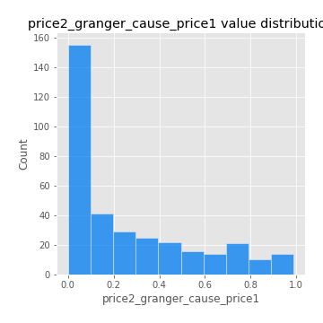
## Feature : price1_granger_cause_price2
- **Feature type** : continous
- **Missing** : 0.0%
- **Unique** : 347
- **Count** :347.0
- **Mean** :0.3110937065000737
- **Std** :0.2717823697771868
- **Min** :4.4461318946886344e-05
- **25%th Percentile** : 0.06029167023492811
- **50%th Percentile** : 0.27014257067588643
- **75%th Percentile** : 0.5009099163968912
- **Max** :0.9876789421465306

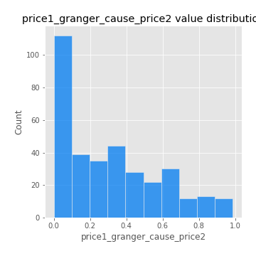

[<< Go back](../README.md)
