# Summary of 2_DecisionTree

[<< Go back](../README.md)

## Decision Tree
- **n_jobs**: -1
- **criterion**: gini
- **max_depth**: 3
- **explain_level**: 2

## Validation
 - **validation_type**: split
 - **train_ratio**: 0.75
 - **shuffle**: True
 - **stratify**: True

## Optimized metric
accuracy

## Training time

13.6 seconds

## Metric details
|           |    score |   threshold |
|:----------|---------:|------------:|
| logloss   | 0.798617 |  nan        |
| auc       | 0.848573 |  nan        |
| f1        | 0.818182 |    0.494118 |
| accuracy  | 0.816092 |    0.494118 |
| precision | 0.84     |    0.947606 |
| recall    | 0.954545 |    0        |
| mcc       | 0.632135 |    0.494118 |

## Confusion matrix (at threshold=0.494118)
|                      |   Predicted as real |   Predicted as simulated |
|:---------------------|--------------------:|-------------------------:|
| Labeled as real      |                  35 |                        8 |
| Labeled as simulated |                   8 |                       36 |

## Learning curves
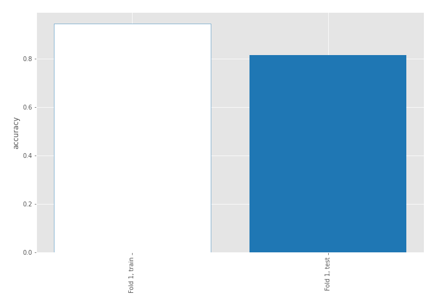

## Decision Tree 

### Tree #1
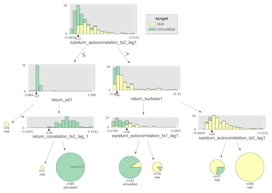

### Rules

if (sqreturn_autocorrelation_ts2_lag1 > -0.005) and (return_kurtosis1 > 1.598) and (sqreturn_autocorrelation_ts2_lag1 > 0.041) then class: real (proba: 100.0%) | based on 85 samples

if (sqreturn_autocorrelation_ts2_lag1 <= -0.005) and (return_sd1 > 1.474) and (return_correlation_ts2_lag_1 > -0.087) then class: simulated (proba: 98.82%) | based on 85 samples

if (sqreturn_autocorrelation_ts2_lag1 > -0.005) and (return_kurtosis1 <= 1.598) and (sqreturn_autocorrelation_ts1_lag1 <= 0.057) then class: simulated (proba: 90.7%) | based on 43 samples

if (sqreturn_autocorrelation_ts2_lag1 > -0.005) and (return_kurtosis1 > 1.598) and (sqreturn_autocorrelation_ts2_lag1 <= 0.041) then class: real (proba: 74.07%) | based on 27 samples

if (sqreturn_autocorrelation_ts2_lag1 > -0.005) and (return_kurtosis1 <= 1.598) and (sqreturn_autocorrelation_ts1_lag1 > 0.057) then class: real (proba: 87.5%) | based on 16 samples

if (sqreturn_autocorrelation_ts2_lag1 <= -0.005) and (return_sd1 <= 1.474) then class: real (proba: 100.0%) | based on 3 samples

if (sqreturn_autocorrelation_ts2_lag1 <= -0.005) and (return_sd1 > 1.474) and (return_correlation_ts2_lag_1 <= -0.087) then class: real (proba: 100.0%) | based on 1 samples

## Permutation-based Importance
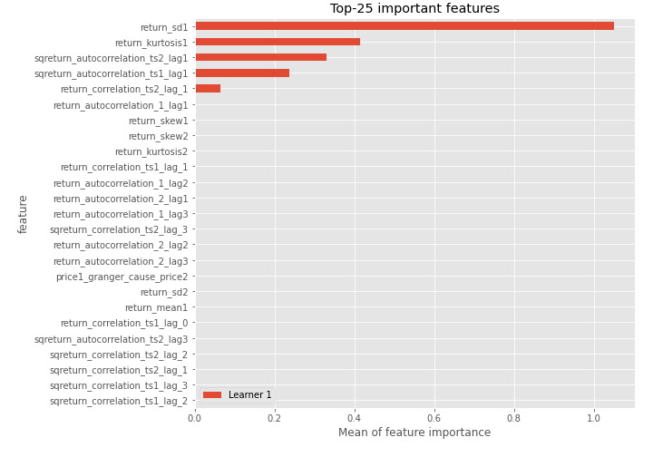
## Confusion Matrix

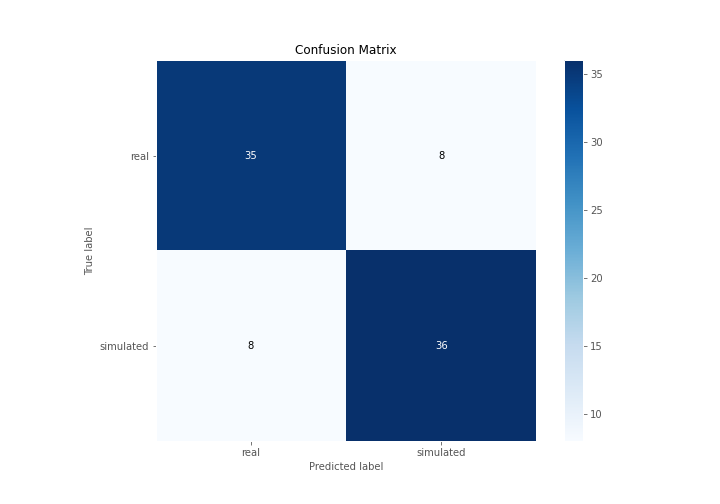

## Normalized Confusion Matrix

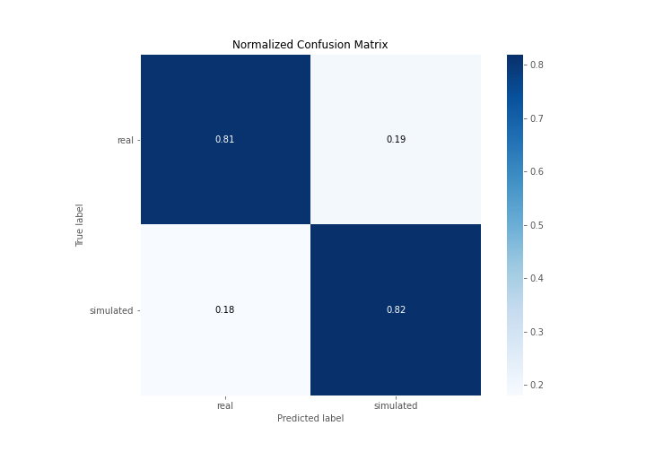

## ROC Curve

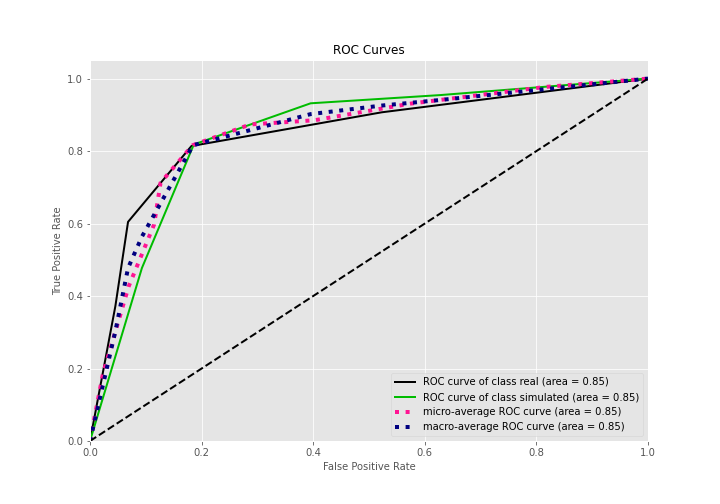

## Kolmogorov-Smirnov Statistic

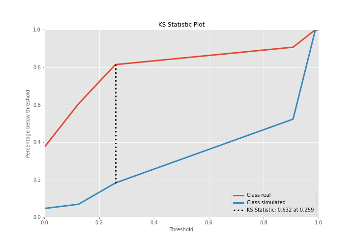

## Precision-Recall Curve

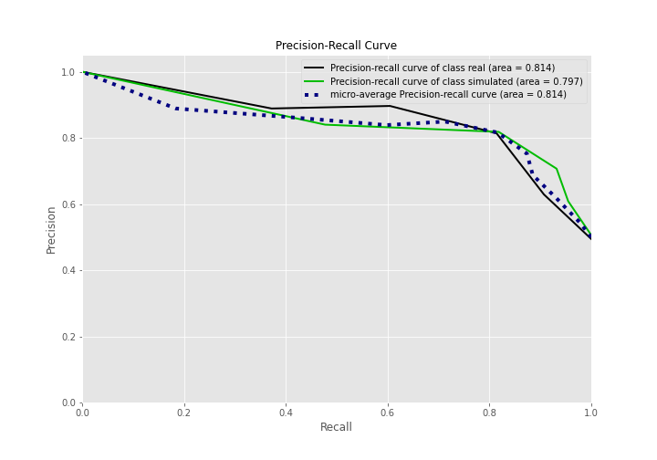

## Calibration Curve

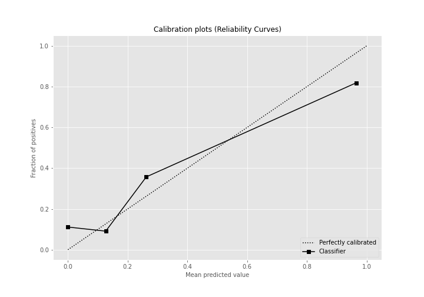

## Cumulative Gains Curve

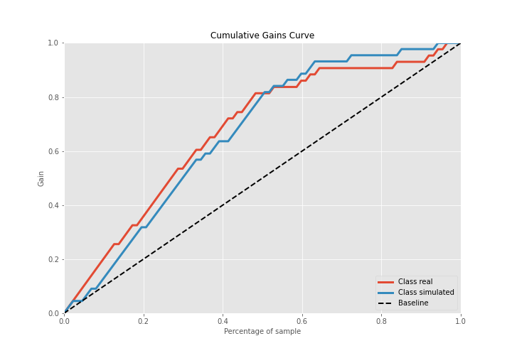

## Lift Curve

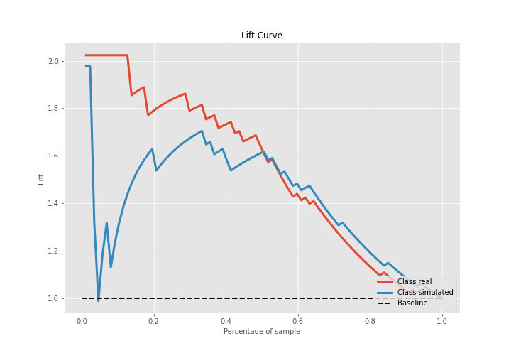

## SHAP Importance
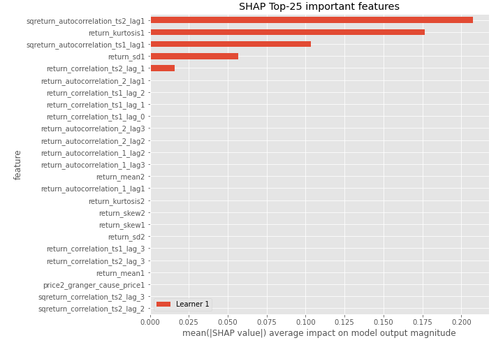

## SHAP Dependence plots

### Dependence (Fold 1)
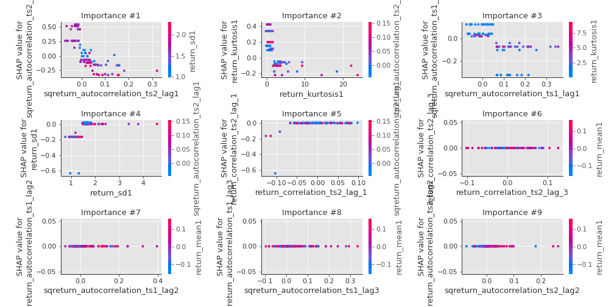

## SHAP Decision plots

### Top-10 Worst decisions for class 0 (Fold 1)
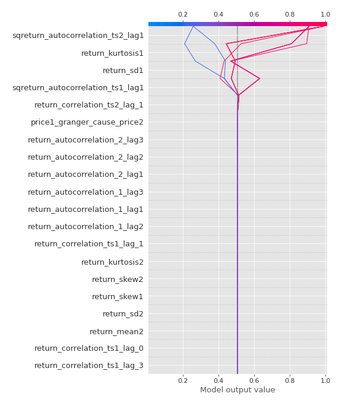
### Top-10 Best decisions for class 0 (Fold 1)
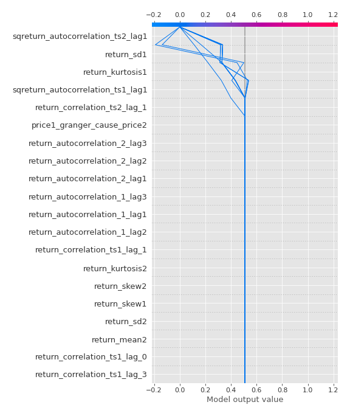
### Top-10 Worst decisions for class 1 (Fold 1)
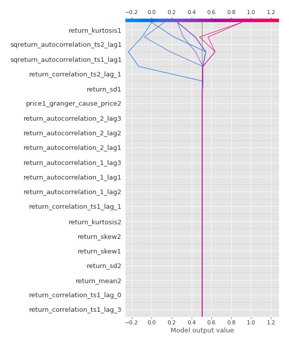
### Top-10 Best decisions for class 1 (Fold 1)
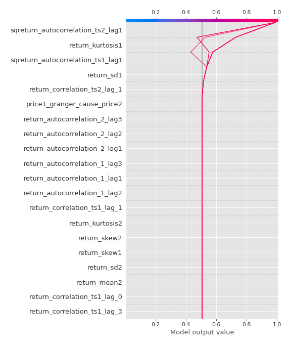

[<< Go back](../README.md)
