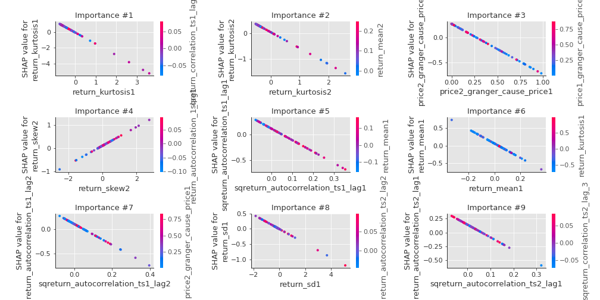

# Summary of 3_Linear

[<< Go back](../README.md)

## Logistic Regression (Linear)
- **n_jobs**: -1
- **explain_level**: 2

## Validation
 - **validation_type**: split
 - **train_ratio**: 0.75
 - **shuffle**: True
 - **stratify**: True

## Optimized metric
accuracy

## Training time

12.7 seconds

## Metric details
|           |    score |    threshold |
|:----------|---------:|-------------:|
| logloss   | 0.394081 | nan          |
| auc       | 0.94556  | nan          |
| f1        | 0.911111 |   0.603168   |
| accuracy  | 0.908046 |   0.659136   |
| precision | 1        |   0.82298    |
| recall    | 1        |   0.00202726 |
| mcc       | 0.816835 |   0.603168   |

## Confusion matrix (at threshold=0.659136)
|                      |   Predicted as real |   Predicted as simulated |
|:---------------------|--------------------:|-------------------------:|
| Labeled as real      |                  39 |                        4 |
| Labeled as simulated |                   4 |                       40 |

## Learning curves

## Coefficients
| feature                           |   Learner_1 |
|:----------------------------------|------------:|
| return_mean2                      |   1.47456   |
| return_autocorrelation_1_lag1     |   1.26167   |
| return_correlation_ts2_lag_1      |   0.938434  |
| sqreturn_correlation_ts2_lag_1    |   0.938434  |
| sqreturn_correlation_ts1_lag_0    |   0.806526  |
| return_correlation_ts1_lag_0      |   0.806526  |
| return_autocorrelation_2_lag2     |   0.6842    |
| sqreturn_correlation_ts1_lag_1    |   0.66889   |
| return_correlation_ts1_lag_1      |   0.66889   |
| return_autocorrelation_2_lag1     |   0.653286  |
| return_autocorrelation_1_lag3     |   0.632901  |
| return_autocorrelation_1_lag2     |   0.556699  |
| sqreturn_correlation_ts2_lag_3    |   0.538651  |
| return_correlation_ts2_lag_3      |   0.538651  |
| return_autocorrelation_2_lag3     |   0.478865  |
| return_skew2                      |   0.404762  |
| return_correlation_ts1_lag_2      |   0.370666  |
| sqreturn_correlation_ts1_lag_2    |   0.370666  |
| sqreturn_correlation_ts1_lag_3    |   0.370197  |
| return_correlation_ts1_lag_3      |   0.370197  |
| sqreturn_correlation_ts2_lag_2    |   0.329621  |
| return_correlation_ts2_lag_2      |   0.329621  |
| return_sd2                        |   0.0973237 |
| intercept                         |  -0.0872747 |
| return_skew1                      |  -0.178343  |
| return_sd1                        |  -0.233238  |
| price1_granger_cause_price2       |  -0.349262  |
| return_kurtosis2                  |  -0.626427  |
| price2_granger_cause_price1       |  -1.00552   |
| sqreturn_autocorrelation_ts2_lag3 |  -1.17122   |
| return_kurtosis1                  |  -1.43447   |
| sqreturn_autocorrelation_ts2_lag2 |  -1.48221   |
| sqreturn_autocorrelation_ts1_lag3 |  -1.50129   |
| return_mean1                      |  -2.04423   |
| sqreturn_autocorrelation_ts1_lag2 |  -2.15132   |
| sqreturn_autocorrelation_ts2_lag1 |  -2.27165   |
| sqreturn_autocorrelation_ts1_lag1 |  -2.27384   |

## Permutation-based Importance

## Confusion Matrix

## Normalized Confusion Matrix

## ROC Curve

## Kolmogorov-Smirnov Statistic

## Precision-Recall Curve

## Calibration Curve

## Cumulative Gains Curve

## Lift Curve

## SHAP Importance

## SHAP Dependence plots

### Dependence (Fold 1)

## SHAP Decision plots

### Top-10 Worst decisions for class 0 (Fold 1)

### Top-10 Best decisions for class 0 (Fold 1)

### Top-10 Worst decisions for class 1 (Fold 1)

### Top-10 Best decisions for class 1 (Fold 1)

[<< Go back](../README.md)
