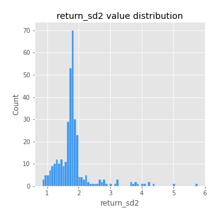
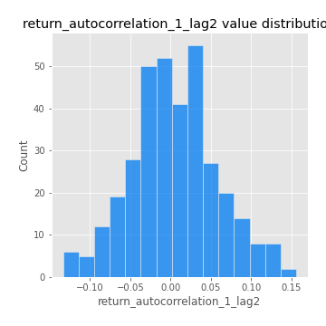
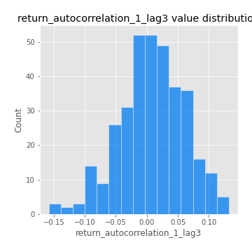
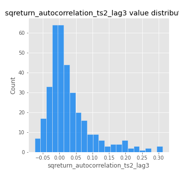

# Exploratory Data Analysis

[<< Go back](../README.md)
## Feature : target
- **Feature type** : categorical
- **Missing** : 0.0%
- **Unique** : 2
- **Count** :347
- **Unique** :2
- **Top** :simulated
- **Freq** :176

## Feature : return_mean1
- **Feature type** : continous
- **Missing** : 0.0%
- **Unique** : 347
- **Count** :347.0
- **Mean** :0.012615671513460295
- **Std** :0.1042814199522097
- **Min** :-0.32966409891767545
- **25%th Percentile** : -0.05446246041909545
- **50%th Percentile** : 0.020791065331283814
- **75%th Percentile** : 0.08457250542933417
- **Max** :0.3612366374600757

## Feature : return_mean2
- **Feature type** : continous
- **Missing** : 0.0%
- **Unique** : 347
- **Count** :347.0
- **Mean** :0.09876927896054975
- **Std** :0.09292887369997342
- **Min** :-0.24205418062825398
- **25%th Percentile** : 0.042506201545567515
- **50%th Percentile** : 0.09756489023491552
- **75%th Percentile** : 0.15776017531067105
- **Max** :0.3925347455930531

## Feature : return_sd1
- **Feature type** : continous
- **Missing** : 0.0%
- **Unique** : 347
- **Count** :347.0
- **Mean** :1.7415222495080502
- **Std** :0.5493352977100763
- **Min** :0.7620831696941981
- **25%th Percentile** : 1.550687750274141
- **50%th Percentile** : 1.6396594481232176
- **75%th Percentile** : 1.7278040861131005
- **Max** :5.996244884956102

## Feature : return_sd2
- **Feature type** : continous
- **Missing** : 0.0%
- **Unique** : 347
- **Count** :347.0
- **Mean** :1.824264954768215
- **Std** :0.6077148421545407
- **Min** :0.8455946193085045
- **25%th Percentile** : 1.6120544955253158
- **50%th Percentile** : 1.7696787337297548
- **75%th Percentile** : 1.863632514448894
- **Max** :5.762808157208253

## Feature : return_skew1
- **Feature type** : continous
- **Missing** : 0.0%
- **Unique** : 347
- **Count** :347.0
- **Mean** :-0.08243127743754367
- **Std** :0.6064224323473687
- **Min** :-3.530116233761814
- **25%th Percentile** : -0.2553054206774103
- **50%th Percentile** : -0.029933928104557708
- **75%th Percentile** : 0.148406104095202
- **Max** :2.5845963767725557

## Feature : return_skew2
- **Feature type** : continous
- **Missing** : 0.0%
- **Unique** : 347
- **Count** :347.0
- **Mean** :-0.1817350554198965
- **Std** :0.8702999055235039
- **Min** :-8.801502855292393
- **25%th Percentile** : -0.42219526258049206
- **50%th Percentile** : -0.08497239697872812
- **75%th Percentile** : 0.1286621711120888
- **Max** :2.7422934636615905

## Feature : return_kurtosis1
- **Feature type** : continous
- **Missing** : 0.0%
- **Unique** : 347
- **Count** :347.0
- **Mean** :3.629188307360372
- **Std** :5.28189054789785
- **Min** :-0.3965310051857429
- **25%th Percentile** : 0.663783811607213
- **50%th Percentile** : 1.6815159815556346
- **75%th Percentile** : 4.17618388085217
- **Max** :31.614652972751188

## Feature : return_kurtosis2
- **Feature type** : continous
- **Missing** : 0.0%
- **Unique** : 347
- **Count** :347.0
- **Mean** :5.192326016064536
- **Std** :10.099026781591594
- **Min** :-0.28274402355690365
- **25%th Percentile** : 1.185053025691468
- **50%th Percentile** : 2.5311914071073
- **75%th Percentile** : 5.306987132829273
- **Max** :143.10871011533666

## Feature : return_autocorrelation_1_lag1
- **Feature type** : continous
- **Missing** : 0.0%
- **Unique** : 347
- **Count** :347.0
- **Mean** :-0.0034997435907263936
- **Std** :0.061763343162646575
- **Min** :-0.2135576224968752
- **25%th Percentile** : -0.03383746716215904
- **50%th Percentile** : 0.001209603095604238
- **75%th Percentile** : 0.03702381372716408
- **Max** :0.1426030996182074

## Feature : return_autocorrelation_1_lag2
- **Feature type** : continous
- **Missing** : 0.0%
- **Unique** : 347
- **Count** :347.0
- **Mean** :0.004843646375683428
- **Std** :0.05364295550398886
- **Min** :-0.1335078708830081
- **25%th Percentile** : -0.0310481181683558
- **50%th Percentile** : 0.0023039563864688593
- **75%th Percentile** : 0.037441846534573484
- **Max** :0.1561488228015672

## Feature : return_autocorrelation_1_lag3
- **Feature type** : continous
- **Missing** : 0.0%
- **Unique** : 347
- **Count** :347.0
- **Mean** :0.008235057115501822
- **Std** :0.05280370089144863
- **Min** :-0.15806635192103805
- **25%th Percentile** : -0.022971932751499783
- **50%th Percentile** : 0.006575930184776834
- **75%th Percentile** : 0.045131131654323864
- **Max** :0.132376903591337

## Feature : return_autocorrelation_2_lag1
- **Feature type** : continous
- **Missing** : 0.0%
- **Unique** : 347
- **Count** :347.0
- **Mean** :-0.00818037517782866
- **Std** :0.06175886041492543
- **Min** :-0.25075531010123286
- **25%th Percentile** : -0.037725663752592384
- **50%th Percentile** : -0.0069997606842294915
- **75%th Percentile** : 0.027924228533076693
- **Max** :0.31863413537898483

## Feature : return_autocorrelation_2_lag2
- **Feature type** : continous
- **Missing** : 0.0%
- **Unique** : 347
- **Count** :347.0
- **Mean** :-0.0007165205334202146
- **Std** :0.0495897764002502
- **Min** :-0.15323211089747296
- **25%th Percentile** : -0.03229903147758964
- **50%th Percentile** : -0.0019786601520114383
- **75%th Percentile** : 0.0303320300626666
- **Max** :0.20974504043791217

## Feature : return_autocorrelation_2_lag3
- **Feature type** : continous
- **Missing** : 0.0%
- **Unique** : 347
- **Count** :347.0
- **Mean** :-0.00010378545586664928
- **Std** :0.04940575971798299
- **Min** :-0.14200107169559698
- **25%th Percentile** : -0.03090058771463064
- **50%th Percentile** : 0.00022750077779911033
- **75%th Percentile** : 0.032086328622947614
- **Max** :0.1419999376914021

## Feature : return_correlation_ts1_lag_0
- **Feature type** : continous
- **Missing** : 0.0%
- **Unique** : 347
- **Count** :347.0
- **Mean** :0.3344640796789385
- **Std** :0.10974474297193847
- **Min** :-0.027089510445801036
- **25%th Percentile** : 0.28035213563054306
- **50%th Percentile** : 0.343069083402239
- **75%th Percentile** : 0.3947894799005806
- **Max** :0.7041861626832071

## Feature : return_correlation_ts1_lag_1
- **Feature type** : continous
- **Missing** : 0.0%
- **Unique** : 347
- **Count** :347.0
- **Mean** :-0.0031470986814257397
- **Std** :0.05116976778871699
- **Min** :-0.16985510949917193
- **25%th Percentile** : -0.03654108513036382
- **50%th Percentile** : 0.001559202586656911
- **75%th Percentile** : 0.02850972368505885
- **Max** :0.12219233120910407

## Feature : return_correlation_ts1_lag_2
- **Feature type** : continous
- **Missing** : 0.0%
- **Unique** : 347
- **Count** :347.0
- **Mean** :0.005540202725860993
- **Std** :0.05294724536565613
- **Min** :-0.21653581047581763
- **25%th Percentile** : -0.026095695239026773
- **50%th Percentile** : 0.002484037300201709
- **75%th Percentile** : 0.04185228181973974
- **Max** :0.1583521847688971

## Feature : return_correlation_ts1_lag_3
- **Feature type** : continous
- **Missing** : 0.0%
- **Unique** : 347
- **Count** :347.0
- **Mean** :0.006633149937976284
- **Std** :0.05016627619338344
- **Min** :-0.1270218498974763
- **25%th Percentile** : -0.025704195564409525
- **50%th Percentile** : 0.00940527987536251
- **75%th Percentile** : 0.04179415844996166
- **Max** :0.1636773216468148

## Feature : return_correlation_ts2_lag_1
- **Feature type** : continous
- **Missing** : 0.0%
- **Unique** : 347
- **Count** :347.0
- **Mean** :-0.00027769530303179427
- **Std** :0.05545660384097715
- **Min** :-0.2081139431093261
- **25%th Percentile** : -0.0331036187685013
- **50%th Percentile** : -0.002148506714879542
- **75%th Percentile** : 0.03708410580318722
- **Max** :0.15421585401111898

## Feature : return_correlation_ts2_lag_2
- **Feature type** : continous
- **Missing** : 0.0%
- **Unique** : 347
- **Count** :347.0
- **Mean** :0.0034581166824875164
- **Std** :0.051618199088334565
- **Min** :-0.23751835475804678
- **25%th Percentile** : -0.03129054819455944
- **50%th Percentile** : 0.00317689997024158
- **75%th Percentile** : 0.0379853618343981
- **Max** :0.20772887392904255

## Feature : return_correlation_ts2_lag_3
- **Feature type** : continous
- **Missing** : 0.0%
- **Unique** : 347
- **Count** :347.0
- **Mean** :0.006154649770874139
- **Std** :0.053656246536316246
- **Min** :-0.17564076057312866
- **25%th Percentile** : -0.02342935706065381
- **50%th Percentile** : 0.004678343036389244
- **75%th Percentile** : 0.04551216436935296
- **Max** :0.13976992196641974

## Feature : sqreturn_autocorrelation_ts1_lag1
- **Feature type** : continous
- **Missing** : 0.0%
- **Unique** : 347
- **Count** :347.0
- **Mean** :0.047553649531359245
- **Std** :0.09098610988895518
- **Min** :-0.0783573890432234
- **25%th Percentile** : -0.014479780717891372
- **50%th Percentile** : 0.02459550803438465
- **75%th Percentile** : 0.08591334130031542
- **Max** :0.49414293176447355

## Feature : sqreturn_autocorrelation_ts1_lag2
- **Feature type** : continous
- **Missing** : 0.0%
- **Unique** : 347
- **Count** :347.0
- **Mean** :0.039390026943094805
- **Std** :0.09001353932971283
- **Min** :-0.1005510497279269
- **25%th Percentile** : -0.015656129553837238
- **50%th Percentile** : 0.013302693786468957
- **75%th Percentile** : 0.06559144137208814
- **Max** :0.540735851444759

## Feature : sqreturn_autocorrelation_ts1_lag3
- **Feature type** : continous
- **Missing** : 0.0%
- **Unique** : 347
- **Count** :347.0
- **Mean** :0.03127218877982592
- **Std** :0.07803641636641973
- **Min** :-0.09618729096330718
- **25%th Percentile** : -0.017712721633715317
- **50%th Percentile** : 0.011899487611532363
- **75%th Percentile** : 0.06132038508666933
- **Max** :0.3457940197475473

## Feature : sqreturn_autocorrelation_ts2_lag1
- **Feature type** : continous
- **Missing** : 0.0%
- **Unique** : 347
- **Count** :347.0
- **Mean** :0.04370290141840761
- **Std** :0.08764711748697479
- **Min** :-0.08282696733633478
- **25%th Percentile** : -0.016144246200767116
- **50%th Percentile** : 0.020890313633460743
- **75%th Percentile** : 0.07464678766495364
- **Max** :0.510085647437958

## Feature : sqreturn_autocorrelation_ts2_lag2
- **Feature type** : continous
- **Missing** : 0.0%
- **Unique** : 347
- **Count** :347.0
- **Mean** :0.03766084958236685
- **Std** :0.08293512444823543
- **Min** :-0.09117352184090058
- **25%th Percentile** : -0.009081445115823235
- **50%th Percentile** : 0.012367098888812732
- **75%th Percentile** : 0.05195702516180044
- **Max** :0.5373432415582473

## Feature : sqreturn_autocorrelation_ts2_lag3
- **Feature type** : continous
- **Missing** : 0.0%
- **Unique** : 347
- **Count** :347.0
- **Mean** :0.028630048568224053
- **Std** :0.06781902441284977
- **Min** :-0.07493335167932645
- **25%th Percentile** : -0.013020228105282423
- **50%th Percentile** : 0.009452155165373536
- **75%th Percentile** : 0.05072551628207648
- **Max** :0.31225727797735664

## Feature : sqreturn_correlation_ts1_lag_0
- **Feature type** : continous
- **Missing** : 0.0%
- **Unique** : 347
- **Count** :347.0
- **Mean** :0.3344640796789385
- **Std** :0.10974474297193847
- **Min** :-0.027089510445801036
- **25%th Percentile** : 0.28035213563054306
- **50%th Percentile** : 0.343069083402239
- **75%th Percentile** : 0.3947894799005806
- **Max** :0.7041861626832071

## Feature : sqreturn_correlation_ts1_lag_1
- **Feature type** : continous
- **Missing** : 0.0%
- **Unique** : 347
- **Count** :347.0
- **Mean** :-0.0031470986814257397
- **Std** :0.05116976778871699
- **Min** :-0.16985510949917193
- **25%th Percentile** : -0.03654108513036382
- **50%th Percentile** : 0.001559202586656911
- **75%th Percentile** : 0.02850972368505885
- **Max** :0.12219233120910407

## Feature : sqreturn_correlation_ts1_lag_2
- **Feature type** : continous
- **Missing** : 0.0%
- **Unique** : 347
- **Count** :347.0
- **Mean** :0.005540202725860993
- **Std** :0.05294724536565613
- **Min** :-0.21653581047581763
- **25%th Percentile** : -0.026095695239026773
- **50%th Percentile** : 0.002484037300201709
- **75%th Percentile** : 0.04185228181973974
- **Max** :0.1583521847688971

## Feature : sqreturn_correlation_ts1_lag_3
- **Feature type** : continous
- **Missing** : 0.0%
- **Unique** : 347
- **Count** :347.0
- **Mean** :0.006633149937976284
- **Std** :0.05016627619338344
- **Min** :-0.1270218498974763
- **25%th Percentile** : -0.025704195564409525
- **50%th Percentile** : 0.00940527987536251
- **75%th Percentile** : 0.04179415844996166
- **Max** :0.1636773216468148

## Feature : sqreturn_correlation_ts2_lag_1
- **Feature type** : continous
- **Missing** : 0.0%
- **Unique** : 347
- **Count** :347.0
- **Mean** :-0.00027769530303179427
- **Std** :0.05545660384097715
- **Min** :-0.2081139431093261
- **25%th Percentile** : -0.0331036187685013
- **50%th Percentile** : -0.002148506714879542
- **75%th Percentile** : 0.03708410580318722
- **Max** :0.15421585401111898

## Feature : sqreturn_correlation_ts2_lag_2
- **Feature type** : continous
- **Missing** : 0.0%
- **Unique** : 347
- **Count** :347.0
- **Mean** :0.0034581166824875164
- **Std** :0.051618199088334565
- **Min** :-0.23751835475804678
- **25%th Percentile** : -0.03129054819455944
- **50%th Percentile** : 0.00317689997024158
- **75%th Percentile** : 0.0379853618343981
- **Max** :0.20772887392904255

## Feature : sqreturn_correlation_ts2_lag_3
- **Feature type** : continous
- **Missing** : 0.0%
- **Unique** : 347
- **Count** :347.0
- **Mean** :0.006154649770874139
- **Std** :0.053656246536316246
- **Min** :-0.17564076057312866
- **25%th Percentile** : -0.02342935706065381
- **50%th Percentile** : 0.004678343036389244
- **75%th Percentile** : 0.04551216436935296
- **Max** :0.13976992196641974

## Feature : price2_granger_cause_price1
- **Feature type** : continous
- **Missing** : 0.0%
- **Unique** : 347
- **Count** :347.0
- **Mean** :0.2758092620570837
- **Std** :0.30119170905540193
- **Min** :1.083887518553769e-11
- **25%th Percentile** : 0.010959931340550715
- **50%th Percentile** : 0.1424018606533265
- **75%th Percentile** : 0.5065963375670531
- **Max** :0.9885712803689185

## Feature : price1_granger_cause_price2
- **Feature type** : continous
- **Missing** : 0.0%
- **Unique** : 347
- **Count** :347.0
- **Mean** :0.31337253616085503
- **Std** :0.2881667003226107
- **Min** :4.194276314086506e-07
- **25%th Percentile** : 0.05137934654651695
- **50%th Percentile** : 0.23180440856705845
- **75%th Percentile** : 0.5332529838531433
- **Max** :0.9951398266867577

[<< Go back](../README.md)
