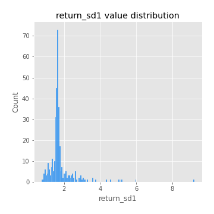
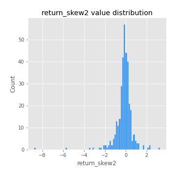

# Exploratory Data Analysis

[<< Go back](../README.md)
## Feature : target
- **Feature type** : categorical
- **Missing** : 0.0%
- **Unique** : 2
- **Count** :347
- **Unique** :2
- **Top** :simulated
- **Freq** :174

## Feature : return_mean1
- **Feature type** : continous
- **Missing** : 0.0%
- **Unique** : 347
- **Count** :347.0
- **Mean** :0.021913938538895544
- **Std** :0.10196640775159269
- **Min** :-0.29962222291378676
- **25%th Percentile** : -0.038351231073253944
- **50%th Percentile** : 0.03306055348799087
- **75%th Percentile** : 0.08578594672667973
- **Max** :0.37175100008111034

## Feature : return_mean2
- **Feature type** : continous
- **Missing** : 0.0%
- **Unique** : 347
- **Count** :347.0
- **Mean** :0.10689700361341625
- **Std** :0.10358090846443693
- **Min** :-0.24205418062825398
- **25%th Percentile** : 0.04819893703399071
- **50%th Percentile** : 0.1077539378868134
- **75%th Percentile** : 0.17123791290447088
- **Max** :0.38179636397381456

## Feature : return_sd1
- **Feature type** : continous
- **Missing** : 0.0%
- **Unique** : 347
- **Count** :347.0
- **Mean** :1.7897287943860751
- **Std** :0.7491264855119864
- **Min** :0.7470080772831957
- **25%th Percentile** : 1.547980181952437
- **50%th Percentile** : 1.647407278428017
- **75%th Percentile** : 1.7543945986017278
- **Max** :9.236766377527575

## Feature : return_sd2
- **Feature type** : continous
- **Missing** : 0.0%
- **Unique** : 347
- **Count** :347.0
- **Mean** :1.8660845965397834
- **Std** :0.6481680953109242
- **Min** :0.8455946193085045
- **25%th Percentile** : 1.6279567963146304
- **50%th Percentile** : 1.7843346449744495
- **75%th Percentile** : 1.903613143139903
- **Max** :5.872800253666788

## Feature : return_skew1
- **Feature type** : continous
- **Missing** : 0.0%
- **Unique** : 347
- **Count** :347.0
- **Mean** :-0.07963492256108788
- **Std** :0.6246267409720301
- **Min** :-3.453087436558107
- **25%th Percentile** : -0.28171484505087085
- **50%th Percentile** : -0.03988137961536872
- **75%th Percentile** : 0.16791602727418506
- **Max** :2.5845963767725557

## Feature : return_skew2
- **Feature type** : continous
- **Missing** : 0.0%
- **Unique** : 347
- **Count** :347.0
- **Mean** :-0.17975877953966438
- **Std** :0.8842387597978573
- **Min** :-8.801502855292393
- **25%th Percentile** : -0.3819981942974182
- **50%th Percentile** : -0.09361283109260612
- **75%th Percentile** : 0.15471028055002062
- **Max** :3.279410618338977

## Feature : return_kurtosis1
- **Feature type** : continous
- **Missing** : 0.0%
- **Unique** : 347
- **Count** :347.0
- **Mean** :3.921648024296516
- **Std** :5.93126873329578
- **Min** :-0.28844213893533066
- **25%th Percentile** : 0.7546148966983317
- **50%th Percentile** : 1.9031393931326819
- **75%th Percentile** : 4.1487022518862675
- **Max** :46.07507808162177

## Feature : return_kurtosis2
- **Feature type** : continous
- **Missing** : 0.0%
- **Unique** : 347
- **Count** :347.0
- **Mean** :5.1619674967568505
- **Std** :10.31206866371897
- **Min** :-0.2050896099696633
- **25%th Percentile** : 1.2865609551905886
- **50%th Percentile** : 2.4046278956864655
- **75%th Percentile** : 5.15193887364829
- **Max** :143.10871011533666

## Feature : return_autocorrelation_1_lag1
- **Feature type** : continous
- **Missing** : 0.0%
- **Unique** : 347
- **Count** :347.0
- **Mean** :-0.0014812945265389392
- **Std** :0.05914503444513267
- **Min** :-0.2135576224968752
- **25%th Percentile** : -0.03475350145436956
- **50%th Percentile** : 0.0056941582190139705
- **75%th Percentile** : 0.036569795920143186
- **Max** :0.1253959753011446

## Feature : return_autocorrelation_1_lag2
- **Feature type** : continous
- **Missing** : 0.0%
- **Unique** : 347
- **Count** :347.0
- **Mean** :0.0045806465614245204
- **Std** :0.0525344916822918
- **Min** :-0.13309283796645122
- **25%th Percentile** : -0.028286632508074366
- **50%th Percentile** : 0.00609239418387548
- **75%th Percentile** : 0.03842618822510707
- **Max** :0.18587145614336492

## Feature : return_autocorrelation_1_lag3
- **Feature type** : continous
- **Missing** : 0.0%
- **Unique** : 347
- **Count** :347.0
- **Mean** :0.008763302650673724
- **Std** :0.05055043637971947
- **Min** :-0.15806635192103805
- **25%th Percentile** : -0.022852719503669745
- **50%th Percentile** : 0.008994050490237639
- **75%th Percentile** : 0.04426424509374772
- **Max** :0.11898261905897652

## Feature : return_autocorrelation_2_lag1
- **Feature type** : continous
- **Missing** : 0.0%
- **Unique** : 347
- **Count** :347.0
- **Mean** :-0.004645027938740121
- **Std** :0.06047631219895547
- **Min** :-0.25075531010123286
- **25%th Percentile** : -0.035448566827274014
- **50%th Percentile** : -0.0006270719955293724
- **75%th Percentile** : 0.03139997791210803
- **Max** :0.31863413537898483

## Feature : return_autocorrelation_2_lag2
- **Feature type** : continous
- **Missing** : 0.0%
- **Unique** : 347
- **Count** :347.0
- **Mean** :-5.704438345475195e-05
- **Std** :0.05150370466133491
- **Min** :-0.1495113937562178
- **25%th Percentile** : -0.03371961464259407
- **50%th Percentile** : -0.0005296858994614946
- **75%th Percentile** : 0.032432062619442495
- **Max** :0.20974504043791217

## Feature : return_autocorrelation_2_lag3
- **Feature type** : continous
- **Missing** : 0.0%
- **Unique** : 347
- **Count** :347.0
- **Mean** :0.0006470153663559142
- **Std** :0.0492326549131302
- **Min** :-0.14200107169559698
- **25%th Percentile** : -0.028501422040691633
- **50%th Percentile** : 0.001168038911395616
- **75%th Percentile** : 0.03552345191714336
- **Max** :0.1419999376914021

## Feature : return_correlation_ts1_lag_0
- **Feature type** : continous
- **Missing** : 0.0%
- **Unique** : 347
- **Count** :347.0
- **Mean** :0.33728163643332887
- **Std** :0.1141499299129
- **Min** :-0.027089510445801036
- **25%th Percentile** : 0.2797012111972227
- **50%th Percentile** : 0.34577132977896
- **75%th Percentile** : 0.39688958632459004
- **Max** :0.7041861626832071

## Feature : return_correlation_ts1_lag_1
- **Feature type** : continous
- **Missing** : 0.0%
- **Unique** : 347
- **Count** :347.0
- **Mean** :-0.0003606828142933893
- **Std** :0.051822754273120775
- **Min** :-0.16985510949917193
- **25%th Percentile** : -0.03463035539669618
- **50%th Percentile** : 0.003723973816499782
- **75%th Percentile** : 0.03550990648317788
- **Max** :0.15499424718508623

## Feature : return_correlation_ts1_lag_2
- **Feature type** : continous
- **Missing** : 0.0%
- **Unique** : 347
- **Count** :347.0
- **Mean** :0.004047240546721226
- **Std** :0.048885957973255165
- **Min** :-0.21653581047581763
- **25%th Percentile** : -0.030309320312936476
- **50%th Percentile** : 0.005035966008469336
- **75%th Percentile** : 0.041644825391614376
- **Max** :0.11189067784001727

## Feature : return_correlation_ts1_lag_3
- **Feature type** : continous
- **Missing** : 0.0%
- **Unique** : 347
- **Count** :347.0
- **Mean** :0.003760805244075477
- **Std** :0.05071705424506869
- **Min** :-0.1270218498974763
- **25%th Percentile** : -0.028032305141638836
- **50%th Percentile** : 0.005148581441872404
- **75%th Percentile** : 0.03852265517578356
- **Max** :0.1422809271770942

## Feature : return_correlation_ts2_lag_1
- **Feature type** : continous
- **Missing** : 0.0%
- **Unique** : 347
- **Count** :347.0
- **Mean** :0.00014163614718551329
- **Std** :0.05332715819959924
- **Min** :-0.2081139431093261
- **25%th Percentile** : -0.03405746809765167
- **50%th Percentile** : -0.0003418558995802806
- **75%th Percentile** : 0.03468658460116252
- **Max** :0.17208763791364762

## Feature : return_correlation_ts2_lag_2
- **Feature type** : continous
- **Missing** : 0.0%
- **Unique** : 347
- **Count** :347.0
- **Mean** :0.005342306779488443
- **Std** :0.049448233914877945
- **Min** :-0.23751835475804678
- **25%th Percentile** : -0.027952212665296627
- **50%th Percentile** : 0.004533848601185282
- **75%th Percentile** : 0.034046021951324154
- **Max** :0.20772887392904255

## Feature : return_correlation_ts2_lag_3
- **Feature type** : continous
- **Missing** : 0.0%
- **Unique** : 347
- **Count** :347.0
- **Mean** :0.0037413124665736843
- **Std** :0.05139887722973697
- **Min** :-0.17564076057312866
- **25%th Percentile** : -0.025766675508724433
- **50%th Percentile** : 0.0019175667288213862
- **75%th Percentile** : 0.04014031843948451
- **Max** :0.1346278462015126

## Feature : sqreturn_autocorrelation_ts1_lag1
- **Feature type** : continous
- **Missing** : 0.0%
- **Unique** : 347
- **Count** :347.0
- **Mean** :0.046659131013538205
- **Std** :0.0911950108860159
- **Min** :-0.10738123934266923
- **25%th Percentile** : -0.012504274415796107
- **50%th Percentile** : 0.02459550803438465
- **75%th Percentile** : 0.08077604747526154
- **Max** :0.49414293176447355

## Feature : sqreturn_autocorrelation_ts1_lag2
- **Feature type** : continous
- **Missing** : 0.0%
- **Unique** : 347
- **Count** :347.0
- **Mean** :0.04001577874875441
- **Std** :0.08750267483945008
- **Min** :-0.10891658311914597
- **25%th Percentile** : -0.012337074225929785
- **50%th Percentile** : 0.013753687957154615
- **75%th Percentile** : 0.06572588147611967
- **Max** :0.540735851444759

## Feature : sqreturn_autocorrelation_ts1_lag3
- **Feature type** : continous
- **Missing** : 0.0%
- **Unique** : 347
- **Count** :347.0
- **Mean** :0.0345182187714458
- **Std** :0.07347379899489219
- **Min** :-0.09160723699756111
- **25%th Percentile** : -0.011080571603052656
- **50%th Percentile** : 0.012885014751173963
- **75%th Percentile** : 0.059565276274247
- **Max** :0.3457940197475473

## Feature : sqreturn_autocorrelation_ts2_lag1
- **Feature type** : continous
- **Missing** : 0.0%
- **Unique** : 347
- **Count** :347.0
- **Mean** :0.05088605297590298
- **Std** :0.08944698057476183
- **Min** :-0.08203999480798871
- **25%th Percentile** : -0.009724060142087019
- **50%th Percentile** : 0.020681759813863734
- **75%th Percentile** : 0.08904466683541362
- **Max** :0.510085647437958

## Feature : sqreturn_autocorrelation_ts2_lag2
- **Feature type** : continous
- **Missing** : 0.0%
- **Unique** : 347
- **Count** :347.0
- **Mean** :0.03842430147978298
- **Std** :0.08399607640534323
- **Min** :-0.08451579897602216
- **25%th Percentile** : -0.012315963267117497
- **50%th Percentile** : 0.012375866706371325
- **75%th Percentile** : 0.06040818930124494
- **Max** :0.5373432415582473

## Feature : sqreturn_autocorrelation_ts2_lag3
- **Feature type** : continous
- **Missing** : 0.0%
- **Unique** : 347
- **Count** :347.0
- **Mean** :0.02814744722656288
- **Std** :0.06685595258738225
- **Min** :-0.0898424319574706
- **25%th Percentile** : -0.013347894623998956
- **50%th Percentile** : 0.010183227334158442
- **75%th Percentile** : 0.05565131203003554
- **Max** :0.31225727797735664

## Feature : sqreturn_correlation_ts1_lag_0
- **Feature type** : continous
- **Missing** : 0.0%
- **Unique** : 347
- **Count** :347.0
- **Mean** :0.33728163643332887
- **Std** :0.1141499299129
- **Min** :-0.027089510445801036
- **25%th Percentile** : 0.2797012111972227
- **50%th Percentile** : 0.34577132977896
- **75%th Percentile** : 0.39688958632459004
- **Max** :0.7041861626832071

## Feature : sqreturn_correlation_ts1_lag_1
- **Feature type** : continous
- **Missing** : 0.0%
- **Unique** : 347
- **Count** :347.0
- **Mean** :-0.0003606828142933893
- **Std** :0.051822754273120775
- **Min** :-0.16985510949917193
- **25%th Percentile** : -0.03463035539669618
- **50%th Percentile** : 0.003723973816499782
- **75%th Percentile** : 0.03550990648317788
- **Max** :0.15499424718508623

## Feature : sqreturn_correlation_ts1_lag_2
- **Feature type** : continous
- **Missing** : 0.0%
- **Unique** : 347
- **Count** :347.0
- **Mean** :0.004047240546721226
- **Std** :0.048885957973255165
- **Min** :-0.21653581047581763
- **25%th Percentile** : -0.030309320312936476
- **50%th Percentile** : 0.005035966008469336
- **75%th Percentile** : 0.041644825391614376
- **Max** :0.11189067784001727

## Feature : sqreturn_correlation_ts1_lag_3
- **Feature type** : continous
- **Missing** : 0.0%
- **Unique** : 347
- **Count** :347.0
- **Mean** :0.003760805244075477
- **Std** :0.05071705424506869
- **Min** :-0.1270218498974763
- **25%th Percentile** : -0.028032305141638836
- **50%th Percentile** : 0.005148581441872404
- **75%th Percentile** : 0.03852265517578356
- **Max** :0.1422809271770942

## Feature : sqreturn_correlation_ts2_lag_1
- **Feature type** : continous
- **Missing** : 0.0%
- **Unique** : 347
- **Count** :347.0
- **Mean** :0.00014163614718551329
- **Std** :0.05332715819959924
- **Min** :-0.2081139431093261
- **25%th Percentile** : -0.03405746809765167
- **50%th Percentile** : -0.0003418558995802806
- **75%th Percentile** : 0.03468658460116252
- **Max** :0.17208763791364762

## Feature : sqreturn_correlation_ts2_lag_2
- **Feature type** : continous
- **Missing** : 0.0%
- **Unique** : 347
- **Count** :347.0
- **Mean** :0.005342306779488443
- **Std** :0.049448233914877945
- **Min** :-0.23751835475804678
- **25%th Percentile** : -0.027952212665296627
- **50%th Percentile** : 0.004533848601185282
- **75%th Percentile** : 0.034046021951324154
- **Max** :0.20772887392904255

## Feature : sqreturn_correlation_ts2_lag_3
- **Feature type** : continous
- **Missing** : 0.0%
- **Unique** : 347
- **Count** :347.0
- **Mean** :0.0037413124665736843
- **Std** :0.05139887722973697
- **Min** :-0.17564076057312866
- **25%th Percentile** : -0.025766675508724433
- **50%th Percentile** : 0.0019175667288213862
- **75%th Percentile** : 0.04014031843948451
- **Max** :0.1346278462015126

## Feature : price2_granger_cause_price1
- **Feature type** : continous
- **Missing** : 0.0%
- **Unique** : 347
- **Count** :347.0
- **Mean** :0.24049689818187026
- **Std** :0.2790912828949521
- **Min** :8.126667100957199e-10
- **25%th Percentile** : 0.009063535088665984
- **50%th Percentile** : 0.11146364315431569
- **75%th Percentile** : 0.39545576891568823
- **Max** :0.9885712803689185

## Feature : price1_granger_cause_price2
- **Feature type** : continous
- **Missing** : 0.0%
- **Unique** : 347
- **Count** :347.0
- **Mean** :0.3204196589804252
- **Std** :0.28312331152342435
- **Min** :2.795839358924516e-07
- **25%th Percentile** : 0.05906330584506475
- **50%th Percentile** : 0.25983358252546546
- **75%th Percentile** : 0.5120430390942463
- **Max** :0.9951398266867577

[<< Go back](../README.md)
