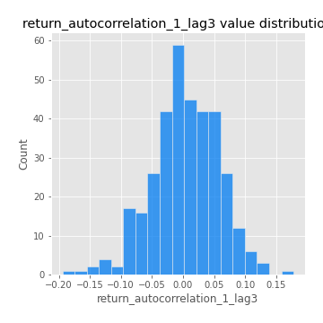

# Exploratory Data Analysis

[<< Go back](../README.md)
## Feature : target
- **Feature type** : categorical
- **Missing** : 0.0%
- **Unique** : 2
- **Count** :347
- **Unique** :2
- **Top** :simulated
- **Freq** :174

## Feature : return_mean1
- **Feature type** : continous
- **Missing** : 0.0%
- **Unique** : 347
- **Count** :347.0
- **Mean** :0.019369150546898247
- **Std** :0.10492564393541785
- **Min** :-0.3946288687449877
- **25%th Percentile** : -0.036178034032381415
- **50%th Percentile** : 0.03211671930283425
- **75%th Percentile** : 0.08341091638887793
- **Max** :0.37175100008111034

## Feature : return_mean2
- **Feature type** : continous
- **Missing** : 0.0%
- **Unique** : 347
- **Count** :347.0
- **Mean** :0.10230101674668095
- **Std** :0.10149666225766142
- **Min** :-0.24205418062825398
- **25%th Percentile** : 0.04167918596463484
- **50%th Percentile** : 0.09422985442962857
- **75%th Percentile** : 0.1721127390307014
- **Max** :0.37616608147096464

## Feature : return_sd1
- **Feature type** : continous
- **Missing** : 0.0%
- **Unique** : 347
- **Count** :347.0
- **Mean** :1.7849898814758378
- **Std** :0.7265663593029624
- **Min** :0.7470080772831957
- **25%th Percentile** : 1.5500591800276549
- **50%th Percentile** : 1.6364691995010459
- **75%th Percentile** : 1.7632653090727097
- **Max** :9.236766377527575

## Feature : return_sd2
- **Feature type** : continous
- **Missing** : 0.0%
- **Unique** : 347
- **Count** :347.0
- **Mean** :1.9077797846680333
- **Std** :0.7313972262027373
- **Min** :0.8455946193085045
- **25%th Percentile** : 1.668986492751411
- **50%th Percentile** : 1.7890340698986609
- **75%th Percentile** : 1.9176932057004237
- **Max** :6.737618636746393

## Feature : return_skew1
- **Feature type** : continous
- **Missing** : 0.0%
- **Unique** : 347
- **Count** :347.0
- **Mean** :-0.09417355887090585
- **Std** :0.6243906533330355
- **Min** :-3.530116233761814
- **25%th Percentile** : -0.2675817656326793
- **50%th Percentile** : -0.044011188389783934
- **75%th Percentile** : 0.16416248565995845
- **Max** :2.5845963767725557

## Feature : return_skew2
- **Feature type** : continous
- **Missing** : 0.0%
- **Unique** : 347
- **Count** :347.0
- **Mean** :-0.1985038061835391
- **Std** :0.8733028272018887
- **Min** :-8.801502855292393
- **25%th Percentile** : -0.3942422440568344
- **50%th Percentile** : -0.10711441252194295
- **75%th Percentile** : 0.15158752725069308
- **Max** :2.2606839051517187

## Feature : return_kurtosis1
- **Feature type** : continous
- **Missing** : 0.0%
- **Unique** : 347
- **Count** :347.0
- **Mean** :3.807563962503793
- **Std** :5.74622904283355
- **Min** :-0.3586844391874102
- **25%th Percentile** : 0.7607519492159394
- **50%th Percentile** : 1.6774089326060548
- **75%th Percentile** : 4.097489709093216
- **Max** :36.91113889081053

## Feature : return_kurtosis2
- **Feature type** : continous
- **Missing** : 0.0%
- **Unique** : 347
- **Count** :347.0
- **Mean** :5.061333413760413
- **Std** :9.925991856905771
- **Min** :-0.022353429678550807
- **25%th Percentile** : 1.1985978848910621
- **50%th Percentile** : 2.3916740204246394
- **75%th Percentile** : 5.2997733300595335
- **Max** :143.10871011533666

## Feature : return_autocorrelation_1_lag1
- **Feature type** : continous
- **Missing** : 0.0%
- **Unique** : 347
- **Count** :347.0
- **Mean** :-0.0008178821064896743
- **Std** :0.06219097840553645
- **Min** :-0.2135576224968752
- **25%th Percentile** : -0.0336873906694924
- **50%th Percentile** : 0.004724691300259304
- **75%th Percentile** : 0.03880951510999795
- **Max** :0.1378515047071255

## Feature : return_autocorrelation_1_lag2
- **Feature type** : continous
- **Missing** : 0.0%
- **Unique** : 347
- **Count** :347.0
- **Mean** :0.0007129738885956585
- **Std** :0.050018193108800076
- **Min** :-0.13309283796645122
- **25%th Percentile** : -0.03231856002655881
- **50%th Percentile** : -0.001684641566079684
- **75%th Percentile** : 0.029757663345233568
- **Max** :0.1561488228015672

## Feature : return_autocorrelation_1_lag3
- **Feature type** : continous
- **Missing** : 0.0%
- **Unique** : 347
- **Count** :347.0
- **Mean** :0.0037382374197735923
- **Std** :0.05373551722728211
- **Min** :-0.1940836867390813
- **25%th Percentile** : -0.028998016576351718
- **50%th Percentile** : 0.004706986070341413
- **75%th Percentile** : 0.04242958864701271
- **Max** :0.17805869530681923

## Feature : return_autocorrelation_2_lag1
- **Feature type** : continous
- **Missing** : 0.0%
- **Unique** : 347
- **Count** :347.0
- **Mean** :-0.008358933524383534
- **Std** :0.05893808192952552
- **Min** :-0.25075531010123286
- **25%th Percentile** : -0.03586657296833651
- **50%th Percentile** : -0.006446843573942762
- **75%th Percentile** : 0.028722443973191555
- **Max** :0.31863413537898483

## Feature : return_autocorrelation_2_lag2
- **Feature type** : continous
- **Missing** : 0.0%
- **Unique** : 347
- **Count** :347.0
- **Mean** :0.0006661995482059608
- **Std** :0.051086257037621687
- **Min** :-0.15323211089747296
- **25%th Percentile** : -0.03172595031710418
- **50%th Percentile** : -0.0011200103939454547
- **75%th Percentile** : 0.03121239749670943
- **Max** :0.20974504043791217

## Feature : return_autocorrelation_2_lag3
- **Feature type** : continous
- **Missing** : 0.0%
- **Unique** : 347
- **Count** :347.0
- **Mean** :-0.0035485284996392766
- **Std** :0.049694568858704054
- **Min** :-0.14200107169559698
- **25%th Percentile** : -0.03401677207383112
- **50%th Percentile** : -0.004537943363285668
- **75%th Percentile** : 0.03132769524981442
- **Max** :0.1419999376914021

## Feature : return_correlation_ts1_lag_0
- **Feature type** : continous
- **Missing** : 0.0%
- **Unique** : 347
- **Count** :347.0
- **Mean** :0.33864464582320547
- **Std** :0.1129989953862301
- **Min** :0.005136598099876001
- **25%th Percentile** : 0.2797012111972227
- **50%th Percentile** : 0.3443336301433116
- **75%th Percentile** : 0.3937920254080235
- **Max** :0.7041861626832071

## Feature : return_correlation_ts1_lag_1
- **Feature type** : continous
- **Missing** : 0.0%
- **Unique** : 347
- **Count** :347.0
- **Mean** :0.0010284090860981643
- **Std** :0.05166408498226339
- **Min** :-0.16985510949917193
- **25%th Percentile** : -0.02855572310935425
- **50%th Percentile** : 0.005428403526405702
- **75%th Percentile** : 0.03529518623959031
- **Max** :0.15499424718508623

## Feature : return_correlation_ts1_lag_2
- **Feature type** : continous
- **Missing** : 0.0%
- **Unique** : 347
- **Count** :347.0
- **Mean** :0.0006530425110346614
- **Std** :0.048502157819547594
- **Min** :-0.21653581047581763
- **25%th Percentile** : -0.03219441922277787
- **50%th Percentile** : -0.0007858635389180041
- **75%th Percentile** : 0.03313663069785757
- **Max** :0.10925794766608564

## Feature : return_correlation_ts1_lag_3
- **Feature type** : continous
- **Missing** : 0.0%
- **Unique** : 347
- **Count** :347.0
- **Mean** :0.0024259845538785125
- **Std** :0.05214022614315202
- **Min** :-0.1383115243863583
- **25%th Percentile** : -0.03180548958176958
- **50%th Percentile** : 0.0018677593857086832
- **75%th Percentile** : 0.03951240741745764
- **Max** :0.1636773216468148

## Feature : return_correlation_ts2_lag_1
- **Feature type** : continous
- **Missing** : 0.0%
- **Unique** : 347
- **Count** :347.0
- **Mean** :-0.002520529009073813
- **Std** :0.05362235642516292
- **Min** :-0.20093919236581337
- **25%th Percentile** : -0.03517466810568697
- **50%th Percentile** : -0.0026782976659979183
- **75%th Percentile** : 0.03236491541140653
- **Max** :0.17208763791364762

## Feature : return_correlation_ts2_lag_2
- **Feature type** : continous
- **Missing** : 0.0%
- **Unique** : 347
- **Count** :347.0
- **Mean** :0.0045143287851622076
- **Std** :0.05083047529033906
- **Min** :-0.23751835475804678
- **25%th Percentile** : -0.027646267153339656
- **50%th Percentile** : 0.0031094984293467288
- **75%th Percentile** : 0.03549912327447647
- **Max** :0.20772887392904255

## Feature : return_correlation_ts2_lag_3
- **Feature type** : continous
- **Missing** : 0.0%
- **Unique** : 347
- **Count** :347.0
- **Mean** :-0.001229782123963049
- **Std** :0.05087521280678694
- **Min** :-0.17564076057312866
- **25%th Percentile** : -0.028631167159625204
- **50%th Percentile** : -0.0011263914179240767
- **75%th Percentile** : 0.03124068089310765
- **Max** :0.15218965704320375

## Feature : sqreturn_autocorrelation_ts1_lag1
- **Feature type** : continous
- **Missing** : 0.0%
- **Unique** : 347
- **Count** :347.0
- **Mean** :0.053834187539730426
- **Std** :0.09381609834063144
- **Min** :-0.08254803840710173
- **25%th Percentile** : -0.009023675690346194
- **50%th Percentile** : 0.028232667311884372
- **75%th Percentile** : 0.08808965261429583
- **Max** :0.4439086285737898

## Feature : sqreturn_autocorrelation_ts1_lag2
- **Feature type** : continous
- **Missing** : 0.0%
- **Unique** : 347
- **Count** :347.0
- **Mean** :0.04613940964293116
- **Std** :0.09822189239685204
- **Min** :-0.10515730548061657
- **25%th Percentile** : -0.014803490863335583
- **50%th Percentile** : 0.015272211200579837
- **75%th Percentile** : 0.07091707187118314
- **Max** :0.540735851444759

## Feature : sqreturn_autocorrelation_ts1_lag3
- **Feature type** : continous
- **Missing** : 0.0%
- **Unique** : 347
- **Count** :347.0
- **Mean** :0.033251849042291
- **Std** :0.08305420969084726
- **Min** :-0.12362585356635716
- **25%th Percentile** : -0.015094025682020971
- **50%th Percentile** : 0.011833799155797515
- **75%th Percentile** : 0.05496456686710034
- **Max** :0.44755937369538146

## Feature : sqreturn_autocorrelation_ts2_lag1
- **Feature type** : continous
- **Missing** : 0.0%
- **Unique** : 347
- **Count** :347.0
- **Mean** :0.04456398352392708
- **Std** :0.08425781299936648
- **Min** :-0.1091377677014546
- **25%th Percentile** : -0.012105062172408743
- **50%th Percentile** : 0.023961665432907082
- **75%th Percentile** : 0.07417599712304764
- **Max** :0.4190090519891419

## Feature : sqreturn_autocorrelation_ts2_lag2
- **Feature type** : continous
- **Missing** : 0.0%
- **Unique** : 347
- **Count** :347.0
- **Mean** :0.039251678707165484
- **Std** :0.09055928577581084
- **Min** :-0.07628257299677765
- **25%th Percentile** : -0.013321727682494294
- **50%th Percentile** : 0.01100466491058592
- **75%th Percentile** : 0.052949678246137874
- **Max** :0.5373432415582473

## Feature : sqreturn_autocorrelation_ts2_lag3
- **Feature type** : continous
- **Missing** : 0.0%
- **Unique** : 347
- **Count** :347.0
- **Mean** :0.02924674965335769
- **Std** :0.0696041725226701
- **Min** :-0.06752791554988691
- **25%th Percentile** : -0.016426018081023414
- **50%th Percentile** : 0.010968068262527164
- **75%th Percentile** : 0.04624432960949204
- **Max** :0.31225727797735664

## Feature : sqreturn_correlation_ts1_lag_0
- **Feature type** : continous
- **Missing** : 0.0%
- **Unique** : 347
- **Count** :347.0
- **Mean** :0.33864464582320547
- **Std** :0.1129989953862301
- **Min** :0.005136598099876001
- **25%th Percentile** : 0.2797012111972227
- **50%th Percentile** : 0.3443336301433116
- **75%th Percentile** : 0.3937920254080235
- **Max** :0.7041861626832071

## Feature : sqreturn_correlation_ts1_lag_1
- **Feature type** : continous
- **Missing** : 0.0%
- **Unique** : 347
- **Count** :347.0
- **Mean** :0.0010284090860981643
- **Std** :0.05166408498226339
- **Min** :-0.16985510949917193
- **25%th Percentile** : -0.02855572310935425
- **50%th Percentile** : 0.005428403526405702
- **75%th Percentile** : 0.03529518623959031
- **Max** :0.15499424718508623

## Feature : sqreturn_correlation_ts1_lag_2
- **Feature type** : continous
- **Missing** : 0.0%
- **Unique** : 347
- **Count** :347.0
- **Mean** :0.0006530425110346614
- **Std** :0.048502157819547594
- **Min** :-0.21653581047581763
- **25%th Percentile** : -0.03219441922277787
- **50%th Percentile** : -0.0007858635389180041
- **75%th Percentile** : 0.03313663069785757
- **Max** :0.10925794766608564

## Feature : sqreturn_correlation_ts1_lag_3
- **Feature type** : continous
- **Missing** : 0.0%
- **Unique** : 347
- **Count** :347.0
- **Mean** :0.0024259845538785125
- **Std** :0.05214022614315202
- **Min** :-0.1383115243863583
- **25%th Percentile** : -0.03180548958176958
- **50%th Percentile** : 0.0018677593857086832
- **75%th Percentile** : 0.03951240741745764
- **Max** :0.1636773216468148

## Feature : sqreturn_correlation_ts2_lag_1
- **Feature type** : continous
- **Missing** : 0.0%
- **Unique** : 347
- **Count** :347.0
- **Mean** :-0.002520529009073813
- **Std** :0.05362235642516292
- **Min** :-0.20093919236581337
- **25%th Percentile** : -0.03517466810568697
- **50%th Percentile** : -0.0026782976659979183
- **75%th Percentile** : 0.03236491541140653
- **Max** :0.17208763791364762

## Feature : sqreturn_correlation_ts2_lag_2
- **Feature type** : continous
- **Missing** : 0.0%
- **Unique** : 347
- **Count** :347.0
- **Mean** :0.0045143287851622076
- **Std** :0.05083047529033906
- **Min** :-0.23751835475804678
- **25%th Percentile** : -0.027646267153339656
- **50%th Percentile** : 0.0031094984293467288
- **75%th Percentile** : 0.03549912327447647
- **Max** :0.20772887392904255

## Feature : sqreturn_correlation_ts2_lag_3
- **Feature type** : continous
- **Missing** : 0.0%
- **Unique** : 347
- **Count** :347.0
- **Mean** :-0.001229782123963049
- **Std** :0.05087521280678694
- **Min** :-0.17564076057312866
- **25%th Percentile** : -0.028631167159625204
- **50%th Percentile** : -0.0011263914179240767
- **75%th Percentile** : 0.03124068089310765
- **Max** :0.15218965704320375

## Feature : price2_granger_cause_price1
- **Feature type** : continous
- **Missing** : 0.0%
- **Unique** : 347
- **Count** :347.0
- **Mean** :0.281726467645466
- **Std** :0.29904830291514783
- **Min** :2.0146474119196675e-07
- **25%th Percentile** : 0.011010732122182627
- **50%th Percentile** : 0.1530198036041635
- **75%th Percentile** : 0.4927488742163512
- **Max** :0.9925512323767748

## Feature : price1_granger_cause_price2
- **Feature type** : continous
- **Missing** : 0.0%
- **Unique** : 347
- **Count** :347.0
- **Mean** :0.32072449778882867
- **Std** :0.27958500420580085
- **Min** :1.573773355653904e-06
- **25%th Percentile** : 0.0649642366387658
- **50%th Percentile** : 0.25911355233688016
- **75%th Percentile** : 0.5116697938066106
- **Max** :0.9954169539693377

[<< Go back](../README.md)
