# Summary of 2_DecisionTree

[<< Go back](../README.md)

## Decision Tree
- **n_jobs**: -1
- **criterion**: gini
- **max_depth**: 3
- **explain_level**: 2

## Validation
 - **validation_type**: split
 - **train_ratio**: 0.75
 - **shuffle**: True
 - **stratify**: True

## Optimized metric
accuracy

## Training time

16.3 seconds

## Metric details
|           |    score |   threshold |
|:----------|---------:|------------:|
| logloss   | 0.354802 |  nan        |
| auc       | 0.92574  |  nan        |
| f1        | 0.891304 |    0.501117 |
| accuracy  | 0.885057 |    0.501117 |
| precision | 0.836735 |    0.501117 |
| recall    | 1        |    0        |
| mcc       | 0.777862 |    0.501117 |

## Confusion matrix (at threshold=0.501117)
|                      |   Predicted as real |   Predicted as simulated |
|:---------------------|--------------------:|-------------------------:|
| Labeled as real      |                  36 |                        8 |
| Labeled as simulated |                   2 |                       41 |

## Learning curves
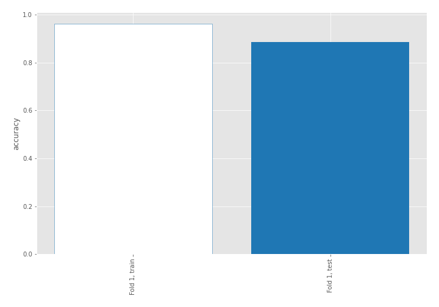

## Decision Tree 

### Tree #1
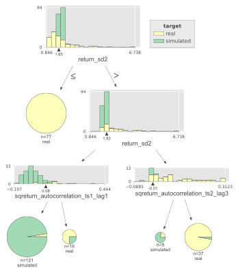

### Rules

if (return_sd2 > 1.652) and (return_sd2 <= 1.924) and (sqreturn_autocorrelation_ts1_lag1 <= 0.085) then class: simulated (proba: 97.52%) | based on 121 samples

if (return_sd2 <= 1.652) then class: real (proba: 100.0%) | based on 77 samples

if (return_sd2 > 1.652) and (return_sd2 > 1.924) and (sqreturn_autocorrelation_ts2_lag3 > -0.008) then class: real (proba: 97.3%) | based on 37 samples

if (return_sd2 > 1.652) and (return_sd2 <= 1.924) and (sqreturn_autocorrelation_ts1_lag1 > 0.085) then class: real (proba: 75.0%) | based on 16 samples

if (return_sd2 > 1.652) and (return_sd2 > 1.924) and (sqreturn_autocorrelation_ts2_lag3 <= -0.008) then class: simulated (proba: 77.78%) | based on 9 samples

## Permutation-based Importance
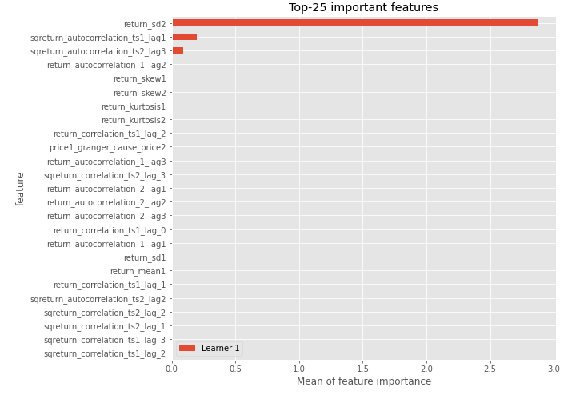
## Confusion Matrix

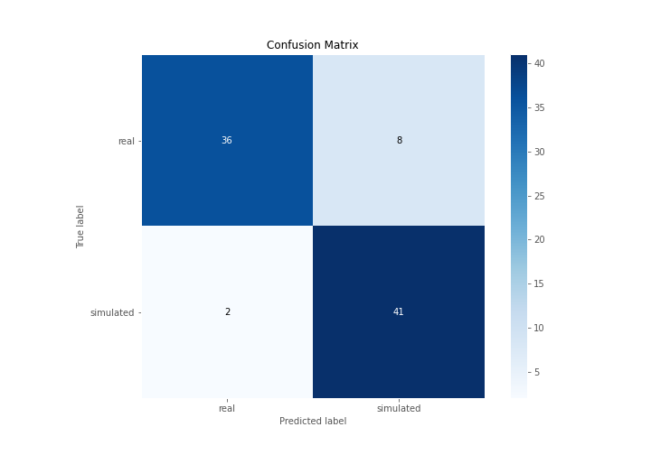

## Normalized Confusion Matrix

## ROC Curve

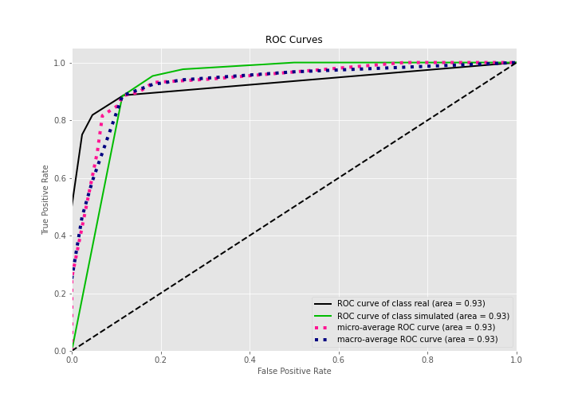

## Kolmogorov-Smirnov Statistic

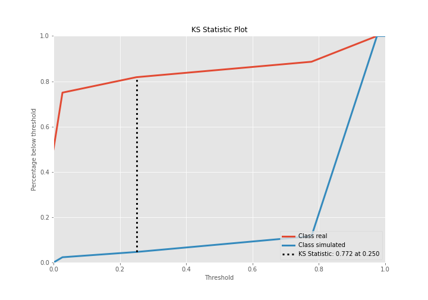

## Precision-Recall Curve

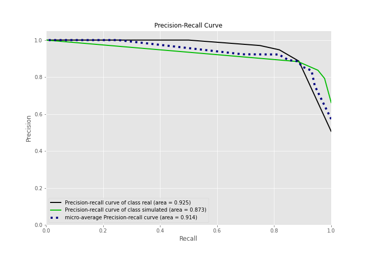

## Calibration Curve

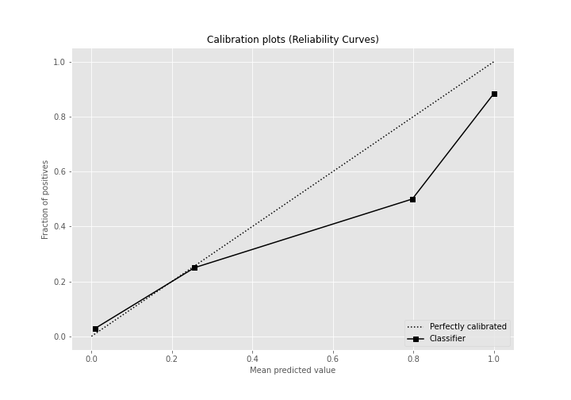

## Cumulative Gains Curve

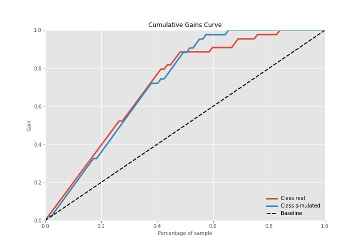

## Lift Curve

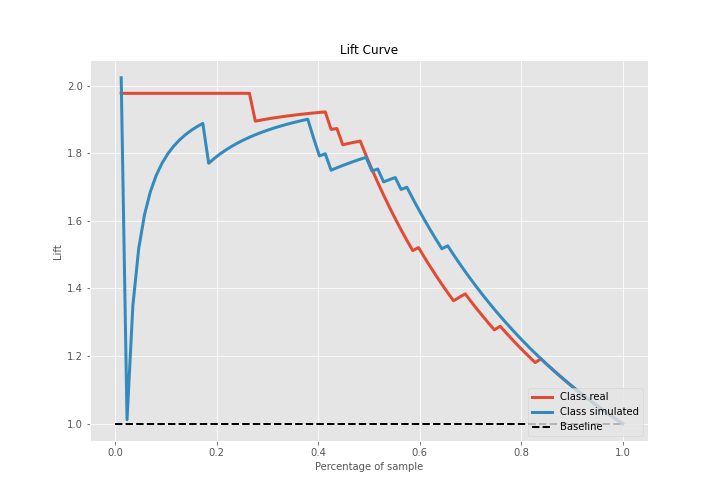

## SHAP Importance
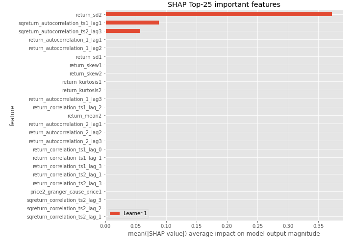

## SHAP Dependence plots

### Dependence (Fold 1)
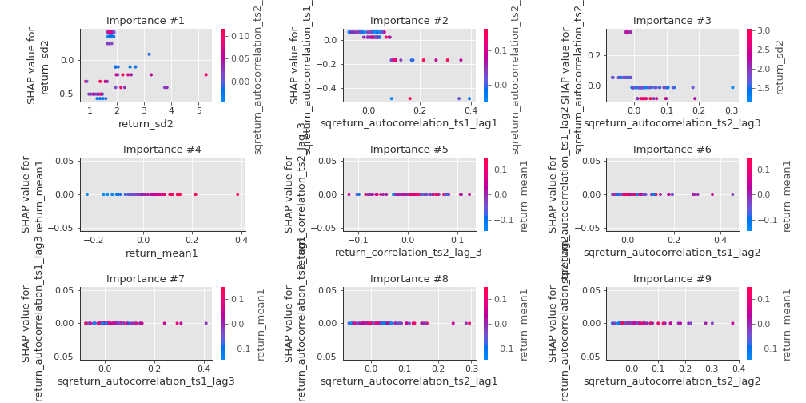

## SHAP Decision plots

### Top-10 Worst decisions for class 0 (Fold 1)
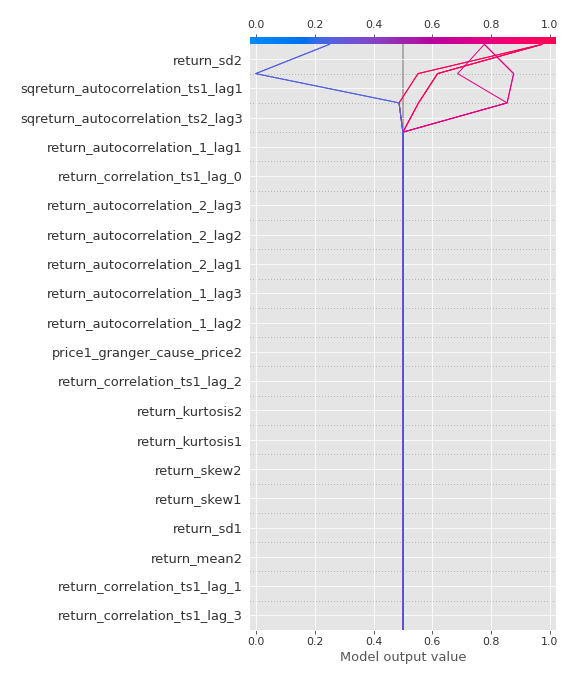
### Top-10 Best decisions for class 0 (Fold 1)
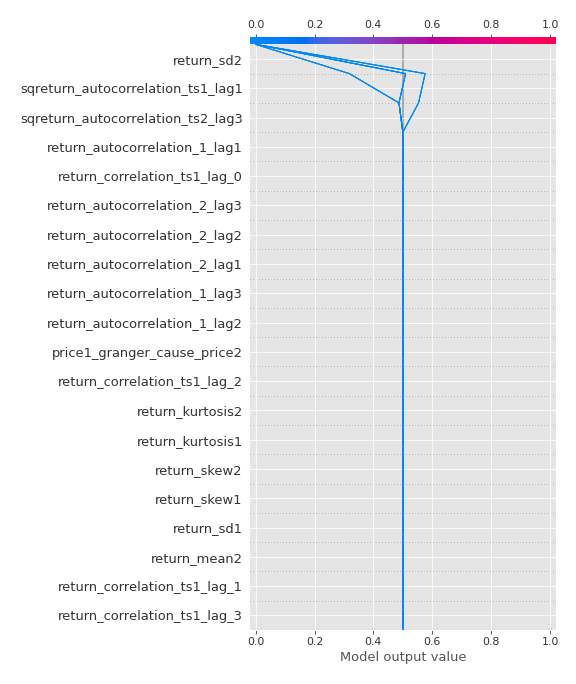
### Top-10 Worst decisions for class 1 (Fold 1)

### Top-10 Best decisions for class 1 (Fold 1)
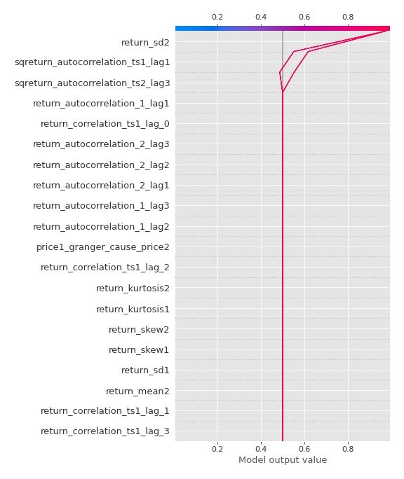

[<< Go back](../README.md)
