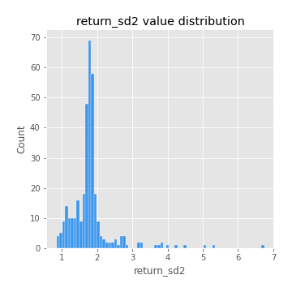

# Exploratory Data Analysis

[<< Go back](../README.md)
## Feature : target
- **Feature type** : categorical
- **Missing** : 0.0%
- **Unique** : 2
- **Count** :347
- **Unique** :2
- **Top** :real
- **Freq** :174

## Feature : return_mean1
- **Feature type** : continous
- **Missing** : 0.0%
- **Unique** : 347
- **Count** :347.0
- **Mean** :0.018216851472056123
- **Std** :0.10449118459999077
- **Min** :-0.31753547759138917
- **25%th Percentile** : -0.04130203061155502
- **50%th Percentile** : 0.021012640722570367
- **75%th Percentile** : 0.08746533110420385
- **Max** :0.38422054719005083

## Feature : return_mean2
- **Feature type** : continous
- **Missing** : 0.0%
- **Unique** : 347
- **Count** :347.0
- **Mean** :0.09781812472160135
- **Std** :0.09259996077070745
- **Min** :-0.2144814672643959
- **25%th Percentile** : 0.043093791324302605
- **50%th Percentile** : 0.09434191780146914
- **75%th Percentile** : 0.16034202953248394
- **Max** :0.37616608147096464

## Feature : return_sd1
- **Feature type** : continous
- **Missing** : 0.0%
- **Unique** : 347
- **Count** :347.0
- **Mean** :1.773888992080289
- **Std** :0.7458939700421173
- **Min** :0.7470080772831957
- **25%th Percentile** : 1.5479065314408027
- **50%th Percentile** : 1.6383049696423104
- **75%th Percentile** : 1.7474200205782782
- **Max** :9.236766377527575

## Feature : return_sd2
- **Feature type** : continous
- **Missing** : 0.0%
- **Unique** : 347
- **Count** :347.0
- **Mean** :1.8093537172865224
- **Std** :0.6171207720848032
- **Min** :0.8455946193085045
- **25%th Percentile** : 1.5831731667512812
- **50%th Percentile** : 1.7663004660728803
- **75%th Percentile** : 1.8724901272168966
- **Max** :6.737618636746393

## Feature : return_skew1
- **Feature type** : continous
- **Missing** : 0.0%
- **Unique** : 347
- **Count** :347.0
- **Mean** :-0.11184580681164356
- **Std** :0.6230504372275629
- **Min** :-3.530116233761814
- **25%th Percentile** : -0.2860543138638223
- **50%th Percentile** : -0.05627074404731192
- **75%th Percentile** : 0.14643199027840428
- **Max** :2.5845963767725557

## Feature : return_skew2
- **Feature type** : continous
- **Missing** : 0.0%
- **Unique** : 347
- **Count** :347.0
- **Mean** :-0.176589685599147
- **Std** :0.8009960154050473
- **Min** :-8.801502855292393
- **25%th Percentile** : -0.4170360599547527
- **50%th Percentile** : -0.07826754350192505
- **75%th Percentile** : 0.14097913992699396
- **Max** :2.2606839051517187

## Feature : return_kurtosis1
- **Feature type** : continous
- **Missing** : 0.0%
- **Unique** : 347
- **Count** :347.0
- **Mean** :3.921674641395264
- **Std** :6.075380654831773
- **Min** :-0.36508648404428357
- **25%th Percentile** : 0.736848010140108
- **50%th Percentile** : 1.6996746957219258
- **75%th Percentile** : 4.009156393045629
- **Max** :36.91113889081053

## Feature : return_kurtosis2
- **Feature type** : continous
- **Missing** : 0.0%
- **Unique** : 347
- **Count** :347.0
- **Mean** :4.7617259902800635
- **Std** :9.261774319493467
- **Min** :-0.12498655352941812
- **25%th Percentile** : 1.1468021297241124
- **50%th Percentile** : 2.4874271003406005
- **75%th Percentile** : 5.030909651160541
- **Max** :143.10871011533666

## Feature : return_autocorrelation_1_lag1
- **Feature type** : continous
- **Missing** : 0.0%
- **Unique** : 347
- **Count** :347.0
- **Mean** :-0.008780328062041752
- **Std** :0.06064700955329883
- **Min** :-0.20673896439036124
- **25%th Percentile** : -0.04446094365574745
- **50%th Percentile** : -0.0003986500096667489
- **75%th Percentile** : 0.029981712914539972
- **Max** :0.13653129251882767

## Feature : return_autocorrelation_1_lag2
- **Feature type** : continous
- **Missing** : 0.0%
- **Unique** : 347
- **Count** :347.0
- **Mean** :0.004672656318396008
- **Std** :0.052071766063237004
- **Min** :-0.12172858720259
- **25%th Percentile** : -0.02679870063271341
- **50%th Percentile** : 0.002611546346450535
- **75%th Percentile** : 0.03828421331939525
- **Max** :0.1561488228015672

## Feature : return_autocorrelation_1_lag3
- **Feature type** : continous
- **Missing** : 0.0%
- **Unique** : 347
- **Count** :347.0
- **Mean** :0.005121419874852638
- **Std** :0.0535444080834616
- **Min** :-0.1940836867390813
- **25%th Percentile** : -0.028824441569613786
- **50%th Percentile** : 0.005253971981397842
- **75%th Percentile** : 0.0416333238649962
- **Max** :0.17805869530681923

## Feature : return_autocorrelation_2_lag1
- **Feature type** : continous
- **Missing** : 0.0%
- **Unique** : 347
- **Count** :347.0
- **Mean** :-0.012349440525776524
- **Std** :0.05685554854837369
- **Min** :-0.25075531010123286
- **25%th Percentile** : -0.04490954468793276
- **50%th Percentile** : -0.008741801533389595
- **75%th Percentile** : 0.0253407439738893
- **Max** :0.11691198349502589

## Feature : return_autocorrelation_2_lag2
- **Feature type** : continous
- **Missing** : 0.0%
- **Unique** : 347
- **Count** :347.0
- **Mean** :0.001105591517457181
- **Std** :0.049921180690260226
- **Min** :-0.1495113937562178
- **25%th Percentile** : -0.031764547724697896
- **50%th Percentile** : -0.0019786601520114383
- **75%th Percentile** : 0.03379684066327783
- **Max** :0.1735398560230086

## Feature : return_autocorrelation_2_lag3
- **Feature type** : continous
- **Missing** : 0.0%
- **Unique** : 347
- **Count** :347.0
- **Mean** :-0.001695027569984046
- **Std** :0.051343957466959377
- **Min** :-0.14200107169559698
- **25%th Percentile** : -0.035020534036188565
- **50%th Percentile** : -0.00020772289058575038
- **75%th Percentile** : 0.03333144017706362
- **Max** :0.12489629575199976

## Feature : return_correlation_ts1_lag_0
- **Feature type** : continous
- **Missing** : 0.0%
- **Unique** : 347
- **Count** :347.0
- **Mean** :0.33443166026324944
- **Std** :0.11337964255028457
- **Min** :-0.027089510445801036
- **25%th Percentile** : 0.2737421543590628
- **50%th Percentile** : 0.3431941168702048
- **75%th Percentile** : 0.3943496283909751
- **Max** :0.7028422087350163

## Feature : return_correlation_ts1_lag_1
- **Feature type** : continous
- **Missing** : 0.0%
- **Unique** : 347
- **Count** :347.0
- **Mean** :-0.00203116025533685
- **Std** :0.05261817162354588
- **Min** :-0.1549695474991776
- **25%th Percentile** : -0.03614498562810432
- **50%th Percentile** : 0.0013958571343517011
- **75%th Percentile** : 0.03446294207687968
- **Max** :0.15499424718508623

## Feature : return_correlation_ts1_lag_2
- **Feature type** : continous
- **Missing** : 0.0%
- **Unique** : 347
- **Count** :347.0
- **Mean** :0.003319556019901096
- **Std** :0.046539770756175484
- **Min** :-0.13012331963446322
- **25%th Percentile** : -0.029535039575204196
- **50%th Percentile** : 0.005271960203138391
- **75%th Percentile** : 0.03589232527370695
- **Max** :0.13785333082276166

## Feature : return_correlation_ts1_lag_3
- **Feature type** : continous
- **Missing** : 0.0%
- **Unique** : 347
- **Count** :347.0
- **Mean** :0.0006903124069514403
- **Std** :0.05245959226310151
- **Min** :-0.1270218498974763
- **25%th Percentile** : -0.03710295725668461
- **50%th Percentile** : 0.0028582243659688207
- **75%th Percentile** : 0.03424976317834374
- **Max** :0.1636773216468148

## Feature : return_correlation_ts2_lag_1
- **Feature type** : continous
- **Missing** : 0.0%
- **Unique** : 347
- **Count** :347.0
- **Mean** :-0.005568410223910677
- **Std** :0.051993996998547856
- **Min** :-0.2081139431093261
- **25%th Percentile** : -0.03520618617355841
- **50%th Percentile** : -0.0050514227174079055
- **75%th Percentile** : 0.030290742166796232
- **Max** :0.11556235671885211

## Feature : return_correlation_ts2_lag_2
- **Feature type** : continous
- **Missing** : 0.0%
- **Unique** : 347
- **Count** :347.0
- **Mean** :0.005065501909086004
- **Std** :0.051324619719558165
- **Min** :-0.23751835475804678
- **25%th Percentile** : -0.02838251314768249
- **50%th Percentile** : 0.0030720153553475947
- **75%th Percentile** : 0.03745063246864834
- **Max** :0.20772887392904255

## Feature : return_correlation_ts2_lag_3
- **Feature type** : continous
- **Missing** : 0.0%
- **Unique** : 347
- **Count** :347.0
- **Mean** :0.004821456633832784
- **Std** :0.05316114256085435
- **Min** :-0.17564076057312866
- **25%th Percentile** : -0.022618971645265405
- **50%th Percentile** : 0.00759359341233956
- **75%th Percentile** : 0.041557003151800845
- **Max** :0.1570082034866012

## Feature : sqreturn_autocorrelation_ts1_lag1
- **Feature type** : continous
- **Missing** : 0.0%
- **Unique** : 347
- **Count** :347.0
- **Mean** :0.04638695311333385
- **Std** :0.08726558663228637
- **Min** :-0.10709253301216197
- **25%th Percentile** : -0.008906781091958428
- **50%th Percentile** : 0.027143272239297796
- **75%th Percentile** : 0.08275441791374133
- **Max** :0.4439086285737898

## Feature : sqreturn_autocorrelation_ts1_lag2
- **Feature type** : continous
- **Missing** : 0.0%
- **Unique** : 347
- **Count** :347.0
- **Mean** :0.04032906753569389
- **Std** :0.08890259500537293
- **Min** :-0.0940782323604201
- **25%th Percentile** : -0.014518521428684754
- **50%th Percentile** : 0.01626135840334948
- **75%th Percentile** : 0.06431612019185468
- **Max** :0.4522162366773919

## Feature : sqreturn_autocorrelation_ts1_lag3
- **Feature type** : continous
- **Missing** : 0.0%
- **Unique** : 347
- **Count** :347.0
- **Mean** :0.03391259977846285
- **Std** :0.07916186171269507
- **Min** :-0.09028600525525247
- **25%th Percentile** : -0.01468494318049995
- **50%th Percentile** : 0.01002880039810122
- **75%th Percentile** : 0.0635173315272512
- **Max** :0.41030914918857014

## Feature : sqreturn_autocorrelation_ts2_lag1
- **Feature type** : continous
- **Missing** : 0.0%
- **Unique** : 347
- **Count** :347.0
- **Mean** :0.04518012112859382
- **Std** :0.08762454243496089
- **Min** :-0.09378164442612502
- **25%th Percentile** : -0.010727106703452182
- **50%th Percentile** : 0.020600434587657243
- **75%th Percentile** : 0.07388155160495859
- **Max** :0.510085647437958

## Feature : sqreturn_autocorrelation_ts2_lag2
- **Feature type** : continous
- **Missing** : 0.0%
- **Unique** : 347
- **Count** :347.0
- **Mean** :0.03843486441124177
- **Std** :0.08886382628001145
- **Min** :-0.09474012532590141
- **25%th Percentile** : -0.01220271540775833
- **50%th Percentile** : 0.01162085636483385
- **75%th Percentile** : 0.05381406154916067
- **Max** :0.45676817892778204

## Feature : sqreturn_autocorrelation_ts2_lag3
- **Feature type** : continous
- **Missing** : 0.0%
- **Unique** : 347
- **Count** :347.0
- **Mean** :0.029117459376791485
- **Std** :0.06915697533151156
- **Min** :-0.08846722365022158
- **25%th Percentile** : -0.013779248324066833
- **50%th Percentile** : 0.01099820015147977
- **75%th Percentile** : 0.05697062203950617
- **Max** :0.31225727797735664

## Feature : sqreturn_correlation_ts1_lag_0
- **Feature type** : continous
- **Missing** : 0.0%
- **Unique** : 347
- **Count** :347.0
- **Mean** :0.33443166026324944
- **Std** :0.11337964255028457
- **Min** :-0.027089510445801036
- **25%th Percentile** : 0.2737421543590628
- **50%th Percentile** : 0.3431941168702048
- **75%th Percentile** : 0.3943496283909751
- **Max** :0.7028422087350163

## Feature : sqreturn_correlation_ts1_lag_1
- **Feature type** : continous
- **Missing** : 0.0%
- **Unique** : 347
- **Count** :347.0
- **Mean** :-0.00203116025533685
- **Std** :0.05261817162354588
- **Min** :-0.1549695474991776
- **25%th Percentile** : -0.03614498562810432
- **50%th Percentile** : 0.0013958571343517011
- **75%th Percentile** : 0.03446294207687968
- **Max** :0.15499424718508623

## Feature : sqreturn_correlation_ts1_lag_2
- **Feature type** : continous
- **Missing** : 0.0%
- **Unique** : 347
- **Count** :347.0
- **Mean** :0.003319556019901096
- **Std** :0.046539770756175484
- **Min** :-0.13012331963446322
- **25%th Percentile** : -0.029535039575204196
- **50%th Percentile** : 0.005271960203138391
- **75%th Percentile** : 0.03589232527370695
- **Max** :0.13785333082276166

## Feature : sqreturn_correlation_ts1_lag_3
- **Feature type** : continous
- **Missing** : 0.0%
- **Unique** : 347
- **Count** :347.0
- **Mean** :0.0006903124069514403
- **Std** :0.05245959226310151
- **Min** :-0.1270218498974763
- **25%th Percentile** : -0.03710295725668461
- **50%th Percentile** : 0.0028582243659688207
- **75%th Percentile** : 0.03424976317834374
- **Max** :0.1636773216468148

## Feature : sqreturn_correlation_ts2_lag_1
- **Feature type** : continous
- **Missing** : 0.0%
- **Unique** : 347
- **Count** :347.0
- **Mean** :-0.005568410223910677
- **Std** :0.051993996998547856
- **Min** :-0.2081139431093261
- **25%th Percentile** : -0.03520618617355841
- **50%th Percentile** : -0.0050514227174079055
- **75%th Percentile** : 0.030290742166796232
- **Max** :0.11556235671885211

## Feature : sqreturn_correlation_ts2_lag_2
- **Feature type** : continous
- **Missing** : 0.0%
- **Unique** : 347
- **Count** :347.0
- **Mean** :0.005065501909086004
- **Std** :0.051324619719558165
- **Min** :-0.23751835475804678
- **25%th Percentile** : -0.02838251314768249
- **50%th Percentile** : 0.0030720153553475947
- **75%th Percentile** : 0.03745063246864834
- **Max** :0.20772887392904255

## Feature : sqreturn_correlation_ts2_lag_3
- **Feature type** : continous
- **Missing** : 0.0%
- **Unique** : 347
- **Count** :347.0
- **Mean** :0.004821456633832784
- **Std** :0.05316114256085435
- **Min** :-0.17564076057312866
- **25%th Percentile** : -0.022618971645265405
- **50%th Percentile** : 0.00759359341233956
- **75%th Percentile** : 0.041557003151800845
- **Max** :0.1570082034866012

## Feature : price2_granger_cause_price1
- **Feature type** : continous
- **Missing** : 0.0%
- **Unique** : 347
- **Count** :347.0
- **Mean** :0.2629808615772055
- **Std** :0.2880670590470235
- **Min** :8.156744762297053e-11
- **25%th Percentile** : 0.012350554811842798
- **50%th Percentile** : 0.14240997465561187
- **75%th Percentile** : 0.45121884231054216
- **Max** :0.9993351300779112

## Feature : price1_granger_cause_price2
- **Feature type** : continous
- **Missing** : 0.0%
- **Unique** : 347
- **Count** :347.0
- **Mean** :0.3230657659767971
- **Std** :0.28556336409575905
- **Min** :6.229481013319811e-05
- **25%th Percentile** : 0.06543399461595681
- **50%th Percentile** : 0.24048241416760002
- **75%th Percentile** : 0.5629354409828039
- **Max** :0.9677499172353743

[<< Go back](../README.md)
