# Summary of 2_DecisionTree

[<< Go back](../README.md)

## Decision Tree
- **n_jobs**: -1
- **criterion**: gini
- **max_depth**: 3
- **explain_level**: 2

## Validation
 - **validation_type**: split
 - **train_ratio**: 0.75
 - **shuffle**: True
 - **stratify**: True

## Optimized metric
accuracy

## Training time

17.8 seconds

## Metric details
|           |    score |   threshold |
|:----------|---------:|------------:|
| logloss   | 0.221665 |  nan        |
| auc       | 0.94556  |  nan        |
| f1        | 0.942529 |    0.478927 |
| accuracy  | 0.942529 |    0.478927 |
| precision | 1        |    0.96875  |
| recall    | 1        |    0        |
| mcc       | 0.885307 |    0.478927 |

## Confusion matrix (at threshold=0.478927)
|                      |   Predicted as real |   Predicted as simulated |
|:---------------------|--------------------:|-------------------------:|
| Labeled as real      |                  41 |                        2 |
| Labeled as simulated |                   3 |                       41 |

## Learning curves
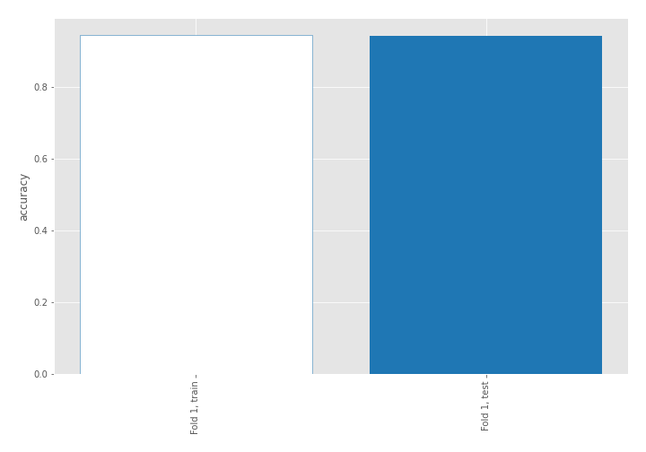

## Decision Tree 

### Tree #1
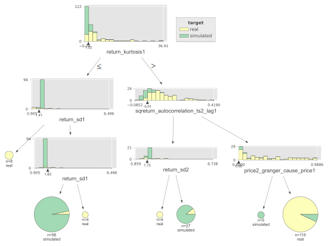

### Rules

if (return_kurtosis1 > 1.52) and (sqreturn_autocorrelation_ts2_lag1 > -0.005) and (price2_granger_cause_price1 > 0.001) then class: real (proba: 93.1%) | based on 116 samples

if (return_kurtosis1 <= 1.52) and (return_sd1 > 1.41) and (return_sd1 <= 1.829) then class: simulated (proba: 96.88%) | based on 96 samples

if (return_kurtosis1 > 1.52) and (sqreturn_autocorrelation_ts2_lag1 <= -0.005) and (return_sd2 > 1.732) then class: simulated (proba: 88.89%) | based on 27 samples

if (return_kurtosis1 <= 1.52) and (return_sd1 <= 1.41) then class: real (proba: 100.0%) | based on 8 samples

if (return_kurtosis1 > 1.52) and (sqreturn_autocorrelation_ts2_lag1 > -0.005) and (price2_granger_cause_price1 <= 0.001) then class: simulated (proba: 100.0%) | based on 5 samples

if (return_kurtosis1 > 1.52) and (sqreturn_autocorrelation_ts2_lag1 <= -0.005) and (return_sd2 <= 1.732) then class: real (proba: 100.0%) | based on 4 samples

if (return_kurtosis1 <= 1.52) and (return_sd1 > 1.41) and (return_sd1 > 1.829) then class: real (proba: 100.0%) | based on 4 samples

## Permutation-based Importance
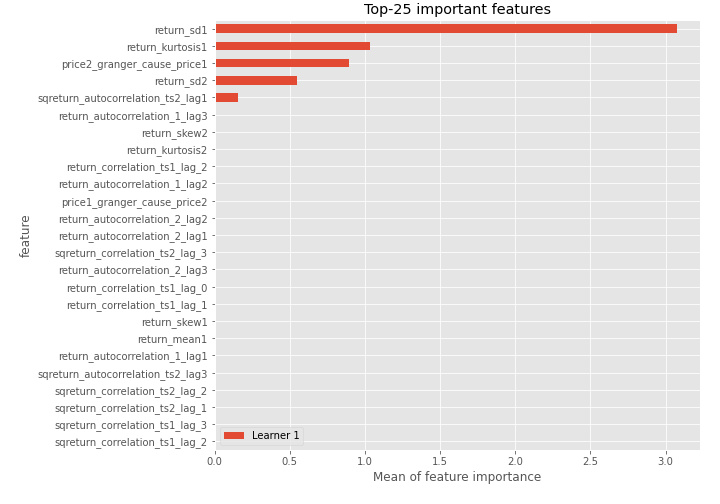
## Confusion Matrix

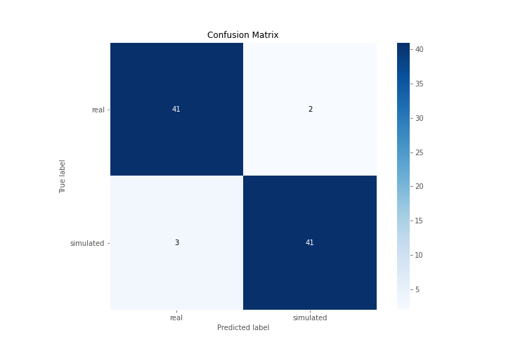

## Normalized Confusion Matrix

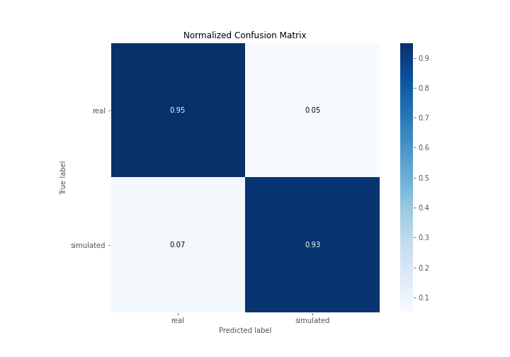

## ROC Curve

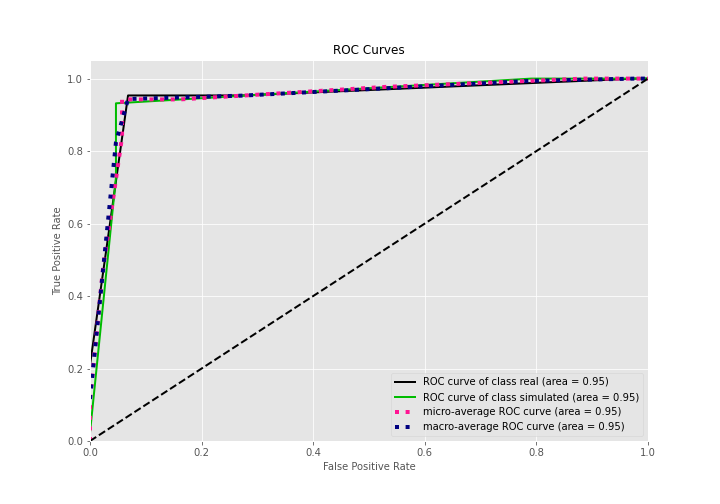

## Kolmogorov-Smirnov Statistic

## Precision-Recall Curve

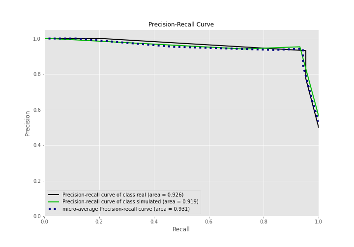

## Calibration Curve

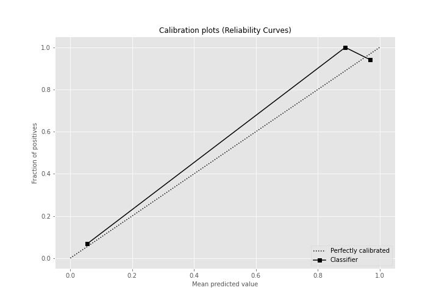

## Cumulative Gains Curve

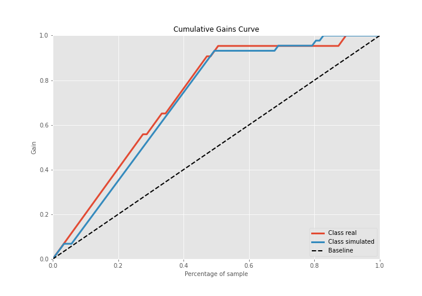

## Lift Curve

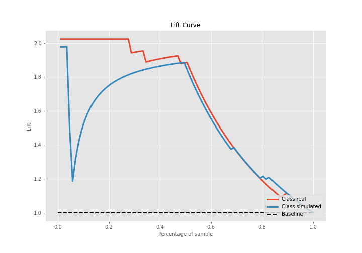

## SHAP Importance

## SHAP Dependence plots

### Dependence (Fold 1)
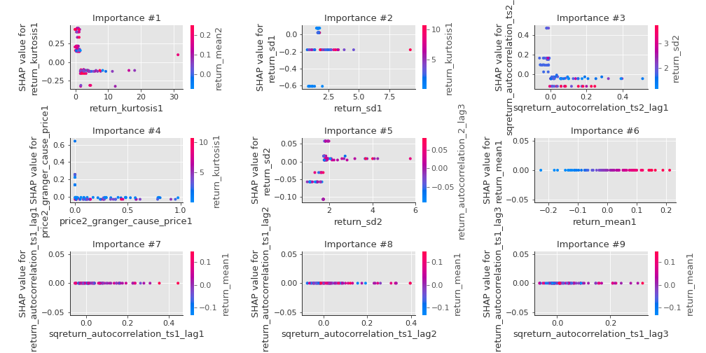

## SHAP Decision plots

### Top-10 Worst decisions for class 0 (Fold 1)
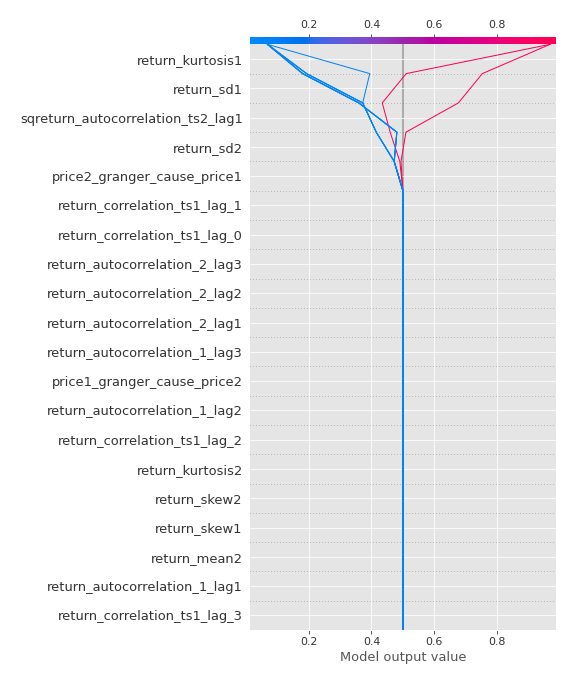
### Top-10 Best decisions for class 0 (Fold 1)
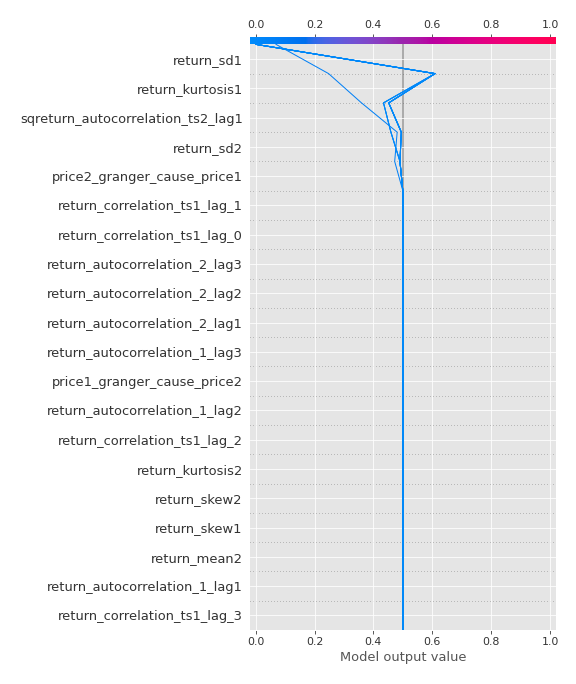
### Top-10 Worst decisions for class 1 (Fold 1)
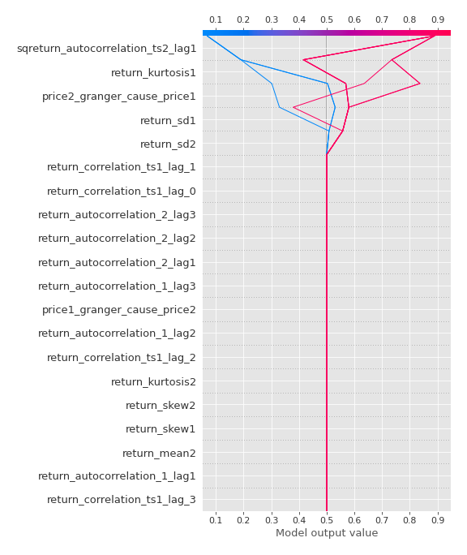
### Top-10 Best decisions for class 1 (Fold 1)

[<< Go back](../README.md)
