# Summary of 3_Linear

[<< Go back](../README.md)

## Logistic Regression (Linear)
- **n_jobs**: -1
- **explain_level**: 2

## Validation
 - **validation_type**: split
 - **train_ratio**: 0.75
 - **shuffle**: True
 - **stratify**: True

## Optimized metric
accuracy

## Training time

16.6 seconds

## Metric details
|           |    score |    threshold |
|:----------|---------:|-------------:|
| logloss   | 0.325714 | nan          |
| auc       | 0.957717 | nan          |
| f1        | 0.954545 |   0.547665   |
| accuracy  | 0.954023 |   0.547665   |
| precision | 1        |   0.902751   |
| recall    | 1        |   0.00468294 |
| mcc       | 0.908034 |   0.547665   |

## Confusion matrix (at threshold=0.547665)
|                      |   Predicted as real |   Predicted as simulated |
|:---------------------|--------------------:|-------------------------:|
| Labeled as real      |                  41 |                        2 |
| Labeled as simulated |                   2 |                       42 |

## Learning curves
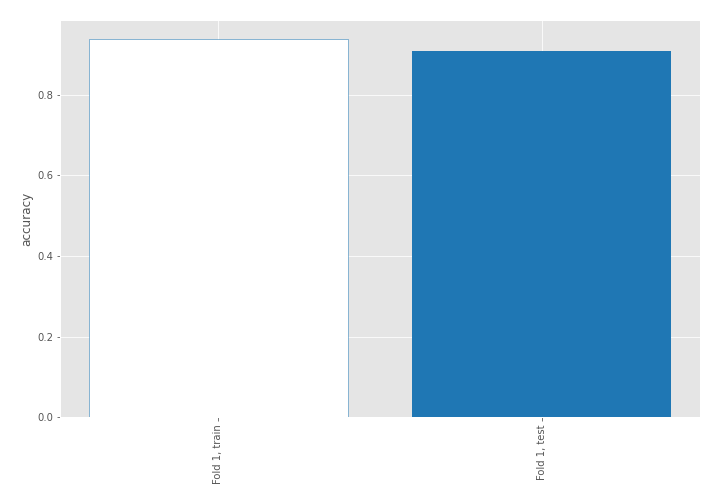

## Coefficients
| feature                           |   Learner_1 |
|:----------------------------------|------------:|
| return_mean2                      |   1.76438   |
| return_correlation_ts1_lag_0      |   1.32655   |
| sqreturn_correlation_ts1_lag_0    |   1.32655   |
| return_autocorrelation_1_lag2     |   0.835813  |
| return_autocorrelation_1_lag1     |   0.758224  |
| return_autocorrelation_1_lag3     |   0.694024  |
| sqreturn_correlation_ts1_lag_1    |   0.571431  |
| return_correlation_ts1_lag_1      |   0.571431  |
| return_autocorrelation_2_lag3     |   0.544813  |
| sqreturn_correlation_ts1_lag_2    |   0.523612  |
| return_correlation_ts1_lag_2      |   0.523612  |
| sqreturn_correlation_ts2_lag_1    |   0.513969  |
| return_correlation_ts2_lag_1      |   0.513969  |
| sqreturn_correlation_ts1_lag_3    |   0.435668  |
| return_correlation_ts1_lag_3      |   0.435668  |
| return_autocorrelation_2_lag1     |   0.4083    |
| sqreturn_correlation_ts2_lag_3    |   0.399377  |
| return_correlation_ts2_lag_3      |   0.399377  |
| return_skew2                      |   0.327845  |
| return_skew1                      |   0.258023  |
| return_autocorrelation_2_lag2     |   0.216212  |
| sqreturn_correlation_ts2_lag_2    |   0.174505  |
| return_correlation_ts2_lag_2      |   0.174505  |
| return_sd2                        |  -0.0064258 |
| return_kurtosis2                  |  -0.0828075 |
| return_sd1                        |  -0.123887  |
| intercept                         |  -0.126892  |
| sqreturn_autocorrelation_ts2_lag3 |  -0.802907  |
| price1_granger_cause_price2       |  -0.999429  |
| return_kurtosis1                  |  -1.29803   |
| price2_granger_cause_price1       |  -1.396     |
| sqreturn_autocorrelation_ts2_lag2 |  -1.48787   |
| sqreturn_autocorrelation_ts1_lag3 |  -1.5795    |
| sqreturn_autocorrelation_ts2_lag1 |  -2.10929   |
| sqreturn_autocorrelation_ts1_lag2 |  -2.11916   |
| return_mean1                      |  -2.2356    |
| sqreturn_autocorrelation_ts1_lag1 |  -2.43784   |

## Permutation-based Importance
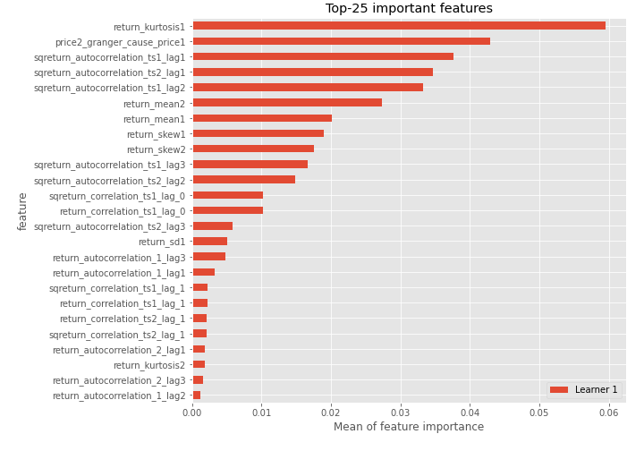
## Confusion Matrix

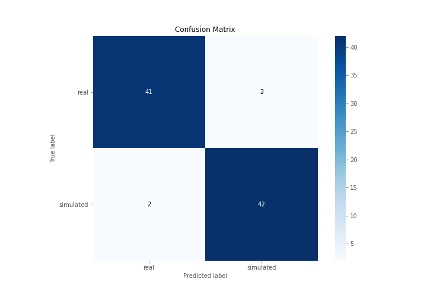

## Normalized Confusion Matrix

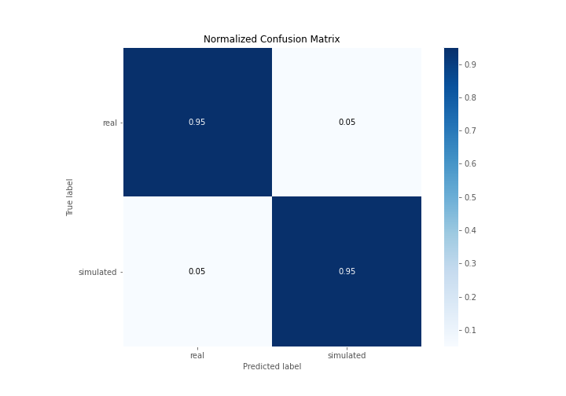

## ROC Curve

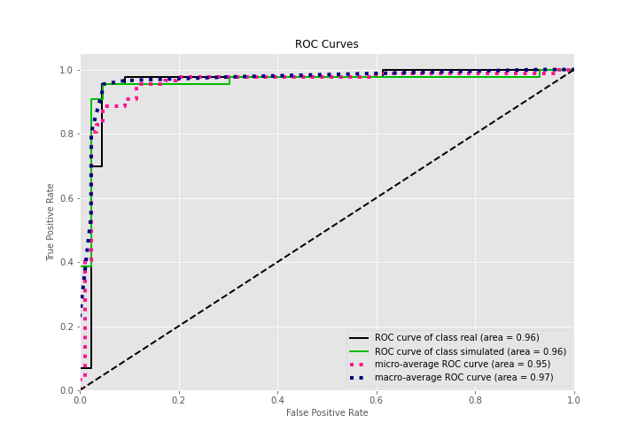

## Kolmogorov-Smirnov Statistic

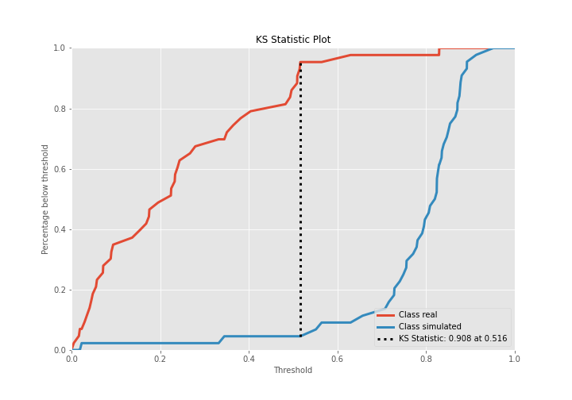

## Precision-Recall Curve

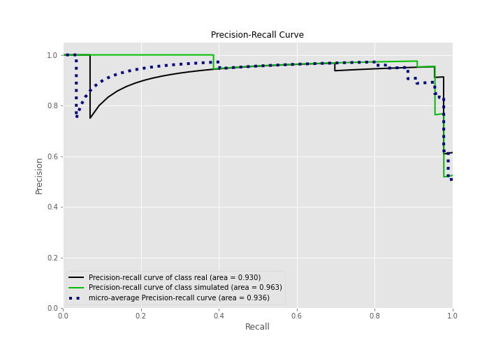

## Calibration Curve

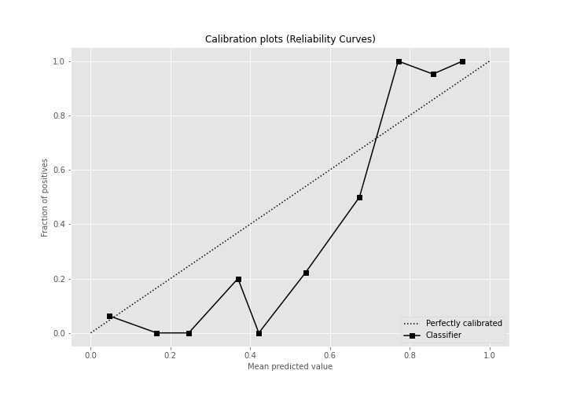

## Cumulative Gains Curve

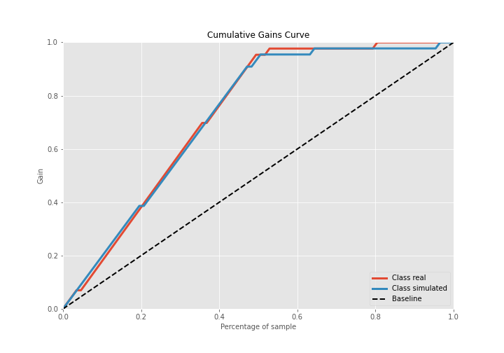

## Lift Curve

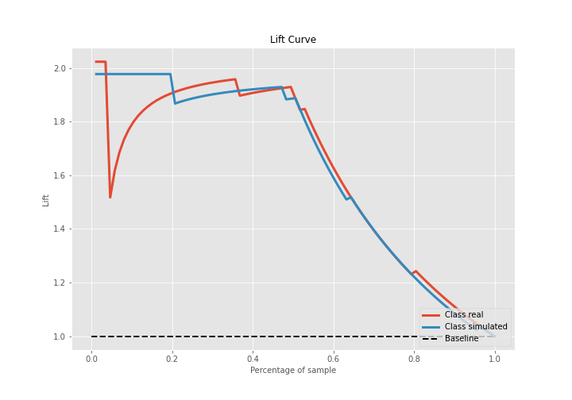

## SHAP Importance
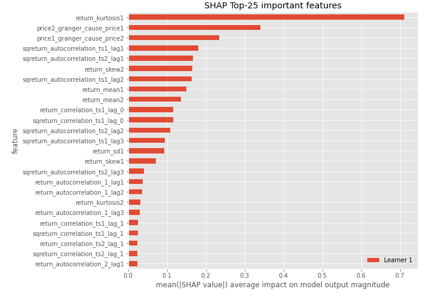

## SHAP Dependence plots

### Dependence (Fold 1)
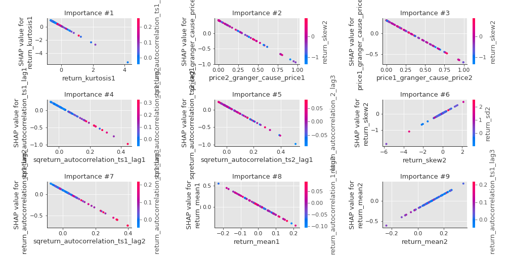

## SHAP Decision plots

### Top-10 Worst decisions for class 0 (Fold 1)
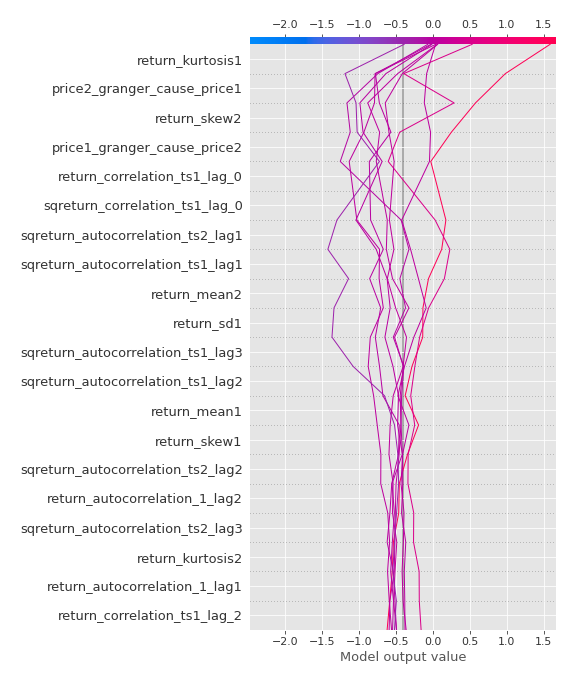
### Top-10 Best decisions for class 0 (Fold 1)
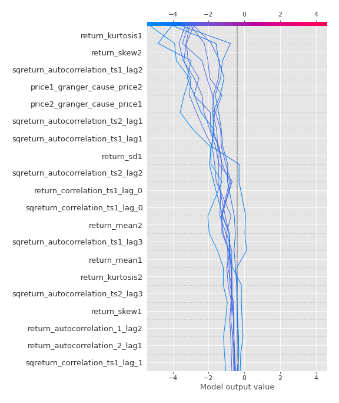
### Top-10 Worst decisions for class 1 (Fold 1)
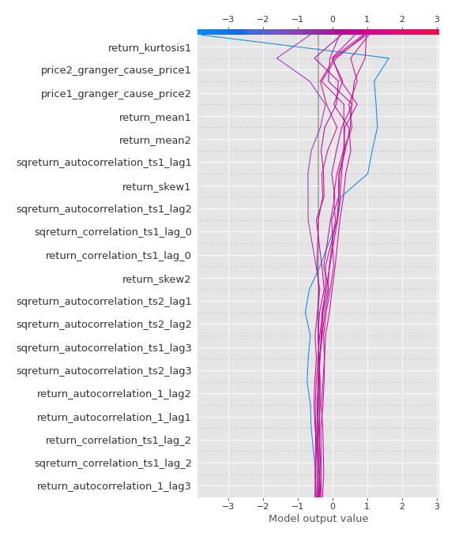
### Top-10 Best decisions for class 1 (Fold 1)
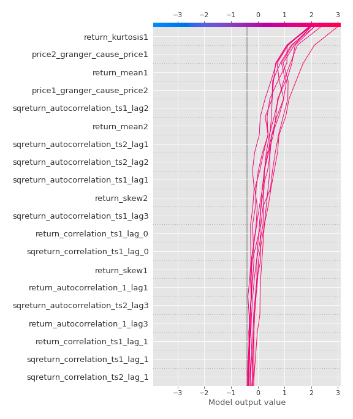

[<< Go back](../README.md)
