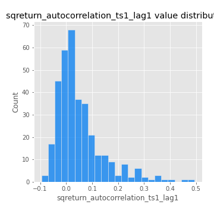

# Exploratory Data Analysis

[<< Go back](../README.md)
## Feature : target
- **Feature type** : categorical
- **Missing** : 0.0%
- **Unique** : 2
- **Count** :347
- **Unique** :2
- **Top** :simulated
- **Freq** :174

## Feature : return_mean1
- **Feature type** : continous
- **Missing** : 0.0%
- **Unique** : 347
- **Count** :347.0
- **Mean** :0.02041714234952893
- **Std** :0.10342616438861234
- **Min** :-0.31612130164326085
- **25%th Percentile** : -0.040811118676783456
- **50%th Percentile** : 0.030654939284210238
- **75%th Percentile** : 0.08421546856949104
- **Max** :0.37175100008111034

## Feature : return_mean2
- **Feature type** : continous
- **Missing** : 0.0%
- **Unique** : 347
- **Count** :347.0
- **Mean** :0.10455458653049601
- **Std** :0.10057595761370185
- **Min** :-0.24205418062825398
- **25%th Percentile** : 0.04710266629445216
- **50%th Percentile** : 0.10025757791428651
- **75%th Percentile** : 0.16808888917674003
- **Max** :0.46582918109585525

## Feature : return_sd1
- **Feature type** : continous
- **Missing** : 0.0%
- **Unique** : 347
- **Count** :347.0
- **Mean** :1.7918080784209023
- **Std** :0.739041288888922
- **Min** :0.7470080772831957
- **25%th Percentile** : 1.5565855888912883
- **50%th Percentile** : 1.644545862885299
- **75%th Percentile** : 1.7674580253493153
- **Max** :9.236766377527575

## Feature : return_sd2
- **Feature type** : continous
- **Missing** : 0.0%
- **Unique** : 347
- **Count** :347.0
- **Mean** :1.8858555465281137
- **Std** :0.7517235303888354
- **Min** :0.8592887433004143
- **25%th Percentile** : 1.6289176039267481
- **50%th Percentile** : 1.7702464082173004
- **75%th Percentile** : 1.8868513529595656
- **Max** :6.737618636746393

## Feature : return_skew1
- **Feature type** : continous
- **Missing** : 0.0%
- **Unique** : 347
- **Count** :347.0
- **Mean** :-0.0662007405906766
- **Std** :0.6548650562822542
- **Min** :-3.530116233761814
- **25%th Percentile** : -0.26497913130041284
- **50%th Percentile** : -0.041951931011540516
- **75%th Percentile** : 0.19575565131694322
- **Max** :3.0412007645394756

## Feature : return_skew2
- **Feature type** : continous
- **Missing** : 0.0%
- **Unique** : 347
- **Count** :347.0
- **Mean** :-0.1563546957921844
- **Std** :0.93050334227356
- **Min** :-8.801502855292393
- **25%th Percentile** : -0.38102414482583147
- **50%th Percentile** : -0.07826754350192505
- **75%th Percentile** : 0.16852223092700575
- **Max** :5.908391398363991

## Feature : return_kurtosis1
- **Feature type** : continous
- **Missing** : 0.0%
- **Unique** : 347
- **Count** :347.0
- **Mean** :3.9170657110402454
- **Std** :6.05482014790097
- **Min** :-0.23625654868384416
- **25%th Percentile** : 0.756627010781509
- **50%th Percentile** : 1.8065319995211593
- **75%th Percentile** : 4.07919664934239
- **Max** :36.91113889081053

## Feature : return_kurtosis2
- **Feature type** : continous
- **Missing** : 0.0%
- **Unique** : 347
- **Count** :347.0
- **Mean** :5.174340196321811
- **Std** :10.712541948879004
- **Min** :-0.2097114044458066
- **25%th Percentile** : 1.1167149406857129
- **50%th Percentile** : 2.4490574844511825
- **75%th Percentile** : 5.185847220562664
- **Max** :143.10871011533666

## Feature : return_autocorrelation_1_lag1
- **Feature type** : continous
- **Missing** : 0.0%
- **Unique** : 347
- **Count** :347.0
- **Mean** :-0.003848932919515722
- **Std** :0.060015792427721086
- **Min** :-0.20673896439036124
- **25%th Percentile** : -0.03701118033701757
- **50%th Percentile** : -0.0027485183958647435
- **75%th Percentile** : 0.03845458236860472
- **Max** :0.14828073809302095

## Feature : return_autocorrelation_1_lag2
- **Feature type** : continous
- **Missing** : 0.0%
- **Unique** : 347
- **Count** :347.0
- **Mean** :0.004624315059585952
- **Std** :0.05489044165156621
- **Min** :-0.13309283796645122
- **25%th Percentile** : -0.03144936486866796
- **50%th Percentile** : 0.005174831885161771
- **75%th Percentile** : 0.04165383195924993
- **Max** :0.1561488228015672

## Feature : return_autocorrelation_1_lag3
- **Feature type** : continous
- **Missing** : 0.0%
- **Unique** : 347
- **Count** :347.0
- **Mean** :0.008945618255609888
- **Std** :0.055173203218624185
- **Min** :-0.1940836867390813
- **25%th Percentile** : -0.026414538424156676
- **50%th Percentile** : 0.007462759577997864
- **75%th Percentile** : 0.04701603318877934
- **Max** :0.17805869530681923

## Feature : return_autocorrelation_2_lag1
- **Feature type** : continous
- **Missing** : 0.0%
- **Unique** : 347
- **Count** :347.0
- **Mean** :-0.00930789051553079
- **Std** :0.06427866664139041
- **Min** :-0.25075531010123286
- **25%th Percentile** : -0.042974724449087606
- **50%th Percentile** : -0.005129467779891817
- **75%th Percentile** : 0.029792344272821708
- **Max** :0.31863413537898483

## Feature : return_autocorrelation_2_lag2
- **Feature type** : continous
- **Missing** : 0.0%
- **Unique** : 347
- **Count** :347.0
- **Mean** :0.0013104903233348555
- **Std** :0.0515238067231025
- **Min** :-0.15323211089747296
- **25%th Percentile** : -0.03261751079502832
- **50%th Percentile** : -0.0001397725722570761
- **75%th Percentile** : 0.03435257485850629
- **Max** :0.20974504043791217

## Feature : return_autocorrelation_2_lag3
- **Feature type** : continous
- **Missing** : 0.0%
- **Unique** : 347
- **Count** :347.0
- **Mean** :-0.0003167201940296141
- **Std** :0.04931045398636481
- **Min** :-0.14200107169559698
- **25%th Percentile** : -0.028886142764128125
- **50%th Percentile** : -0.00034851136339246924
- **75%th Percentile** : 0.03318077152112893
- **Max** :0.1419999376914021

## Feature : return_correlation_ts1_lag_0
- **Feature type** : continous
- **Missing** : 0.0%
- **Unique** : 347
- **Count** :347.0
- **Mean** :0.33597304390151245
- **Std** :0.11234821107778664
- **Min** :0.005136598099876001
- **25%th Percentile** : 0.27489880543082745
- **50%th Percentile** : 0.3426659877793483
- **75%th Percentile** : 0.3958879378001179
- **Max** :0.7041861626832071

## Feature : return_correlation_ts1_lag_1
- **Feature type** : continous
- **Missing** : 0.0%
- **Unique** : 347
- **Count** :347.0
- **Mean** :-0.000591154872057647
- **Std** :0.05141964013214231
- **Min** :-0.1506680294614535
- **25%th Percentile** : -0.033565741146539776
- **50%th Percentile** : 0.004196794753563863
- **75%th Percentile** : 0.036162230167287014
- **Max** :0.15499424718508623

## Feature : return_correlation_ts1_lag_2
- **Feature type** : continous
- **Missing** : 0.0%
- **Unique** : 347
- **Count** :347.0
- **Mean** :0.0011170357662612087
- **Std** :0.04798006719703691
- **Min** :-0.12754281468591028
- **25%th Percentile** : -0.03141543158843689
- **50%th Percentile** : 0.0005518114992432347
- **75%th Percentile** : 0.03501386266973716
- **Max** :0.12012079034470448

## Feature : return_correlation_ts1_lag_3
- **Feature type** : continous
- **Missing** : 0.0%
- **Unique** : 347
- **Count** :347.0
- **Mean** :0.006739455318020218
- **Std** :0.052477879005738276
- **Min** :-0.1270218498974763
- **25%th Percentile** : -0.023527689529540416
- **50%th Percentile** : 0.005959545120544301
- **75%th Percentile** : 0.038887545561480205
- **Max** :0.17743181218786036

## Feature : return_correlation_ts2_lag_1
- **Feature type** : continous
- **Missing** : 0.0%
- **Unique** : 347
- **Count** :347.0
- **Mean** :-0.0023071041137706265
- **Std** :0.05780517667179655
- **Min** :-0.2081139431093261
- **25%th Percentile** : -0.03916864647140757
- **50%th Percentile** : -0.002148506714879542
- **75%th Percentile** : 0.03338990293696242
- **Max** :0.17208763791364762

## Feature : return_correlation_ts2_lag_2
- **Feature type** : continous
- **Missing** : 0.0%
- **Unique** : 347
- **Count** :347.0
- **Mean** :0.007635316235185521
- **Std** :0.049151868095965834
- **Min** :-0.15299951737180204
- **25%th Percentile** : -0.024357565091050797
- **50%th Percentile** : 0.00783009120488281
- **75%th Percentile** : 0.0385139858943572
- **Max** :0.20772887392904255

## Feature : return_correlation_ts2_lag_3
- **Feature type** : continous
- **Missing** : 0.0%
- **Unique** : 347
- **Count** :347.0
- **Mean** :0.0023852579868611046
- **Std** :0.05022136073316063
- **Min** :-0.17564076057312866
- **25%th Percentile** : -0.027625439263515152
- **50%th Percentile** : 0.0021785385614415905
- **75%th Percentile** : 0.03830651767200597
- **Max** :0.12502781355851633

## Feature : sqreturn_autocorrelation_ts1_lag1
- **Feature type** : continous
- **Missing** : 0.0%
- **Unique** : 347
- **Count** :347.0
- **Mean** :0.05063499945167357
- **Std** :0.09204888110813553
- **Min** :-0.0952727158370939
- **25%th Percentile** : -0.009784957245982846
- **50%th Percentile** : 0.024672051494299494
- **75%th Percentile** : 0.08155881368267934
- **Max** :0.49414293176447355

## Feature : sqreturn_autocorrelation_ts1_lag2
- **Feature type** : continous
- **Missing** : 0.0%
- **Unique** : 347
- **Count** :347.0
- **Mean** :0.04410608999538151
- **Std** :0.09465192263184018
- **Min** :-0.09422419060640977
- **25%th Percentile** : -0.011649492262547764
- **50%th Percentile** : 0.01953911566734624
- **75%th Percentile** : 0.06356366409771849
- **Max** :0.540735851444759

## Feature : sqreturn_autocorrelation_ts1_lag3
- **Feature type** : continous
- **Missing** : 0.0%
- **Unique** : 347
- **Count** :347.0
- **Mean** :0.036105781214519246
- **Std** :0.08195931312015206
- **Min** :-0.09745657489711668
- **25%th Percentile** : -0.015286676699011908
- **50%th Percentile** : 0.011710548254852042
- **75%th Percentile** : 0.05686973508683755
- **Max** :0.44755937369538146

## Feature : sqreturn_autocorrelation_ts2_lag1
- **Feature type** : continous
- **Missing** : 0.0%
- **Unique** : 347
- **Count** :347.0
- **Mean** :0.048152014670214335
- **Std** :0.0922039093329546
- **Min** :-0.08520586663750691
- **25%th Percentile** : -0.01357762059119139
- **50%th Percentile** : 0.022953494028003986
- **75%th Percentile** : 0.08384687394187884
- **Max** :0.510085647437958

## Feature : sqreturn_autocorrelation_ts2_lag2
- **Feature type** : continous
- **Missing** : 0.0%
- **Unique** : 347
- **Count** :347.0
- **Mean** :0.04195694210924477
- **Std** :0.09147308124825952
- **Min** :-0.08995071181191319
- **25%th Percentile** : -0.01328401996545607
- **50%th Percentile** : 0.012239267024428074
- **75%th Percentile** : 0.05644761446123693
- **Max** :0.5373432415582473

## Feature : sqreturn_autocorrelation_ts2_lag3
- **Feature type** : continous
- **Missing** : 0.0%
- **Unique** : 347
- **Count** :347.0
- **Mean** :0.030009439055154664
- **Std** :0.07036340424640011
- **Min** :-0.07040551967006488
- **25%th Percentile** : -0.012953245919165145
- **50%th Percentile** : 0.010663667182495971
- **75%th Percentile** : 0.047794799896021124
- **Max** :0.3778392466809041

## Feature : sqreturn_correlation_ts1_lag_0
- **Feature type** : continous
- **Missing** : 0.0%
- **Unique** : 347
- **Count** :347.0
- **Mean** :0.33597304390151245
- **Std** :0.11234821107778664
- **Min** :0.005136598099876001
- **25%th Percentile** : 0.27489880543082745
- **50%th Percentile** : 0.3426659877793483
- **75%th Percentile** : 0.3958879378001179
- **Max** :0.7041861626832071

## Feature : sqreturn_correlation_ts1_lag_1
- **Feature type** : continous
- **Missing** : 0.0%
- **Unique** : 347
- **Count** :347.0
- **Mean** :-0.000591154872057647
- **Std** :0.05141964013214231
- **Min** :-0.1506680294614535
- **25%th Percentile** : -0.033565741146539776
- **50%th Percentile** : 0.004196794753563863
- **75%th Percentile** : 0.036162230167287014
- **Max** :0.15499424718508623

## Feature : sqreturn_correlation_ts1_lag_2
- **Feature type** : continous
- **Missing** : 0.0%
- **Unique** : 347
- **Count** :347.0
- **Mean** :0.0011170357662612087
- **Std** :0.04798006719703691
- **Min** :-0.12754281468591028
- **25%th Percentile** : -0.03141543158843689
- **50%th Percentile** : 0.0005518114992432347
- **75%th Percentile** : 0.03501386266973716
- **Max** :0.12012079034470448

## Feature : sqreturn_correlation_ts1_lag_3
- **Feature type** : continous
- **Missing** : 0.0%
- **Unique** : 347
- **Count** :347.0
- **Mean** :0.006739455318020218
- **Std** :0.052477879005738276
- **Min** :-0.1270218498974763
- **25%th Percentile** : -0.023527689529540416
- **50%th Percentile** : 0.005959545120544301
- **75%th Percentile** : 0.038887545561480205
- **Max** :0.17743181218786036

## Feature : sqreturn_correlation_ts2_lag_1
- **Feature type** : continous
- **Missing** : 0.0%
- **Unique** : 347
- **Count** :347.0
- **Mean** :-0.0023071041137706265
- **Std** :0.05780517667179655
- **Min** :-0.2081139431093261
- **25%th Percentile** : -0.03916864647140757
- **50%th Percentile** : -0.002148506714879542
- **75%th Percentile** : 0.03338990293696242
- **Max** :0.17208763791364762

## Feature : sqreturn_correlation_ts2_lag_2
- **Feature type** : continous
- **Missing** : 0.0%
- **Unique** : 347
- **Count** :347.0
- **Mean** :0.007635316235185521
- **Std** :0.049151868095965834
- **Min** :-0.15299951737180204
- **25%th Percentile** : -0.024357565091050797
- **50%th Percentile** : 0.00783009120488281
- **75%th Percentile** : 0.0385139858943572
- **Max** :0.20772887392904255

## Feature : sqreturn_correlation_ts2_lag_3
- **Feature type** : continous
- **Missing** : 0.0%
- **Unique** : 347
- **Count** :347.0
- **Mean** :0.0023852579868611046
- **Std** :0.05022136073316063
- **Min** :-0.17564076057312866
- **25%th Percentile** : -0.027625439263515152
- **50%th Percentile** : 0.0021785385614415905
- **75%th Percentile** : 0.03830651767200597
- **Max** :0.12502781355851633

## Feature : price2_granger_cause_price1
- **Feature type** : continous
- **Missing** : 0.0%
- **Unique** : 347
- **Count** :347.0
- **Mean** :0.25242611363097955
- **Std** :0.2905582011853376
- **Min** :2.0598872769492275e-09
- **25%th Percentile** : 0.0076728057320276585
- **50%th Percentile** : 0.11146364315431569
- **75%th Percentile** : 0.4353764666168963
- **Max** :0.9885712803689185

## Feature : price1_granger_cause_price2
- **Feature type** : continous
- **Missing** : 0.0%
- **Unique** : 347
- **Count** :347.0
- **Mean** :0.3039352940066446
- **Std** :0.2784755476233535
- **Min** :2.1004301095007265e-05
- **25%th Percentile** : 0.05838363777520362
- **50%th Percentile** : 0.23400322282893343
- **75%th Percentile** : 0.5136383787281313
- **Max** :0.9964948055729681

[<< Go back](../README.md)
