# Summary of 2_DecisionTree

[<< Go back](../README.md)

## Decision Tree
- **n_jobs**: -1
- **criterion**: gini
- **max_depth**: 3
- **explain_level**: 2

## Validation
 - **validation_type**: split
 - **train_ratio**: 0.75
 - **shuffle**: True
 - **stratify**: True

## Optimized metric
accuracy

## Training time

18.7 seconds

## Metric details
|           |    score |   threshold |
|:----------|---------:|------------:|
| logloss   | 0.948829 | nan         |
| auc       | 0.828571 | nan         |
| f1        | 0.845361 |   0.0306122 |
| accuracy  | 0.827586 |   0.0306122 |
| precision | 0.808511 |   0.486607  |
| recall    | 0.977778 |   0         |
| mcc       | 0.661573 |   0.0306122 |

## Confusion matrix (at threshold=0.030612)
|                      |   Predicted as real |   Predicted as simulated |
|:---------------------|--------------------:|-------------------------:|
| Labeled as real      |                  31 |                       11 |
| Labeled as simulated |                   4 |                       41 |

## Learning curves
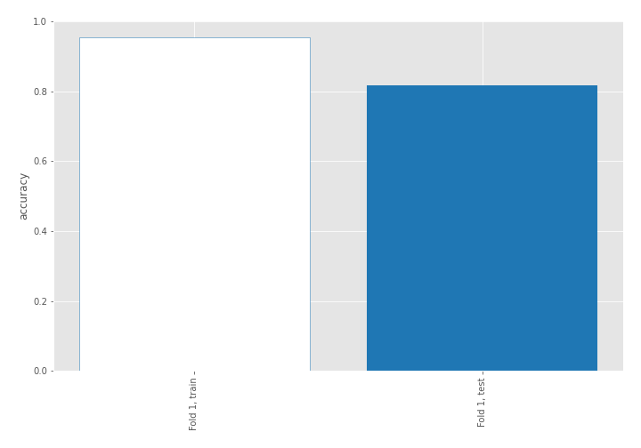

## Decision Tree 

### Tree #1
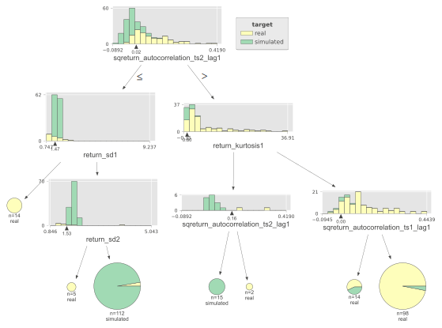

### Rules

if (sqreturn_autocorrelation_ts2_lag1 <= 0.025) and (return_sd1 > 1.467) and (return_sd2 > 1.528) then class: simulated (proba: 97.32%) | based on 112 samples

if (sqreturn_autocorrelation_ts2_lag1 > 0.025) and (return_kurtosis1 > 0.802) and (sqreturn_autocorrelation_ts1_lag1 > 0.001) then class: real (proba: 96.94%) | based on 98 samples

if (sqreturn_autocorrelation_ts2_lag1 > 0.025) and (return_kurtosis1 <= 0.802) and (sqreturn_autocorrelation_ts2_lag1 <= 0.155) then class: simulated (proba: 100.0%) | based on 15 samples

if (sqreturn_autocorrelation_ts2_lag1 > 0.025) and (return_kurtosis1 > 0.802) and (sqreturn_autocorrelation_ts1_lag1 <= 0.001) then class: real (proba: 57.14%) | based on 14 samples

if (sqreturn_autocorrelation_ts2_lag1 <= 0.025) and (return_sd1 <= 1.467) then class: real (proba: 100.0%) | based on 14 samples

if (sqreturn_autocorrelation_ts2_lag1 <= 0.025) and (return_sd1 > 1.467) and (return_sd2 <= 1.528) then class: real (proba: 100.0%) | based on 5 samples

if (sqreturn_autocorrelation_ts2_lag1 > 0.025) and (return_kurtosis1 <= 0.802) and (sqreturn_autocorrelation_ts2_lag1 > 0.155) then class: real (proba: 100.0%) | based on 2 samples

## Permutation-based Importance
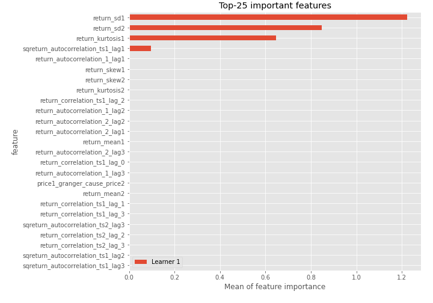
## Confusion Matrix

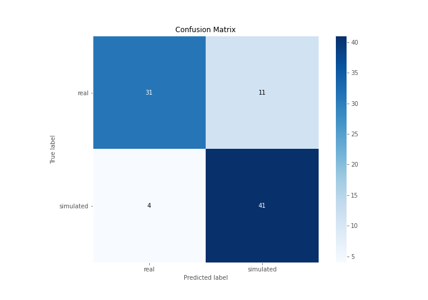

## Normalized Confusion Matrix

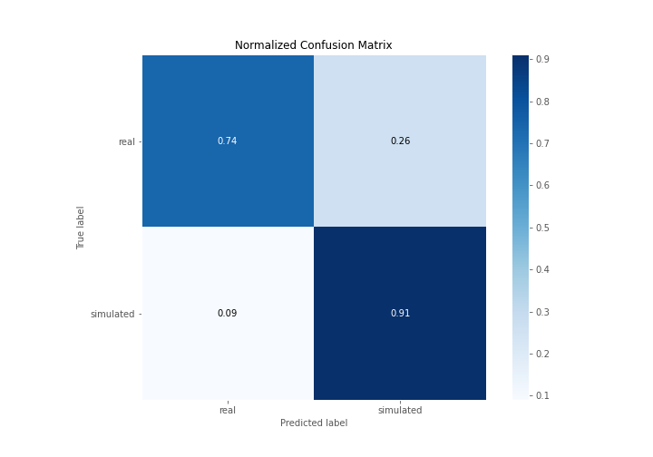

## ROC Curve

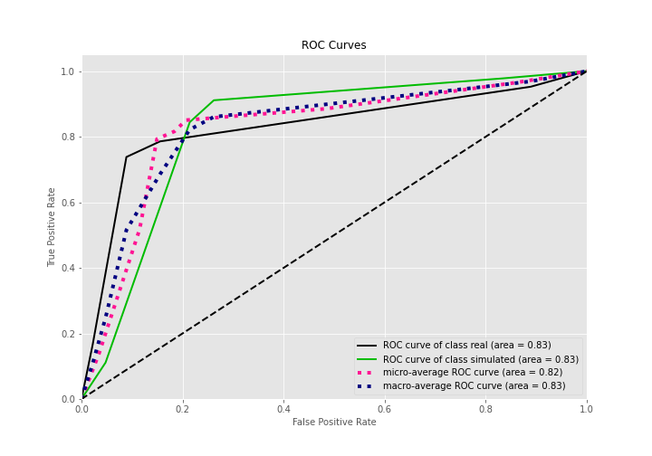

## Kolmogorov-Smirnov Statistic

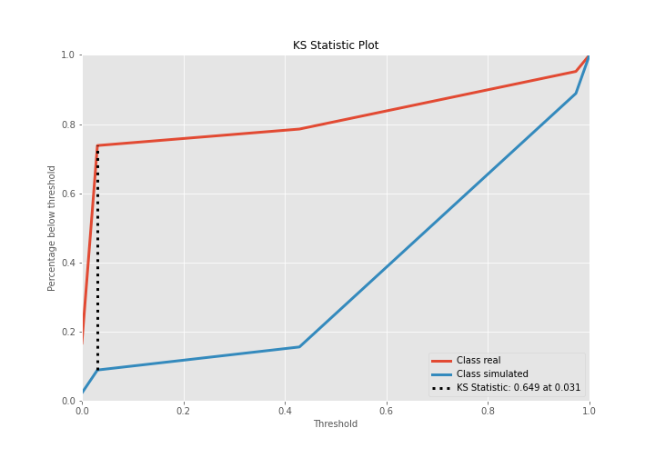

## Precision-Recall Curve

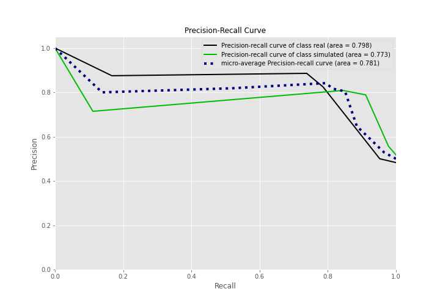

## Calibration Curve

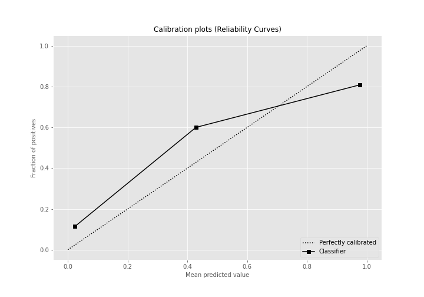

## Cumulative Gains Curve

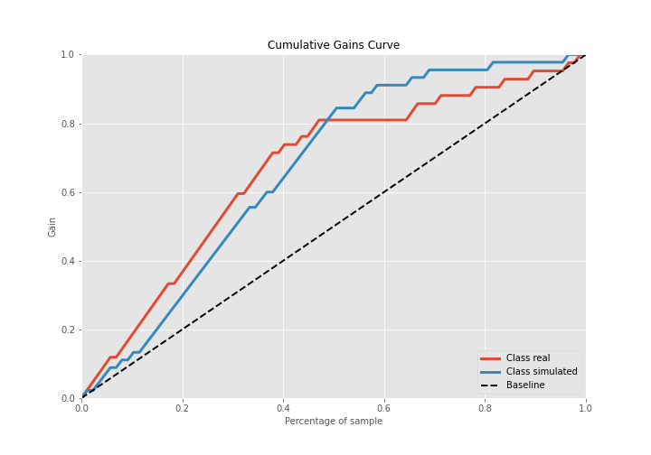

## Lift Curve

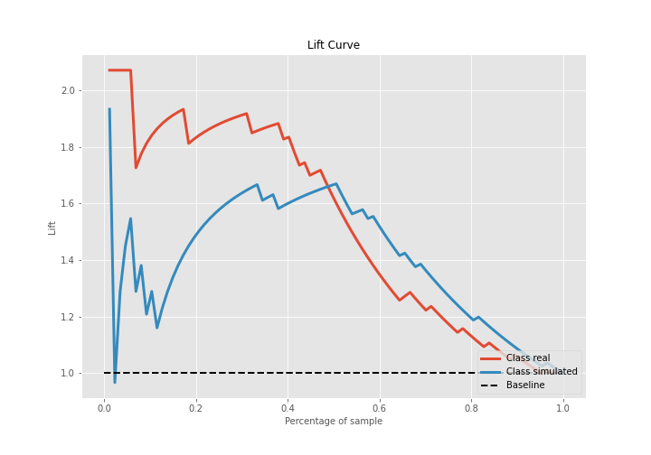

## SHAP Importance
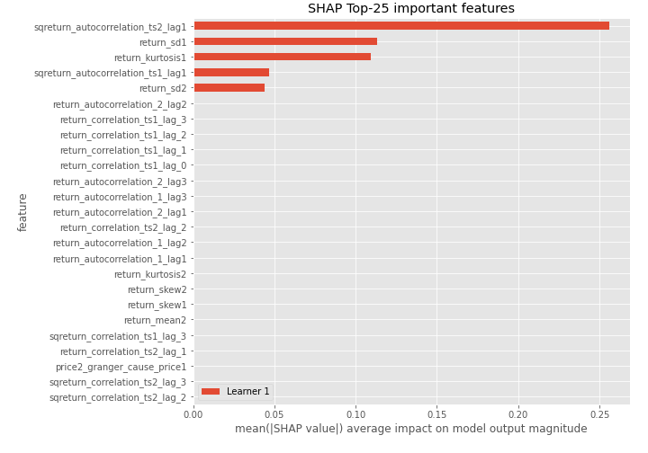

## SHAP Dependence plots

### Dependence (Fold 1)
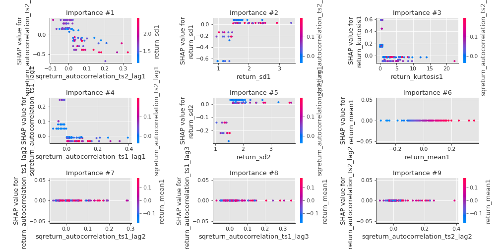

## SHAP Decision plots

### Top-10 Worst decisions for class 0 (Fold 1)
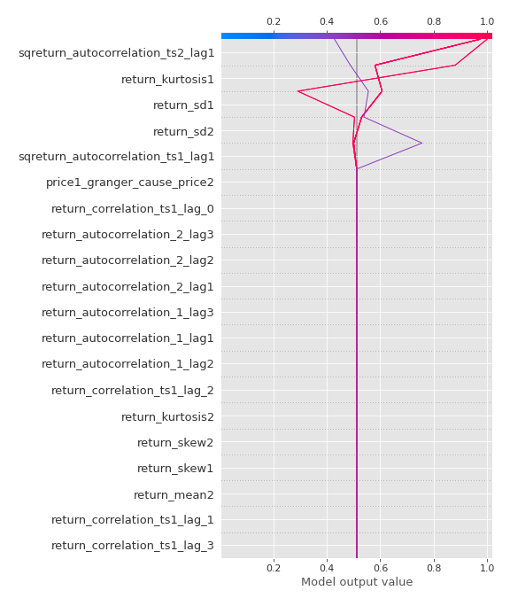
### Top-10 Best decisions for class 0 (Fold 1)
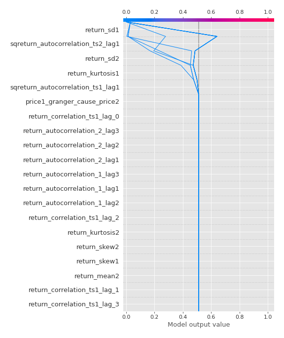
### Top-10 Worst decisions for class 1 (Fold 1)
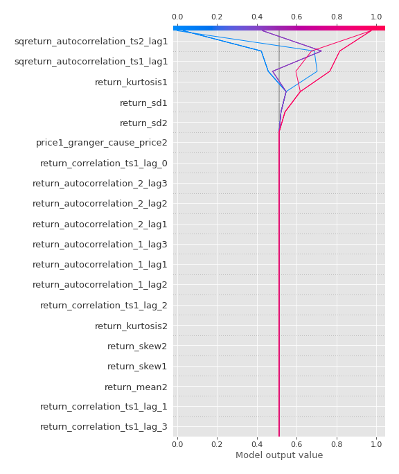
### Top-10 Best decisions for class 1 (Fold 1)
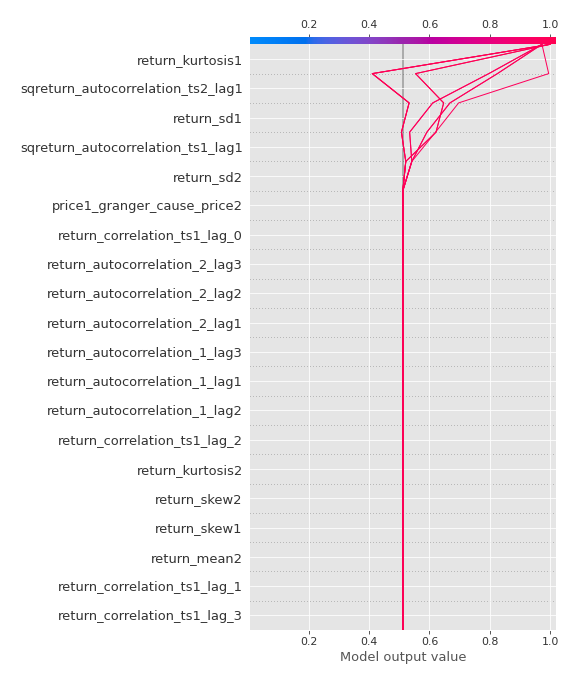

[<< Go back](../README.md)
