# Summary of 3_Linear

[<< Go back](../README.md)

## Logistic Regression (Linear)
- **n_jobs**: -1
- **explain_level**: 2

## Validation
 - **validation_type**: split
 - **train_ratio**: 0.75
 - **shuffle**: True
 - **stratify**: True

## Optimized metric
accuracy

## Training time

17.6 seconds

## Metric details
|           |    score |    threshold |
|:----------|---------:|-------------:|
| logloss   | 0.339876 | nan          |
| auc       | 0.960317 | nan          |
| f1        | 0.933333 |   0.60331    |
| accuracy  | 0.931034 |   0.60331    |
| precision | 1        |   0.852692   |
| recall    | 1        |   0.00901534 |
| mcc       | 0.861905 |   0.60331    |

## Confusion matrix (at threshold=0.60331)
|                      |   Predicted as real |   Predicted as simulated |
|:---------------------|--------------------:|-------------------------:|
| Labeled as real      |                  39 |                        3 |
| Labeled as simulated |                   3 |                       42 |

## Learning curves
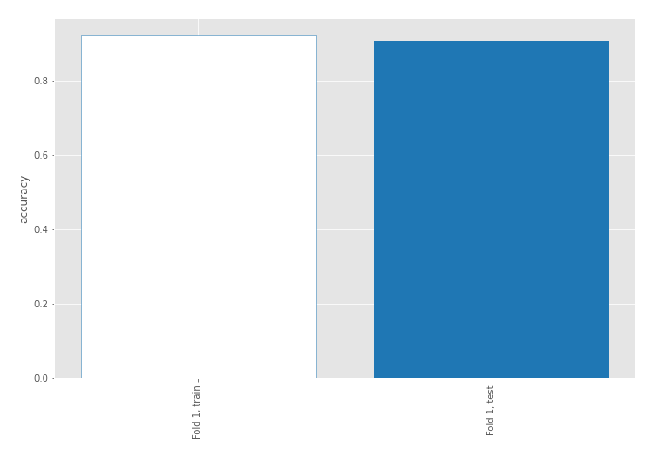

## Coefficients
| feature                           |   Learner_1 |
|:----------------------------------|------------:|
| return_mean2                      |   1.66177   |
| return_correlation_ts1_lag_0      |   1.24217   |
| sqreturn_correlation_ts1_lag_0    |   1.24217   |
| return_autocorrelation_1_lag1     |   0.850174  |
| return_autocorrelation_1_lag2     |   0.800689  |
| sqreturn_correlation_ts1_lag_1    |   0.771665  |
| return_correlation_ts1_lag_1      |   0.771665  |
| return_autocorrelation_2_lag1     |   0.634619  |
| return_autocorrelation_1_lag3     |   0.589411  |
| return_correlation_ts1_lag_2      |   0.58445   |
| sqreturn_correlation_ts1_lag_2    |   0.58445   |
| return_autocorrelation_2_lag2     |   0.573821  |
| return_skew2                      |   0.506826  |
| sqreturn_correlation_ts1_lag_3    |   0.475288  |
| return_correlation_ts1_lag_3      |   0.475288  |
| sqreturn_correlation_ts2_lag_1    |   0.365223  |
| return_correlation_ts2_lag_1      |   0.365223  |
| return_autocorrelation_2_lag3     |   0.361691  |
| return_skew1                      |   0.30762   |
| sqreturn_correlation_ts2_lag_2    |   0.244958  |
| return_correlation_ts2_lag_2      |   0.244958  |
| return_sd2                        |   0.222945  |
| sqreturn_correlation_ts2_lag_3    |   0.147779  |
| return_correlation_ts2_lag_3      |   0.147779  |
| intercept                         |  -0.0631701 |
| return_kurtosis2                  |  -0.506438  |
| return_sd1                        |  -0.517572  |
| price1_granger_cause_price2       |  -0.682783  |
| return_kurtosis1                  |  -0.854668  |
| sqreturn_autocorrelation_ts2_lag3 |  -1.34709   |
| price2_granger_cause_price1       |  -1.55058   |
| sqreturn_autocorrelation_ts2_lag2 |  -1.65366   |
| return_mean1                      |  -1.76395   |
| sqreturn_autocorrelation_ts1_lag2 |  -1.86758   |
| sqreturn_autocorrelation_ts1_lag3 |  -1.92639   |
| sqreturn_autocorrelation_ts2_lag1 |  -2.30232   |
| sqreturn_autocorrelation_ts1_lag1 |  -2.44569   |

## Permutation-based Importance
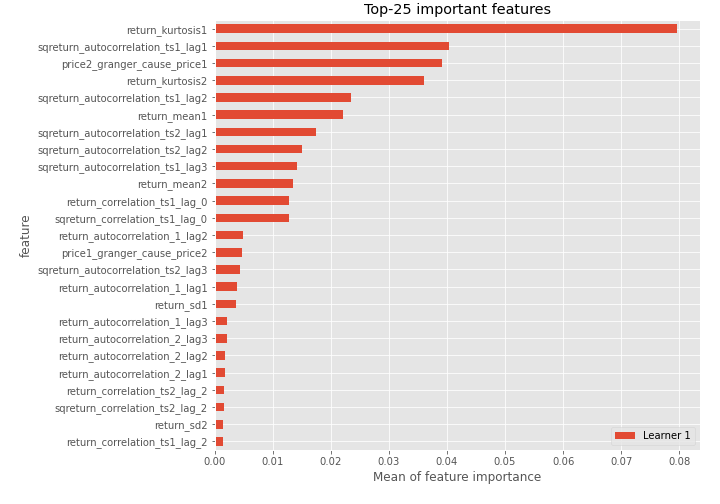
## Confusion Matrix

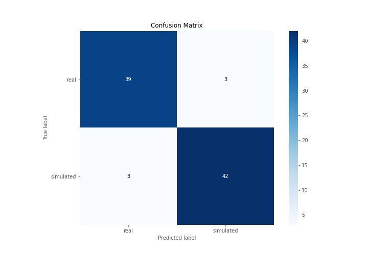

## Normalized Confusion Matrix

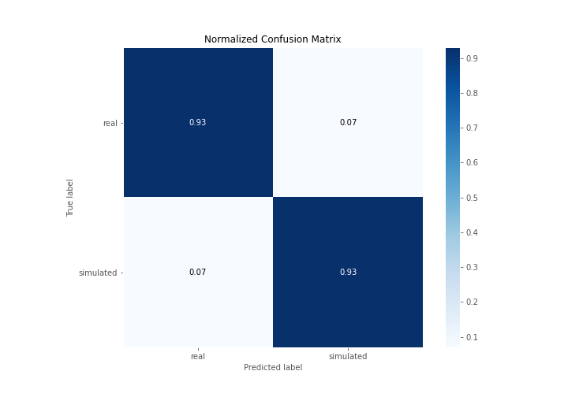

## ROC Curve

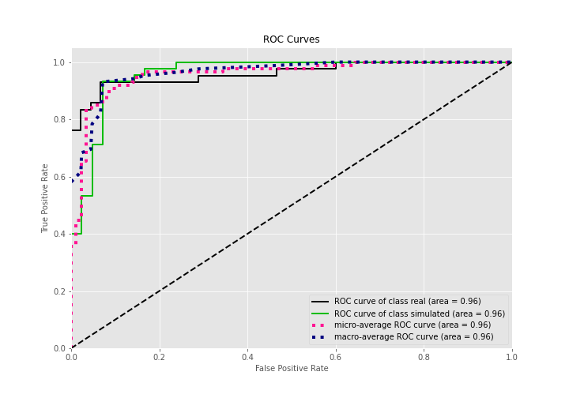

## Kolmogorov-Smirnov Statistic

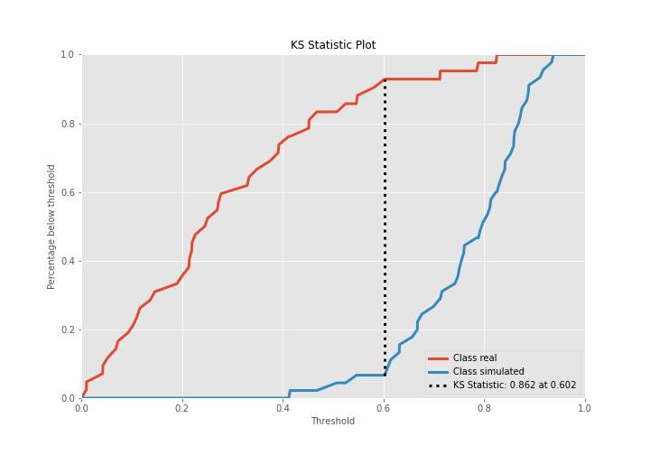

## Precision-Recall Curve

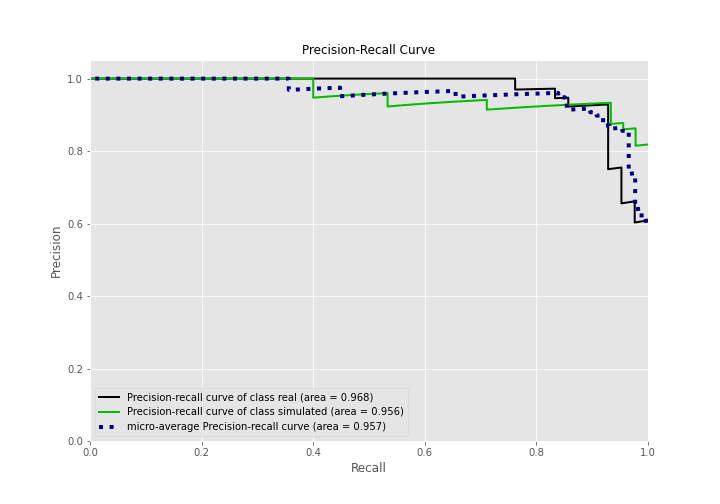

## Calibration Curve

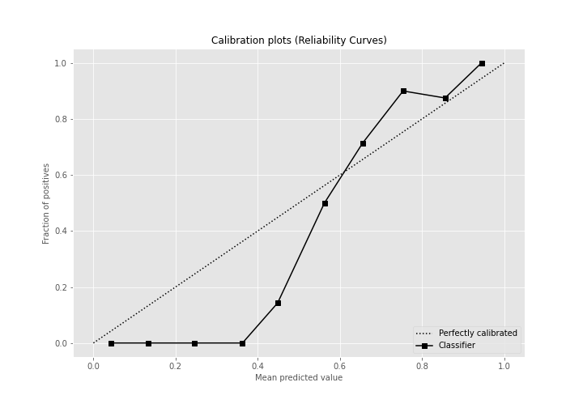

## Cumulative Gains Curve

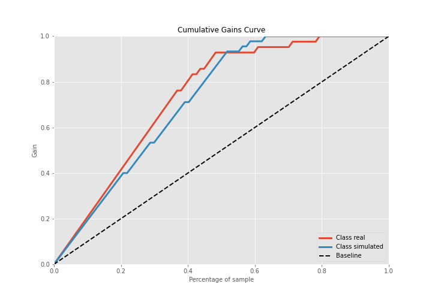

## Lift Curve

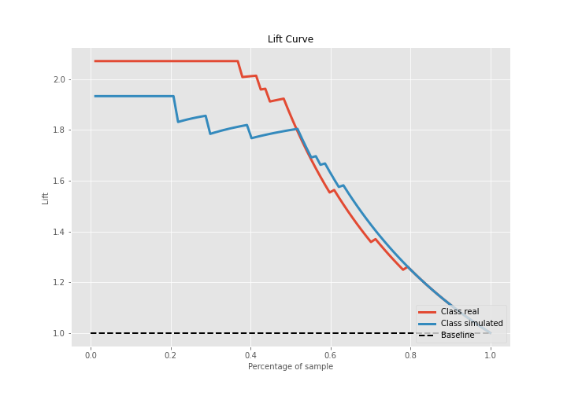

## SHAP Importance
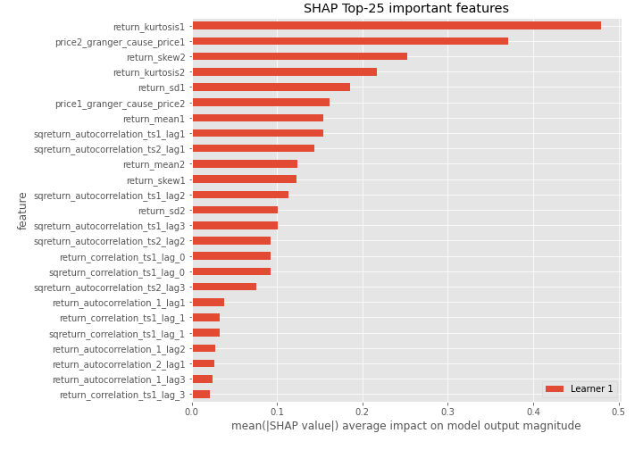

## SHAP Dependence plots

### Dependence (Fold 1)
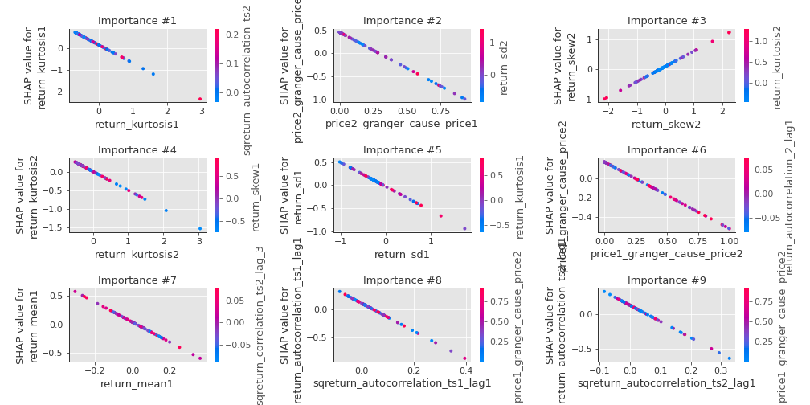

## SHAP Decision plots

### Top-10 Worst decisions for class 0 (Fold 1)
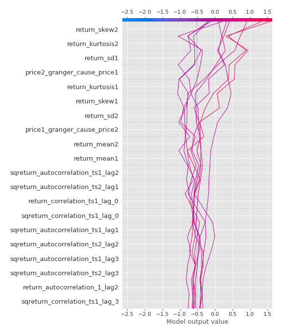
### Top-10 Best decisions for class 0 (Fold 1)
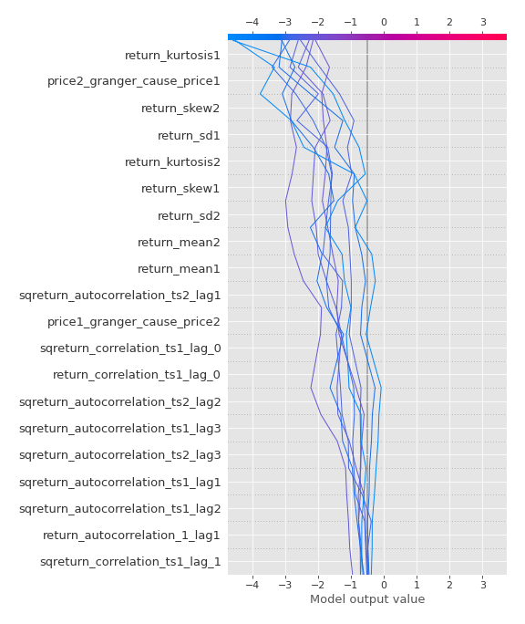
### Top-10 Worst decisions for class 1 (Fold 1)
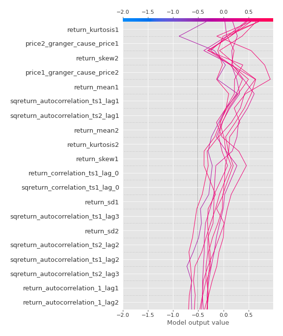
### Top-10 Best decisions for class 1 (Fold 1)
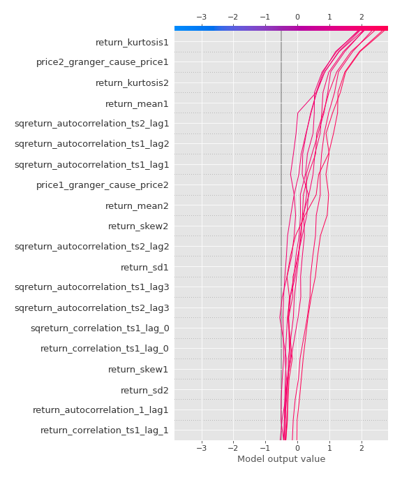

[<< Go back](../README.md)
