# Exploratory Data Analysis

[<< Go back](../README.md)
## Feature : target
- **Feature type** : categorical
- **Missing** : 0.0%
- **Unique** : 2
- **Count** :347
- **Unique** :2
- **Top** :simulated
- **Freq** :178

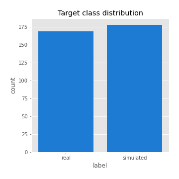
## Feature : return_mean1
- **Feature type** : continous
- **Missing** : 0.0%
- **Unique** : 347
- **Count** :347.0
- **Mean** :0.014958901163687387
- **Std** :0.1053438443746307
- **Min** :-0.3053901769486253
- **25%th Percentile** : -0.048361313265553416
- **50%th Percentile** : 0.020791065331283814
- **75%th Percentile** : 0.08072912208670588
- **Max** :0.37175100008111034

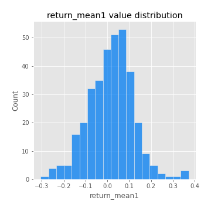
## Feature : return_mean2
- **Feature type** : continous
- **Missing** : 0.0%
- **Unique** : 347
- **Count** :347.0
- **Mean** :0.09781837413429077
- **Std** :0.09421229264243054
- **Min** :-0.21818165578778434
- **25%th Percentile** : 0.04153035073539672
- **50%th Percentile** : 0.0980102616521251
- **75%th Percentile** : 0.1564469189084085
- **Max** :0.37616608147096464

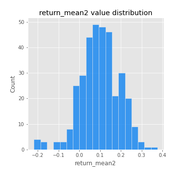
## Feature : return_sd1
- **Feature type** : continous
- **Missing** : 0.0%
- **Unique** : 347
- **Count** :347.0
- **Mean** :1.8039477984532237
- **Std** :0.7966911423755751
- **Min** :0.7470080772831957
- **25%th Percentile** : 1.5568854601219155
- **50%th Percentile** : 1.642283619627346
- **75%th Percentile** : 1.7516026290571556
- **Max** :9.236766377527575

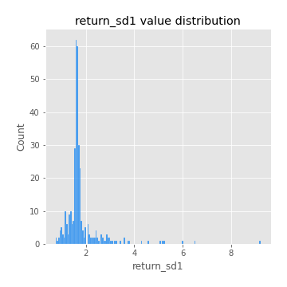
## Feature : return_sd2
- **Feature type** : continous
- **Missing** : 0.0%
- **Unique** : 347
- **Count** :347.0
- **Mean** :1.8439178697964584
- **Std** :0.5799794339466372
- **Min** :0.8455946193085045
- **25%th Percentile** : 1.6342433017184197
- **50%th Percentile** : 1.7855413327126783
- **75%th Percentile** : 1.9108957842126033
- **Max** :5.042707010333888

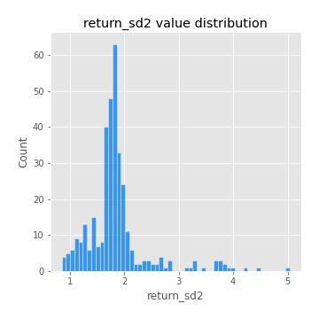
## Feature : return_skew1
- **Feature type** : continous
- **Missing** : 0.0%
- **Unique** : 347
- **Count** :347.0
- **Mean** :-0.03305650491426231
- **Std** :0.6382379886730843
- **Min** :-2.817259764925239
- **25%th Percentile** : -0.24511988411307456
- **50%th Percentile** : -0.009509067045499248
- **75%th Percentile** : 0.18677479839295
- **Max** :2.5845963767725557

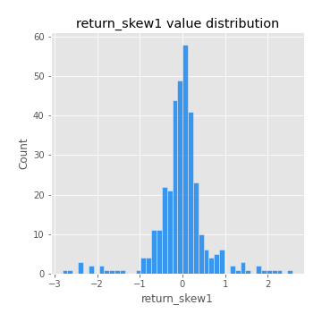
## Feature : return_skew2
- **Feature type** : continous
- **Missing** : 0.0%
- **Unique** : 347
- **Count** :347.0
- **Mean** :-0.13270176348518184
- **Std** :0.8374706612838332
- **Min** :-8.801502855292393
- **25%th Percentile** : -0.3718223900747931
- **50%th Percentile** : -0.08335354382166539
- **75%th Percentile** : 0.1642809560932097
- **Max** :2.7287168624901565

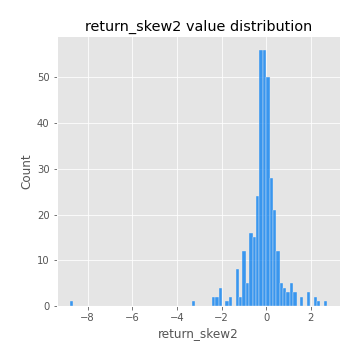
## Feature : return_kurtosis1
- **Feature type** : continous
- **Missing** : 0.0%
- **Unique** : 347
- **Count** :347.0
- **Mean** :3.9922867759671035
- **Std** :5.637348971481971
- **Min** :-0.3473503247636258
- **25%th Percentile** : 0.7424802060821387
- **50%th Percentile** : 1.9377883521737895
- **75%th Percentile** : 4.350279189396841
- **Max** :36.91113889081053

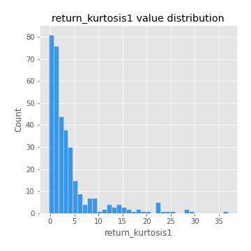
## Feature : return_kurtosis2
- **Feature type** : continous
- **Missing** : 0.0%
- **Unique** : 347
- **Count** :347.0
- **Mean** :5.127028491068812
- **Std** :9.372125822865325
- **Min** :-0.05070774615095974
- **25%th Percentile** : 1.185644677367339
- **50%th Percentile** : 2.5600102787272907
- **75%th Percentile** : 5.41975400745011
- **Max** :143.10871011533666

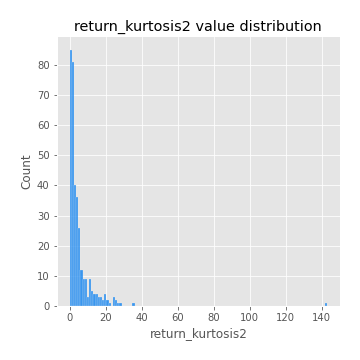
## Feature : return_autocorrelation_1_lag1
- **Feature type** : continous
- **Missing** : 0.0%
- **Unique** : 347
- **Count** :347.0
- **Mean** :-0.003006071281198033
- **Std** :0.05936254633496003
- **Min** :-0.2135576224968752
- **25%th Percentile** : -0.036235931268845695
- **50%th Percentile** : 0.003799976663061319
- **75%th Percentile** : 0.03852279254940974
- **Max** :0.14166099210854252

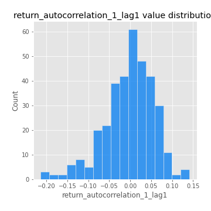
## Feature : return_autocorrelation_1_lag2
- **Feature type** : continous
- **Missing** : 0.0%
- **Unique** : 347
- **Count** :347.0
- **Mean** :0.003645812823736771
- **Std** :0.051411722894527785
- **Min** :-0.12172858720259
- **25%th Percentile** : -0.02680948668664528
- **50%th Percentile** : 0.005534348243397494
- **75%th Percentile** : 0.03869585290127782
- **Max** :0.1561488228015672

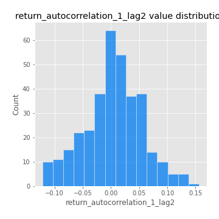
## Feature : return_autocorrelation_1_lag3
- **Feature type** : continous
- **Missing** : 0.0%
- **Unique** : 347
- **Count** :347.0
- **Mean** :0.006269195745876701
- **Std** :0.05280636208620953
- **Min** :-0.1940836867390813
- **25%th Percentile** : -0.028609258973383137
- **50%th Percentile** : 0.009481760281068818
- **75%th Percentile** : 0.04111197829730551
- **Max** :0.12885879012210372

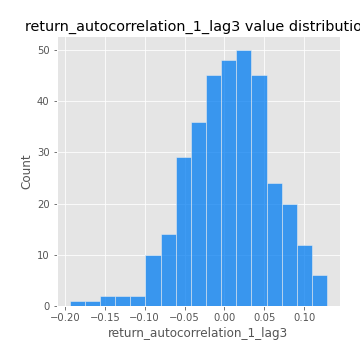
## Feature : return_autocorrelation_2_lag1
- **Feature type** : continous
- **Missing** : 0.0%
- **Unique** : 347
- **Count** :347.0
- **Mean** :-0.005177544267315797
- **Std** :0.05682864993458631
- **Min** :-0.25075531010123286
- **25%th Percentile** : -0.037541319013099164
- **50%th Percentile** : 0.00020755181075451918
- **75%th Percentile** : 0.03279727273330658
- **Max** :0.13109366410815865

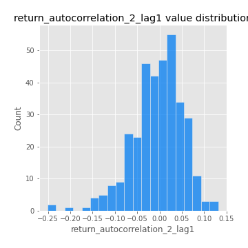
## Feature : return_autocorrelation_2_lag2
- **Feature type** : continous
- **Missing** : 0.0%
- **Unique** : 347
- **Count** :347.0
- **Mean** :-0.002309229860649721
- **Std** :0.049607895417710955
- **Min** :-0.15323211089747296
- **25%th Percentile** : -0.03459042868748592
- **50%th Percentile** : -0.0031967354105811
- **75%th Percentile** : 0.031086642122861954
- **Max** :0.1735398560230086

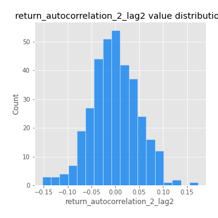
## Feature : return_autocorrelation_2_lag3
- **Feature type** : continous
- **Missing** : 0.0%
- **Unique** : 347
- **Count** :347.0
- **Mean** :-0.0006242453935573128
- **Std** :0.04929255365465969
- **Min** :-0.14200107169559698
- **25%th Percentile** : -0.02969223260341009
- **50%th Percentile** : -2.510909182247247e-06
- **75%th Percentile** : 0.032407152472956266
- **Max** :0.1419999376914021

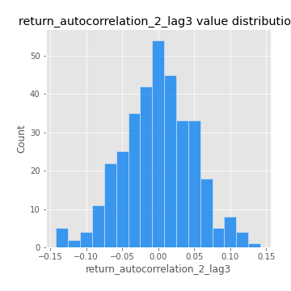
## Feature : return_correlation_ts1_lag_0
- **Feature type** : continous
- **Missing** : 0.0%
- **Unique** : 347
- **Count** :347.0
- **Mean** :0.340518540705731
- **Std** :0.11201881757312303
- **Min** :-0.027089510445801036
- **25%th Percentile** : 0.2797012111972227
- **50%th Percentile** : 0.3492588004736749
- **75%th Percentile** : 0.40023751577380445
- **Max** :0.7041861626832071

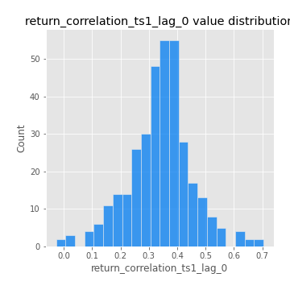
## Feature : return_correlation_ts1_lag_1
- **Feature type** : continous
- **Missing** : 0.0%
- **Unique** : 347
- **Count** :347.0
- **Mean** :-0.0003631981055139641
- **Std** :0.05245142172793927
- **Min** :-0.16985510949917193
- **25%th Percentile** : -0.03179838720151315
- **50%th Percentile** : 0.002157207880544263
- **75%th Percentile** : 0.03826186923368407
- **Max** :0.15499424718508623

## Feature : return_correlation_ts1_lag_2
- **Feature type** : continous
- **Missing** : 0.0%
- **Unique** : 347
- **Count** :347.0
- **Mean** :0.0036748064331762597
- **Std** :0.048186934902361304
- **Min** :-0.21653581047581763
- **25%th Percentile** : -0.025754330809759234
- **50%th Percentile** : 0.0033132651790438064
- **75%th Percentile** : 0.03687819082676776
- **Max** :0.1273365704192747

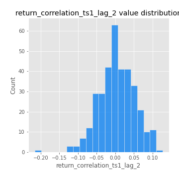
## Feature : return_correlation_ts1_lag_3
- **Feature type** : continous
- **Missing** : 0.0%
- **Unique** : 347
- **Count** :347.0
- **Mean** :0.008247178722011944
- **Std** :0.051933392192630025
- **Min** :-0.1270218498974763
- **25%th Percentile** : -0.02610238231565149
- **50%th Percentile** : 0.009164001352846406
- **75%th Percentile** : 0.04211835677442505
- **Max** :0.1636773216468148

## Feature : return_correlation_ts2_lag_1
- **Feature type** : continous
- **Missing** : 0.0%
- **Unique** : 347
- **Count** :347.0
- **Mean** :-0.0014890641967665284
- **Std** :0.05174970899971606
- **Min** :-0.2081139431093261
- **25%th Percentile** : -0.03527823627431946
- **50%th Percentile** : -0.000826169937067775
- **75%th Percentile** : 0.029107668844944222
- **Max** :0.17208763791364762

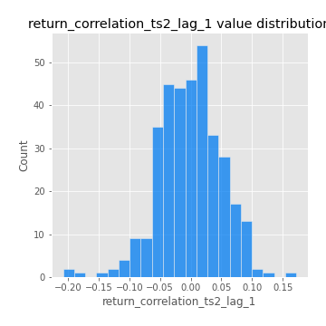
## Feature : return_correlation_ts2_lag_2
- **Feature type** : continous
- **Missing** : 0.0%
- **Unique** : 347
- **Count** :347.0
- **Mean** :0.004575194210497166
- **Std** :0.051927998775466416
- **Min** :-0.23751835475804678
- **25%th Percentile** : -0.03124771280257612
- **50%th Percentile** : 0.004463532829933748
- **75%th Percentile** : 0.03660678385673835
- **Max** :0.20772887392904255

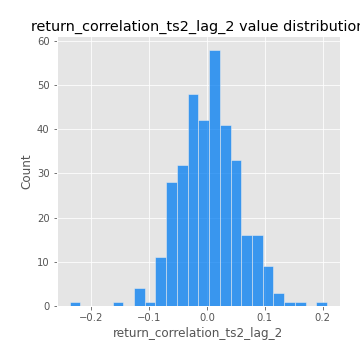
## Feature : return_correlation_ts2_lag_3
- **Feature type** : continous
- **Missing** : 0.0%
- **Unique** : 347
- **Count** :347.0
- **Mean** :0.0024434502059207234
- **Std** :0.05158959493084002
- **Min** :-0.17564076057312866
- **25%th Percentile** : -0.026230919795687733
- **50%th Percentile** : 0.0017062306092014044
- **75%th Percentile** : 0.036606426533325645
- **Max** :0.13128380114518473

## Feature : sqreturn_autocorrelation_ts1_lag1
- **Feature type** : continous
- **Missing** : 0.0%
- **Unique** : 347
- **Count** :347.0
- **Mean** :0.04927216782536075
- **Std** :0.09227004046796458
- **Min** :-0.09451421198614368
- **25%th Percentile** : -0.009727931151484629
- **50%th Percentile** : 0.025881988263396036
- **75%th Percentile** : 0.07984953986941637
- **Max** :0.4439086285737898

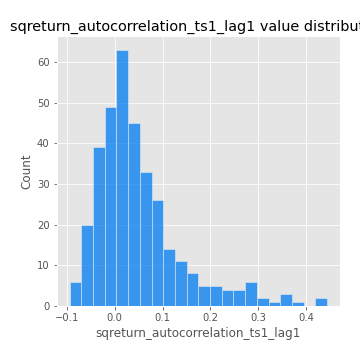
## Feature : sqreturn_autocorrelation_ts1_lag2
- **Feature type** : continous
- **Missing** : 0.0%
- **Unique** : 347
- **Count** :347.0
- **Mean** :0.03887941288508855
- **Std** :0.0861687098763847
- **Min** :-0.11303637801694279
- **25%th Percentile** : -0.014327943080218763
- **50%th Percentile** : 0.01626135840334948
- **75%th Percentile** : 0.06352479703874594
- **Max** :0.42719220751700526

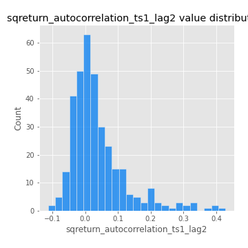
## Feature : sqreturn_autocorrelation_ts1_lag3
- **Feature type** : continous
- **Missing** : 0.0%
- **Unique** : 347
- **Count** :347.0
- **Mean** :0.03348813627109215
- **Std** :0.07763122244054786
- **Min** :-0.08419021359557262
- **25%th Percentile** : -0.017075239984037018
- **50%th Percentile** : 0.013507739782740676
- **75%th Percentile** : 0.056644392632660565
- **Max** :0.34857575772959026

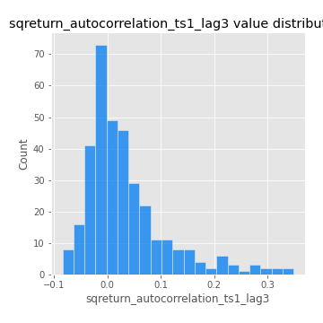
## Feature : sqreturn_autocorrelation_ts2_lag1
- **Feature type** : continous
- **Missing** : 0.0%
- **Unique** : 347
- **Count** :347.0
- **Mean** :0.04514811799928145
- **Std** :0.08152456947161936
- **Min** :-0.0892328171866746
- **25%th Percentile** : -0.010296314415659107
- **50%th Percentile** : 0.0220875234679677
- **75%th Percentile** : 0.07383976805608977
- **Max** :0.4190090519891419

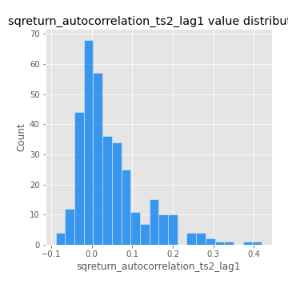
## Feature : sqreturn_autocorrelation_ts2_lag2
- **Feature type** : continous
- **Missing** : 0.0%
- **Unique** : 347
- **Count** :347.0
- **Mean** :0.03668331789731094
- **Std** :0.08709146675560961
- **Min** :-0.0845034496427181
- **25%th Percentile** : -0.01303197511785005
- **50%th Percentile** : 0.009973992634636376
- **75%th Percentile** : 0.0495552114613273
- **Max** :0.5373432415582473

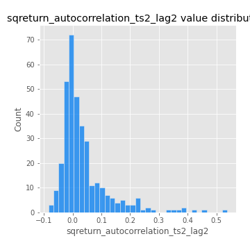
## Feature : sqreturn_autocorrelation_ts2_lag3
- **Feature type** : continous
- **Missing** : 0.0%
- **Unique** : 347
- **Count** :347.0
- **Mean** :0.02468679252604111
- **Std** :0.07225601974966883
- **Min** :-0.10505025521130086
- **25%th Percentile** : -0.02012659391940117
- **50%th Percentile** : 0.005843497408176627
- **75%th Percentile** : 0.04273022787281832
- **Max** :0.31225727797735664

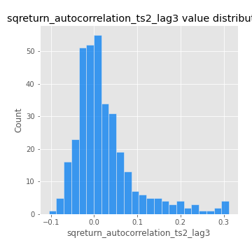
## Feature : sqreturn_correlation_ts1_lag_0
- **Feature type** : continous
- **Missing** : 0.0%
- **Unique** : 347
- **Count** :347.0
- **Mean** :0.340518540705731
- **Std** :0.11201881757312303
- **Min** :-0.027089510445801036
- **25%th Percentile** : 0.2797012111972227
- **50%th Percentile** : 0.3492588004736749
- **75%th Percentile** : 0.40023751577380445
- **Max** :0.7041861626832071

## Feature : sqreturn_correlation_ts1_lag_1
- **Feature type** : continous
- **Missing** : 0.0%
- **Unique** : 347
- **Count** :347.0
- **Mean** :-0.0003631981055139641
- **Std** :0.05245142172793927
- **Min** :-0.16985510949917193
- **25%th Percentile** : -0.03179838720151315
- **50%th Percentile** : 0.002157207880544263
- **75%th Percentile** : 0.03826186923368407
- **Max** :0.15499424718508623

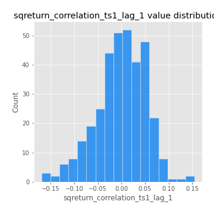
## Feature : sqreturn_correlation_ts1_lag_2
- **Feature type** : continous
- **Missing** : 0.0%
- **Unique** : 347
- **Count** :347.0
- **Mean** :0.0036748064331762597
- **Std** :0.048186934902361304
- **Min** :-0.21653581047581763
- **25%th Percentile** : -0.025754330809759234
- **50%th Percentile** : 0.0033132651790438064
- **75%th Percentile** : 0.03687819082676776
- **Max** :0.1273365704192747

## Feature : sqreturn_correlation_ts1_lag_3
- **Feature type** : continous
- **Missing** : 0.0%
- **Unique** : 347
- **Count** :347.0
- **Mean** :0.008247178722011944
- **Std** :0.051933392192630025
- **Min** :-0.1270218498974763
- **25%th Percentile** : -0.02610238231565149
- **50%th Percentile** : 0.009164001352846406
- **75%th Percentile** : 0.04211835677442505
- **Max** :0.1636773216468148

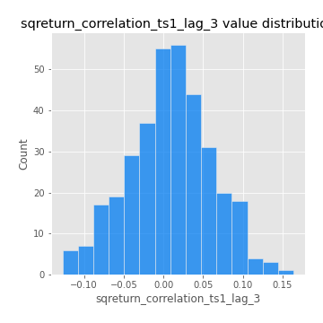
## Feature : sqreturn_correlation_ts2_lag_1
- **Feature type** : continous
- **Missing** : 0.0%
- **Unique** : 347
- **Count** :347.0
- **Mean** :-0.0014890641967665284
- **Std** :0.05174970899971606
- **Min** :-0.2081139431093261
- **25%th Percentile** : -0.03527823627431946
- **50%th Percentile** : -0.000826169937067775
- **75%th Percentile** : 0.029107668844944222
- **Max** :0.17208763791364762

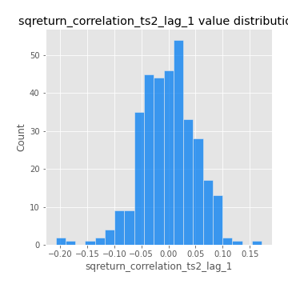
## Feature : sqreturn_correlation_ts2_lag_2
- **Feature type** : continous
- **Missing** : 0.0%
- **Unique** : 347
- **Count** :347.0
- **Mean** :0.004575194210497166
- **Std** :0.051927998775466416
- **Min** :-0.23751835475804678
- **25%th Percentile** : -0.03124771280257612
- **50%th Percentile** : 0.004463532829933748
- **75%th Percentile** : 0.03660678385673835
- **Max** :0.20772887392904255

## Feature : sqreturn_correlation_ts2_lag_3
- **Feature type** : continous
- **Missing** : 0.0%
- **Unique** : 347
- **Count** :347.0
- **Mean** :0.0024434502059207234
- **Std** :0.05158959493084002
- **Min** :-0.17564076057312866
- **25%th Percentile** : -0.026230919795687733
- **50%th Percentile** : 0.0017062306092014044
- **75%th Percentile** : 0.036606426533325645
- **Max** :0.13128380114518473

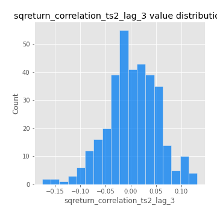
## Feature : price2_granger_cause_price1
- **Feature type** : continous
- **Missing** : 0.0%
- **Unique** : 347
- **Count** :347.0
- **Mean** :0.22687012049337477
- **Std** :0.2723713525376892
- **Min** :3.684908057540393e-12
- **25%th Percentile** : 0.005182655692448665
- **50%th Percentile** : 0.0995874928369756
- **75%th Percentile** : 0.3811062724960158
- **Max** :0.9853666024514321

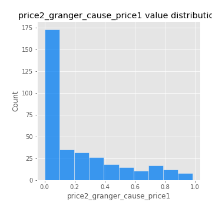
## Feature : price1_granger_cause_price2
- **Feature type** : continous
- **Missing** : 0.0%
- **Unique** : 347
- **Count** :347.0
- **Mean** :0.31273358918445937
- **Std** :0.27816810700902395
- **Min** :7.30800618801086e-06
- **25%th Percentile** : 0.06451751221546222
- **50%th Percentile** : 0.24884919691828303
- **75%th Percentile** : 0.5003923644230732
- **Max** :0.9991756088919865

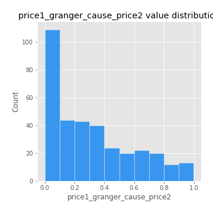

[<< Go back](../README.md)
