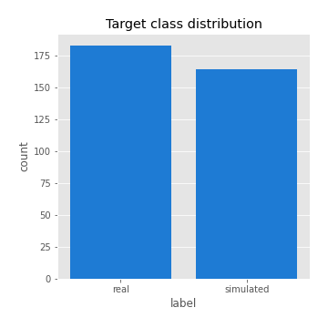
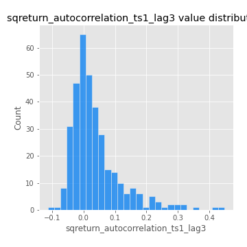
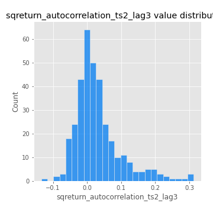

# Exploratory Data Analysis

[<< Go back](../README.md)
## Feature : target
- **Feature type** : categorical
- **Missing** : 0.0%
- **Unique** : 2
- **Count** :347
- **Unique** :2
- **Top** :real
- **Freq** :183

## Feature : return_mean1
- **Feature type** : continous
- **Missing** : 0.0%
- **Unique** : 347
- **Count** :347.0
- **Mean** :0.014054019250923262
- **Std** :0.10699666468834142
- **Min** :-0.4030054882353023
- **25%th Percentile** : -0.04457615200010112
- **50%th Percentile** : 0.029700224992778478
- **75%th Percentile** : 0.08354993080210382
- **Max** :0.4411297834913089

## Feature : return_mean2
- **Feature type** : continous
- **Missing** : 0.0%
- **Unique** : 347
- **Count** :347.0
- **Mean** :0.09447162748600557
- **Std** :0.10074126012735614
- **Min** :-0.24205418062825398
- **25%th Percentile** : 0.040911182359094744
- **50%th Percentile** : 0.09184727668649381
- **75%th Percentile** : 0.16099469569066716
- **Max** :0.3924583528492521

## Feature : return_sd1
- **Feature type** : continous
- **Missing** : 0.0%
- **Unique** : 347
- **Count** :347.0
- **Mean** :1.7922461689035512
- **Std** :0.7370196600302781
- **Min** :0.7470080772831957
- **25%th Percentile** : 1.556506543362481
- **50%th Percentile** : 1.6541341889526702
- **75%th Percentile** : 1.7780295286770156
- **Max** :9.236766377527575

## Feature : return_sd2
- **Feature type** : continous
- **Missing** : 0.0%
- **Unique** : 347
- **Count** :347.0
- **Mean** :1.850850190875085
- **Std** :0.6665651178880972
- **Min** :0.8592887433004143
- **25%th Percentile** : 1.5913104126821354
- **50%th Percentile** : 1.762547036557432
- **75%th Percentile** : 1.913126514717489
- **Max** :5.762808157208253

## Feature : return_skew1
- **Feature type** : continous
- **Missing** : 0.0%
- **Unique** : 347
- **Count** :347.0
- **Mean** :-0.14324775677415189
- **Std** :0.6883318391851823
- **Min** :-3.530116233761814
- **25%th Percentile** : -0.3204551207855199
- **50%th Percentile** : -0.05043759662347677
- **75%th Percentile** : 0.1588172508689178
- **Max** :2.5845963767725557

## Feature : return_skew2
- **Feature type** : continous
- **Missing** : 0.0%
- **Unique** : 347
- **Count** :347.0
- **Mean** :-0.19406974141173067
- **Std** :0.9287476073697017
- **Min** :-8.801502855292393
- **25%th Percentile** : -0.41738154750409723
- **50%th Percentile** : -0.07826754350192505
- **75%th Percentile** : 0.18664054211387088
- **Max** :2.2606839051517187

## Feature : return_kurtosis1
- **Feature type** : continous
- **Missing** : 0.0%
- **Unique** : 347
- **Count** :347.0
- **Mean** :4.3801255837511315
- **Std** :6.3903307511562115
- **Min** :-0.2999027431238135
- **25%th Percentile** : 0.8714443487769032
- **50%th Percentile** : 2.2171221086568713
- **75%th Percentile** : 4.521634451909939
- **Max** :46.07507808162177

## Feature : return_kurtosis2
- **Feature type** : continous
- **Missing** : 0.0%
- **Unique** : 347
- **Count** :347.0
- **Mean** :5.711242550376755
- **Std** :10.768074155544781
- **Min** :-0.3155055875550281
- **25%th Percentile** : 1.2142743146053778
- **50%th Percentile** : 2.7950233750665885
- **75%th Percentile** : 5.847271186825016
- **Max** :143.10871011533666

## Feature : return_autocorrelation_1_lag1
- **Feature type** : continous
- **Missing** : 0.0%
- **Unique** : 347
- **Count** :347.0
- **Mean** :-0.0019710468747968224
- **Std** :0.061037014579514666
- **Min** :-0.2135576224968752
- **25%th Percentile** : -0.03423002308720034
- **50%th Percentile** : 0.005212930600790154
- **75%th Percentile** : 0.03737122913470038
- **Max** :0.13830986764216377

## Feature : return_autocorrelation_1_lag2
- **Feature type** : continous
- **Missing** : 0.0%
- **Unique** : 347
- **Count** :347.0
- **Mean** :0.0013522692067380359
- **Std** :0.05452054033158799
- **Min** :-0.13309283796645122
- **25%th Percentile** : -0.03386494838079884
- **50%th Percentile** : 0.000643073297190363
- **75%th Percentile** : 0.03283816964977766
- **Max** :0.1620039019997912

## Feature : return_autocorrelation_1_lag3
- **Feature type** : continous
- **Missing** : 0.0%
- **Unique** : 347
- **Count** :347.0
- **Mean** :0.0069592377845606075
- **Std** :0.05420288073149212
- **Min** :-0.1940836867390813
- **25%th Percentile** : -0.030477977016957727
- **50%th Percentile** : 0.00845944405470225
- **75%th Percentile** : 0.04438700998541794
- **Max** :0.17805869530681923

## Feature : return_autocorrelation_2_lag1
- **Feature type** : continous
- **Missing** : 0.0%
- **Unique** : 347
- **Count** :347.0
- **Mean** :-0.007394262266837968
- **Std** :0.06022315245535099
- **Min** :-0.24590087874039124
- **25%th Percentile** : -0.036487519397608525
- **50%th Percentile** : -0.003242741316782181
- **75%th Percentile** : 0.0277073792384445
- **Max** :0.31863413537898483

## Feature : return_autocorrelation_2_lag2
- **Feature type** : continous
- **Missing** : 0.0%
- **Unique** : 347
- **Count** :347.0
- **Mean** :-0.00263254040468507
- **Std** :0.05108038896615505
- **Min** :-0.13300063901033632
- **25%th Percentile** : -0.03860252460210029
- **50%th Percentile** : -0.005738112684011857
- **75%th Percentile** : 0.029951411244402513
- **Max** :0.20974504043791217

## Feature : return_autocorrelation_2_lag3
- **Feature type** : continous
- **Missing** : 0.0%
- **Unique** : 347
- **Count** :347.0
- **Mean** :-0.004370997832801827
- **Std** :0.050588632510313244
- **Min** :-0.14200107169559698
- **25%th Percentile** : -0.0353615902107319
- **50%th Percentile** : -0.0053658812951810205
- **75%th Percentile** : 0.02734243173276832
- **Max** :0.146978421213268

## Feature : return_correlation_ts1_lag_0
- **Feature type** : continous
- **Missing** : 0.0%
- **Unique** : 347
- **Count** :347.0
- **Mean** :0.33831368522778665
- **Std** :0.11927174016563866
- **Min** :-0.027089510445801036
- **25%th Percentile** : 0.2684928886373308
- **50%th Percentile** : 0.3438947143821985
- **75%th Percentile** : 0.3972252432923078
- **Max** :0.7041861626832071

## Feature : return_correlation_ts1_lag_1
- **Feature type** : continous
- **Missing** : 0.0%
- **Unique** : 347
- **Count** :347.0
- **Mean** :-0.0012220484912867262
- **Std** :0.053706262163827685
- **Min** :-0.16985510949917193
- **25%th Percentile** : -0.03598287958726822
- **50%th Percentile** : 0.0013958571343517011
- **75%th Percentile** : 0.03564204303474818
- **Max** :0.15499424718508623

## Feature : return_correlation_ts1_lag_2
- **Feature type** : continous
- **Missing** : 0.0%
- **Unique** : 347
- **Count** :347.0
- **Mean** :-0.00022358262388777857
- **Std** :0.0492968535344213
- **Min** :-0.21653581047581763
- **25%th Percentile** : -0.03204168144512519
- **50%th Percentile** : 0.0012887099928209761
- **75%th Percentile** : 0.035067217816855935
- **Max** :0.11947366848959844

## Feature : return_correlation_ts1_lag_3
- **Feature type** : continous
- **Missing** : 0.0%
- **Unique** : 347
- **Count** :347.0
- **Mean** :0.0025579389142040268
- **Std** :0.05123657260157488
- **Min** :-0.1270218498974763
- **25%th Percentile** : -0.028829675106037914
- **50%th Percentile** : 0.005532420494007793
- **75%th Percentile** : 0.03462640960046308
- **Max** :0.1636773216468148

## Feature : return_correlation_ts2_lag_1
- **Feature type** : continous
- **Missing** : 0.0%
- **Unique** : 347
- **Count** :347.0
- **Mean** :-0.0018906610210206987
- **Std** :0.05472949186245064
- **Min** :-0.20093919236581337
- **25%th Percentile** : -0.03607262425525477
- **50%th Percentile** : -0.00034596390047452515
- **75%th Percentile** : 0.036034478564095904
- **Max** :0.1456600104807153

## Feature : return_correlation_ts2_lag_2
- **Feature type** : continous
- **Missing** : 0.0%
- **Unique** : 347
- **Count** :347.0
- **Mean** :0.004877971345148024
- **Std** :0.04736159833868594
- **Min** :-0.15299951737180204
- **25%th Percentile** : -0.027435247405799685
- **50%th Percentile** : 0.004224030850819424
- **75%th Percentile** : 0.03243147958454992
- **Max** :0.20772887392904255

## Feature : return_correlation_ts2_lag_3
- **Feature type** : continous
- **Missing** : 0.0%
- **Unique** : 347
- **Count** :347.0
- **Mean** :0.0023632638658670465
- **Std** :0.05350402703839342
- **Min** :-0.17564076057312866
- **25%th Percentile** : -0.02697850229522316
- **50%th Percentile** : 0.0005156439438987019
- **75%th Percentile** : 0.041514855088980264
- **Max** :0.13128380114518473

## Feature : sqreturn_autocorrelation_ts1_lag1
- **Feature type** : continous
- **Missing** : 0.0%
- **Unique** : 347
- **Count** :347.0
- **Mean** :0.05080722199967271
- **Std** :0.09318329896707973
- **Min** :-0.12064612381748523
- **25%th Percentile** : -0.012383235680691822
- **50%th Percentile** : 0.02646208242990712
- **75%th Percentile** : 0.08626020282751887
- **Max** :0.4439086285737898

## Feature : sqreturn_autocorrelation_ts1_lag2
- **Feature type** : continous
- **Missing** : 0.0%
- **Unique** : 347
- **Count** :347.0
- **Mean** :0.045324669552405106
- **Std** :0.09198412203069056
- **Min** :-0.08177824182008601
- **25%th Percentile** : -0.01101581598214484
- **50%th Percentile** : 0.01774433423526874
- **75%th Percentile** : 0.06897568219892941
- **Max** :0.540735851444759

## Feature : sqreturn_autocorrelation_ts1_lag3
- **Feature type** : continous
- **Missing** : 0.0%
- **Unique** : 347
- **Count** :347.0
- **Mean** :0.0361015415681405
- **Std** :0.08004942208103215
- **Min** :-0.11334300903493834
- **25%th Percentile** : -0.013703652839517175
- **50%th Percentile** : 0.01381718269959376
- **75%th Percentile** : 0.05742600832193391
- **Max** :0.44755937369538146

## Feature : sqreturn_autocorrelation_ts2_lag1
- **Feature type** : continous
- **Missing** : 0.0%
- **Unique** : 347
- **Count** :347.0
- **Mean** :0.048456772770139316
- **Std** :0.08716928040363668
- **Min** :-0.08905608084276065
- **25%th Percentile** : -0.010483211278377908
- **50%th Percentile** : 0.024838192339087774
- **75%th Percentile** : 0.08704246355173748
- **Max** :0.510085647437958

## Feature : sqreturn_autocorrelation_ts2_lag2
- **Feature type** : continous
- **Missing** : 0.0%
- **Unique** : 347
- **Count** :347.0
- **Mean** :0.0420968040151983
- **Std** :0.08750174637793251
- **Min** :-0.09196206236619435
- **25%th Percentile** : -0.008707754993964856
- **50%th Percentile** : 0.01601685926865175
- **75%th Percentile** : 0.06301721998518874
- **Max** :0.5373432415582473

## Feature : sqreturn_autocorrelation_ts2_lag3
- **Feature type** : continous
- **Missing** : 0.0%
- **Unique** : 347
- **Count** :347.0
- **Mean** :0.0304241028332297
- **Std** :0.06862887560922189
- **Min** :-0.13452961378587625
- **25%th Percentile** : -0.010886995580783392
- **50%th Percentile** : 0.013829435039296567
- **75%th Percentile** : 0.05319544954058923
- **Max** :0.31225727797735664

## Feature : sqreturn_correlation_ts1_lag_0
- **Feature type** : continous
- **Missing** : 0.0%
- **Unique** : 347
- **Count** :347.0
- **Mean** :0.33831368522778665
- **Std** :0.11927174016563866
- **Min** :-0.027089510445801036
- **25%th Percentile** : 0.2684928886373308
- **50%th Percentile** : 0.3438947143821985
- **75%th Percentile** : 0.3972252432923078
- **Max** :0.7041861626832071

## Feature : sqreturn_correlation_ts1_lag_1
- **Feature type** : continous
- **Missing** : 0.0%
- **Unique** : 347
- **Count** :347.0
- **Mean** :-0.0012220484912867262
- **Std** :0.053706262163827685
- **Min** :-0.16985510949917193
- **25%th Percentile** : -0.03598287958726822
- **50%th Percentile** : 0.0013958571343517011
- **75%th Percentile** : 0.03564204303474818
- **Max** :0.15499424718508623

## Feature : sqreturn_correlation_ts1_lag_2
- **Feature type** : continous
- **Missing** : 0.0%
- **Unique** : 347
- **Count** :347.0
- **Mean** :-0.00022358262388777857
- **Std** :0.0492968535344213
- **Min** :-0.21653581047581763
- **25%th Percentile** : -0.03204168144512519
- **50%th Percentile** : 0.0012887099928209761
- **75%th Percentile** : 0.035067217816855935
- **Max** :0.11947366848959844

## Feature : sqreturn_correlation_ts1_lag_3
- **Feature type** : continous
- **Missing** : 0.0%
- **Unique** : 347
- **Count** :347.0
- **Mean** :0.0025579389142040268
- **Std** :0.05123657260157488
- **Min** :-0.1270218498974763
- **25%th Percentile** : -0.028829675106037914
- **50%th Percentile** : 0.005532420494007793
- **75%th Percentile** : 0.03462640960046308
- **Max** :0.1636773216468148

## Feature : sqreturn_correlation_ts2_lag_1
- **Feature type** : continous
- **Missing** : 0.0%
- **Unique** : 347
- **Count** :347.0
- **Mean** :-0.0018906610210206987
- **Std** :0.05472949186245064
- **Min** :-0.20093919236581337
- **25%th Percentile** : -0.03607262425525477
- **50%th Percentile** : -0.00034596390047452515
- **75%th Percentile** : 0.036034478564095904
- **Max** :0.1456600104807153

## Feature : sqreturn_correlation_ts2_lag_2
- **Feature type** : continous
- **Missing** : 0.0%
- **Unique** : 347
- **Count** :347.0
- **Mean** :0.004877971345148024
- **Std** :0.04736159833868594
- **Min** :-0.15299951737180204
- **25%th Percentile** : -0.027435247405799685
- **50%th Percentile** : 0.004224030850819424
- **75%th Percentile** : 0.03243147958454992
- **Max** :0.20772887392904255

## Feature : sqreturn_correlation_ts2_lag_3
- **Feature type** : continous
- **Missing** : 0.0%
- **Unique** : 347
- **Count** :347.0
- **Mean** :0.0023632638658670465
- **Std** :0.05350402703839342
- **Min** :-0.17564076057312866
- **25%th Percentile** : -0.02697850229522316
- **50%th Percentile** : 0.0005156439438987019
- **75%th Percentile** : 0.041514855088980264
- **Max** :0.13128380114518473

## Feature : price2_granger_cause_price1
- **Feature type** : continous
- **Missing** : 0.0%
- **Unique** : 347
- **Count** :347.0
- **Mean** :0.27536108899168166
- **Std** :0.29678530387587815
- **Min** :3.5469874235903423e-13
- **25%th Percentile** : 0.015816172900350325
- **50%th Percentile** : 0.14183467535006206
- **75%th Percentile** : 0.4724568168668309
- **Max** :0.9885712803689185

## Feature : price1_granger_cause_price2
- **Feature type** : continous
- **Missing** : 0.0%
- **Unique** : 347
- **Count** :347.0
- **Mean** :0.3334412851762518
- **Std** :0.2821903012077283
- **Min** :2.3169577405454604e-05
- **25%th Percentile** : 0.0740755740355312
- **50%th Percentile** : 0.2763460062172228
- **75%th Percentile** : 0.557208524550211
- **Max** :0.9995188914530474

[<< Go back](../README.md)
