# Exploratory Data Analysis

[<< Go back](../README.md)
## Feature : target
- **Feature type** : categorical
- **Missing** : 0.0%
- **Unique** : 2
- **Count** :347
- **Unique** :2
- **Top** :simulated
- **Freq** :177

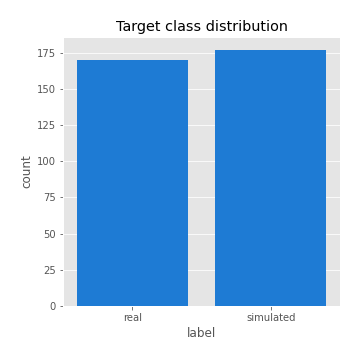
## Feature : return_mean1
- **Feature type** : continous
- **Missing** : 0.0%
- **Unique** : 347
- **Count** :347.0
- **Mean** :0.013312612231641489
- **Std** :0.1026681641181176
- **Min** :-0.41470233703187903
- **25%th Percentile** : -0.04316344859928105
- **50%th Percentile** : 0.022252672466928546
- **75%th Percentile** : 0.07671821493048883
- **Max** :0.37175100008111034

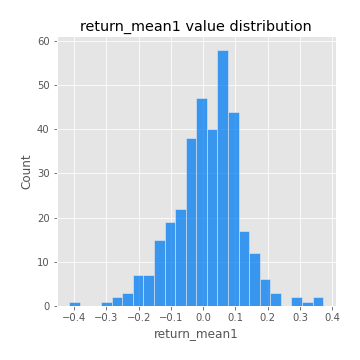
## Feature : return_mean2
- **Feature type** : continous
- **Missing** : 0.0%
- **Unique** : 347
- **Count** :347.0
- **Mean** :0.10072884727206702
- **Std** :0.09880182559914259
- **Min** :-0.2144814672643959
- **25%th Percentile** : 0.04096937738165538
- **50%th Percentile** : 0.0980102616521251
- **75%th Percentile** : 0.1617132658519687
- **Max** :0.37616608147096464

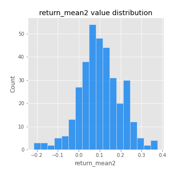
## Feature : return_sd1
- **Feature type** : continous
- **Missing** : 0.0%
- **Unique** : 347
- **Count** :347.0
- **Mean** :1.7751635737859734
- **Std** :0.738816588287169
- **Min** :0.8382061051466024
- **25%th Percentile** : 1.5590796938569547
- **50%th Percentile** : 1.6320221356529403
- **75%th Percentile** : 1.7483534010873905
- **Max** :9.236766377527575

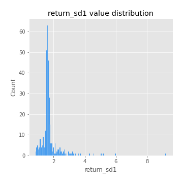
## Feature : return_sd2
- **Feature type** : continous
- **Missing** : 0.0%
- **Unique** : 347
- **Count** :347.0
- **Mean** :1.8863637262752622
- **Std** :0.7162251310767563
- **Min** :0.8455946193085045
- **25%th Percentile** : 1.6401011191459425
- **50%th Percentile** : 1.7720316575566335
- **75%th Percentile** : 1.8976169157268414
- **Max** :6.737618636746393

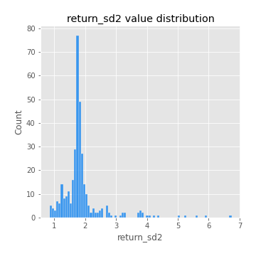
## Feature : return_skew1
- **Feature type** : continous
- **Missing** : 0.0%
- **Unique** : 347
- **Count** :347.0
- **Mean** :-0.1178601836049562
- **Std** :0.6351703830870902
- **Min** :-3.530116233761814
- **25%th Percentile** : -0.29740156945882745
- **50%th Percentile** : -0.06753604793094878
- **75%th Percentile** : 0.13145205565383977
- **Max** :2.5845963767725557

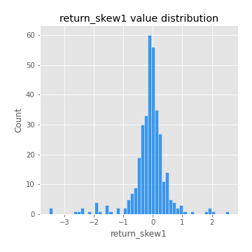
## Feature : return_skew2
- **Feature type** : continous
- **Missing** : 0.0%
- **Unique** : 347
- **Count** :347.0
- **Mean** :-0.1628609443766663
- **Std** :0.7854046151529944
- **Min** :-5.778144124281153
- **25%th Percentile** : -0.4120552543514621
- **50%th Percentile** : -0.08652168841547545
- **75%th Percentile** : 0.15351132375294924
- **Max** :2.2606839051517187

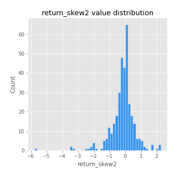
## Feature : return_kurtosis1
- **Feature type** : continous
- **Missing** : 0.0%
- **Unique** : 347
- **Count** :347.0
- **Mean** :3.8987849330787987
- **Std** :5.998876824000497
- **Min** :-0.35503537784387174
- **25%th Percentile** : 0.720124970459312
- **50%th Percentile** : 1.8045331960405346
- **75%th Percentile** : 4.176603147926987
- **Max** :46.07507808162177

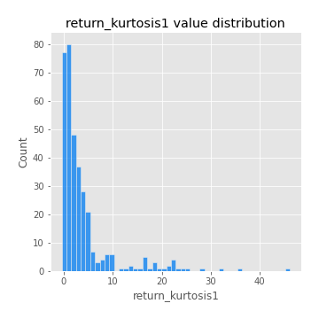
## Feature : return_kurtosis2
- **Feature type** : continous
- **Missing** : 0.0%
- **Unique** : 347
- **Count** :347.0
- **Mean** :5.315994707530729
- **Std** :7.391366238081901
- **Min** :-0.10224221147712909
- **25%th Percentile** : 1.3023609181993958
- **50%th Percentile** : 2.9480809274591375
- **75%th Percentile** : 6.16829126192635
- **Max** :71.39844769176813

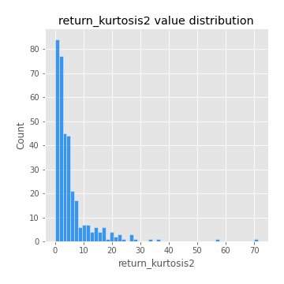
## Feature : return_autocorrelation_1_lag1
- **Feature type** : continous
- **Missing** : 0.0%
- **Unique** : 347
- **Count** :347.0
- **Mean** :-0.005287921327673742
- **Std** :0.05930911346065676
- **Min** :-0.2135576224968752
- **25%th Percentile** : -0.034367988936053334
- **50%th Percentile** : 0.003455720940083524
- **75%th Percentile** : 0.03738353568560131
- **Max** :0.12810656890648087

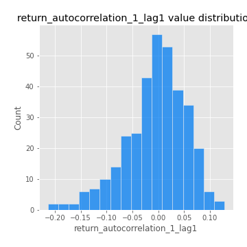
## Feature : return_autocorrelation_1_lag2
- **Feature type** : continous
- **Missing** : 0.0%
- **Unique** : 347
- **Count** :347.0
- **Mean** :0.0012295539659020105
- **Std** :0.049167651411989054
- **Min** :-0.12172858720259
- **25%th Percentile** : -0.031578587259107394
- **50%th Percentile** : -0.00021514778654450553
- **75%th Percentile** : 0.034514163352571924
- **Max** :0.13553587149024285

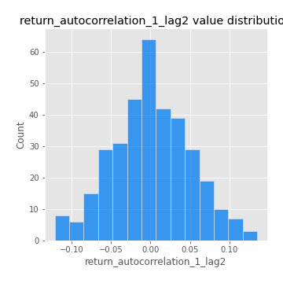
## Feature : return_autocorrelation_1_lag3
- **Feature type** : continous
- **Missing** : 0.0%
- **Unique** : 347
- **Count** :347.0
- **Mean** :0.008006471095025513
- **Std** :0.05113185941096189
- **Min** :-0.1940836867390813
- **25%th Percentile** : -0.022226012780570507
- **50%th Percentile** : 0.007471659635639196
- **75%th Percentile** : 0.040118715539294456
- **Max** :0.17805869530681923

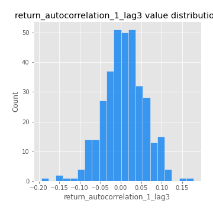
## Feature : return_autocorrelation_2_lag1
- **Feature type** : continous
- **Missing** : 0.0%
- **Unique** : 347
- **Count** :347.0
- **Mean** :-0.007018925575758061
- **Std** :0.06201416691910985
- **Min** :-0.24590087874039124
- **25%th Percentile** : -0.04108963121927256
- **50%th Percentile** : -0.0014327133341762272
- **75%th Percentile** : 0.03265288146324796
- **Max** :0.31863413537898483

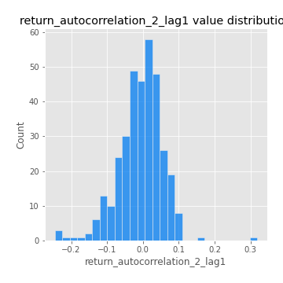
## Feature : return_autocorrelation_2_lag2
- **Feature type** : continous
- **Missing** : 0.0%
- **Unique** : 347
- **Count** :347.0
- **Mean** :-0.0008410320701118054
- **Std** :0.0528938565853905
- **Min** :-0.15323211089747296
- **25%th Percentile** : -0.03624963562793558
- **50%th Percentile** : -0.002527484749183836
- **75%th Percentile** : 0.030871506137053993
- **Max** :0.20974504043791217

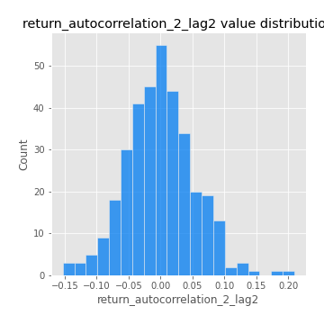
## Feature : return_autocorrelation_2_lag3
- **Feature type** : continous
- **Missing** : 0.0%
- **Unique** : 347
- **Count** :347.0
- **Mean** :0.0002503432390071664
- **Std** :0.04762405782563072
- **Min** :-0.14200107169559698
- **25%th Percentile** : -0.03204870669404619
- **50%th Percentile** : 0.0007330338250546356
- **75%th Percentile** : 0.03003566432082607
- **Max** :0.16381336510282504

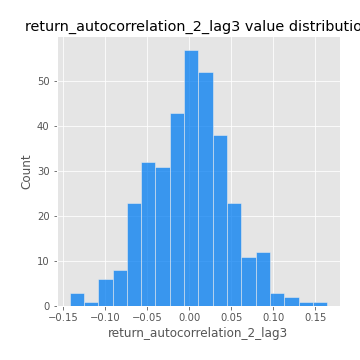
## Feature : return_correlation_ts1_lag_0
- **Feature type** : continous
- **Missing** : 0.0%
- **Unique** : 347
- **Count** :347.0
- **Mean** :0.3327034376492003
- **Std** :0.1125899457060484
- **Min** :-0.027089510445801036
- **25%th Percentile** : 0.27477902530085585
- **50%th Percentile** : 0.33996542164416005
- **75%th Percentile** : 0.3936600824366998
- **Max** :0.7041861626832071

## Feature : return_correlation_ts1_lag_1
- **Feature type** : continous
- **Missing** : 0.0%
- **Unique** : 347
- **Count** :347.0
- **Mean** :0.0003133606656647548
- **Std** :0.0509911293763191
- **Min** :-0.16985510949917193
- **25%th Percentile** : -0.03420483157473245
- **50%th Percentile** : 0.0014913360691627712
- **75%th Percentile** : 0.037805851059607994
- **Max** :0.15499424718508623

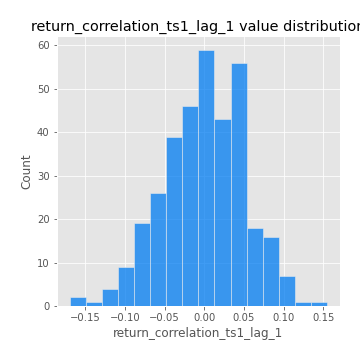
## Feature : return_correlation_ts1_lag_2
- **Feature type** : continous
- **Missing** : 0.0%
- **Unique** : 347
- **Count** :347.0
- **Mean** :2.2526463473738074e-05
- **Std** :0.04763653410530866
- **Min** :-0.21653581047581763
- **25%th Percentile** : -0.03171713635769487
- **50%th Percentile** : -0.0022021691130074987
- **75%th Percentile** : 0.03075899975762934
- **Max** :0.11552053853403042

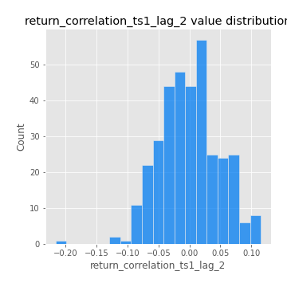
## Feature : return_correlation_ts1_lag_3
- **Feature type** : continous
- **Missing** : 0.0%
- **Unique** : 347
- **Count** :347.0
- **Mean** :0.005368263614036492
- **Std** :0.051719326408341364
- **Min** :-0.12306593817498207
- **25%th Percentile** : -0.028016331248820796
- **50%th Percentile** : 0.0027221200054549912
- **75%th Percentile** : 0.04378770708099709
- **Max** :0.1636773216468148

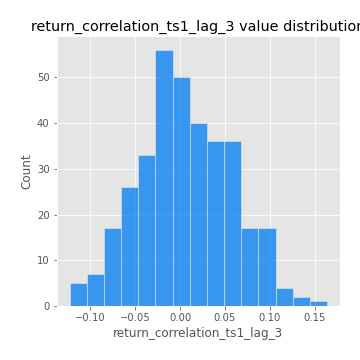
## Feature : return_correlation_ts2_lag_1
- **Feature type** : continous
- **Missing** : 0.0%
- **Unique** : 347
- **Count** :347.0
- **Mean** :0.0003728434195005456
- **Std** :0.05448837261995108
- **Min** :-0.2081139431093261
- **25%th Percentile** : -0.03033465555004308
- **50%th Percentile** : 0.0003890490001213905
- **75%th Percentile** : 0.03763401722859646
- **Max** :0.1285299577258529

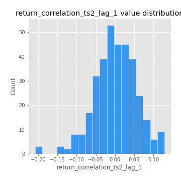
## Feature : return_correlation_ts2_lag_2
- **Feature type** : continous
- **Missing** : 0.0%
- **Unique** : 347
- **Count** :347.0
- **Mean** :0.0010919245862841642
- **Std** :0.04904914561772095
- **Min** :-0.23751835475804678
- **25%th Percentile** : -0.0276337135630455
- **50%th Percentile** : 0.0022770941881023487
- **75%th Percentile** : 0.029685254220681363
- **Max** :0.15388933426238696

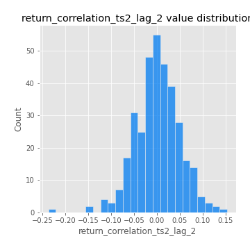
## Feature : return_correlation_ts2_lag_3
- **Feature type** : continous
- **Missing** : 0.0%
- **Unique** : 347
- **Count** :347.0
- **Mean** :0.009309401833892162
- **Std** :0.048337242907990546
- **Min** :-0.15490495486968472
- **25%th Percentile** : -0.021609359302553637
- **50%th Percentile** : 0.008829382316756328
- **75%th Percentile** : 0.04415374342576396
- **Max** :0.14139253532113696

## Feature : sqreturn_autocorrelation_ts1_lag1
- **Feature type** : continous
- **Missing** : 0.0%
- **Unique** : 347
- **Count** :347.0
- **Mean** :0.05029673977580005
- **Std** :0.09312818479032658
- **Min** :-0.08731225760049333
- **25%th Percentile** : -0.009300222217086023
- **50%th Percentile** : 0.024032305878409526
- **75%th Percentile** : 0.08275441791374133
- **Max** :0.49414293176447355

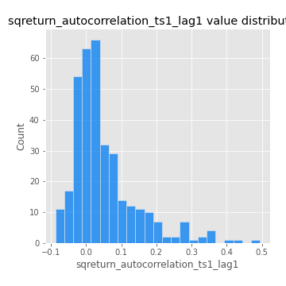
## Feature : sqreturn_autocorrelation_ts1_lag2
- **Feature type** : continous
- **Missing** : 0.0%
- **Unique** : 347
- **Count** :347.0
- **Mean** :0.04243096400525496
- **Std** :0.09152605266844085
- **Min** :-0.11496878556811428
- **25%th Percentile** : -0.01365423998521401
- **50%th Percentile** : 0.01438665182715873
- **75%th Percentile** : 0.06818846683875823
- **Max** :0.540735851444759

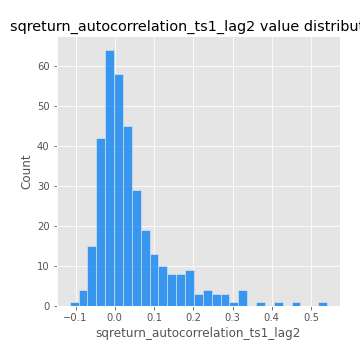
## Feature : sqreturn_autocorrelation_ts1_lag3
- **Feature type** : continous
- **Missing** : 0.0%
- **Unique** : 347
- **Count** :347.0
- **Mean** :0.03499377316300956
- **Std** :0.08241821110387243
- **Min** :-0.11118267632134475
- **25%th Percentile** : -0.015737324162560087
- **50%th Percentile** : 0.012593715022244586
- **75%th Percentile** : 0.05496456686710034
- **Max** :0.44755937369538146

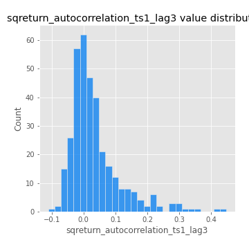
## Feature : sqreturn_autocorrelation_ts2_lag1
- **Feature type** : continous
- **Missing** : 0.0%
- **Unique** : 347
- **Count** :347.0
- **Mean** :0.045195898152658225
- **Std** :0.08864765107109908
- **Min** :-0.117180752383204
- **25%th Percentile** : -0.013421477860041997
- **50%th Percentile** : 0.020890313633460743
- **75%th Percentile** : 0.07673656701728544
- **Max** :0.510085647437958

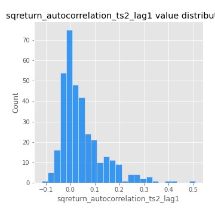
## Feature : sqreturn_autocorrelation_ts2_lag2
- **Feature type** : continous
- **Missing** : 0.0%
- **Unique** : 347
- **Count** :347.0
- **Mean** :0.03688063759740052
- **Std** :0.08700619652850507
- **Min** :-0.08353106990912691
- **25%th Percentile** : -0.012559031036980821
- **50%th Percentile** : 0.008393639699920732
- **75%th Percentile** : 0.0506924651679968
- **Max** :0.5373432415582473

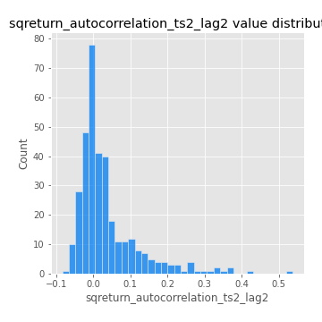
## Feature : sqreturn_autocorrelation_ts2_lag3
- **Feature type** : continous
- **Missing** : 0.0%
- **Unique** : 347
- **Count** :347.0
- **Mean** :0.022724828718537076
- **Std** :0.0678979218393648
- **Min** :-0.11886729956727778
- **25%th Percentile** : -0.016364708760500266
- **50%th Percentile** : 0.0032351112157377117
- **75%th Percentile** : 0.03917099819576842
- **Max** :0.30256115637327263

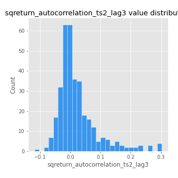
## Feature : sqreturn_correlation_ts1_lag_0
- **Feature type** : continous
- **Missing** : 0.0%
- **Unique** : 347
- **Count** :347.0
- **Mean** :0.3327034376492003
- **Std** :0.1125899457060484
- **Min** :-0.027089510445801036
- **25%th Percentile** : 0.27477902530085585
- **50%th Percentile** : 0.33996542164416005
- **75%th Percentile** : 0.3936600824366998
- **Max** :0.7041861626832071

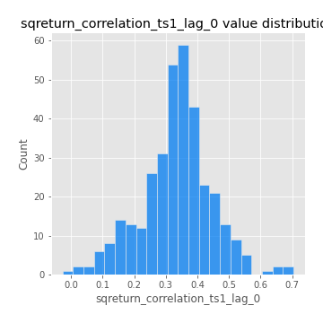
## Feature : sqreturn_correlation_ts1_lag_1
- **Feature type** : continous
- **Missing** : 0.0%
- **Unique** : 347
- **Count** :347.0
- **Mean** :0.0003133606656647548
- **Std** :0.0509911293763191
- **Min** :-0.16985510949917193
- **25%th Percentile** : -0.03420483157473245
- **50%th Percentile** : 0.0014913360691627712
- **75%th Percentile** : 0.037805851059607994
- **Max** :0.15499424718508623

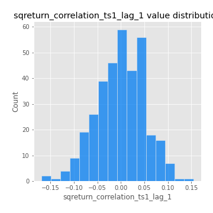
## Feature : sqreturn_correlation_ts1_lag_2
- **Feature type** : continous
- **Missing** : 0.0%
- **Unique** : 347
- **Count** :347.0
- **Mean** :2.2526463473738074e-05
- **Std** :0.04763653410530866
- **Min** :-0.21653581047581763
- **25%th Percentile** : -0.03171713635769487
- **50%th Percentile** : -0.0022021691130074987
- **75%th Percentile** : 0.03075899975762934
- **Max** :0.11552053853403042

## Feature : sqreturn_correlation_ts1_lag_3
- **Feature type** : continous
- **Missing** : 0.0%
- **Unique** : 347
- **Count** :347.0
- **Mean** :0.005368263614036492
- **Std** :0.051719326408341364
- **Min** :-0.12306593817498207
- **25%th Percentile** : -0.028016331248820796
- **50%th Percentile** : 0.0027221200054549912
- **75%th Percentile** : 0.04378770708099709
- **Max** :0.1636773216468148

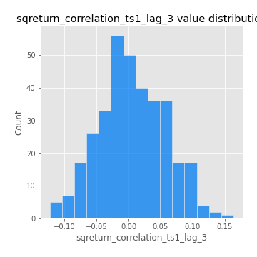
## Feature : sqreturn_correlation_ts2_lag_1
- **Feature type** : continous
- **Missing** : 0.0%
- **Unique** : 347
- **Count** :347.0
- **Mean** :0.0003728434195005456
- **Std** :0.05448837261995108
- **Min** :-0.2081139431093261
- **25%th Percentile** : -0.03033465555004308
- **50%th Percentile** : 0.0003890490001213905
- **75%th Percentile** : 0.03763401722859646
- **Max** :0.1285299577258529

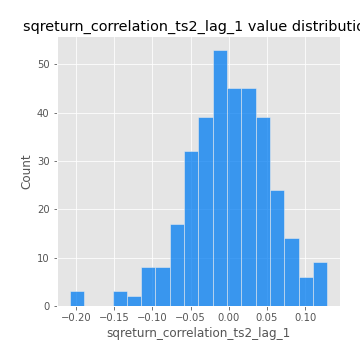
## Feature : sqreturn_correlation_ts2_lag_2
- **Feature type** : continous
- **Missing** : 0.0%
- **Unique** : 347
- **Count** :347.0
- **Mean** :0.0010919245862841642
- **Std** :0.04904914561772095
- **Min** :-0.23751835475804678
- **25%th Percentile** : -0.0276337135630455
- **50%th Percentile** : 0.0022770941881023487
- **75%th Percentile** : 0.029685254220681363
- **Max** :0.15388933426238696

## Feature : sqreturn_correlation_ts2_lag_3
- **Feature type** : continous
- **Missing** : 0.0%
- **Unique** : 347
- **Count** :347.0
- **Mean** :0.009309401833892162
- **Std** :0.048337242907990546
- **Min** :-0.15490495486968472
- **25%th Percentile** : -0.021609359302553637
- **50%th Percentile** : 0.008829382316756328
- **75%th Percentile** : 0.04415374342576396
- **Max** :0.14139253532113696

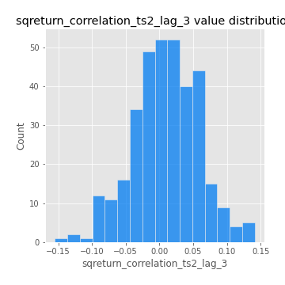
## Feature : price2_granger_cause_price1
- **Feature type** : continous
- **Missing** : 0.0%
- **Unique** : 347
- **Count** :347.0
- **Mean** :0.24015530124442094
- **Std** :0.278081834764987
- **Min** :8.09494711134577e-11
- **25%th Percentile** : 0.010315996123525014
- **50%th Percentile** : 0.11010942906136534
- **75%th Percentile** : 0.39545576891568823
- **Max** :0.9994059823571391

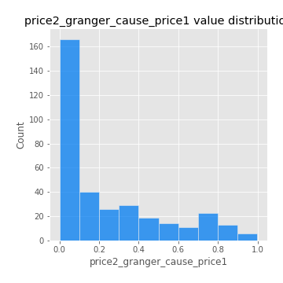
## Feature : price1_granger_cause_price2
- **Feature type** : continous
- **Missing** : 0.0%
- **Unique** : 347
- **Count** :347.0
- **Mean** :0.3271956843537814
- **Std** :0.28891419851386296
- **Min** :4.6736302040784935e-07
- **25%th Percentile** : 0.05651000093965339
- **50%th Percentile** : 0.25911355233688016
- **75%th Percentile** : 0.5437055925557714
- **Max** :0.996910393769651

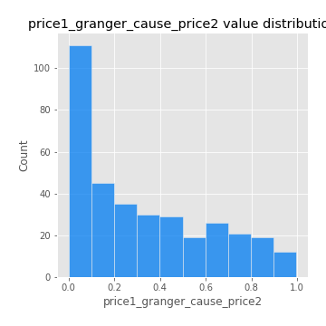

[<< Go back](../README.md)
