# Summary of 2_DecisionTree

[<< Go back](../README.md)

## Decision Tree
- **n_jobs**: -1
- **criterion**: gini
- **max_depth**: 3
- **explain_level**: 2

## Validation
 - **validation_type**: split
 - **train_ratio**: 0.75
 - **shuffle**: True
 - **stratify**: True

## Optimized metric
accuracy

## Training time

21.4 seconds

## Metric details
|           |    score |   threshold |
|:----------|---------:|------------:|
| logloss   | 0.903894 |  nan        |
| auc       | 0.864693 |  nan        |
| f1        | 0.837209 |    0.441176 |
| accuracy  | 0.83908  |    0.441176 |
| precision | 0.894737 |    0.923633 |
| recall    | 0.954545 |    0        |
| mcc       | 0.685158 |    0.923633 |

## Confusion matrix (at threshold=0.441176)
|                      |   Predicted as real |   Predicted as simulated |
|:---------------------|--------------------:|-------------------------:|
| Labeled as real      |                  37 |                        6 |
| Labeled as simulated |                   8 |                       36 |

## Learning curves
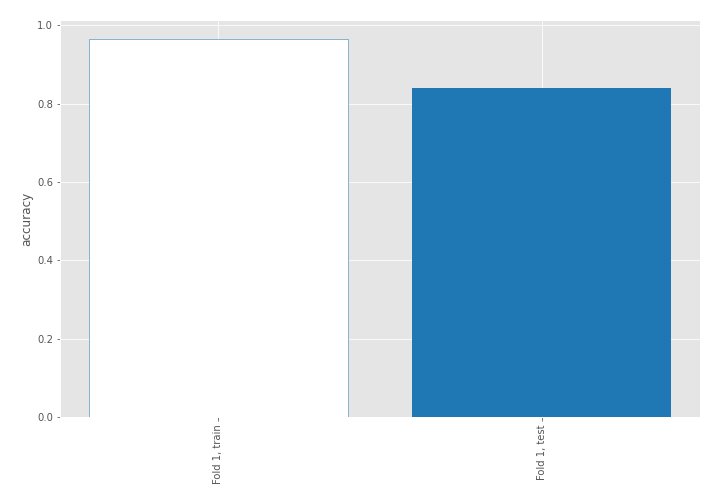

## Decision Tree 

### Tree #1
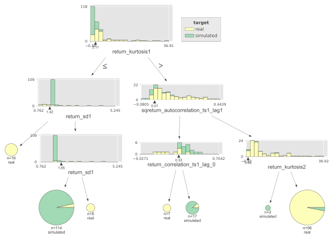

### Rules

if (return_kurtosis1 <= 2.11) and (return_sd1 > 1.416) and (return_sd1 <= 1.95) then class: simulated (proba: 96.49%) | based on 114 samples

if (return_kurtosis1 > 2.11) and (sqreturn_autocorrelation_ts1_lag1 > 0.009) and (return_kurtosis2 > 0.651) then class: real (proba: 96.88%) | based on 96 samples

if (return_kurtosis1 > 2.11) and (sqreturn_autocorrelation_ts1_lag1 <= 0.009) and (return_correlation_ts1_lag_0 > 0.33) then class: simulated (proba: 88.24%) | based on 17 samples

if (return_kurtosis1 <= 2.11) and (return_sd1 <= 1.416) then class: real (proba: 100.0%) | based on 16 samples

if (return_kurtosis1 <= 2.11) and (return_sd1 > 1.416) and (return_sd1 > 1.95) then class: real (proba: 100.0%) | based on 8 samples

if (return_kurtosis1 > 2.11) and (sqreturn_autocorrelation_ts1_lag1 <= 0.009) and (return_correlation_ts1_lag_0 <= 0.33) then class: real (proba: 100.0%) | based on 7 samples

if (return_kurtosis1 > 2.11) and (sqreturn_autocorrelation_ts1_lag1 > 0.009) and (return_kurtosis2 <= 0.651) then class: simulated (proba: 100.0%) | based on 2 samples

## Permutation-based Importance
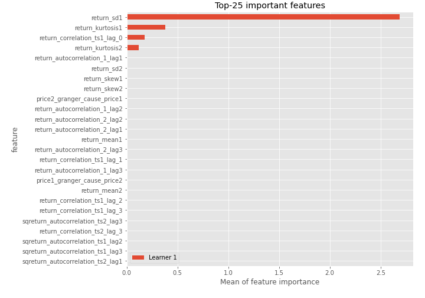
## Confusion Matrix

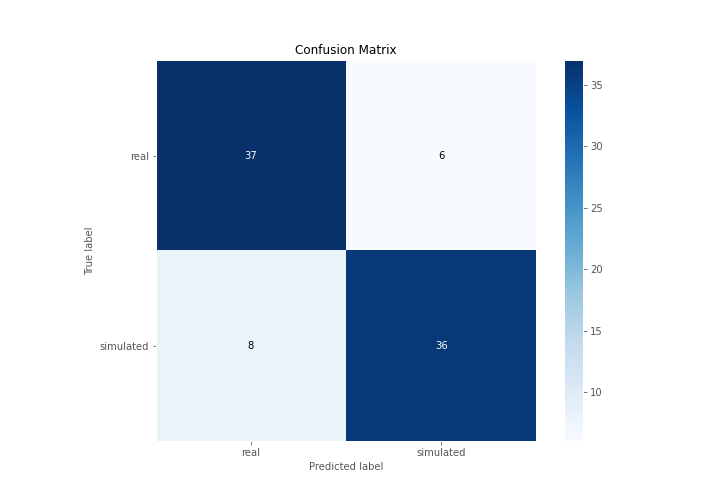

## Normalized Confusion Matrix

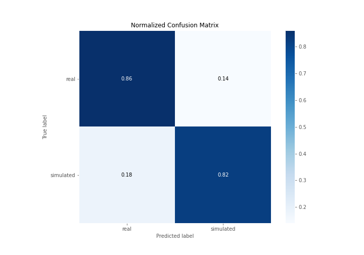

## ROC Curve

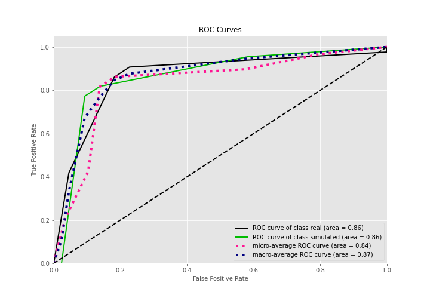

## Kolmogorov-Smirnov Statistic

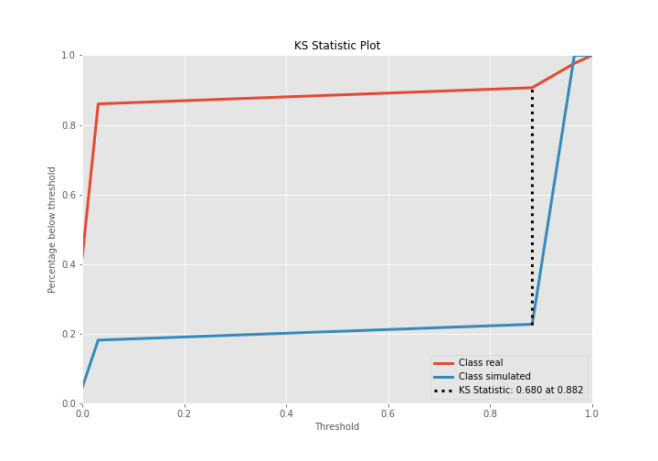

## Precision-Recall Curve

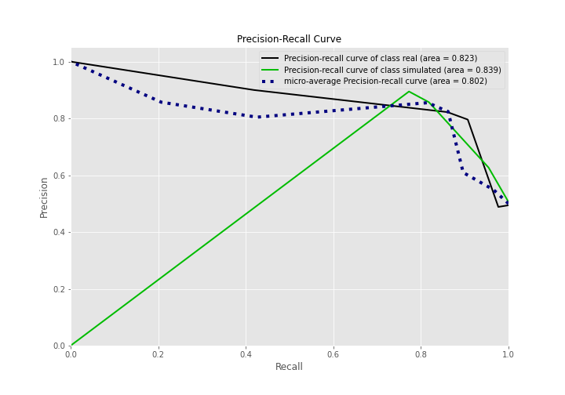

## Calibration Curve

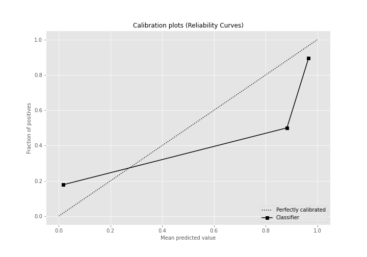

## Cumulative Gains Curve

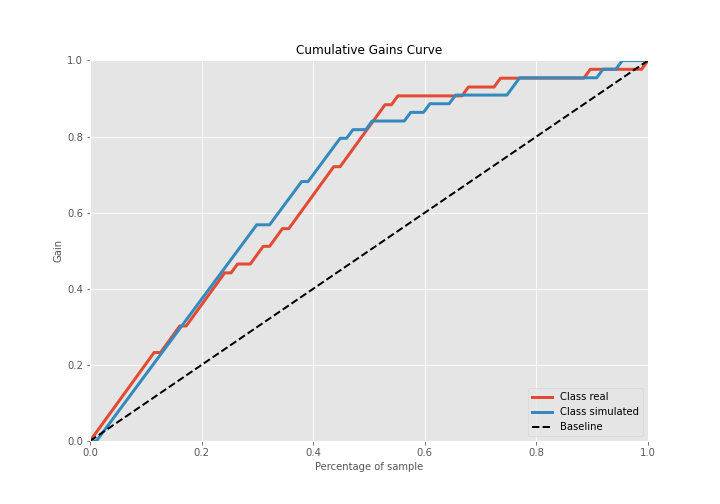

## Lift Curve

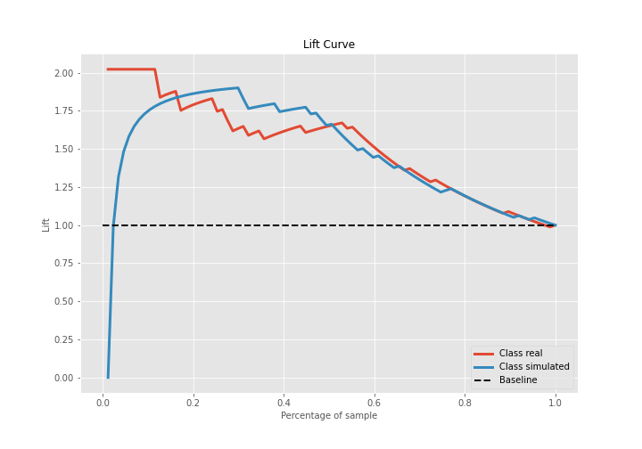

## SHAP Importance
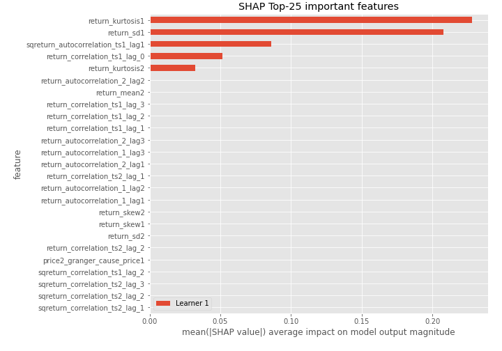

## SHAP Dependence plots

### Dependence (Fold 1)
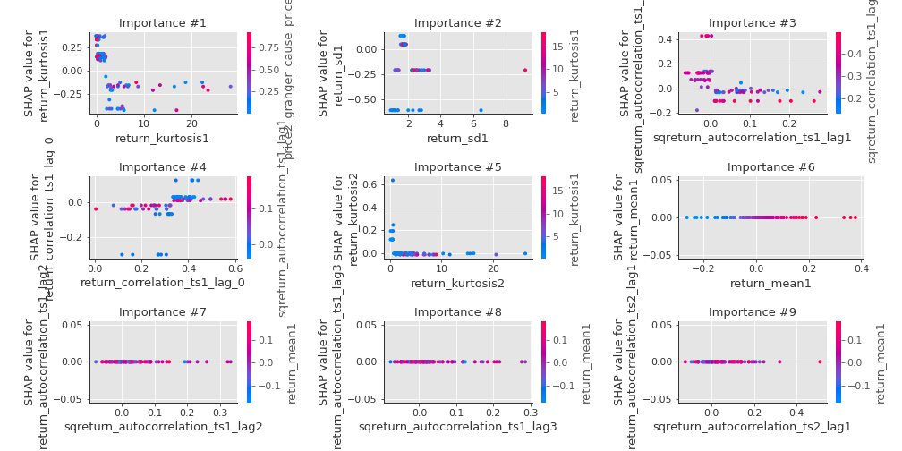

## SHAP Decision plots

### Top-10 Worst decisions for class 0 (Fold 1)
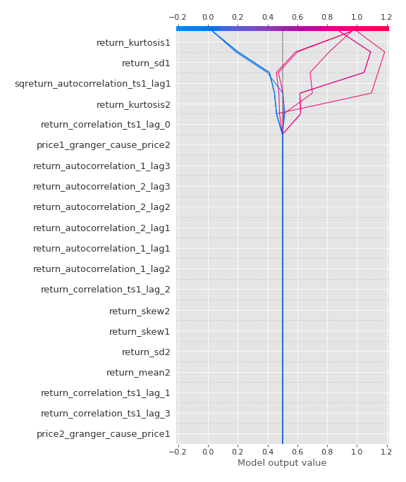
### Top-10 Best decisions for class 0 (Fold 1)
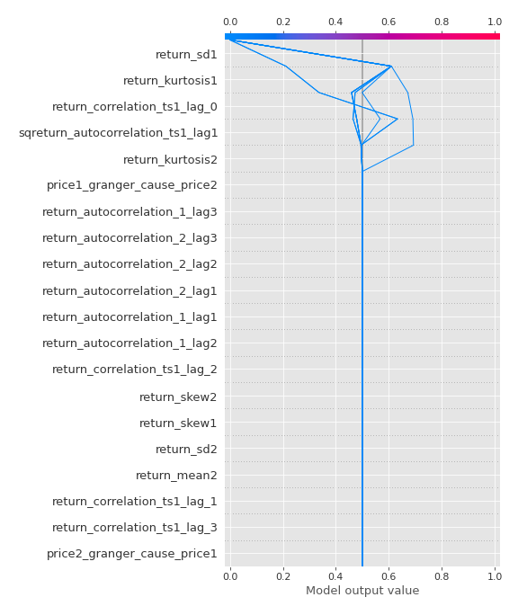
### Top-10 Worst decisions for class 1 (Fold 1)
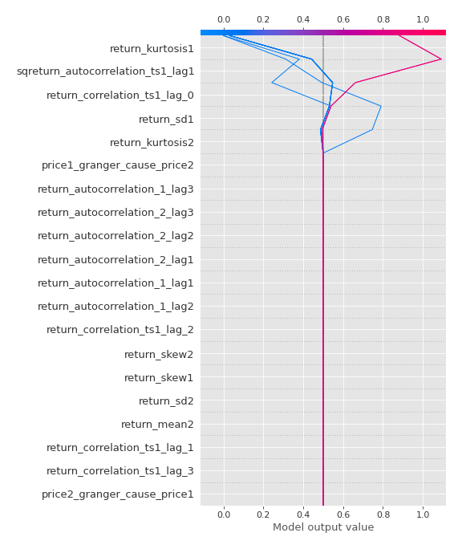
### Top-10 Best decisions for class 1 (Fold 1)
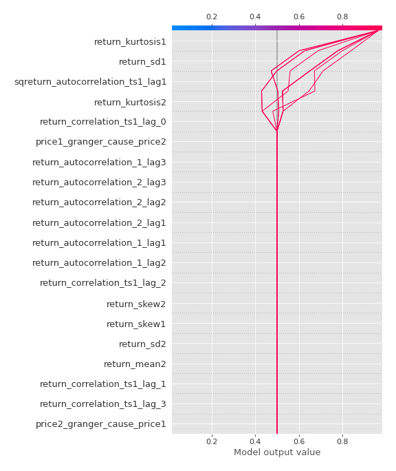

[<< Go back](../README.md)
