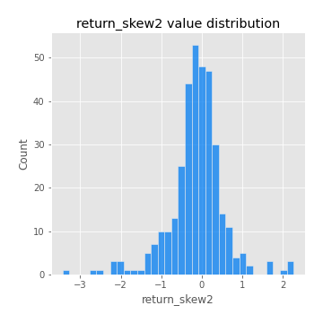
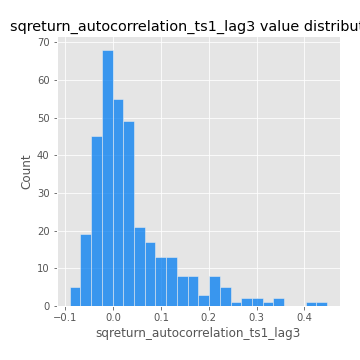
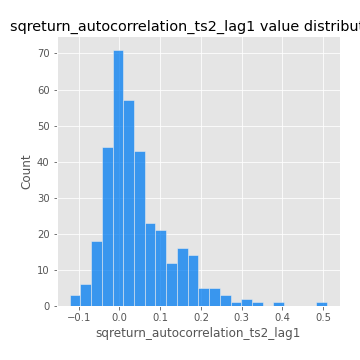

# Exploratory Data Analysis

[<< Go back](../README.md)
## Feature : target
- **Feature type** : categorical
- **Missing** : 0.0%
- **Unique** : 2
- **Count** :347
- **Unique** :2
- **Top** :simulated
- **Freq** :174

## Feature : return_mean1
- **Feature type** : continous
- **Missing** : 0.0%
- **Unique** : 347
- **Count** :347.0
- **Mean** :0.016315544612773458
- **Std** :0.10341990708956202
- **Min** :-0.2632370018491012
- **25%th Percentile** : -0.048572728966093354
- **50%th Percentile** : 0.021934692753096476
- **75%th Percentile** : 0.08394490599281391
- **Max** :0.37760571663613696

## Feature : return_mean2
- **Feature type** : continous
- **Missing** : 0.0%
- **Unique** : 347
- **Count** :347.0
- **Mean** :0.10564101225590433
- **Std** :0.10001233785212367
- **Min** :-0.21818165578778434
- **25%th Percentile** : 0.04371612790203011
- **50%th Percentile** : 0.09822058238526712
- **75%th Percentile** : 0.17204246546784904
- **Max** :0.37616608147096464

## Feature : return_sd1
- **Feature type** : continous
- **Missing** : 0.0%
- **Unique** : 347
- **Count** :347.0
- **Mean** :1.8047653217801374
- **Std** :0.7689917059204914
- **Min** :0.7620831696941981
- **25%th Percentile** : 1.5584728377835624
- **50%th Percentile** : 1.6493410790115475
- **75%th Percentile** : 1.750101783758784
- **Max** :9.236766377527575

## Feature : return_sd2
- **Feature type** : continous
- **Missing** : 0.0%
- **Unique** : 347
- **Count** :347.0
- **Mean** :1.8718969445616451
- **Std** :0.6688176986354953
- **Min** :0.8592887433004143
- **25%th Percentile** : 1.6266353065902825
- **50%th Percentile** : 1.7877065736875277
- **75%th Percentile** : 1.8987302011994687
- **Max** :6.737618636746393

## Feature : return_skew1
- **Feature type** : continous
- **Missing** : 0.0%
- **Unique** : 347
- **Count** :347.0
- **Mean** :-0.07517404320047406
- **Std** :0.6367151754308158
- **Min** :-3.530116233761814
- **25%th Percentile** : -0.2675817656326793
- **50%th Percentile** : -0.01844878139699248
- **75%th Percentile** : 0.17284489424458843
- **Max** :2.5845963767725557

## Feature : return_skew2
- **Feature type** : continous
- **Missing** : 0.0%
- **Unique** : 347
- **Count** :347.0
- **Mean** :-0.14094073656451794
- **Std** :0.6754439322032723
- **Min** :-3.436088288137694
- **25%th Percentile** : -0.41340605185698664
- **50%th Percentile** : -0.09234178844753686
- **75%th Percentile** : 0.1920068506084026
- **Max** :2.2606839051517187

## Feature : return_kurtosis1
- **Feature type** : continous
- **Missing** : 0.0%
- **Unique** : 347
- **Count** :347.0
- **Mean** :3.892950127364148
- **Std** :5.875979762291606
- **Min** :-0.30332018053106236
- **25%th Percentile** : 0.7553987696646298
- **50%th Percentile** : 1.8965871268780155
- **75%th Percentile** : 4.18121845918347
- **Max** :36.91113889081053

## Feature : return_kurtosis2
- **Feature type** : continous
- **Missing** : 0.0%
- **Unique** : 347
- **Count** :347.0
- **Mean** :4.713899433475715
- **Std** :5.89869422971806
- **Min** :-0.21749497708525922
- **25%th Percentile** : 1.3051631915167703
- **50%th Percentile** : 2.5311914071073
- **75%th Percentile** : 5.2320845313083
- **Max** :36.023880269969645

## Feature : return_autocorrelation_1_lag1
- **Feature type** : continous
- **Missing** : 0.0%
- **Unique** : 347
- **Count** :347.0
- **Mean** :-0.004194638092957797
- **Std** :0.06010476765938997
- **Min** :-0.2135576224968752
- **25%th Percentile** : -0.03564893581797253
- **50%th Percentile** : 0.004010943415189421
- **75%th Percentile** : 0.03365554439645118
- **Max** :0.1340953308463163

## Feature : return_autocorrelation_1_lag2
- **Feature type** : continous
- **Missing** : 0.0%
- **Unique** : 347
- **Count** :347.0
- **Mean** :0.0005341781551891981
- **Std** :0.0515612997053036
- **Min** :-0.12172858720259
- **25%th Percentile** : -0.032690728711454314
- **50%th Percentile** : -0.00019422178934094543
- **75%th Percentile** : 0.033164120049939155
- **Max** :0.16150280160366862

## Feature : return_autocorrelation_1_lag3
- **Feature type** : continous
- **Missing** : 0.0%
- **Unique** : 347
- **Count** :347.0
- **Mean** :0.005422882115980919
- **Std** :0.05579199546179558
- **Min** :-0.1940836867390813
- **25%th Percentile** : -0.027501666206427605
- **50%th Percentile** : 0.007739859844678178
- **75%th Percentile** : 0.039162886002666514
- **Max** :0.17805869530681923

## Feature : return_autocorrelation_2_lag1
- **Feature type** : continous
- **Missing** : 0.0%
- **Unique** : 347
- **Count** :347.0
- **Mean** :-0.006323091243368632
- **Std** :0.05848525689137831
- **Min** :-0.25075531010123286
- **25%th Percentile** : -0.03401784676407729
- **50%th Percentile** : -0.002855127032865258
- **75%th Percentile** : 0.02970809529881419
- **Max** :0.16349871797309318

## Feature : return_autocorrelation_2_lag2
- **Feature type** : continous
- **Missing** : 0.0%
- **Unique** : 347
- **Count** :347.0
- **Mean** :-0.0006871716155232089
- **Std** :0.04976477916956635
- **Min** :-0.15323211089747296
- **25%th Percentile** : -0.034648768579850955
- **50%th Percentile** : -0.0012214363158903725
- **75%th Percentile** : 0.03253504064819733
- **Max** :0.1735398560230086

## Feature : return_autocorrelation_2_lag3
- **Feature type** : continous
- **Missing** : 0.0%
- **Unique** : 347
- **Count** :347.0
- **Mean** :-0.003757775690315897
- **Std** :0.05091571631537609
- **Min** :-0.14411563682008163
- **25%th Percentile** : -0.03365699557695076
- **50%th Percentile** : -0.003601649787892222
- **75%th Percentile** : 0.030062090423700435
- **Max** :0.12286059062452304

## Feature : return_correlation_ts1_lag_0
- **Feature type** : continous
- **Missing** : 0.0%
- **Unique** : 347
- **Count** :347.0
- **Mean** :0.3401068189967495
- **Std** :0.11607591129587383
- **Min** :-0.027089510445801036
- **25%th Percentile** : 0.28710778204058834
- **50%th Percentile** : 0.3493653811274158
- **75%th Percentile** : 0.3960320681174626
- **Max** :0.7041861626832071

## Feature : return_correlation_ts1_lag_1
- **Feature type** : continous
- **Missing** : 0.0%
- **Unique** : 347
- **Count** :347.0
- **Mean** :-0.002578500793659183
- **Std** :0.05207257358579028
- **Min** :-0.16985510949917193
- **25%th Percentile** : -0.036576486434120314
- **50%th Percentile** : -0.00010845371550362763
- **75%th Percentile** : 0.034175654789297585
- **Max** :0.15499424718508623

## Feature : return_correlation_ts1_lag_2
- **Feature type** : continous
- **Missing** : 0.0%
- **Unique** : 347
- **Count** :347.0
- **Mean** :0.0014582073155920963
- **Std** :0.04649213700507776
- **Min** :-0.21653581047581763
- **25%th Percentile** : -0.03080308016861203
- **50%th Percentile** : 0.0030273519897263965
- **75%th Percentile** : 0.03653149962364305
- **Max** :0.1481063799843763

## Feature : return_correlation_ts1_lag_3
- **Feature type** : continous
- **Missing** : 0.0%
- **Unique** : 347
- **Count** :347.0
- **Mean** :0.0017117387628635729
- **Std** :0.05196698234786947
- **Min** :-0.1270218498974763
- **25%th Percentile** : -0.031199546622427417
- **50%th Percentile** : 0.002707917884459186
- **75%th Percentile** : 0.03545612329265982
- **Max** :0.15775069009214754

## Feature : return_correlation_ts2_lag_1
- **Feature type** : continous
- **Missing** : 0.0%
- **Unique** : 347
- **Count** :347.0
- **Mean** :-8.647659595827928e-05
- **Std** :0.04970895985132472
- **Min** :-0.19671969155495325
- **25%th Percentile** : -0.029145935719354255
- **50%th Percentile** : 0.00036508166361098605
- **75%th Percentile** : 0.034904752884661404
- **Max** :0.11556235671885211

## Feature : return_correlation_ts2_lag_2
- **Feature type** : continous
- **Missing** : 0.0%
- **Unique** : 347
- **Count** :347.0
- **Mean** :0.002853983285752345
- **Std** :0.04973204931121303
- **Min** :-0.23751835475804678
- **25%th Percentile** : -0.027746924531009194
- **50%th Percentile** : 0.0011844594227708948
- **75%th Percentile** : 0.03442623492682176
- **Max** :0.20772887392904255

## Feature : return_correlation_ts2_lag_3
- **Feature type** : continous
- **Missing** : 0.0%
- **Unique** : 347
- **Count** :347.0
- **Mean** :0.004325304291711942
- **Std** :0.05320370743837058
- **Min** :-0.17564076057312866
- **25%th Percentile** : -0.02659312751760127
- **50%th Percentile** : 0.00017535309721386524
- **75%th Percentile** : 0.040387170964921504
- **Max** :0.1504529465840871

## Feature : sqreturn_autocorrelation_ts1_lag1
- **Feature type** : continous
- **Missing** : 0.0%
- **Unique** : 347
- **Count** :347.0
- **Mean** :0.051715329798487586
- **Std** :0.09283731244577127
- **Min** :-0.08045257441167941
- **25%th Percentile** : -0.009112869575403143
- **50%th Percentile** : 0.023102393654911572
- **75%th Percentile** : 0.08399598344850834
- **Max** :0.4439086285737898

## Feature : sqreturn_autocorrelation_ts1_lag2
- **Feature type** : continous
- **Missing** : 0.0%
- **Unique** : 347
- **Count** :347.0
- **Mean** :0.044711948924953435
- **Std** :0.09717391589310038
- **Min** :-0.11450783632637301
- **25%th Percentile** : -0.015607183038147145
- **50%th Percentile** : 0.015996971098101078
- **75%th Percentile** : 0.0757838911899247
- **Max** :0.540735851444759

## Feature : sqreturn_autocorrelation_ts1_lag3
- **Feature type** : continous
- **Missing** : 0.0%
- **Unique** : 347
- **Count** :347.0
- **Mean** :0.03725082597157412
- **Std** :0.08459753590774437
- **Min** :-0.09081242161431217
- **25%th Percentile** : -0.01587830123584434
- **50%th Percentile** : 0.013014190554133217
- **75%th Percentile** : 0.06416179091149629
- **Max** :0.44755937369538146

## Feature : sqreturn_autocorrelation_ts2_lag1
- **Feature type** : continous
- **Missing** : 0.0%
- **Unique** : 347
- **Count** :347.0
- **Mean** :0.04473209926150615
- **Std** :0.08545254699301044
- **Min** :-0.12240255195510631
- **25%th Percentile** : -0.012291673555178701
- **50%th Percentile** : 0.024896300065362514
- **75%th Percentile** : 0.08049836792645038
- **Max** :0.510085647437958

## Feature : sqreturn_autocorrelation_ts2_lag2
- **Feature type** : continous
- **Missing** : 0.0%
- **Unique** : 347
- **Count** :347.0
- **Mean** :0.03960787363262805
- **Std** :0.08766845385779468
- **Min** :-0.06976292455543046
- **25%th Percentile** : -0.01220271540775833
- **50%th Percentile** : 0.012367098888812732
- **75%th Percentile** : 0.05951268546871475
- **Max** :0.5373432415582473

## Feature : sqreturn_autocorrelation_ts2_lag3
- **Feature type** : continous
- **Missing** : 0.0%
- **Unique** : 347
- **Count** :347.0
- **Mean** :0.03161323785184325
- **Std** :0.07071992675851352
- **Min** :-0.08444353506049891
- **25%th Percentile** : -0.013353074673631723
- **50%th Percentile** : 0.012691401328833429
- **75%th Percentile** : 0.055137853683781865
- **Max** :0.3310310058387402

## Feature : sqreturn_correlation_ts1_lag_0
- **Feature type** : continous
- **Missing** : 0.0%
- **Unique** : 347
- **Count** :347.0
- **Mean** :0.3401068189967495
- **Std** :0.11607591129587383
- **Min** :-0.027089510445801036
- **25%th Percentile** : 0.28710778204058834
- **50%th Percentile** : 0.3493653811274158
- **75%th Percentile** : 0.3960320681174626
- **Max** :0.7041861626832071

## Feature : sqreturn_correlation_ts1_lag_1
- **Feature type** : continous
- **Missing** : 0.0%
- **Unique** : 347
- **Count** :347.0
- **Mean** :-0.002578500793659183
- **Std** :0.05207257358579028
- **Min** :-0.16985510949917193
- **25%th Percentile** : -0.036576486434120314
- **50%th Percentile** : -0.00010845371550362763
- **75%th Percentile** : 0.034175654789297585
- **Max** :0.15499424718508623

## Feature : sqreturn_correlation_ts1_lag_2
- **Feature type** : continous
- **Missing** : 0.0%
- **Unique** : 347
- **Count** :347.0
- **Mean** :0.0014582073155920963
- **Std** :0.04649213700507776
- **Min** :-0.21653581047581763
- **25%th Percentile** : -0.03080308016861203
- **50%th Percentile** : 0.0030273519897263965
- **75%th Percentile** : 0.03653149962364305
- **Max** :0.1481063799843763

## Feature : sqreturn_correlation_ts1_lag_3
- **Feature type** : continous
- **Missing** : 0.0%
- **Unique** : 347
- **Count** :347.0
- **Mean** :0.0017117387628635729
- **Std** :0.05196698234786947
- **Min** :-0.1270218498974763
- **25%th Percentile** : -0.031199546622427417
- **50%th Percentile** : 0.002707917884459186
- **75%th Percentile** : 0.03545612329265982
- **Max** :0.15775069009214754

## Feature : sqreturn_correlation_ts2_lag_1
- **Feature type** : continous
- **Missing** : 0.0%
- **Unique** : 347
- **Count** :347.0
- **Mean** :-8.647659595827928e-05
- **Std** :0.04970895985132472
- **Min** :-0.19671969155495325
- **25%th Percentile** : -0.029145935719354255
- **50%th Percentile** : 0.00036508166361098605
- **75%th Percentile** : 0.034904752884661404
- **Max** :0.11556235671885211

## Feature : sqreturn_correlation_ts2_lag_2
- **Feature type** : continous
- **Missing** : 0.0%
- **Unique** : 347
- **Count** :347.0
- **Mean** :0.002853983285752345
- **Std** :0.04973204931121303
- **Min** :-0.23751835475804678
- **25%th Percentile** : -0.027746924531009194
- **50%th Percentile** : 0.0011844594227708948
- **75%th Percentile** : 0.03442623492682176
- **Max** :0.20772887392904255

## Feature : sqreturn_correlation_ts2_lag_3
- **Feature type** : continous
- **Missing** : 0.0%
- **Unique** : 347
- **Count** :347.0
- **Mean** :0.004325304291711942
- **Std** :0.05320370743837058
- **Min** :-0.17564076057312866
- **25%th Percentile** : -0.02659312751760127
- **50%th Percentile** : 0.00017535309721386524
- **75%th Percentile** : 0.040387170964921504
- **Max** :0.1504529465840871

## Feature : price2_granger_cause_price1
- **Feature type** : continous
- **Missing** : 0.0%
- **Unique** : 347
- **Count** :347.0
- **Mean** :0.2710522567369199
- **Std** :0.29497429400884106
- **Min** :6.727847760739026e-10
- **25%th Percentile** : 0.013456339822179114
- **50%th Percentile** : 0.1424018606533265
- **75%th Percentile** : 0.46074549191555936
- **Max** :0.9885712803689185

## Feature : price1_granger_cause_price2
- **Feature type** : continous
- **Missing** : 0.0%
- **Unique** : 347
- **Count** :347.0
- **Mean** :0.3149399573331402
- **Std** :0.2822820418383505
- **Min** :2.1373899092056852e-06
- **25%th Percentile** : 0.058469181601009265
- **50%th Percentile** : 0.2465105977247485
- **75%th Percentile** : 0.5189115862965494
- **Max** :0.993354628670495

[<< Go back](../README.md)
