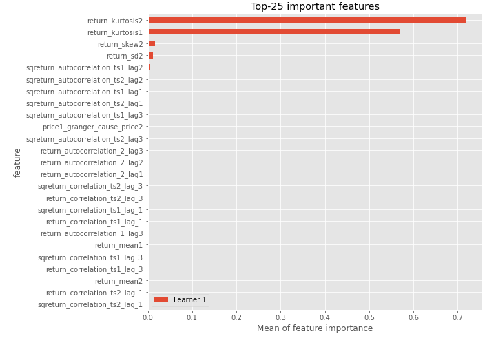
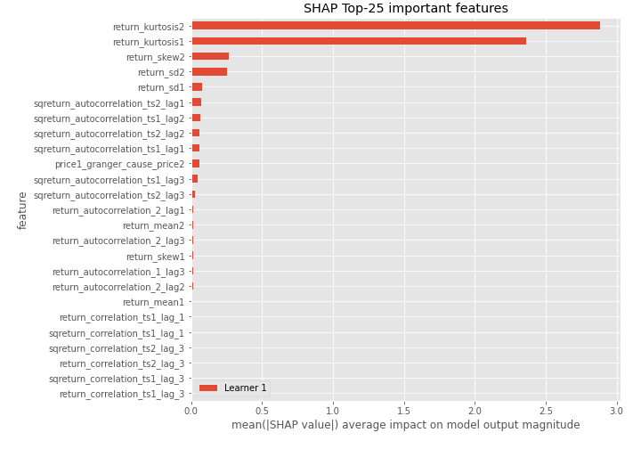

# Summary of 3_Linear

[<< Go back](../README.md)

## Logistic Regression (Linear)
- **n_jobs**: -1
- **explain_level**: 2

## Validation
 - **validation_type**: split
 - **train_ratio**: 0.75
 - **shuffle**: True
 - **stratify**: True

## Optimized metric
accuracy

## Training time

3.9 seconds

## Metric details
|           |    score |     threshold |
|:----------|---------:|--------------:|
| logloss   | 0.128918 | nan           |
| auc       | 1        | nan           |
| f1        | 0.988764 |   0.755592    |
| accuracy  | 0.988506 |   0.755592    |
| precision | 1        |   0.894769    |
| recall    | 1        |   3.68053e-22 |
| mcc       | 0.977261 |   0.755592    |

## Confusion matrix (at threshold=0.755592)
|                      |   Predicted as real |   Predicted as simulated |
|:---------------------|--------------------:|-------------------------:|
| Labeled as real      |                  42 |                        1 |
| Labeled as simulated |                   0 |                       44 |

## Learning curves

## Coefficients
| feature                           |   Learner_1 |
|:----------------------------------|------------:|
| return_skew2                      |   0.577559  |
| return_autocorrelation_2_lag3     |   0.425409  |
| return_autocorrelation_2_lag1     |   0.347423  |
| return_autocorrelation_1_lag3     |   0.32369   |
| return_autocorrelation_2_lag2     |   0.292249  |
| return_correlation_ts1_lag_1      |   0.20922   |
| sqreturn_correlation_ts1_lag_1    |   0.20922   |
| sqreturn_correlation_ts2_lag_3    |   0.208278  |
| return_correlation_ts2_lag_3      |   0.208278  |
| sqreturn_correlation_ts1_lag_3    |   0.208062  |
| return_correlation_ts1_lag_3      |   0.208062  |
| return_autocorrelation_1_lag2     |   0.164921  |
| return_sd1                        |   0.113845  |
| return_correlation_ts1_lag_2      |   0.0861316 |
| sqreturn_correlation_ts1_lag_2    |   0.0861316 |
| sqreturn_correlation_ts1_lag_0    |   0.0705823 |
| return_correlation_ts1_lag_0      |   0.0705823 |
| return_autocorrelation_1_lag1     |   0.048623  |
| return_correlation_ts2_lag_1      |   0.0402301 |
| sqreturn_correlation_ts2_lag_1    |   0.0402301 |
| price2_granger_cause_price1       |  -0.0289529 |
| return_skew1                      |  -0.0464846 |
| sqreturn_correlation_ts2_lag_2    |  -0.131599  |
| return_correlation_ts2_lag_2      |  -0.131599  |
| return_mean1                      |  -0.179519  |
| return_mean2                      |  -0.223855  |
| price1_granger_cause_price2       |  -0.253844  |
| return_sd2                        |  -0.485528  |
| sqreturn_autocorrelation_ts2_lag3 |  -0.558015  |
| sqreturn_autocorrelation_ts1_lag3 |  -0.735999  |
| sqreturn_autocorrelation_ts1_lag2 |  -0.841582  |
| sqreturn_autocorrelation_ts1_lag1 |  -0.934894  |
| sqreturn_autocorrelation_ts2_lag2 |  -0.943492  |
| sqreturn_autocorrelation_ts2_lag1 |  -1.21232   |
| intercept                         |  -1.81366   |
| return_kurtosis2                  |  -3.7741    |
| return_kurtosis1                  |  -3.81248   |

## Permutation-based Importance

## Confusion Matrix

## Normalized Confusion Matrix

## ROC Curve

## Kolmogorov-Smirnov Statistic

## Precision-Recall Curve

## Calibration Curve

## Cumulative Gains Curve

## Lift Curve

## SHAP Importance

## SHAP Dependence plots

### Dependence (Fold 1)

## SHAP Decision plots

### Top-10 Worst decisions for class 0 (Fold 1)

### Top-10 Best decisions for class 0 (Fold 1)

### Top-10 Worst decisions for class 1 (Fold 1)

### Top-10 Best decisions for class 1 (Fold 1)

[<< Go back](../README.md)
