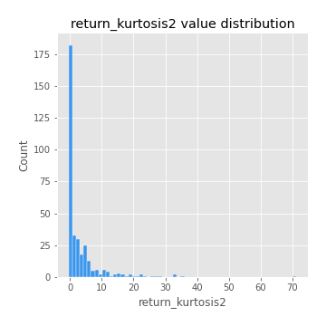
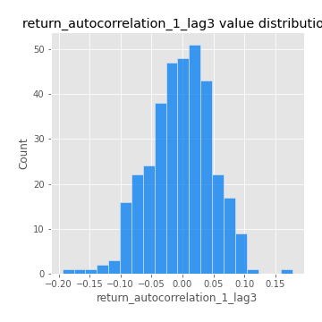
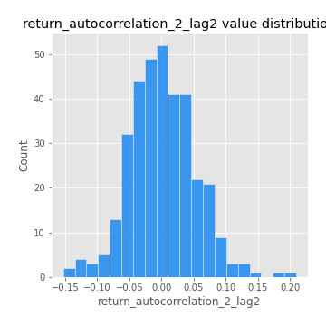

# Exploratory Data Analysis

[<< Go back](../README.md)
## Feature : target
- **Feature type** : categorical
- **Missing** : 0.0%
- **Unique** : 2
- **Count** :347
- **Unique** :2
- **Top** :simulated
- **Freq** :176

## Feature : return_mean1
- **Feature type** : continous
- **Missing** : 0.0%
- **Unique** : 347
- **Count** :347.0
- **Mean** :0.05647419932416899
- **Std** :0.07525829729769912
- **Min** :-0.17686457077756634
- **25%th Percentile** : 0.010758489267328161
- **50%th Percentile** : 0.05493119099752536
- **75%th Percentile** : 0.09643810421096681
- **Max** :0.37175100008111034

## Feature : return_mean2
- **Feature type** : continous
- **Missing** : 0.0%
- **Unique** : 347
- **Count** :347.0
- **Mean** :0.057901272076666885
- **Std** :0.09045998357845736
- **Min** :-0.24205418062825398
- **25%th Percentile** : 0.004946491276377798
- **50%th Percentile** : 0.05516611444454279
- **75%th Percentile** : 0.10872689043609275
- **Max** :0.4272763894283836

## Feature : return_sd1
- **Feature type** : continous
- **Missing** : 0.0%
- **Unique** : 347
- **Count** :347.0
- **Mean** :1.7334503005943005
- **Std** :0.5726160658639512
- **Min** :0.7470080772831957
- **25%th Percentile** : 1.5566802510659494
- **50%th Percentile** : 1.6087819766236533
- **75%th Percentile** : 1.702846202430301
- **Max** :6.495661311240861

## Feature : return_sd2
- **Feature type** : continous
- **Missing** : 0.0%
- **Unique** : 347
- **Count** :347.0
- **Mean** :1.7613306140158396
- **Std** :0.7340987150720732
- **Min** :0.8592887433004143
- **25%th Percentile** : 1.5164883749104583
- **50%th Percentile** : 1.5903655275890658
- **75%th Percentile** : 1.6837210531398665
- **Max** :6.737618636746393

## Feature : return_skew1
- **Feature type** : continous
- **Missing** : 0.0%
- **Unique** : 347
- **Count** :347.0
- **Mean** :-0.0713714452543931
- **Std** :0.5865982241972136
- **Min** :-3.530116233761814
- **25%th Percentile** : -0.19661669837782492
- **50%th Percentile** : -0.019239334248116285
- **75%th Percentile** : 0.09515095100603829
- **Max** :2.5845963767725557

## Feature : return_skew2
- **Feature type** : continous
- **Missing** : 0.0%
- **Unique** : 347
- **Count** :347.0
- **Mean** :-0.1603374679858798
- **Std** :0.6343824183164044
- **Min** :-5.778144124281153
- **25%th Percentile** : -0.23204672254394254
- **50%th Percentile** : -0.06057402484540102
- **75%th Percentile** : 0.07793605286133995
- **Max** :2.242019525651531

## Feature : return_kurtosis1
- **Feature type** : continous
- **Missing** : 0.0%
- **Unique** : 347
- **Count** :347.0
- **Mean** :3.0902798918639016
- **Std** :5.983947685144882
- **Min** :-0.4201671663711517
- **25%th Percentile** : -0.050617445994323385
- **50%th Percentile** : 0.3348900835878772
- **75%th Percentile** : 3.3144235969375373
- **Max** :36.91113889081053

## Feature : return_kurtosis2
- **Feature type** : continous
- **Missing** : 0.0%
- **Unique** : 347
- **Count** :347.0
- **Mean** :3.2627224345169856
- **Std** :6.786092275026244
- **Min** :-0.5084500350752612
- **25%th Percentile** : -0.040382620272660485
- **50%th Percentile** : 0.4234940982915134
- **75%th Percentile** : 4.101810584478865
- **Max** :71.39844769176813

## Feature : return_autocorrelation_1_lag1
- **Feature type** : continous
- **Missing** : 0.0%
- **Unique** : 347
- **Count** :347.0
- **Mean** :-0.01099669903654909
- **Std** :0.05666642868128262
- **Min** :-0.2135576224968752
- **25%th Percentile** : -0.045471757178970985
- **50%th Percentile** : -0.0073825539194493014
- **75%th Percentile** : 0.02729905635994037
- **Max** :0.12810656890648087

## Feature : return_autocorrelation_1_lag2
- **Feature type** : continous
- **Missing** : 0.0%
- **Unique** : 347
- **Count** :347.0
- **Mean** :-0.0052017512407748065
- **Std** :0.049900374174847724
- **Min** :-0.13309283796645122
- **25%th Percentile** : -0.03847688870502703
- **50%th Percentile** : -0.004613866201947514
- **75%th Percentile** : 0.027697463467717134
- **Max** :0.1561488228015672

## Feature : return_autocorrelation_1_lag3
- **Feature type** : continous
- **Missing** : 0.0%
- **Unique** : 347
- **Count** :347.0
- **Mean** :-0.003992550894410152
- **Std** :0.05110491243812156
- **Min** :-0.1940836867390813
- **25%th Percentile** : -0.03429730270617613
- **50%th Percentile** : -0.00014511122054603864
- **75%th Percentile** : 0.03146588714389226
- **Max** :0.17805869530681923

## Feature : return_autocorrelation_2_lag1
- **Feature type** : continous
- **Missing** : 0.0%
- **Unique** : 347
- **Count** :347.0
- **Mean** :-0.007526609313945768
- **Std** :0.06073606577215474
- **Min** :-0.25075531010123286
- **25%th Percentile** : -0.03808526257175844
- **50%th Percentile** : -0.0007150581423045594
- **75%th Percentile** : 0.030177583413758608
- **Max** :0.31863413537898483

## Feature : return_autocorrelation_2_lag2
- **Feature type** : continous
- **Missing** : 0.0%
- **Unique** : 347
- **Count** :347.0
- **Mean** :0.0012471792652637911
- **Std** :0.05103264098112279
- **Min** :-0.15323211089747296
- **25%th Percentile** : -0.03204081164743812
- **50%th Percentile** : -0.0019786601520114383
- **75%th Percentile** : 0.03335188191433014
- **Max** :0.20974504043791217

## Feature : return_autocorrelation_2_lag3
- **Feature type** : continous
- **Missing** : 0.0%
- **Unique** : 347
- **Count** :347.0
- **Mean** :0.002074156474125231
- **Std** :0.048122538342214964
- **Min** :-0.1344316177078651
- **25%th Percentile** : -0.0264522143914383
- **50%th Percentile** : 0.0011700209716224875
- **75%th Percentile** : 0.037656356993785056
- **Max** :0.1419999376914021

## Feature : return_correlation_ts1_lag_0
- **Feature type** : continous
- **Missing** : 0.0%
- **Unique** : 347
- **Count** :347.0
- **Mean** :0.32516454784939985
- **Std** :0.11248457844050255
- **Min** :-0.027089510445801036
- **25%th Percentile** : 0.2750648735035664
- **50%th Percentile** : 0.322835722290643
- **75%th Percentile** : 0.3679795182151855
- **Max** :0.7041861626832071

## Feature : return_correlation_ts1_lag_1
- **Feature type** : continous
- **Missing** : 0.0%
- **Unique** : 347
- **Count** :347.0
- **Mean** :-0.005742425044002959
- **Std** :0.05226681209588103
- **Min** :-0.16985510949917193
- **25%th Percentile** : -0.03897021868940255
- **50%th Percentile** : 0.0005389981504366167
- **75%th Percentile** : 0.03264427240781173
- **Max** :0.11819480385322509

## Feature : return_correlation_ts1_lag_2
- **Feature type** : continous
- **Missing** : 0.0%
- **Unique** : 347
- **Count** :347.0
- **Mean** :-0.0030453630778428144
- **Std** :0.04811662631945997
- **Min** :-0.21653581047581763
- **25%th Percentile** : -0.032202005103528615
- **50%th Percentile** : -0.0054427692104833565
- **75%th Percentile** : 0.031012881779361734
- **Max** :0.11145279161125013

## Feature : return_correlation_ts1_lag_3
- **Feature type** : continous
- **Missing** : 0.0%
- **Unique** : 347
- **Count** :347.0
- **Mean** :-0.002424759819808645
- **Std** :0.04989643607999154
- **Min** :-0.1270218498974763
- **25%th Percentile** : -0.03546359970336787
- **50%th Percentile** : -0.0016903142386058654
- **75%th Percentile** : 0.03137591956006082
- **Max** :0.1636773216468148

## Feature : return_correlation_ts2_lag_1
- **Feature type** : continous
- **Missing** : 0.0%
- **Unique** : 347
- **Count** :347.0
- **Mean** :-0.01097325067891782
- **Std** :0.0515341066557191
- **Min** :-0.2081139431093261
- **25%th Percentile** : -0.041734030838442876
- **50%th Percentile** : -0.01067896752325352
- **75%th Percentile** : 0.023534389799867036
- **Max** :0.17208763791364762

## Feature : return_correlation_ts2_lag_2
- **Feature type** : continous
- **Missing** : 0.0%
- **Unique** : 347
- **Count** :347.0
- **Mean** :0.0001410367273565881
- **Std** :0.04853204916189241
- **Min** :-0.12221271802596369
- **25%th Percentile** : -0.03389915614053218
- **50%th Percentile** : -7.69228799058348e-05
- **75%th Percentile** : 0.02879589265035327
- **Max** :0.20772887392904255

## Feature : return_correlation_ts2_lag_3
- **Feature type** : continous
- **Missing** : 0.0%
- **Unique** : 347
- **Count** :347.0
- **Mean** :-0.005579917261902982
- **Std** :0.05002800110480859
- **Min** :-0.17564076057312866
- **25%th Percentile** : -0.03460932049162474
- **50%th Percentile** : -0.003451645375118328
- **75%th Percentile** : 0.02751239786877146
- **Max** :0.12346557981509587

## Feature : sqreturn_autocorrelation_ts1_lag1
- **Feature type** : continous
- **Missing** : 0.0%
- **Unique** : 347
- **Count** :347.0
- **Mean** :0.04893012077446388
- **Std** :0.09100929281299071
- **Min** :-0.13762642645575865
- **25%th Percentile** : -0.010357678221400518
- **50%th Percentile** : 0.027526459453190984
- **75%th Percentile** : 0.08499267162738236
- **Max** :0.4439086285737898

## Feature : sqreturn_autocorrelation_ts1_lag2
- **Feature type** : continous
- **Missing** : 0.0%
- **Unique** : 347
- **Count** :347.0
- **Mean** :0.043650888602995534
- **Std** :0.09583380524589118
- **Min** :-0.12253213758011669
- **25%th Percentile** : -0.014194564605095512
- **50%th Percentile** : 0.02115117878678332
- **75%th Percentile** : 0.0648868800712232
- **Max** :0.540735851444759

## Feature : sqreturn_autocorrelation_ts1_lag3
- **Feature type** : continous
- **Missing** : 0.0%
- **Unique** : 347
- **Count** :347.0
- **Mean** :0.035342052631489054
- **Std** :0.08265926730660873
- **Min** :-0.0877158481204155
- **25%th Percentile** : -0.013396163276187305
- **50%th Percentile** : 0.012885014751173963
- **75%th Percentile** : 0.06085017353559348
- **Max** :0.44755937369538146

## Feature : sqreturn_autocorrelation_ts2_lag1
- **Feature type** : continous
- **Missing** : 0.0%
- **Unique** : 347
- **Count** :347.0
- **Mean** :0.05238698238226095
- **Std** :0.08793579496075066
- **Min** :-0.10265200895157907
- **25%th Percentile** : -0.004447853277705842
- **50%th Percentile** : 0.02982522024063108
- **75%th Percentile** : 0.0868809866215969
- **Max** :0.4190090519891419

## Feature : sqreturn_autocorrelation_ts2_lag2
- **Feature type** : continous
- **Missing** : 0.0%
- **Unique** : 347
- **Count** :347.0
- **Mean** :0.03833556918045146
- **Std** :0.09538621277118599
- **Min** :-0.12424445032629466
- **25%th Percentile** : -0.016395924151906494
- **50%th Percentile** : 0.015009649875009542
- **75%th Percentile** : 0.05942264119782792
- **Max** :0.5373432415582473

## Feature : sqreturn_autocorrelation_ts2_lag3
- **Feature type** : continous
- **Missing** : 0.0%
- **Unique** : 347
- **Count** :347.0
- **Mean** :0.029251511461789937
- **Std** :0.07142269420470167
- **Min** :-0.10849626189332771
- **25%th Percentile** : -0.012822530270963943
- **50%th Percentile** : 0.015600659260481023
- **75%th Percentile** : 0.05123482727825311
- **Max** :0.31225727797735664

## Feature : sqreturn_correlation_ts1_lag_0
- **Feature type** : continous
- **Missing** : 0.0%
- **Unique** : 347
- **Count** :347.0
- **Mean** :0.32516454784939985
- **Std** :0.11248457844050255
- **Min** :-0.027089510445801036
- **25%th Percentile** : 0.2750648735035664
- **50%th Percentile** : 0.322835722290643
- **75%th Percentile** : 0.3679795182151855
- **Max** :0.7041861626832071

## Feature : sqreturn_correlation_ts1_lag_1
- **Feature type** : continous
- **Missing** : 0.0%
- **Unique** : 347
- **Count** :347.0
- **Mean** :-0.005742425044002959
- **Std** :0.05226681209588103
- **Min** :-0.16985510949917193
- **25%th Percentile** : -0.03897021868940255
- **50%th Percentile** : 0.0005389981504366167
- **75%th Percentile** : 0.03264427240781173
- **Max** :0.11819480385322509

## Feature : sqreturn_correlation_ts1_lag_2
- **Feature type** : continous
- **Missing** : 0.0%
- **Unique** : 347
- **Count** :347.0
- **Mean** :-0.0030453630778428144
- **Std** :0.04811662631945997
- **Min** :-0.21653581047581763
- **25%th Percentile** : -0.032202005103528615
- **50%th Percentile** : -0.0054427692104833565
- **75%th Percentile** : 0.031012881779361734
- **Max** :0.11145279161125013

## Feature : sqreturn_correlation_ts1_lag_3
- **Feature type** : continous
- **Missing** : 0.0%
- **Unique** : 347
- **Count** :347.0
- **Mean** :-0.002424759819808645
- **Std** :0.04989643607999154
- **Min** :-0.1270218498974763
- **25%th Percentile** : -0.03546359970336787
- **50%th Percentile** : -0.0016903142386058654
- **75%th Percentile** : 0.03137591956006082
- **Max** :0.1636773216468148

## Feature : sqreturn_correlation_ts2_lag_1
- **Feature type** : continous
- **Missing** : 0.0%
- **Unique** : 347
- **Count** :347.0
- **Mean** :-0.01097325067891782
- **Std** :0.0515341066557191
- **Min** :-0.2081139431093261
- **25%th Percentile** : -0.041734030838442876
- **50%th Percentile** : -0.01067896752325352
- **75%th Percentile** : 0.023534389799867036
- **Max** :0.17208763791364762

## Feature : sqreturn_correlation_ts2_lag_2
- **Feature type** : continous
- **Missing** : 0.0%
- **Unique** : 347
- **Count** :347.0
- **Mean** :0.0001410367273565881
- **Std** :0.04853204916189241
- **Min** :-0.12221271802596369
- **25%th Percentile** : -0.03389915614053218
- **50%th Percentile** : -7.69228799058348e-05
- **75%th Percentile** : 0.02879589265035327
- **Max** :0.20772887392904255

## Feature : sqreturn_correlation_ts2_lag_3
- **Feature type** : continous
- **Missing** : 0.0%
- **Unique** : 347
- **Count** :347.0
- **Mean** :-0.005579917261902982
- **Std** :0.05002800110480859
- **Min** :-0.17564076057312866
- **25%th Percentile** : -0.03460932049162474
- **50%th Percentile** : -0.003451645375118328
- **75%th Percentile** : 0.02751239786877146
- **Max** :0.12346557981509587

## Feature : price2_granger_cause_price1
- **Feature type** : continous
- **Missing** : 0.0%
- **Unique** : 347
- **Count** :347.0
- **Mean** :0.3551669327420421
- **Std** :0.288945190257426
- **Min** :1.1505642493585304e-05
- **25%th Percentile** : 0.09261038103278407
- **50%th Percentile** : 0.3104664570627801
- **75%th Percentile** : 0.5772111325941033
- **Max** :0.9885712803689185

## Feature : price1_granger_cause_price2
- **Feature type** : continous
- **Missing** : 0.0%
- **Unique** : 347
- **Count** :347.0
- **Mean** :0.2840527574496513
- **Std** :0.2791581016382951
- **Min** :2.5320691765171956e-06
- **25%th Percentile** : 0.036368742536741744
- **50%th Percentile** : 0.20404253756357457
- **75%th Percentile** : 0.48273590405450584
- **Max** :0.9985533014201305

[<< Go back](../README.md)
