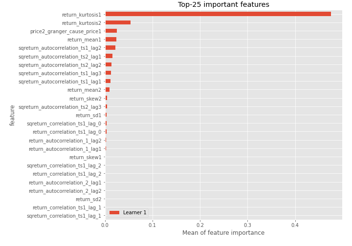
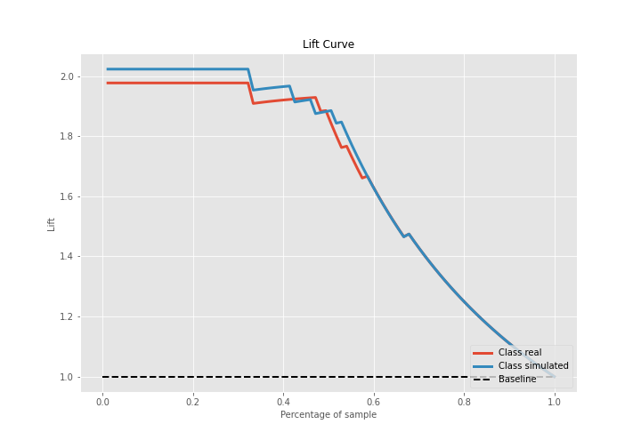

# Summary of 3_Linear

[<< Go back](../README.md)

## Logistic Regression (Linear)
- **n_jobs**: -1
- **explain_level**: 2

## Validation
 - **validation_type**: split
 - **train_ratio**: 0.75
 - **shuffle**: True
 - **stratify**: True

## Optimized metric
accuracy

## Training time

20.9 seconds

## Metric details
|           |    score |     threshold |
|:----------|---------:|--------------:|
| logloss   | 0.261883 | nan           |
| auc       | 0.977801 | nan           |
| f1        | 0.94382  |   0.477752    |
| accuracy  | 0.942529 |   0.477752    |
| precision | 1        |   0.830868    |
| recall    | 1        |   5.10439e-07 |
| mcc       | 0.887243 |   0.477752    |

## Confusion matrix (at threshold=0.477752)
|                      |   Predicted as real |   Predicted as simulated |
|:---------------------|--------------------:|-------------------------:|
| Labeled as real      |                  40 |                        4 |
| Labeled as simulated |                   1 |                       42 |

## Learning curves

## Coefficients
| feature                           |   Learner_1 |
|:----------------------------------|------------:|
| return_mean2                      |   1.71253   |
| return_correlation_ts1_lag_0      |   1.10774   |
| sqreturn_correlation_ts1_lag_0    |   1.10774   |
| return_autocorrelation_1_lag2     |   0.925984  |
| return_autocorrelation_1_lag1     |   0.865274  |
| sqreturn_correlation_ts1_lag_1    |   0.599327  |
| return_correlation_ts1_lag_1      |   0.599327  |
| return_autocorrelation_2_lag1     |   0.569274  |
| return_skew2                      |   0.549971  |
| return_autocorrelation_2_lag3     |   0.521591  |
| sqreturn_correlation_ts2_lag_1    |   0.484909  |
| return_correlation_ts2_lag_1      |   0.484909  |
| sqreturn_correlation_ts2_lag_3    |   0.466292  |
| return_correlation_ts2_lag_3      |   0.466292  |
| return_autocorrelation_2_lag2     |   0.40146   |
| sqreturn_correlation_ts1_lag_2    |   0.394722  |
| return_correlation_ts1_lag_2      |   0.394722  |
| sqreturn_correlation_ts2_lag_2    |   0.391372  |
| return_correlation_ts2_lag_2      |   0.391372  |
| return_skew1                      |   0.374431  |
| return_autocorrelation_1_lag3     |   0.288954  |
| sqreturn_correlation_ts1_lag_3    |   0.127535  |
| return_correlation_ts1_lag_3      |   0.127535  |
| return_sd2                        |   0.0800663 |
| return_sd1                        |  -0.265197  |
| price1_granger_cause_price2       |  -0.30322   |
| intercept                         |  -0.594271  |
| return_kurtosis2                  |  -0.598066  |
| sqreturn_autocorrelation_ts2_lag3 |  -1.16886   |
| price2_granger_cause_price1       |  -1.17445   |
| sqreturn_autocorrelation_ts2_lag2 |  -1.63487   |
| sqreturn_autocorrelation_ts1_lag3 |  -1.67591   |
| sqreturn_autocorrelation_ts2_lag1 |  -2.0127    |
| sqreturn_autocorrelation_ts1_lag2 |  -2.063     |
| return_mean1                      |  -2.14819   |
| sqreturn_autocorrelation_ts1_lag1 |  -2.23315   |
| return_kurtosis1                  |  -2.28896   |

## Permutation-based Importance

## Confusion Matrix

## Normalized Confusion Matrix

## ROC Curve

## Kolmogorov-Smirnov Statistic

## Precision-Recall Curve

## Calibration Curve

## Cumulative Gains Curve

## Lift Curve

## SHAP Importance

## SHAP Dependence plots

### Dependence (Fold 1)

## SHAP Decision plots

### Top-10 Worst decisions for class 0 (Fold 1)

### Top-10 Best decisions for class 0 (Fold 1)

### Top-10 Worst decisions for class 1 (Fold 1)

### Top-10 Best decisions for class 1 (Fold 1)

[<< Go back](../README.md)
