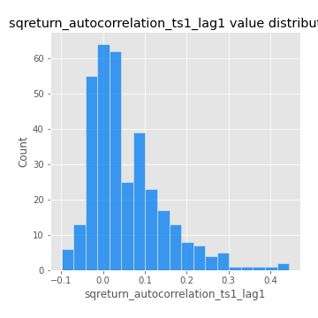

# Exploratory Data Analysis

[<< Go back](../README.md)
## Feature : target
- **Feature type** : categorical
- **Missing** : 0.0%
- **Unique** : 2
- **Count** :347
- **Unique** :2
- **Top** :real
- **Freq** :176

## Feature : return_mean1
- **Feature type** : continous
- **Missing** : 0.0%
- **Unique** : 347
- **Count** :347.0
- **Mean** :0.011026829640392213
- **Std** :0.10632730591327956
- **Min** :-0.3336990797413658
- **25%th Percentile** : -0.04790535209724787
- **50%th Percentile** : 0.018232545002646462
- **75%th Percentile** : 0.07726312834493257
- **Max** :0.3612366374600757

## Feature : return_mean2
- **Feature type** : continous
- **Missing** : 0.0%
- **Unique** : 347
- **Count** :347.0
- **Mean** :0.10247239555240471
- **Std** :0.09922467095978692
- **Min** :-0.21818165578778434
- **25%th Percentile** : 0.046929196107514726
- **50%th Percentile** : 0.09760780098769918
- **75%th Percentile** : 0.17160554573575668
- **Max** :0.37616608147096464

## Feature : return_sd1
- **Feature type** : continous
- **Missing** : 0.0%
- **Unique** : 347
- **Count** :347.0
- **Mean** :1.7957867161817729
- **Std** :0.7157634007003258
- **Min** :0.8382061051466024
- **25%th Percentile** : 1.5714042897618201
- **50%th Percentile** : 1.644120794058946
- **75%th Percentile** : 1.7708091518848224
- **Max** :9.236766377527575

## Feature : return_sd2
- **Feature type** : continous
- **Missing** : 0.0%
- **Unique** : 347
- **Count** :347.0
- **Mean** :1.8748530291414287
- **Std** :0.7092775082935654
- **Min** :0.8592887433004143
- **25%th Percentile** : 1.6289176039267481
- **50%th Percentile** : 1.7770255991343487
- **75%th Percentile** : 1.8918421477747334
- **Max** :6.737618636746393

## Feature : return_skew1
- **Feature type** : continous
- **Missing** : 0.0%
- **Unique** : 347
- **Count** :347.0
- **Mean** :-0.07955540415443496
- **Std** :0.6238205243046419
- **Min** :-3.530116233761814
- **25%th Percentile** : -0.2655318276018894
- **50%th Percentile** : -0.04545710356222468
- **75%th Percentile** : 0.1401250686875906
- **Max** :2.5845963767725557

## Feature : return_skew2
- **Feature type** : continous
- **Missing** : 0.0%
- **Unique** : 347
- **Count** :347.0
- **Mean** :-0.17345147523835783
- **Std** :0.8298221880075465
- **Min** :-8.801502855292393
- **25%th Percentile** : -0.3639183594450047
- **50%th Percentile** : -0.10157182900044116
- **75%th Percentile** : 0.16065389374157435
- **Max** :2.242019525651531

## Feature : return_kurtosis1
- **Feature type** : continous
- **Missing** : 0.0%
- **Unique** : 347
- **Count** :347.0
- **Mean** :3.847371897692698
- **Std** :6.167682134978447
- **Min** :-0.24644339930154624
- **25%th Percentile** : 0.6542728749068747
- **50%th Percentile** : 1.6208291993382526
- **75%th Percentile** : 3.926946560753578
- **Max** :46.07507808162177

## Feature : return_kurtosis2
- **Feature type** : continous
- **Missing** : 0.0%
- **Unique** : 347
- **Count** :347.0
- **Mean** :5.005453632029832
- **Std** :10.31672994583544
- **Min** :-0.12840454010192426
- **25%th Percentile** : 1.1806441246961619
- **50%th Percentile** : 2.322915397884738
- **75%th Percentile** : 4.929482149144769
- **Max** :143.10871011533666

## Feature : return_autocorrelation_1_lag1
- **Feature type** : continous
- **Missing** : 0.0%
- **Unique** : 347
- **Count** :347.0
- **Mean** :-0.005788940759998224
- **Std** :0.06291446067945332
- **Min** :-0.2135576224968752
- **25%th Percentile** : -0.03798634529902589
- **50%th Percentile** : 0.0032797647906864986
- **75%th Percentile** : 0.034456976524662175
- **Max** :0.12810656890648087

## Feature : return_autocorrelation_1_lag2
- **Feature type** : continous
- **Missing** : 0.0%
- **Unique** : 347
- **Count** :347.0
- **Mean** :0.0054755538715621855
- **Std** :0.05133793716478889
- **Min** :-0.12172858720259
- **25%th Percentile** : -0.02867540918221275
- **50%th Percentile** : 0.005149896120765142
- **75%th Percentile** : 0.03938750746717171
- **Max** :0.1561488228015672

## Feature : return_autocorrelation_1_lag3
- **Feature type** : continous
- **Missing** : 0.0%
- **Unique** : 347
- **Count** :347.0
- **Mean** :0.0074101121486865144
- **Std** :0.05131672526349731
- **Min** :-0.1940836867390813
- **25%th Percentile** : -0.022046992518945995
- **50%th Percentile** : 0.009354131681878411
- **75%th Percentile** : 0.040894348727189944
- **Max** :0.17805869530681923

## Feature : return_autocorrelation_2_lag1
- **Feature type** : continous
- **Missing** : 0.0%
- **Unique** : 347
- **Count** :347.0
- **Mean** :-0.009220537987900216
- **Std** :0.059815743038148544
- **Min** :-0.24590087874039124
- **25%th Percentile** : -0.04220490087456638
- **50%th Percentile** : -0.003468421904083321
- **75%th Percentile** : 0.026398227734326728
- **Max** :0.31863413537898483

## Feature : return_autocorrelation_2_lag2
- **Feature type** : continous
- **Missing** : 0.0%
- **Unique** : 347
- **Count** :347.0
- **Mean** :-0.0022530217877530564
- **Std** :0.05161031572018452
- **Min** :-0.1495113937562178
- **25%th Percentile** : -0.03470399968399765
- **50%th Percentile** : -0.0019786601520114383
- **75%th Percentile** : 0.032500067887879514
- **Max** :0.20974504043791217

## Feature : return_autocorrelation_2_lag3
- **Feature type** : continous
- **Missing** : 0.0%
- **Unique** : 347
- **Count** :347.0
- **Mean** :-0.001206459328550414
- **Std** :0.04959257126552006
- **Min** :-0.13930178407140853
- **25%th Percentile** : -0.02921233895063513
- **50%th Percentile** : -0.0007954854322127135
- **75%th Percentile** : 0.030634771806232336
- **Max** :0.14329621007184187

## Feature : return_correlation_ts1_lag_0
- **Feature type** : continous
- **Missing** : 0.0%
- **Unique** : 347
- **Count** :347.0
- **Mean** :0.33714414848393537
- **Std** :0.11037843364614011
- **Min** :-0.027089510445801036
- **25%th Percentile** : 0.28087111983166163
- **50%th Percentile** : 0.3427572706807895
- **75%th Percentile** : 0.39328724631171014
- **Max** :0.7028422087350163

## Feature : return_correlation_ts1_lag_1
- **Feature type** : continous
- **Missing** : 0.0%
- **Unique** : 347
- **Count** :347.0
- **Mean** :-0.004496090379746681
- **Std** :0.05217838965763896
- **Min** :-0.16985510949917193
- **25%th Percentile** : -0.0374045324412276
- **50%th Percentile** : 0.001921905828436598
- **75%th Percentile** : 0.03273237095494616
- **Max** :0.15499424718508623

## Feature : return_correlation_ts1_lag_2
- **Feature type** : continous
- **Missing** : 0.0%
- **Unique** : 347
- **Count** :347.0
- **Mean** :0.0010509044316782488
- **Std** :0.04929955110224896
- **Min** :-0.21653581047581763
- **25%th Percentile** : -0.03160929111881888
- **50%th Percentile** : 0.001521553263676477
- **75%th Percentile** : 0.035028085906621376
- **Max** :0.12387747475569

## Feature : return_correlation_ts1_lag_3
- **Feature type** : continous
- **Missing** : 0.0%
- **Unique** : 347
- **Count** :347.0
- **Mean** :0.003059068910145327
- **Std** :0.04890057318226286
- **Min** :-0.1270218498974763
- **25%th Percentile** : -0.025657467978247805
- **50%th Percentile** : 0.00087733174045983
- **75%th Percentile** : 0.0320512593388797
- **Max** :0.1636773216468148

## Feature : return_correlation_ts2_lag_1
- **Feature type** : continous
- **Missing** : 0.0%
- **Unique** : 347
- **Count** :347.0
- **Mean** :-0.000257381022987854
- **Std** :0.05290564747679952
- **Min** :-0.2081139431093261
- **25%th Percentile** : -0.029627027188527354
- **50%th Percentile** : 0.00039125929501661235
- **75%th Percentile** : 0.03104520962057346
- **Max** :0.11958874148555247

## Feature : return_correlation_ts2_lag_2
- **Feature type** : continous
- **Missing** : 0.0%
- **Unique** : 347
- **Count** :347.0
- **Mean** :0.0008618312984982418
- **Std** :0.049868354972588756
- **Min** :-0.23751835475804678
- **25%th Percentile** : -0.030823338944705743
- **50%th Percentile** : 0.0022438124761268723
- **75%th Percentile** : 0.032660987440523044
- **Max** :0.20772887392904255

## Feature : return_correlation_ts2_lag_3
- **Feature type** : continous
- **Missing** : 0.0%
- **Unique** : 347
- **Count** :347.0
- **Mean** :0.005487589980069132
- **Std** :0.05369219490276709
- **Min** :-0.17564076057312866
- **25%th Percentile** : -0.026494701647251654
- **50%th Percentile** : 0.008668546004972858
- **75%th Percentile** : 0.04366796815896408
- **Max** :0.13875780375307267

## Feature : sqreturn_autocorrelation_ts1_lag1
- **Feature type** : continous
- **Missing** : 0.0%
- **Unique** : 347
- **Count** :347.0
- **Mean** :0.05587396386627484
- **Std** :0.08975350642809765
- **Min** :-0.09901884353939885
- **25%th Percentile** : -0.008389249042975538
- **50%th Percentile** : 0.029160538935224904
- **75%th Percentile** : 0.09696863387785119
- **Max** :0.4439086285737898

## Feature : sqreturn_autocorrelation_ts1_lag2
- **Feature type** : continous
- **Missing** : 0.0%
- **Unique** : 347
- **Count** :347.0
- **Mean** :0.04185789977066385
- **Std** :0.09323507906179411
- **Min** :-0.11063824633330642
- **25%th Percentile** : -0.014859188435879044
- **50%th Percentile** : 0.014174994332167111
- **75%th Percentile** : 0.06877767786920205
- **Max** :0.4522162366773919

## Feature : sqreturn_autocorrelation_ts1_lag3
- **Feature type** : continous
- **Missing** : 0.0%
- **Unique** : 347
- **Count** :347.0
- **Mean** :0.034915840302757246
- **Std** :0.08307448465881555
- **Min** :-0.09259214576385302
- **25%th Percentile** : -0.01776853149687492
- **50%th Percentile** : 0.012903560491205971
- **75%th Percentile** : 0.06333799669581507
- **Max** :0.44755937369538146

## Feature : sqreturn_autocorrelation_ts2_lag1
- **Feature type** : continous
- **Missing** : 0.0%
- **Unique** : 347
- **Count** :347.0
- **Mean** :0.048972773007005324
- **Std** :0.08678681081639014
- **Min** :-0.08520586663750691
- **25%th Percentile** : -0.010769047955056517
- **50%th Percentile** : 0.022529642572539425
- **75%th Percentile** : 0.0811041784062552
- **Max** :0.4190090519891419

## Feature : sqreturn_autocorrelation_ts2_lag2
- **Feature type** : continous
- **Missing** : 0.0%
- **Unique** : 347
- **Count** :347.0
- **Mean** :0.04016645991378307
- **Std** :0.08884181518367394
- **Min** :-0.11010460104743562
- **25%th Percentile** : -0.01185865438588688
- **50%th Percentile** : 0.012367098888812732
- **75%th Percentile** : 0.055835462752456475
- **Max** :0.45676817892778204

## Feature : sqreturn_autocorrelation_ts2_lag3
- **Feature type** : continous
- **Missing** : 0.0%
- **Unique** : 347
- **Count** :347.0
- **Mean** :0.031025660511806243
- **Std** :0.07133529638344399
- **Min** :-0.08482976002238472
- **25%th Percentile** : -0.016520522789613377
- **50%th Percentile** : 0.012047049281430727
- **75%th Percentile** : 0.05752559750044486
- **Max** :0.31225727797735664

## Feature : sqreturn_correlation_ts1_lag_0
- **Feature type** : continous
- **Missing** : 0.0%
- **Unique** : 347
- **Count** :347.0
- **Mean** :0.33714414848393537
- **Std** :0.11037843364614011
- **Min** :-0.027089510445801036
- **25%th Percentile** : 0.28087111983166163
- **50%th Percentile** : 0.3427572706807895
- **75%th Percentile** : 0.39328724631171014
- **Max** :0.7028422087350163

## Feature : sqreturn_correlation_ts1_lag_1
- **Feature type** : continous
- **Missing** : 0.0%
- **Unique** : 347
- **Count** :347.0
- **Mean** :-0.004496090379746681
- **Std** :0.05217838965763896
- **Min** :-0.16985510949917193
- **25%th Percentile** : -0.0374045324412276
- **50%th Percentile** : 0.001921905828436598
- **75%th Percentile** : 0.03273237095494616
- **Max** :0.15499424718508623

## Feature : sqreturn_correlation_ts1_lag_2
- **Feature type** : continous
- **Missing** : 0.0%
- **Unique** : 347
- **Count** :347.0
- **Mean** :0.0010509044316782488
- **Std** :0.04929955110224896
- **Min** :-0.21653581047581763
- **25%th Percentile** : -0.03160929111881888
- **50%th Percentile** : 0.001521553263676477
- **75%th Percentile** : 0.035028085906621376
- **Max** :0.12387747475569

## Feature : sqreturn_correlation_ts1_lag_3
- **Feature type** : continous
- **Missing** : 0.0%
- **Unique** : 347
- **Count** :347.0
- **Mean** :0.003059068910145327
- **Std** :0.04890057318226286
- **Min** :-0.1270218498974763
- **25%th Percentile** : -0.025657467978247805
- **50%th Percentile** : 0.00087733174045983
- **75%th Percentile** : 0.0320512593388797
- **Max** :0.1636773216468148

## Feature : sqreturn_correlation_ts2_lag_1
- **Feature type** : continous
- **Missing** : 0.0%
- **Unique** : 347
- **Count** :347.0
- **Mean** :-0.000257381022987854
- **Std** :0.05290564747679952
- **Min** :-0.2081139431093261
- **25%th Percentile** : -0.029627027188527354
- **50%th Percentile** : 0.00039125929501661235
- **75%th Percentile** : 0.03104520962057346
- **Max** :0.11958874148555247

## Feature : sqreturn_correlation_ts2_lag_2
- **Feature type** : continous
- **Missing** : 0.0%
- **Unique** : 347
- **Count** :347.0
- **Mean** :0.0008618312984982418
- **Std** :0.049868354972588756
- **Min** :-0.23751835475804678
- **25%th Percentile** : -0.030823338944705743
- **50%th Percentile** : 0.0022438124761268723
- **75%th Percentile** : 0.032660987440523044
- **Max** :0.20772887392904255

## Feature : sqreturn_correlation_ts2_lag_3
- **Feature type** : continous
- **Missing** : 0.0%
- **Unique** : 347
- **Count** :347.0
- **Mean** :0.005487589980069132
- **Std** :0.05369219490276709
- **Min** :-0.17564076057312866
- **25%th Percentile** : -0.026494701647251654
- **50%th Percentile** : 0.008668546004972858
- **75%th Percentile** : 0.04366796815896408
- **Max** :0.13875780375307267

## Feature : price2_granger_cause_price1
- **Feature type** : continous
- **Missing** : 0.0%
- **Unique** : 347
- **Count** :347.0
- **Mean** :0.2637969202616809
- **Std** :0.29763003937427
- **Min** :1.4487894455727775e-09
- **25%th Percentile** : 0.007563137390525999
- **50%th Percentile** : 0.1195888330893423
- **75%th Percentile** : 0.47651280493748777
- **Max** :0.9885712803689185

## Feature : price1_granger_cause_price2
- **Feature type** : continous
- **Missing** : 0.0%
- **Unique** : 347
- **Count** :347.0
- **Mean** :0.3302216908134645
- **Std** :0.2869521086455832
- **Min** :5.1314037995368025e-05
- **25%th Percentile** : 0.06941762783991572
- **50%th Percentile** : 0.2736796964960132
- **75%th Percentile** : 0.5579272128596232
- **Max** :0.9981900471276887

[<< Go back](../README.md)
