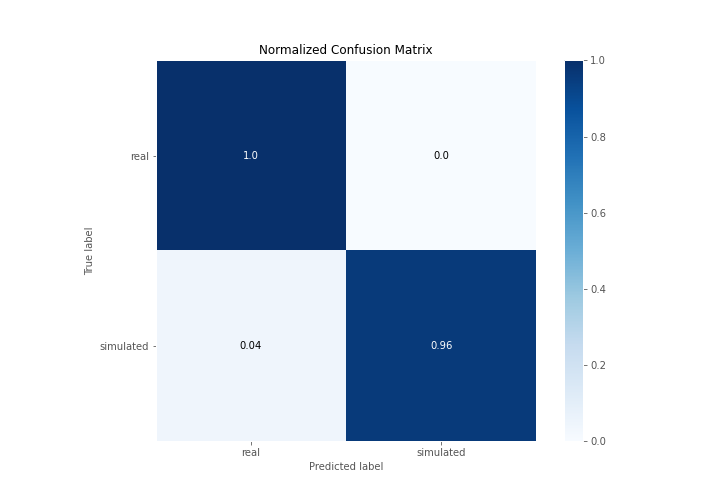
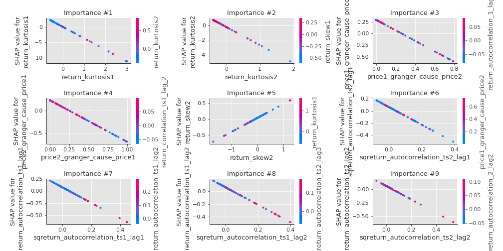

# Summary of 3_Linear

[<< Go back](../README.md)

## Logistic Regression (Linear)
- **n_jobs**: -1
- **explain_level**: 2

## Validation
 - **validation_type**: split
 - **train_ratio**: 0.75
 - **shuffle**: True
 - **stratify**: True

## Optimized metric
accuracy

## Training time

3.0 seconds

## Metric details
|           |    score |     threshold |
|:----------|---------:|--------------:|
| logloss   | 0.165662 | nan           |
| auc       | 0.996296 | nan           |
| f1        | 0.977273 |   0.693473    |
| accuracy  | 0.977011 |   0.693473    |
| precision | 1        |   0.924542    |
| recall    | 1        |   1.84756e-06 |
| mcc       | 0.95505  |   0.693473    |

## Confusion matrix (at threshold=0.693473)
|                      |   Predicted as real |   Predicted as simulated |
|:---------------------|--------------------:|-------------------------:|
| Labeled as real      |                  42 |                        0 |
| Labeled as simulated |                   2 |                       43 |

## Learning curves

## Coefficients
| feature                           |   Learner_1 |
|:----------------------------------|------------:|
| return_mean1                      |   1.09905   |
| return_autocorrelation_2_lag3     |   0.757082  |
| return_autocorrelation_2_lag1     |   0.737932  |
| return_autocorrelation_2_lag2     |   0.682938  |
| sqreturn_correlation_ts2_lag_3    |   0.54518   |
| return_correlation_ts2_lag_3      |   0.54518   |
| return_correlation_ts1_lag_1      |   0.525587  |
| sqreturn_correlation_ts1_lag_1    |   0.525587  |
| return_autocorrelation_1_lag3     |   0.508573  |
| return_correlation_ts1_lag_3      |   0.500079  |
| sqreturn_correlation_ts1_lag_3    |   0.500079  |
| return_correlation_ts2_lag_1      |   0.487811  |
| sqreturn_correlation_ts2_lag_1    |   0.487811  |
| return_skew2                      |   0.444966  |
| return_correlation_ts2_lag_2      |   0.406712  |
| sqreturn_correlation_ts2_lag_2    |   0.406712  |
| return_correlation_ts1_lag_0      |   0.404353  |
| sqreturn_correlation_ts1_lag_0    |   0.404353  |
| return_autocorrelation_1_lag2     |   0.373031  |
| return_autocorrelation_1_lag1     |   0.371259  |
| sqreturn_correlation_ts1_lag_2    |   0.331842  |
| return_correlation_ts1_lag_2      |   0.331842  |
| return_skew1                      |   0.104107  |
| return_sd1                        |   0.0327419 |
| return_mean2                      |   0.0312344 |
| return_sd2                        |   0.0167721 |
| intercept                         |  -0.863162  |
| sqreturn_autocorrelation_ts2_lag3 |  -0.895296  |
| price2_granger_cause_price1       |  -0.918493  |
| price1_granger_cause_price2       |  -1.12476   |
| sqreturn_autocorrelation_ts1_lag3 |  -1.1947    |
| sqreturn_autocorrelation_ts2_lag2 |  -1.24484   |
| sqreturn_autocorrelation_ts1_lag2 |  -1.36684   |
| sqreturn_autocorrelation_ts2_lag1 |  -1.46758   |
| sqreturn_autocorrelation_ts1_lag1 |  -1.62239   |
| return_kurtosis2                  |  -2.45093   |
| return_kurtosis1                  |  -3.66551   |

## Permutation-based Importance

## Confusion Matrix

## Normalized Confusion Matrix

## ROC Curve

## Kolmogorov-Smirnov Statistic

## Precision-Recall Curve

## Calibration Curve

## Cumulative Gains Curve

## Lift Curve

## SHAP Importance

## SHAP Dependence plots

### Dependence (Fold 1)

## SHAP Decision plots

### Top-10 Worst decisions for class 0 (Fold 1)

### Top-10 Best decisions for class 0 (Fold 1)

### Top-10 Worst decisions for class 1 (Fold 1)

### Top-10 Best decisions for class 1 (Fold 1)

[<< Go back](../README.md)
