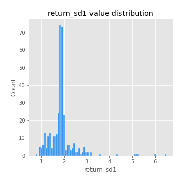
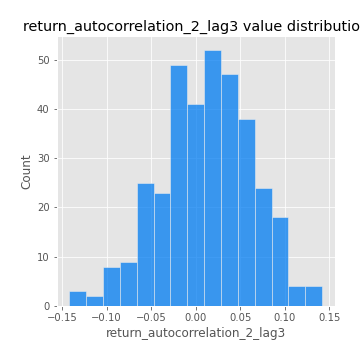
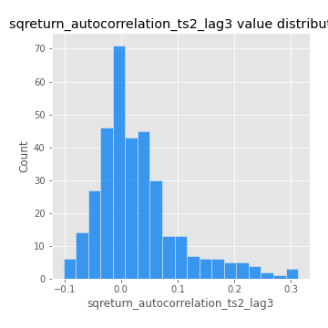

# Exploratory Data Analysis

[<< Go back](../README.md)
## Feature : target
- **Feature type** : categorical
- **Missing** : 0.0%
- **Unique** : 2
- **Count** :347
- **Unique** :2
- **Top** :simulated
- **Freq** :178

## Feature : return_mean1
- **Feature type** : continous
- **Missing** : 0.0%
- **Unique** : 347
- **Count** :347.0
- **Mean** :0.09086739157602357
- **Std** :0.08526770995446595
- **Min** :-0.17686457077756634
- **25%th Percentile** : 0.03395473326092929
- **50%th Percentile** : 0.08421289089959222
- **75%th Percentile** : 0.14410046622807696
- **Max** :0.37175100008111034

## Feature : return_mean2
- **Feature type** : continous
- **Missing** : 0.0%
- **Unique** : 347
- **Count** :347.0
- **Mean** :0.051155188250227246
- **Std** :0.09155379275805713
- **Min** :-0.21818165578778434
- **25%th Percentile** : 0.000132028961415152
- **50%th Percentile** : 0.05443053277736165
- **75%th Percentile** : 0.10058116244512932
- **Max** :0.37616608147096464

## Feature : return_sd1
- **Feature type** : continous
- **Missing** : 0.0%
- **Unique** : 347
- **Count** :347.0
- **Mean** :1.8966684852038014
- **Std** :0.6293578297110157
- **Min** :0.7470080772831957
- **25%th Percentile** : 1.6807155855963516
- **50%th Percentile** : 1.8665616354965238
- **75%th Percentile** : 1.9474143103537298
- **Max** :6.495661311240861

## Feature : return_sd2
- **Feature type** : continous
- **Missing** : 0.0%
- **Unique** : 347
- **Count** :347.0
- **Mean** :1.8463969677031338
- **Std** :0.569789105538148
- **Min** :0.8455946193085045
- **25%th Percentile** : 1.6380433450099603
- **50%th Percentile** : 1.8167924725049096
- **75%th Percentile** : 1.897338197646795
- **Max** :5.042707010333888

## Feature : return_skew1
- **Feature type** : continous
- **Missing** : 0.0%
- **Unique** : 347
- **Count** :347.0
- **Mean** :-0.07786767141409612
- **Std** :0.6166875237405812
- **Min** :-3.530116233761814
- **25%th Percentile** : -0.2046761624521735
- **50%th Percentile** : -0.011642579879061992
- **75%th Percentile** : 0.11945847659180601
- **Max** :2.5845963767725557

## Feature : return_skew2
- **Feature type** : continous
- **Missing** : 0.0%
- **Unique** : 347
- **Count** :347.0
- **Mean** :-0.15279228804085684
- **Std** :0.8229105790998831
- **Min** :-8.801502855292393
- **25%th Percentile** : -0.27578651942845855
- **50%th Percentile** : -0.041769928456378426
- **75%th Percentile** : 0.1149849321325501
- **Max** :2.2606839051517187

## Feature : return_kurtosis1
- **Feature type** : continous
- **Missing** : 0.0%
- **Unique** : 347
- **Count** :347.0
- **Mean** :3.3345741662110897
- **Std** :5.904966865230177
- **Min** :-0.45446423233397626
- **25%th Percentile** : 0.18121496968642314
- **50%th Percentile** : 0.9049898174767708
- **75%th Percentile** : 3.767479093377704
- **Max** :46.07507808162177

## Feature : return_kurtosis2
- **Feature type** : continous
- **Missing** : 0.0%
- **Unique** : 347
- **Count** :347.0
- **Mean** :4.051490855542376
- **Std** :10.202043337979124
- **Min** :-0.40626138790477206
- **25%th Percentile** : 0.30823904795854884
- **50%th Percentile** : 1.4601274279393972
- **75%th Percentile** : 4.207405647043799
- **Max** :143.10871011533666

## Feature : return_autocorrelation_1_lag1
- **Feature type** : continous
- **Missing** : 0.0%
- **Unique** : 347
- **Count** :347.0
- **Mean** :-0.006629784635221278
- **Std** :0.056726775811009864
- **Min** :-0.2135576224968752
- **25%th Percentile** : -0.0300015959890633
- **50%th Percentile** : 0.0013045641608180033
- **75%th Percentile** : 0.028307515227233983
- **Max** :0.1512283174076895

## Feature : return_autocorrelation_1_lag2
- **Feature type** : continous
- **Missing** : 0.0%
- **Unique** : 347
- **Count** :347.0
- **Mean** :0.0030335747484431293
- **Std** :0.05221432268726796
- **Min** :-0.12530494212094073
- **25%th Percentile** : -0.0329912998067401
- **50%th Percentile** : 1.731147300643271e-05
- **75%th Percentile** : 0.036192390068112645
- **Max** :0.1561488228015672

## Feature : return_autocorrelation_1_lag3
- **Feature type** : continous
- **Missing** : 0.0%
- **Unique** : 347
- **Count** :347.0
- **Mean** :0.00466628416408031
- **Std** :0.05144228536692254
- **Min** :-0.15806635192103805
- **25%th Percentile** : -0.028631717020695474
- **50%th Percentile** : 0.006421772136371442
- **75%th Percentile** : 0.04124863645558775
- **Max** :0.17531619125377315

## Feature : return_autocorrelation_2_lag1
- **Feature type** : continous
- **Missing** : 0.0%
- **Unique** : 347
- **Count** :347.0
- **Mean** :0.001154259663687788
- **Std** :0.06193303678745885
- **Min** :-0.25075531010123286
- **25%th Percentile** : -0.034924472676970596
- **50%th Percentile** : 0.007073596059273019
- **75%th Percentile** : 0.04221586778413246
- **Max** :0.31863413537898483

## Feature : return_autocorrelation_2_lag2
- **Feature type** : continous
- **Missing** : 0.0%
- **Unique** : 347
- **Count** :347.0
- **Mean** :0.009315320995483796
- **Std** :0.053273578790376544
- **Min** :-0.1495113937562178
- **25%th Percentile** : -0.0281451894611133
- **50%th Percentile** : 0.007466941240825344
- **75%th Percentile** : 0.04459051746937401
- **Max** :0.20974504043791217

## Feature : return_autocorrelation_2_lag3
- **Feature type** : continous
- **Missing** : 0.0%
- **Unique** : 347
- **Count** :347.0
- **Mean** :0.012206825502559984
- **Std** :0.0514529376614554
- **Min** :-0.14200107169559698
- **25%th Percentile** : -0.02215028922053125
- **50%th Percentile** : 0.015750182760060204
- **75%th Percentile** : 0.047962658226310226
- **Max** :0.1419999376914021

## Feature : return_correlation_ts1_lag_0
- **Feature type** : continous
- **Missing** : 0.0%
- **Unique** : 347
- **Count** :347.0
- **Mean** :0.35262664312462466
- **Std** :0.11127406864408193
- **Min** :0.005136598099876001
- **25%th Percentile** : 0.30902976213123323
- **50%th Percentile** : 0.36379728863390093
- **75%th Percentile** : 0.4063027030460896
- **Max** :0.7028422087350163

## Feature : return_correlation_ts1_lag_1
- **Feature type** : continous
- **Missing** : 0.0%
- **Unique** : 347
- **Count** :347.0
- **Mean** :-0.0007151019533976738
- **Std** :0.05450271651596582
- **Min** :-0.16985510949917193
- **25%th Percentile** : -0.03481683925588244
- **50%th Percentile** : 0.005400496995372647
- **75%th Percentile** : 0.03777251832677868
- **Max** :0.1340056748824203

## Feature : return_correlation_ts1_lag_2
- **Feature type** : continous
- **Missing** : 0.0%
- **Unique** : 347
- **Count** :347.0
- **Mean** :0.0113700737501209
- **Std** :0.05036636191142964
- **Min** :-0.21653581047581763
- **25%th Percentile** : -0.024124150342274796
- **50%th Percentile** : 0.010439191803824624
- **75%th Percentile** : 0.04701518536490959
- **Max** :0.13579320245859197

## Feature : return_correlation_ts1_lag_3
- **Feature type** : continous
- **Missing** : 0.0%
- **Unique** : 347
- **Count** :347.0
- **Mean** :0.011574570149387196
- **Std** :0.05279219397997809
- **Min** :-0.1270218498974763
- **25%th Percentile** : -0.02443794536916189
- **50%th Percentile** : 0.013014974105219191
- **75%th Percentile** : 0.05089869500742285
- **Max** :0.1422809271770942

## Feature : return_correlation_ts2_lag_1
- **Feature type** : continous
- **Missing** : 0.0%
- **Unique** : 347
- **Count** :347.0
- **Mean** :0.004801327434369569
- **Std** :0.05308515443114605
- **Min** :-0.2081139431093261
- **25%th Percentile** : -0.028755448916791916
- **50%th Percentile** : 0.0031242133176507246
- **75%th Percentile** : 0.03795112140536201
- **Max** :0.17208763791364762

## Feature : return_correlation_ts2_lag_2
- **Feature type** : continous
- **Missing** : 0.0%
- **Unique** : 347
- **Count** :347.0
- **Mean** :0.007246644417926083
- **Std** :0.05394428311920288
- **Min** :-0.23751835475804678
- **25%th Percentile** : -0.029302777066030267
- **50%th Percentile** : 0.004309585754736677
- **75%th Percentile** : 0.04196374204601302
- **Max** :0.20772887392904255

## Feature : return_correlation_ts2_lag_3
- **Feature type** : continous
- **Missing** : 0.0%
- **Unique** : 347
- **Count** :347.0
- **Mean** :0.01105978070475551
- **Std** :0.05362902721909303
- **Min** :-0.17564076057312866
- **25%th Percentile** : -0.020500363188687587
- **50%th Percentile** : 0.013290214731242183
- **75%th Percentile** : 0.04686756396883906
- **Max** :0.13272160278389358

## Feature : sqreturn_autocorrelation_ts1_lag1
- **Feature type** : continous
- **Missing** : 0.0%
- **Unique** : 347
- **Count** :347.0
- **Mean** :0.04402585546475014
- **Std** :0.08815410891045332
- **Min** :-0.10391373067023779
- **25%th Percentile** : -0.012081765795414683
- **50%th Percentile** : 0.026968400606411105
- **75%th Percentile** : 0.07973688075171828
- **Max** :0.4439086285737898

## Feature : sqreturn_autocorrelation_ts1_lag2
- **Feature type** : continous
- **Missing** : 0.0%
- **Unique** : 347
- **Count** :347.0
- **Mean** :0.0393802431425434
- **Std** :0.08868668229365416
- **Min** :-0.10400113168521548
- **25%th Percentile** : -0.014199097178647629
- **50%th Percentile** : 0.01439334612042796
- **75%th Percentile** : 0.06391859780191068
- **Max** :0.540735851444759

## Feature : sqreturn_autocorrelation_ts1_lag3
- **Feature type** : continous
- **Missing** : 0.0%
- **Unique** : 347
- **Count** :347.0
- **Mean** :0.029571761487441377
- **Std** :0.07852380887246953
- **Min** :-0.11417626982189022
- **25%th Percentile** : -0.01757157065078057
- **50%th Percentile** : 0.008390209525194188
- **75%th Percentile** : 0.05365505089599454
- **Max** :0.3457940197475473

## Feature : sqreturn_autocorrelation_ts2_lag1
- **Feature type** : continous
- **Missing** : 0.0%
- **Unique** : 347
- **Count** :347.0
- **Mean** :0.04635843995286827
- **Std** :0.08628896630424521
- **Min** :-0.08430539944233337
- **25%th Percentile** : -0.012147126809693376
- **50%th Percentile** : 0.027520139397595855
- **75%th Percentile** : 0.07490908819739699
- **Max** :0.3965571120415088

## Feature : sqreturn_autocorrelation_ts2_lag2
- **Feature type** : continous
- **Missing** : 0.0%
- **Unique** : 347
- **Count** :347.0
- **Mean** :0.040266069036408746
- **Std** :0.08728993108116316
- **Min** :-0.09543150505205845
- **25%th Percentile** : -0.014495161839411713
- **50%th Percentile** : 0.017380477537865327
- **75%th Percentile** : 0.05798317936094324
- **Max** :0.5373432415582473

## Feature : sqreturn_autocorrelation_ts2_lag3
- **Feature type** : continous
- **Missing** : 0.0%
- **Unique** : 347
- **Count** :347.0
- **Mean** :0.02947345118618695
- **Std** :0.07365121675588122
- **Min** :-0.10161464435703503
- **25%th Percentile** : -0.01769041600853484
- **50%th Percentile** : 0.012047049281430727
- **75%th Percentile** : 0.059446131404502514
- **Max** :0.31225727797735664

## Feature : sqreturn_correlation_ts1_lag_0
- **Feature type** : continous
- **Missing** : 0.0%
- **Unique** : 347
- **Count** :347.0
- **Mean** :0.35262664312462466
- **Std** :0.11127406864408193
- **Min** :0.005136598099876001
- **25%th Percentile** : 0.30902976213123323
- **50%th Percentile** : 0.36379728863390093
- **75%th Percentile** : 0.4063027030460896
- **Max** :0.7028422087350163

## Feature : sqreturn_correlation_ts1_lag_1
- **Feature type** : continous
- **Missing** : 0.0%
- **Unique** : 347
- **Count** :347.0
- **Mean** :-0.0007151019533976738
- **Std** :0.05450271651596582
- **Min** :-0.16985510949917193
- **25%th Percentile** : -0.03481683925588244
- **50%th Percentile** : 0.005400496995372647
- **75%th Percentile** : 0.03777251832677868
- **Max** :0.1340056748824203

## Feature : sqreturn_correlation_ts1_lag_2
- **Feature type** : continous
- **Missing** : 0.0%
- **Unique** : 347
- **Count** :347.0
- **Mean** :0.0113700737501209
- **Std** :0.05036636191142964
- **Min** :-0.21653581047581763
- **25%th Percentile** : -0.024124150342274796
- **50%th Percentile** : 0.010439191803824624
- **75%th Percentile** : 0.04701518536490959
- **Max** :0.13579320245859197

## Feature : sqreturn_correlation_ts1_lag_3
- **Feature type** : continous
- **Missing** : 0.0%
- **Unique** : 347
- **Count** :347.0
- **Mean** :0.011574570149387196
- **Std** :0.05279219397997809
- **Min** :-0.1270218498974763
- **25%th Percentile** : -0.02443794536916189
- **50%th Percentile** : 0.013014974105219191
- **75%th Percentile** : 0.05089869500742285
- **Max** :0.1422809271770942

## Feature : sqreturn_correlation_ts2_lag_1
- **Feature type** : continous
- **Missing** : 0.0%
- **Unique** : 347
- **Count** :347.0
- **Mean** :0.004801327434369569
- **Std** :0.05308515443114605
- **Min** :-0.2081139431093261
- **25%th Percentile** : -0.028755448916791916
- **50%th Percentile** : 0.0031242133176507246
- **75%th Percentile** : 0.03795112140536201
- **Max** :0.17208763791364762

## Feature : sqreturn_correlation_ts2_lag_2
- **Feature type** : continous
- **Missing** : 0.0%
- **Unique** : 347
- **Count** :347.0
- **Mean** :0.007246644417926083
- **Std** :0.05394428311920288
- **Min** :-0.23751835475804678
- **25%th Percentile** : -0.029302777066030267
- **50%th Percentile** : 0.004309585754736677
- **75%th Percentile** : 0.04196374204601302
- **Max** :0.20772887392904255

## Feature : sqreturn_correlation_ts2_lag_3
- **Feature type** : continous
- **Missing** : 0.0%
- **Unique** : 347
- **Count** :347.0
- **Mean** :0.01105978070475551
- **Std** :0.05362902721909303
- **Min** :-0.17564076057312866
- **25%th Percentile** : -0.020500363188687587
- **50%th Percentile** : 0.013290214731242183
- **75%th Percentile** : 0.04686756396883906
- **Max** :0.13272160278389358

## Feature : price2_granger_cause_price1
- **Feature type** : continous
- **Missing** : 0.0%
- **Unique** : 347
- **Count** :347.0
- **Mean** :0.278991992270504
- **Std** :0.2819838123406256
- **Min** :1.1522179460968604e-06
- **25%th Percentile** : 0.02611424592129396
- **50%th Percentile** : 0.18412291775194473
- **75%th Percentile** : 0.4839556635270363
- **Max** :0.9970039552245785

## Feature : price1_granger_cause_price2
- **Feature type** : continous
- **Missing** : 0.0%
- **Unique** : 347
- **Count** :347.0
- **Mean** :0.20163973398029764
- **Std** :0.2727528175045404
- **Min** :1.686009187453577e-15
- **25%th Percentile** : 0.000773043396739043
- **50%th Percentile** : 0.04101034350019618
- **75%th Percentile** : 0.34932517105218974
- **Max** :0.9951398266867577

[<< Go back](../README.md)
