# Summary of 3_Linear

[<< Go back](../README.md)

## Logistic Regression (Linear)
- **n_jobs**: -1
- **explain_level**: 2

## Validation
 - **validation_type**: split
 - **train_ratio**: 0.75
 - **shuffle**: True
 - **stratify**: True

## Optimized metric
accuracy

## Training time

3.6 seconds

## Metric details
|           |    score |     threshold |
|:----------|---------:|--------------:|
| logloss   | 0.323906 | nan           |
| auc       | 0.959302 | nan           |
| f1        | 0.941176 |   0.685226    |
| accuracy  | 0.942529 |   0.685226    |
| precision | 1        |   0.901064    |
| recall    | 1        |   4.40288e-08 |
| mcc       | 0.885246 |   0.685226    |

## Confusion matrix (at threshold=0.685226)
|                      |   Predicted as real |   Predicted as simulated |
|:---------------------|--------------------:|-------------------------:|
| Labeled as real      |                  42 |                        2 |
| Labeled as simulated |                   3 |                       40 |

## Learning curves
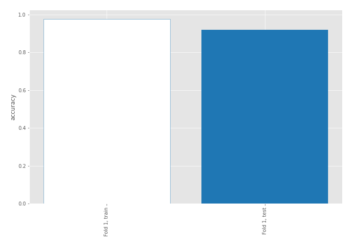

## Coefficients
| feature                           |   Learner_1 |
|:----------------------------------|------------:|
| return_mean1                      |   0.864998  |
| sqreturn_correlation_ts1_lag_0    |   0.859124  |
| return_correlation_ts1_lag_0      |   0.859124  |
| sqreturn_correlation_ts1_lag_1    |   0.695816  |
| return_correlation_ts1_lag_1      |   0.695816  |
| return_autocorrelation_2_lag3     |   0.58452   |
| return_autocorrelation_2_lag1     |   0.558868  |
| return_autocorrelation_1_lag1     |   0.555805  |
| return_skew2                      |   0.524288  |
| return_autocorrelation_2_lag2     |   0.500424  |
| sqreturn_correlation_ts1_lag_2    |   0.466828  |
| return_correlation_ts1_lag_2      |   0.466828  |
| return_skew1                      |   0.464925  |
| sqreturn_correlation_ts2_lag_1    |   0.445361  |
| return_correlation_ts2_lag_1      |   0.445361  |
| return_autocorrelation_1_lag2     |   0.422833  |
| return_autocorrelation_1_lag3     |   0.416723  |
| sqreturn_correlation_ts1_lag_3    |   0.385979  |
| return_correlation_ts1_lag_3      |   0.385979  |
| return_correlation_ts2_lag_3      |   0.343219  |
| sqreturn_correlation_ts2_lag_3    |   0.343219  |
| return_correlation_ts2_lag_2      |   0.190832  |
| sqreturn_correlation_ts2_lag_2    |   0.190832  |
| return_sd1                        |   0.146098  |
| return_sd2                        |  -0.0496792 |
| return_mean2                      |  -0.284528  |
| sqreturn_autocorrelation_ts2_lag3 |  -0.828315  |
| intercept                         |  -0.978732  |
| sqreturn_autocorrelation_ts1_lag3 |  -1.00917   |
| sqreturn_autocorrelation_ts2_lag2 |  -1.22055   |
| sqreturn_autocorrelation_ts1_lag2 |  -1.38386   |
| price2_granger_cause_price1       |  -1.46465   |
| sqreturn_autocorrelation_ts2_lag1 |  -1.54948   |
| sqreturn_autocorrelation_ts1_lag1 |  -1.65099   |
| price1_granger_cause_price2       |  -1.73307   |
| return_kurtosis2                  |  -1.83465   |
| return_kurtosis1                  |  -3.98838   |

## Permutation-based Importance
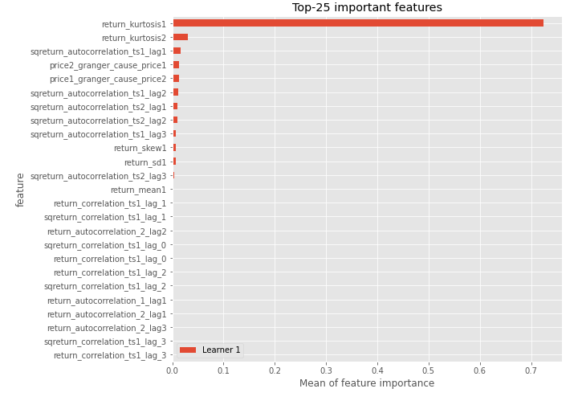
## Confusion Matrix

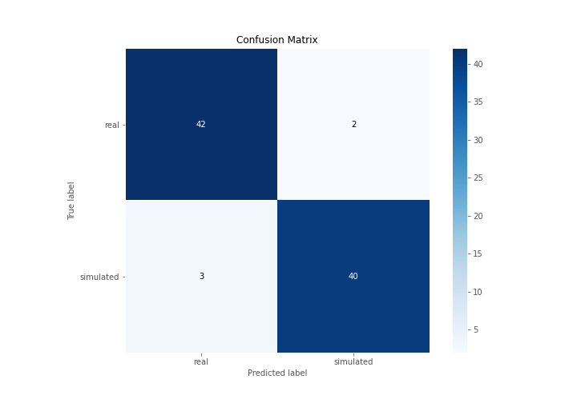

## Normalized Confusion Matrix

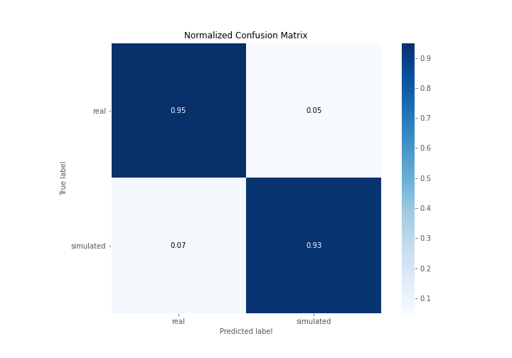

## ROC Curve

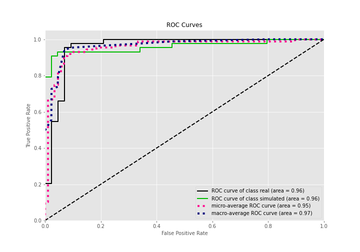

## Kolmogorov-Smirnov Statistic

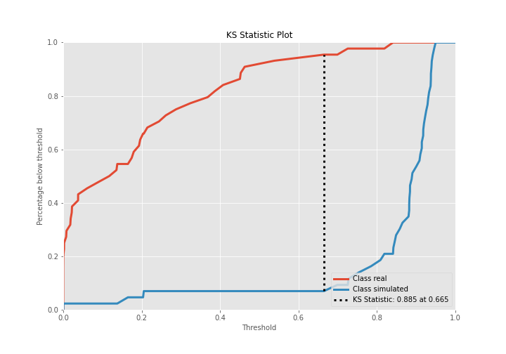

## Precision-Recall Curve

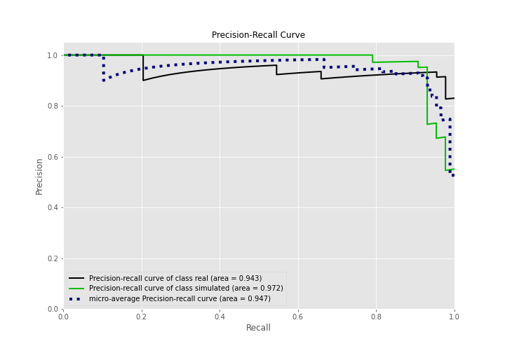

## Calibration Curve

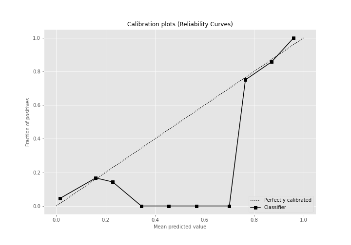

## Cumulative Gains Curve

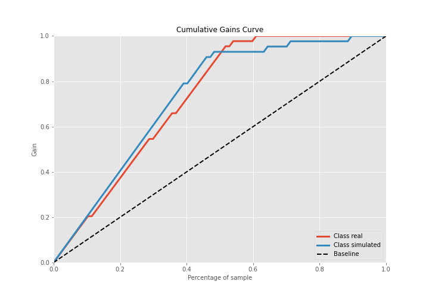

## Lift Curve

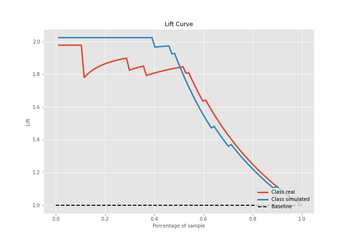

## SHAP Importance
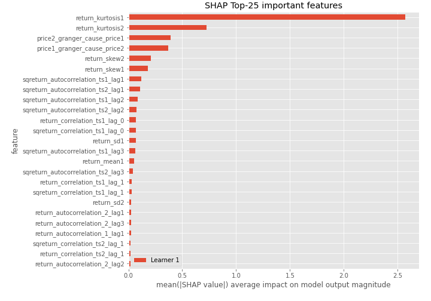

## SHAP Dependence plots

### Dependence (Fold 1)
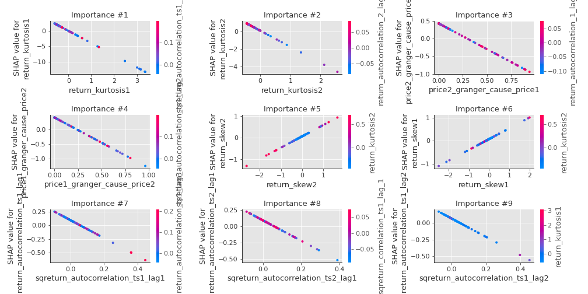

## SHAP Decision plots

### Top-10 Worst decisions for class 0 (Fold 1)
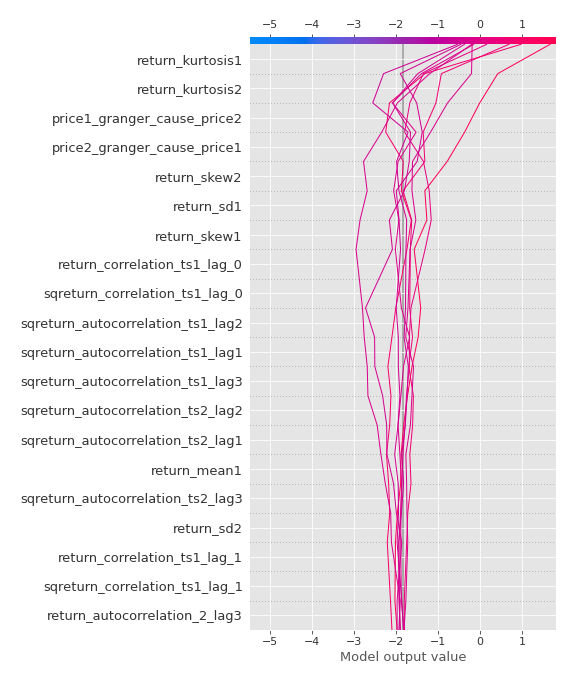
### Top-10 Best decisions for class 0 (Fold 1)
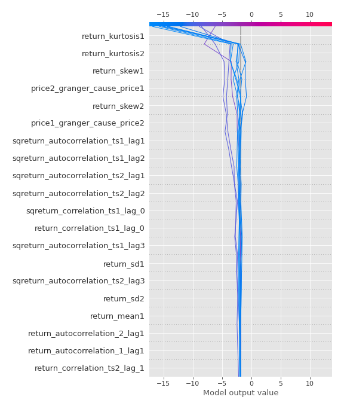
### Top-10 Worst decisions for class 1 (Fold 1)
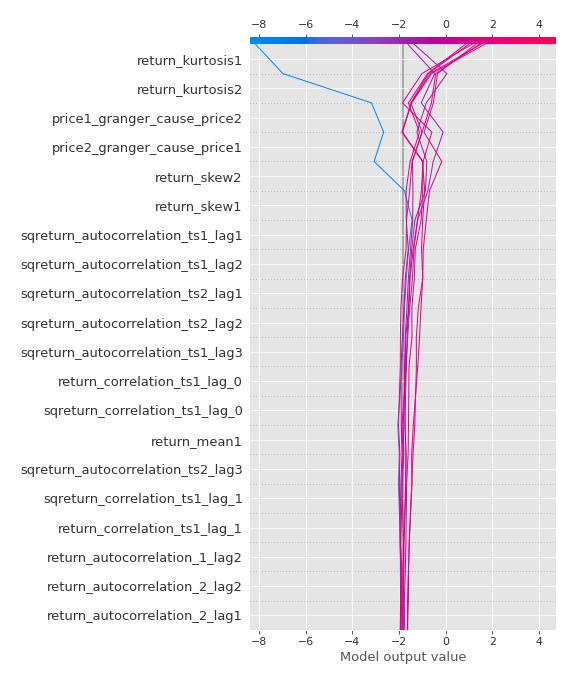
### Top-10 Best decisions for class 1 (Fold 1)
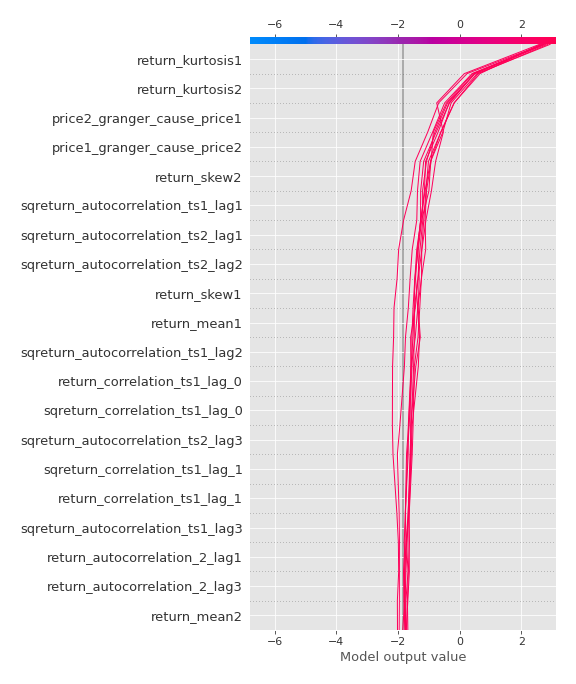

[<< Go back](../README.md)
