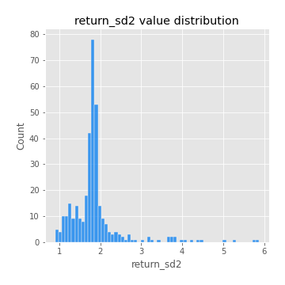
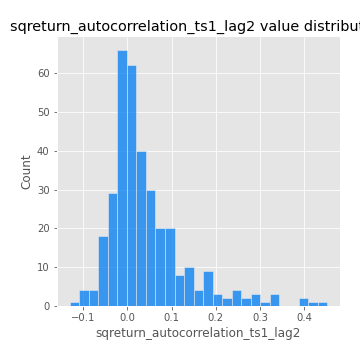
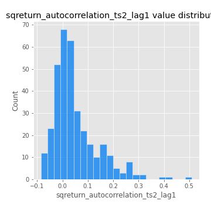

# Exploratory Data Analysis

[<< Go back](../README.md)
## Feature : target
- **Feature type** : categorical
- **Missing** : 0.0%
- **Unique** : 2
- **Count** :347
- **Unique** :2
- **Top** :real
- **Freq** :175

## Feature : return_mean1
- **Feature type** : continous
- **Missing** : 0.0%
- **Unique** : 347
- **Count** :347.0
- **Mean** :0.08671389837755228
- **Std** :0.08531964852208716
- **Min** :-0.22632637961920957
- **25%th Percentile** : 0.03338827755389172
- **50%th Percentile** : 0.08342294051817205
- **75%th Percentile** : 0.14050177595730248
- **Max** :0.3612366374600757

## Feature : return_mean2
- **Feature type** : continous
- **Missing** : 0.0%
- **Unique** : 347
- **Count** :347.0
- **Mean** :0.05770546490014709
- **Std** :0.0931936562404438
- **Min** :-0.27284220662281855
- **25%th Percentile** : 0.010786943504052786
- **50%th Percentile** : 0.06177375626576386
- **75%th Percentile** : 0.11220084146899786
- **Max** :0.37616608147096464

## Feature : return_sd1
- **Feature type** : continous
- **Missing** : 0.0%
- **Unique** : 347
- **Count** :347.0
- **Mean** :1.9029666691314766
- **Std** :0.6915578592818532
- **Min** :0.7620831696941981
- **25%th Percentile** : 1.6902017658202082
- **50%th Percentile** : 1.8571259767136374
- **75%th Percentile** : 1.9510924557222444
- **Max** :9.236766377527575

## Feature : return_sd2
- **Feature type** : continous
- **Missing** : 0.0%
- **Unique** : 347
- **Count** :347.0
- **Mean** :1.876605315779989
- **Std** :0.6662602565487593
- **Min** :0.8967691504919791
- **25%th Percentile** : 1.6278503992024924
- **50%th Percentile** : 1.8141580207263306
- **75%th Percentile** : 1.9104049593694201
- **Max** :5.872800253666788

## Feature : return_skew1
- **Feature type** : continous
- **Missing** : 0.0%
- **Unique** : 347
- **Count** :347.0
- **Mean** :-0.08737776190117
- **Std** :0.6050019151705637
- **Min** :-3.530116233761814
- **25%th Percentile** : -0.212962144911854
- **50%th Percentile** : -0.03486465987483679
- **75%th Percentile** : 0.12575930796971946
- **Max** :1.989411030028313

## Feature : return_skew2
- **Feature type** : continous
- **Missing** : 0.0%
- **Unique** : 347
- **Count** :347.0
- **Mean** :-0.1372038736921248
- **Std** :0.8294695971763075
- **Min** :-8.801502855292393
- **25%th Percentile** : -0.2476038621805744
- **50%th Percentile** : -0.03309244140334725
- **75%th Percentile** : 0.13859410427194344
- **Max** :2.2606839051517187

## Feature : return_kurtosis1
- **Feature type** : continous
- **Missing** : 0.0%
- **Unique** : 347
- **Count** :347.0
- **Mean** :3.4091646606938246
- **Std** :5.948293913972411
- **Min** :-0.3719920743026468
- **25%th Percentile** : 0.19143616431019383
- **50%th Percentile** : 1.1288324810375587
- **75%th Percentile** : 3.8656514401103763
- **Max** :46.07507808162177

## Feature : return_kurtosis2
- **Feature type** : continous
- **Missing** : 0.0%
- **Unique** : 347
- **Count** :347.0
- **Mean** :4.348607222704093
- **Std** :10.057612177812182
- **Min** :-0.44715935883278624
- **25%th Percentile** : 0.33160087116633874
- **50%th Percentile** : 1.5376214012666494
- **75%th Percentile** : 4.30151608205566
- **Max** :143.10871011533666

## Feature : return_autocorrelation_1_lag1
- **Feature type** : continous
- **Missing** : 0.0%
- **Unique** : 347
- **Count** :347.0
- **Mean** :-0.0017370717299389179
- **Std** :0.05853115344752347
- **Min** :-0.20673896439036124
- **25%th Percentile** : -0.03643062081689814
- **50%th Percentile** : 0.005688440745727146
- **75%th Percentile** : 0.03788216845912501
- **Max** :0.12810656890648087

## Feature : return_autocorrelation_1_lag2
- **Feature type** : continous
- **Missing** : 0.0%
- **Unique** : 347
- **Count** :347.0
- **Mean** :0.0017130295210882212
- **Std** :0.050633637243022805
- **Min** :-0.13309283796645122
- **25%th Percentile** : -0.02885542323176103
- **50%th Percentile** : 0.001973049121836925
- **75%th Percentile** : 0.032525398826221075
- **Max** :0.1561488228015672

## Feature : return_autocorrelation_1_lag3
- **Feature type** : continous
- **Missing** : 0.0%
- **Unique** : 347
- **Count** :347.0
- **Mean** :0.007803227042114022
- **Std** :0.05091491835943081
- **Min** :-0.15806635192103805
- **25%th Percentile** : -0.022135329316271393
- **50%th Percentile** : 0.011168765782386608
- **75%th Percentile** : 0.04431069942675373
- **Max** :0.17805869530681923

## Feature : return_autocorrelation_2_lag1
- **Feature type** : continous
- **Missing** : 0.0%
- **Unique** : 347
- **Count** :347.0
- **Mean** :1.4139180619247973e-05
- **Std** :0.061930402541875616
- **Min** :-0.25075531010123286
- **25%th Percentile** : -0.03442027117555825
- **50%th Percentile** : 0.004732928527022069
- **75%th Percentile** : 0.04286746249566695
- **Max** :0.18070304290835285

## Feature : return_autocorrelation_2_lag2
- **Feature type** : continous
- **Missing** : 0.0%
- **Unique** : 347
- **Count** :347.0
- **Mean** :0.010084038914618353
- **Std** :0.053403540619802535
- **Min** :-0.15323211089747296
- **25%th Percentile** : -0.028054092239181358
- **50%th Percentile** : 0.01001902404661531
- **75%th Percentile** : 0.04938751935250795
- **Max** :0.1648909954810232

## Feature : return_autocorrelation_2_lag3
- **Feature type** : continous
- **Missing** : 0.0%
- **Unique** : 347
- **Count** :347.0
- **Mean** :0.005814601458083227
- **Std** :0.052116884633542734
- **Min** :-0.14200107169559698
- **25%th Percentile** : -0.027071057080556293
- **50%th Percentile** : 0.006022948101046963
- **75%th Percentile** : 0.04276966814121089
- **Max** :0.13849977455907306

## Feature : return_correlation_ts1_lag_0
- **Feature type** : continous
- **Missing** : 0.0%
- **Unique** : 347
- **Count** :347.0
- **Mean** :0.34668391826208317
- **Std** :0.10931086485245467
- **Min** :-0.027089510445801036
- **25%th Percentile** : 0.29788174931465794
- **50%th Percentile** : 0.36065644287816256
- **75%th Percentile** : 0.4021917574146706
- **Max** :0.7041861626832071

## Feature : return_correlation_ts1_lag_1
- **Feature type** : continous
- **Missing** : 0.0%
- **Unique** : 347
- **Count** :347.0
- **Mean** :0.00607930450700522
- **Std** :0.05576858752815038
- **Min** :-0.15776193292681923
- **25%th Percentile** : -0.03314043415656928
- **50%th Percentile** : 0.011523157251533243
- **75%th Percentile** : 0.04696756864998532
- **Max** :0.16318494634502417

## Feature : return_correlation_ts1_lag_2
- **Feature type** : continous
- **Missing** : 0.0%
- **Unique** : 347
- **Count** :347.0
- **Mean** :0.008483459203815873
- **Std** :0.04818331348520873
- **Min** :-0.12864410180561703
- **25%th Percentile** : -0.024475296775775653
- **50%th Percentile** : 0.011845923961597105
- **75%th Percentile** : 0.04430410997953166
- **Max** :0.13742065543289253

## Feature : return_correlation_ts1_lag_3
- **Feature type** : continous
- **Missing** : 0.0%
- **Unique** : 347
- **Count** :347.0
- **Mean** :0.00786598657471772
- **Std** :0.05179576422415787
- **Min** :-0.1270218498974763
- **25%th Percentile** : -0.024668662960347164
- **50%th Percentile** : 0.008071049636995389
- **75%th Percentile** : 0.04136692519807866
- **Max** :0.1636773216468148

## Feature : return_correlation_ts2_lag_1
- **Feature type** : continous
- **Missing** : 0.0%
- **Unique** : 347
- **Count** :347.0
- **Mean** :0.003175160386659559
- **Std** :0.0575516403152709
- **Min** :-0.2081139431093261
- **25%th Percentile** : -0.029003286212088704
- **50%th Percentile** : 0.0006232801432226243
- **75%th Percentile** : 0.03984767281418144
- **Max** :0.17208763791364762

## Feature : return_correlation_ts2_lag_2
- **Feature type** : continous
- **Missing** : 0.0%
- **Unique** : 347
- **Count** :347.0
- **Mean** :0.007349910233634547
- **Std** :0.04880110890465938
- **Min** :-0.15299951737180204
- **25%th Percentile** : -0.02631024638240563
- **50%th Percentile** : 0.004536193825541846
- **75%th Percentile** : 0.0388290287495789
- **Max** :0.20772887392904255

## Feature : return_correlation_ts2_lag_3
- **Feature type** : continous
- **Missing** : 0.0%
- **Unique** : 347
- **Count** :347.0
- **Mean** :0.0052168151269855615
- **Std** :0.05274307864052798
- **Min** :-0.17564076057312866
- **25%th Percentile** : -0.024145503133182096
- **50%th Percentile** : 0.005792643695935664
- **75%th Percentile** : 0.042704781943161435
- **Max** :0.17054573117789495

## Feature : sqreturn_autocorrelation_ts1_lag1
- **Feature type** : continous
- **Missing** : 0.0%
- **Unique** : 347
- **Count** :347.0
- **Mean** :0.05041290155068664
- **Std** :0.09714726188654915
- **Min** :-0.11554591208231019
- **25%th Percentile** : -0.012938097282299707
- **50%th Percentile** : 0.02459550803438465
- **75%th Percentile** : 0.08476889035149268
- **Max** :0.49414293176447355

## Feature : sqreturn_autocorrelation_ts1_lag2
- **Feature type** : continous
- **Missing** : 0.0%
- **Unique** : 347
- **Count** :347.0
- **Mean** :0.04070582857076658
- **Std** :0.08799541649869863
- **Min** :-0.13071764833659166
- **25%th Percentile** : -0.01157985798137815
- **50%th Percentile** : 0.01742381197615294
- **75%th Percentile** : 0.0668082684716744
- **Max** :0.4522162366773919

## Feature : sqreturn_autocorrelation_ts1_lag3
- **Feature type** : continous
- **Missing** : 0.0%
- **Unique** : 347
- **Count** :347.0
- **Mean** :0.03274391986872905
- **Std** :0.07721020041369328
- **Min** :-0.0999274079385441
- **25%th Percentile** : -0.01736630627608977
- **50%th Percentile** : 0.013014190554133217
- **75%th Percentile** : 0.056682527828685506
- **Max** :0.41030914918857014

## Feature : sqreturn_autocorrelation_ts2_lag1
- **Feature type** : continous
- **Missing** : 0.0%
- **Unique** : 347
- **Count** :347.0
- **Mean** :0.048446004857058494
- **Std** :0.0882598644796429
- **Min** :-0.08540959540872868
- **25%th Percentile** : -0.008872347131510614
- **50%th Percentile** : 0.025064663625994105
- **75%th Percentile** : 0.08311599375667086
- **Max** :0.510085647437958

## Feature : sqreturn_autocorrelation_ts2_lag2
- **Feature type** : continous
- **Missing** : 0.0%
- **Unique** : 347
- **Count** :347.0
- **Mean** :0.039292634740492396
- **Std** :0.0820815353446853
- **Min** :-0.09141620558446992
- **25%th Percentile** : -0.00893099828458202
- **50%th Percentile** : 0.01300741529117995
- **75%th Percentile** : 0.058255617519687615
- **Max** :0.45676817892778204

## Feature : sqreturn_autocorrelation_ts2_lag3
- **Feature type** : continous
- **Missing** : 0.0%
- **Unique** : 347
- **Count** :347.0
- **Mean** :0.028852719322610028
- **Std** :0.06770688693589251
- **Min** :-0.12502745480699204
- **25%th Percentile** : -0.012916311468639165
- **50%th Percentile** : 0.012784161301929102
- **75%th Percentile** : 0.05237124480323921
- **Max** :0.31225727797735664

## Feature : sqreturn_correlation_ts1_lag_0
- **Feature type** : continous
- **Missing** : 0.0%
- **Unique** : 347
- **Count** :347.0
- **Mean** :0.34668391826208317
- **Std** :0.10931086485245467
- **Min** :-0.027089510445801036
- **25%th Percentile** : 0.29788174931465794
- **50%th Percentile** : 0.36065644287816256
- **75%th Percentile** : 0.4021917574146706
- **Max** :0.7041861626832071

## Feature : sqreturn_correlation_ts1_lag_1
- **Feature type** : continous
- **Missing** : 0.0%
- **Unique** : 347
- **Count** :347.0
- **Mean** :0.00607930450700522
- **Std** :0.05576858752815038
- **Min** :-0.15776193292681923
- **25%th Percentile** : -0.03314043415656928
- **50%th Percentile** : 0.011523157251533243
- **75%th Percentile** : 0.04696756864998532
- **Max** :0.16318494634502417

## Feature : sqreturn_correlation_ts1_lag_2
- **Feature type** : continous
- **Missing** : 0.0%
- **Unique** : 347
- **Count** :347.0
- **Mean** :0.008483459203815873
- **Std** :0.04818331348520873
- **Min** :-0.12864410180561703
- **25%th Percentile** : -0.024475296775775653
- **50%th Percentile** : 0.011845923961597105
- **75%th Percentile** : 0.04430410997953166
- **Max** :0.13742065543289253

## Feature : sqreturn_correlation_ts1_lag_3
- **Feature type** : continous
- **Missing** : 0.0%
- **Unique** : 347
- **Count** :347.0
- **Mean** :0.00786598657471772
- **Std** :0.05179576422415787
- **Min** :-0.1270218498974763
- **25%th Percentile** : -0.024668662960347164
- **50%th Percentile** : 0.008071049636995389
- **75%th Percentile** : 0.04136692519807866
- **Max** :0.1636773216468148

## Feature : sqreturn_correlation_ts2_lag_1
- **Feature type** : continous
- **Missing** : 0.0%
- **Unique** : 347
- **Count** :347.0
- **Mean** :0.003175160386659559
- **Std** :0.0575516403152709
- **Min** :-0.2081139431093261
- **25%th Percentile** : -0.029003286212088704
- **50%th Percentile** : 0.0006232801432226243
- **75%th Percentile** : 0.03984767281418144
- **Max** :0.17208763791364762

## Feature : sqreturn_correlation_ts2_lag_2
- **Feature type** : continous
- **Missing** : 0.0%
- **Unique** : 347
- **Count** :347.0
- **Mean** :0.007349910233634547
- **Std** :0.04880110890465938
- **Min** :-0.15299951737180204
- **25%th Percentile** : -0.02631024638240563
- **50%th Percentile** : 0.004536193825541846
- **75%th Percentile** : 0.0388290287495789
- **Max** :0.20772887392904255

## Feature : sqreturn_correlation_ts2_lag_3
- **Feature type** : continous
- **Missing** : 0.0%
- **Unique** : 347
- **Count** :347.0
- **Mean** :0.0052168151269855615
- **Std** :0.05274307864052798
- **Min** :-0.17564076057312866
- **25%th Percentile** : -0.024145503133182096
- **50%th Percentile** : 0.005792643695935664
- **75%th Percentile** : 0.042704781943161435
- **Max** :0.17054573117789495

## Feature : price2_granger_cause_price1
- **Feature type** : continous
- **Missing** : 0.0%
- **Unique** : 347
- **Count** :347.0
- **Mean** :0.2683748041254241
- **Std** :0.2798024528927477
- **Min** :1.1006039102887483e-08
- **25%th Percentile** : 0.024095124812059096
- **50%th Percentile** : 0.15765302734374834
- **75%th Percentile** : 0.4619158141472478
- **Max** :0.9885712803689185

## Feature : price1_granger_cause_price2
- **Feature type** : continous
- **Missing** : 0.0%
- **Unique** : 347
- **Count** :347.0
- **Mean** :0.21613453718716383
- **Std** :0.2679393411987532
- **Min** :2.8558106426198007e-11
- **25%th Percentile** : 0.003762248658574451
- **50%th Percentile** : 0.07099765917518275
- **75%th Percentile** : 0.369604762802746
- **Max** :0.9951398266867577

[<< Go back](../README.md)
