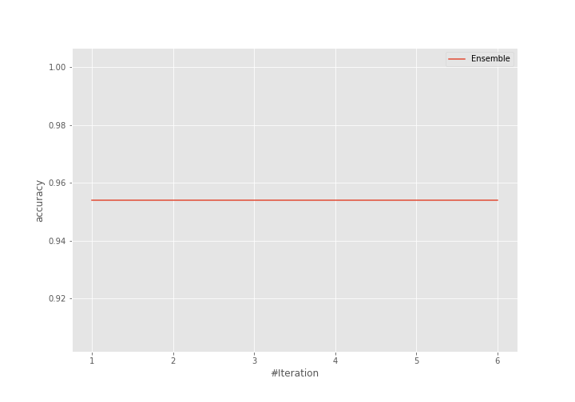
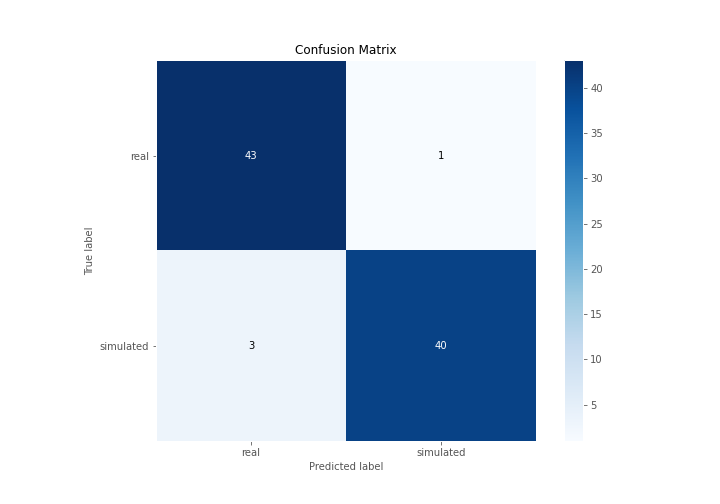

# Summary of Ensemble

[<< Go back](../README.md)

## Ensemble structure
| Model                  |   Weight |
|:-----------------------|---------:|
| 6_Default_RandomForest |        1 |

## Metric details
|           |    score |    threshold |
|:----------|---------:|-------------:|
| logloss   | 0.332132 | nan          |
| auc       | 0.955338 | nan          |
| f1        | 0.952381 |   0.00724638 |
| accuracy  | 0.954023 |   0.00724638 |
| precision | 0.97561  |   0.00724638 |
| recall    | 1        |   0          |
| mcc       | 0.908948 |   0.00724638 |

## Confusion matrix (at threshold=0.007246)
|                      |   Predicted as real |   Predicted as simulated |
|:---------------------|--------------------:|-------------------------:|
| Labeled as real      |                  43 |                        1 |
| Labeled as simulated |                   3 |                       40 |

## Learning curves

## Confusion Matrix

## Normalized Confusion Matrix

## ROC Curve

## Kolmogorov-Smirnov Statistic

## Precision-Recall Curve

## Calibration Curve

## Cumulative Gains Curve

## Lift Curve

[<< Go back](../README.md)
