# Summary of 2_DecisionTree

[<< Go back](../README.md)

## Decision Tree
- **n_jobs**: -1
- **criterion**: gini
- **max_depth**: 3
- **explain_level**: 2

## Validation
 - **validation_type**: split
 - **train_ratio**: 0.75
 - **shuffle**: True
 - **stratify**: True

## Optimized metric
accuracy

## Training time

4.9 seconds

## Metric details
|           |    score |   threshold |
|:----------|---------:|------------:|
| logloss   | 0.242594 |  nan        |
| auc       | 0.97508  |  nan        |
| f1        | 0.963855 |    0        |
| accuracy  | 0.965517 |    0        |
| precision | 0.973684 |    0.877807 |
| recall    | 0.97561  |    0        |
| mcc       | 0.931145 |    0.495455 |

## Confusion matrix (at threshold=0.0)
|                      |   Predicted as real |   Predicted as simulated |
|:---------------------|--------------------:|-------------------------:|
| Labeled as real      |                  44 |                        2 |
| Labeled as simulated |                   1 |                       40 |

## Learning curves

## Decision Tree 

### Tree #1
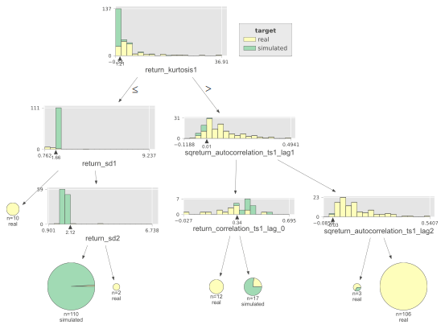

### Rules

if (return_kurtosis1 <= 1.206) and (return_sd1 > 1.664) and (return_sd2 <= 2.125) then class: simulated (proba: 99.09%) | based on 110 samples

if (return_kurtosis1 > 1.206) and (sqreturn_autocorrelation_ts1_lag1 > 0.011) and (sqreturn_autocorrelation_ts1_lag2 > -0.031) then class: real (proba: 100.0%) | based on 106 samples

if (return_kurtosis1 > 1.206) and (sqreturn_autocorrelation_ts1_lag1 <= 0.011) and (return_correlation_ts1_lag_0 > 0.339) then class: simulated (proba: 76.47%) | based on 17 samples

if (return_kurtosis1 > 1.206) and (sqreturn_autocorrelation_ts1_lag1 <= 0.011) and (return_correlation_ts1_lag_0 <= 0.339) then class: real (proba: 100.0%) | based on 12 samples

if (return_kurtosis1 <= 1.206) and (return_sd1 <= 1.664) then class: real (proba: 100.0%) | based on 10 samples

if (return_kurtosis1 > 1.206) and (sqreturn_autocorrelation_ts1_lag1 > 0.011) and (sqreturn_autocorrelation_ts1_lag2 <= -0.031) then class: real (proba: 66.67%) | based on 3 samples

if (return_kurtosis1 <= 1.206) and (return_sd1 > 1.664) and (return_sd2 > 2.125) then class: real (proba: 100.0%) | based on 2 samples

## Permutation-based Importance
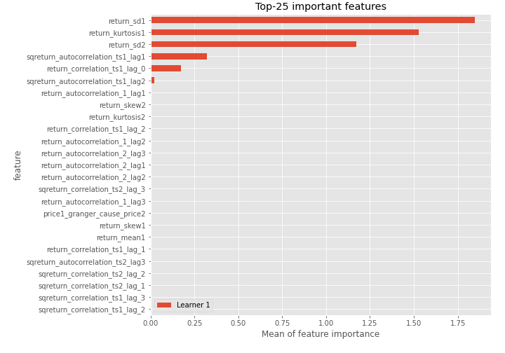
## Confusion Matrix

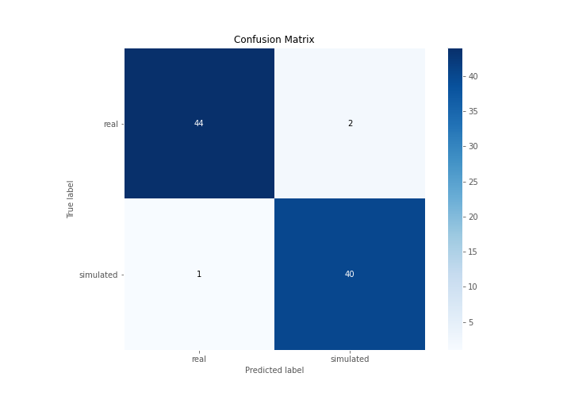

## Normalized Confusion Matrix

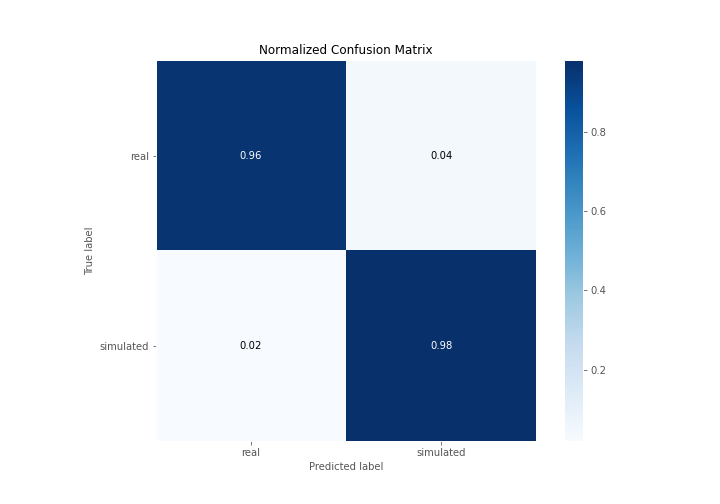

## ROC Curve

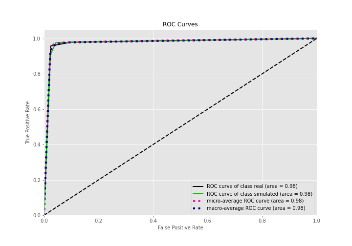

## Kolmogorov-Smirnov Statistic

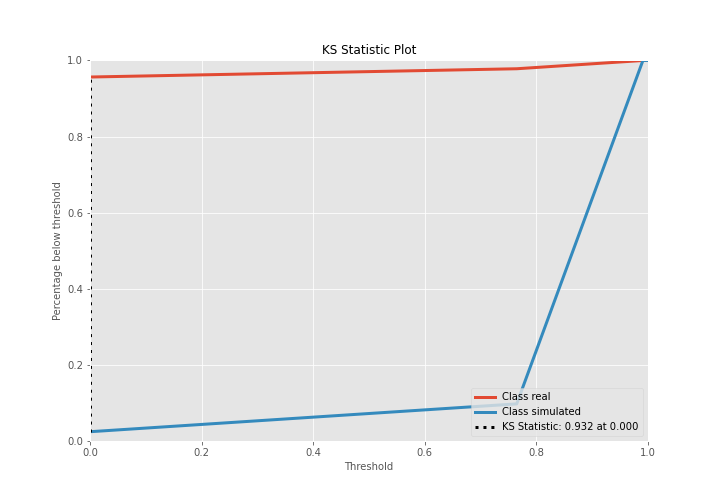

## Precision-Recall Curve

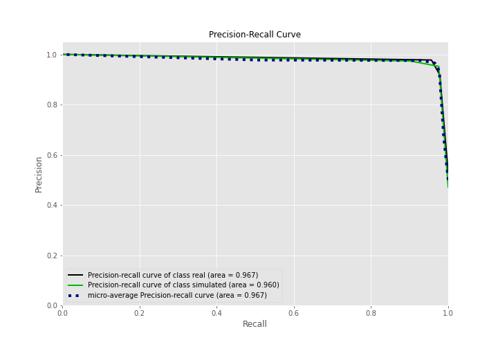

## Calibration Curve

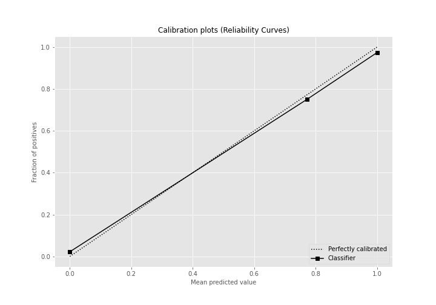

## Cumulative Gains Curve

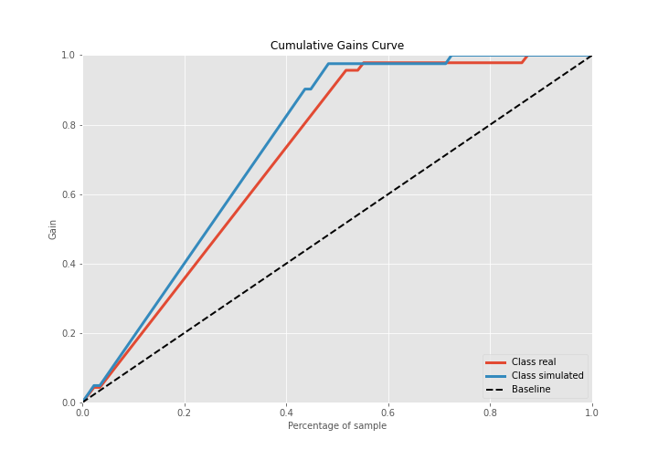

## Lift Curve

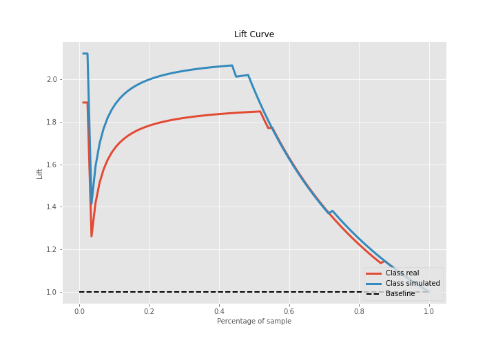

## SHAP Importance
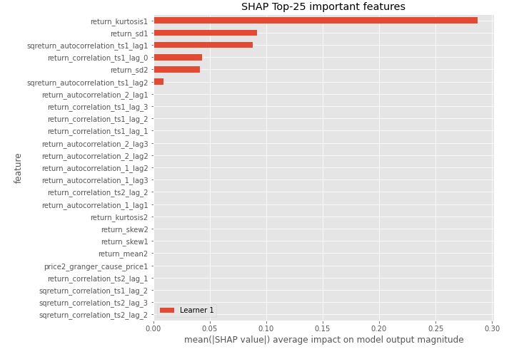

## SHAP Dependence plots

### Dependence (Fold 1)
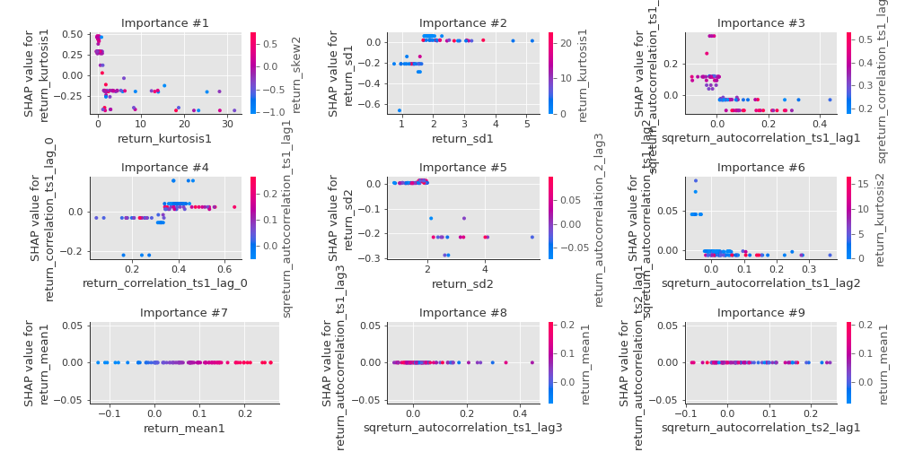

## SHAP Decision plots

### Top-10 Worst decisions for class 0 (Fold 1)
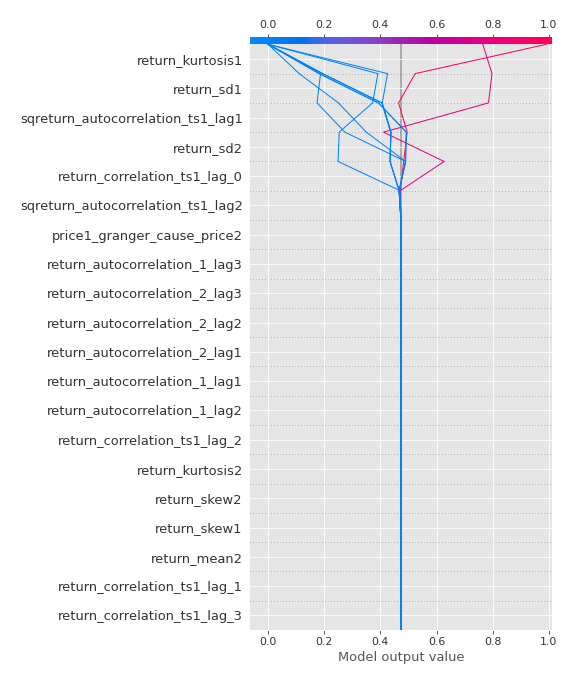
### Top-10 Best decisions for class 0 (Fold 1)
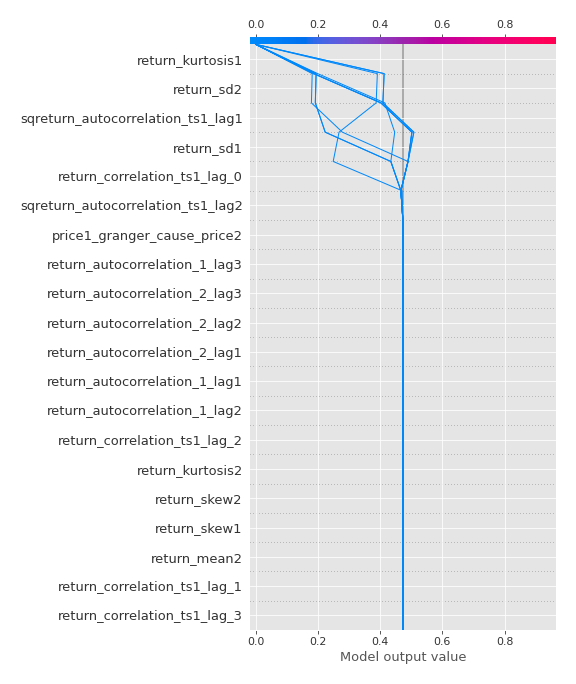
### Top-10 Worst decisions for class 1 (Fold 1)
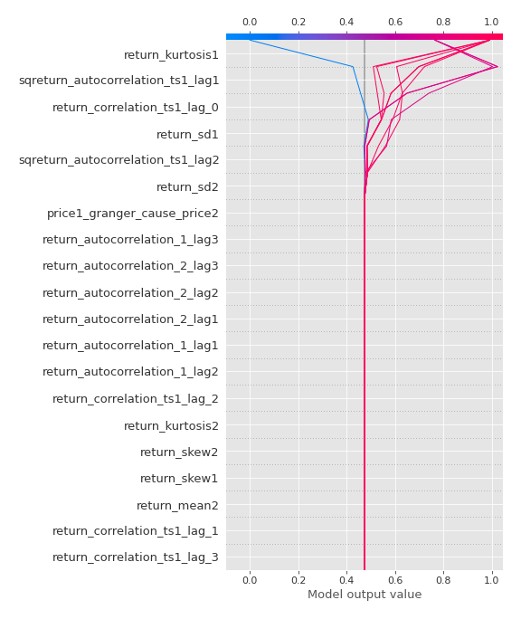
### Top-10 Best decisions for class 1 (Fold 1)
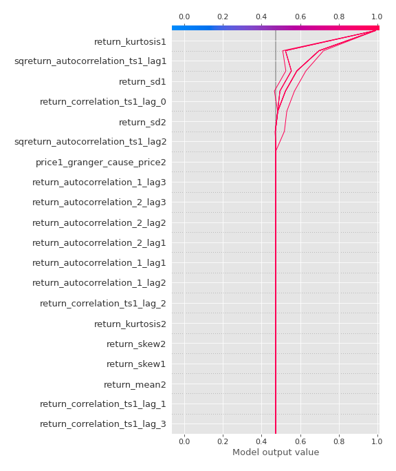

[<< Go back](../README.md)
