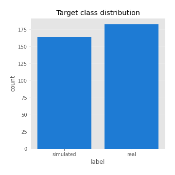
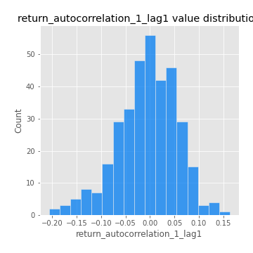

# Exploratory Data Analysis

[<< Go back](../README.md)
## Feature : target
- **Feature type** : categorical
- **Missing** : 0.0%
- **Unique** : 2
- **Count** :347
- **Unique** :2
- **Top** :real
- **Freq** :183

## Feature : return_mean1
- **Feature type** : continous
- **Missing** : 0.0%
- **Unique** : 347
- **Count** :347.0
- **Mean** :0.08545367247558484
- **Std** :0.08571420755927062
- **Min** :-0.22632637961920957
- **25%th Percentile** : 0.03201885046963513
- **50%th Percentile** : 0.08105966791719892
- **75%th Percentile** : 0.13514649822486968
- **Max** :0.37175100008111034

## Feature : return_mean2
- **Feature type** : continous
- **Missing** : 0.0%
- **Unique** : 347
- **Count** :347.0
- **Mean** :0.05006447674293601
- **Std** :0.09695885724230559
- **Min** :-0.2795092047745909
- **25%th Percentile** : -0.006674730585271092
- **50%th Percentile** : 0.047348540101938466
- **75%th Percentile** : 0.10083108692871531
- **Max** :0.4176151149372295

## Feature : return_sd1
- **Feature type** : continous
- **Missing** : 0.0%
- **Unique** : 347
- **Count** :347.0
- **Mean** :1.903902606453418
- **Std** :0.7367335024553182
- **Min** :0.7470080772831957
- **25%th Percentile** : 1.6236185958738418
- **50%th Percentile** : 1.8705183327681718
- **75%th Percentile** : 1.962356927021352
- **Max** :9.236766377527575

## Feature : return_sd2
- **Feature type** : continous
- **Missing** : 0.0%
- **Unique** : 347
- **Count** :347.0
- **Mean** :1.9168889443868307
- **Std** :0.7594843424773545
- **Min** :0.8592887433004143
- **25%th Percentile** : 1.6203644730334634
- **50%th Percentile** : 1.8043337271998037
- **75%th Percentile** : 1.9270907956219459
- **Max** :6.737618636746393

## Feature : return_skew1
- **Feature type** : continous
- **Missing** : 0.0%
- **Unique** : 347
- **Count** :347.0
- **Mean** :-0.10490861050165985
- **Std** :0.6003663619421937
- **Min** :-3.530116233761814
- **25%th Percentile** : -0.2694068459958272
- **50%th Percentile** : -0.05227812634811059
- **75%th Percentile** : 0.12519501442849115
- **Max** :2.224942816365292

## Feature : return_skew2
- **Feature type** : continous
- **Missing** : 0.0%
- **Unique** : 347
- **Count** :347.0
- **Mean** :-0.09994722004284608
- **Std** :0.6013717686807937
- **Min** :-2.5169062744473636
- **25%th Percentile** : -0.27631733249529533
- **50%th Percentile** : -0.03606932604154768
- **75%th Percentile** : 0.13206194018858053
- **Max** :2.2606839051517187

## Feature : return_kurtosis1
- **Feature type** : continous
- **Missing** : 0.0%
- **Unique** : 347
- **Count** :347.0
- **Mean** :3.656413548736651
- **Std** :5.983350958003294
- **Min** :-0.3267677656388912
- **25%th Percentile** : 0.24321690741738156
- **50%th Percentile** : 1.519718363662156
- **75%th Percentile** : 4.073645250680178
- **Max** :36.91113889081053

## Feature : return_kurtosis2
- **Feature type** : continous
- **Missing** : 0.0%
- **Unique** : 347
- **Count** :347.0
- **Mean** :3.91891767770178
- **Std** :5.699038815118066
- **Min** :-0.32673579942626896
- **25%th Percentile** : 0.38095233940785245
- **50%th Percentile** : 1.793632743662236
- **75%th Percentile** : 4.624994353288867
- **Max** :36.023880269969645

## Feature : return_autocorrelation_1_lag1
- **Feature type** : continous
- **Missing** : 0.0%
- **Unique** : 347
- **Count** :347.0
- **Mean** :-0.005692281658744106
- **Std** :0.0610638567503602
- **Min** :-0.20673896439036124
- **25%th Percentile** : -0.04021167356721162
- **50%th Percentile** : -0.003654705826058786
- **75%th Percentile** : 0.03660467340371669
- **Max** :0.1636792537903592

## Feature : return_autocorrelation_1_lag2
- **Feature type** : continous
- **Missing** : 0.0%
- **Unique** : 347
- **Count** :347.0
- **Mean** :0.0008466046256273014
- **Std** :0.053423103858663244
- **Min** :-0.13309283796645122
- **25%th Percentile** : -0.03308163156274574
- **50%th Percentile** : -0.0012341336204821686
- **75%th Percentile** : 0.03887630937135683
- **Max** :0.1504548147767879

## Feature : return_autocorrelation_1_lag3
- **Feature type** : continous
- **Missing** : 0.0%
- **Unique** : 347
- **Count** :347.0
- **Mean** :0.007004268246992889
- **Std** :0.05055653056744106
- **Min** :-0.1940836867390813
- **25%th Percentile** : -0.025096403313829223
- **50%th Percentile** : 0.0077211936287295896
- **75%th Percentile** : 0.04077026668106165
- **Max** :0.1324560036070697

## Feature : return_autocorrelation_2_lag1
- **Feature type** : continous
- **Missing** : 0.0%
- **Unique** : 347
- **Count** :347.0
- **Mean** :-0.0007647857185604672
- **Std** :0.06300646362123084
- **Min** :-0.25075531010123286
- **25%th Percentile** : -0.03673885538763179
- **50%th Percentile** : 0.004881748341133909
- **75%th Percentile** : 0.040992706722886275
- **Max** :0.16349871797309318

## Feature : return_autocorrelation_2_lag2
- **Feature type** : continous
- **Missing** : 0.0%
- **Unique** : 347
- **Count** :347.0
- **Mean** :0.009298015692011738
- **Std** :0.05455471686116149
- **Min** :-0.15323211089747296
- **25%th Percentile** : -0.030026568016001235
- **50%th Percentile** : 0.008534233665332822
- **75%th Percentile** : 0.05072238600038584
- **Max** :0.1735398560230086

## Feature : return_autocorrelation_2_lag3
- **Feature type** : continous
- **Missing** : 0.0%
- **Unique** : 347
- **Count** :347.0
- **Mean** :0.007779462683139291
- **Std** :0.05446420112639817
- **Min** :-0.14200107169559698
- **25%th Percentile** : -0.028501422040691633
- **50%th Percentile** : 0.008778550175183317
- **75%th Percentile** : 0.043984384374878976
- **Max** :0.16949340274734237

## Feature : return_correlation_ts1_lag_0
- **Feature type** : continous
- **Missing** : 0.0%
- **Unique** : 347
- **Count** :347.0
- **Mean** :0.34732106703487997
- **Std** :0.11633705759401765
- **Min** :-0.027089510445801036
- **25%th Percentile** : 0.28474784222741945
- **50%th Percentile** : 0.3644453777355062
- **75%th Percentile** : 0.41052036595475583
- **Max** :0.6949986865664105

## Feature : return_correlation_ts1_lag_1
- **Feature type** : continous
- **Missing** : 0.0%
- **Unique** : 347
- **Count** :347.0
- **Mean** :0.003598302751472184
- **Std** :0.05355719737482561
- **Min** :-0.15776193292681923
- **25%th Percentile** : -0.0323985791810953
- **50%th Percentile** : 0.010813641286967683
- **75%th Percentile** : 0.042284875632825805
- **Max** :0.15499424718508623

## Feature : return_correlation_ts1_lag_2
- **Feature type** : continous
- **Missing** : 0.0%
- **Unique** : 347
- **Count** :347.0
- **Mean** :0.009286438716512038
- **Std** :0.05094226307112016
- **Min** :-0.12864410180561703
- **25%th Percentile** : -0.02866624044203714
- **50%th Percentile** : 0.007204132398884849
- **75%th Percentile** : 0.04697834631295536
- **Max** :0.12682662940166736

## Feature : return_correlation_ts1_lag_3
- **Feature type** : continous
- **Missing** : 0.0%
- **Unique** : 347
- **Count** :347.0
- **Mean** :0.008447644357804198
- **Std** :0.05220603329245769
- **Min** :-0.12306593817498207
- **25%th Percentile** : -0.02746204406242548
- **50%th Percentile** : 0.008898642232345549
- **75%th Percentile** : 0.044366268541447866
- **Max** :0.1636773216468148

## Feature : return_correlation_ts2_lag_1
- **Feature type** : continous
- **Missing** : 0.0%
- **Unique** : 347
- **Count** :347.0
- **Mean** :0.004441606099736132
- **Std** :0.05411566705887507
- **Min** :-0.2081139431093261
- **25%th Percentile** : -0.025490565077604305
- **50%th Percentile** : 0.007776782450481914
- **75%th Percentile** : 0.040323255878308324
- **Max** :0.17208763791364762

## Feature : return_correlation_ts2_lag_2
- **Feature type** : continous
- **Missing** : 0.0%
- **Unique** : 347
- **Count** :347.0
- **Mean** :0.009803099054908868
- **Std** :0.05253389121362883
- **Min** :-0.23751835475804678
- **25%th Percentile** : -0.0254856601946478
- **50%th Percentile** : 0.00783009120488281
- **75%th Percentile** : 0.045550552358514296
- **Max** :0.15388933426238696

## Feature : return_correlation_ts2_lag_3
- **Feature type** : continous
- **Missing** : 0.0%
- **Unique** : 347
- **Count** :347.0
- **Mean** :0.007336099484040057
- **Std** :0.05036123801897365
- **Min** :-0.16212823605110202
- **25%th Percentile** : -0.022885279405497578
- **50%th Percentile** : 0.011322907663246106
- **75%th Percentile** : 0.04482208032064769
- **Max** :0.12578577770423086

## Feature : sqreturn_autocorrelation_ts1_lag1
- **Feature type** : continous
- **Missing** : 0.0%
- **Unique** : 347
- **Count** :347.0
- **Mean** :0.052333203103604335
- **Std** :0.09300329812489547
- **Min** :-0.1187911886500051
- **25%th Percentile** : -0.01043048840765
- **50%th Percentile** : 0.029618638597683135
- **75%th Percentile** : 0.0879243935161117
- **Max** :0.49414293176447355

## Feature : sqreturn_autocorrelation_ts1_lag2
- **Feature type** : continous
- **Missing** : 0.0%
- **Unique** : 347
- **Count** :347.0
- **Mean** :0.045218654994911164
- **Std** :0.08963245519845102
- **Min** :-0.08585802796793458
- **25%th Percentile** : -0.012337074225929785
- **50%th Percentile** : 0.022440785529168193
- **75%th Percentile** : 0.07462054318273581
- **Max** :0.540735851444759

## Feature : sqreturn_autocorrelation_ts1_lag3
- **Feature type** : continous
- **Missing** : 0.0%
- **Unique** : 347
- **Count** :347.0
- **Mean** :0.03555214855274589
- **Std** :0.07880031802153135
- **Min** :-0.08171232430941568
- **25%th Percentile** : -0.015101889593094654
- **50%th Percentile** : 0.015699338166860154
- **75%th Percentile** : 0.06250284432580042
- **Max** :0.44755937369538146

## Feature : sqreturn_autocorrelation_ts2_lag1
- **Feature type** : continous
- **Missing** : 0.0%
- **Unique** : 347
- **Count** :347.0
- **Mean** :0.04709308995551907
- **Std** :0.08718646150482301
- **Min** :-0.08520586663750691
- **25%th Percentile** : -0.012133928013899956
- **50%th Percentile** : 0.02527293529662947
- **75%th Percentile** : 0.08590960592139346
- **Max** :0.510085647437958

## Feature : sqreturn_autocorrelation_ts2_lag2
- **Feature type** : continous
- **Missing** : 0.0%
- **Unique** : 347
- **Count** :347.0
- **Mean** :0.039471726476653805
- **Std** :0.08814415035685215
- **Min** :-0.12535281095812834
- **25%th Percentile** : -0.01220271540775833
- **50%th Percentile** : 0.014616356590142399
- **75%th Percentile** : 0.056916143887290147
- **Max** :0.5373432415582473

## Feature : sqreturn_autocorrelation_ts2_lag3
- **Feature type** : continous
- **Missing** : 0.0%
- **Unique** : 347
- **Count** :347.0
- **Mean** :0.024152221861883302
- **Std** :0.07119240777942423
- **Min** :-0.0943667450700292
- **25%th Percentile** : -0.020301092969362843
- **50%th Percentile** : 0.007761469099359234
- **75%th Percentile** : 0.04521521546244153
- **Max** :0.30256115637327263

## Feature : sqreturn_correlation_ts1_lag_0
- **Feature type** : continous
- **Missing** : 0.0%
- **Unique** : 347
- **Count** :347.0
- **Mean** :0.34732106703487997
- **Std** :0.11633705759401765
- **Min** :-0.027089510445801036
- **25%th Percentile** : 0.28474784222741945
- **50%th Percentile** : 0.3644453777355062
- **75%th Percentile** : 0.41052036595475583
- **Max** :0.6949986865664105

## Feature : sqreturn_correlation_ts1_lag_1
- **Feature type** : continous
- **Missing** : 0.0%
- **Unique** : 347
- **Count** :347.0
- **Mean** :0.003598302751472184
- **Std** :0.05355719737482561
- **Min** :-0.15776193292681923
- **25%th Percentile** : -0.0323985791810953
- **50%th Percentile** : 0.010813641286967683
- **75%th Percentile** : 0.042284875632825805
- **Max** :0.15499424718508623

## Feature : sqreturn_correlation_ts1_lag_2
- **Feature type** : continous
- **Missing** : 0.0%
- **Unique** : 347
- **Count** :347.0
- **Mean** :0.009286438716512038
- **Std** :0.05094226307112016
- **Min** :-0.12864410180561703
- **25%th Percentile** : -0.02866624044203714
- **50%th Percentile** : 0.007204132398884849
- **75%th Percentile** : 0.04697834631295536
- **Max** :0.12682662940166736

## Feature : sqreturn_correlation_ts1_lag_3
- **Feature type** : continous
- **Missing** : 0.0%
- **Unique** : 347
- **Count** :347.0
- **Mean** :0.008447644357804198
- **Std** :0.05220603329245769
- **Min** :-0.12306593817498207
- **25%th Percentile** : -0.02746204406242548
- **50%th Percentile** : 0.008898642232345549
- **75%th Percentile** : 0.044366268541447866
- **Max** :0.1636773216468148

## Feature : sqreturn_correlation_ts2_lag_1
- **Feature type** : continous
- **Missing** : 0.0%
- **Unique** : 347
- **Count** :347.0
- **Mean** :0.004441606099736132
- **Std** :0.05411566705887507
- **Min** :-0.2081139431093261
- **25%th Percentile** : -0.025490565077604305
- **50%th Percentile** : 0.007776782450481914
- **75%th Percentile** : 0.040323255878308324
- **Max** :0.17208763791364762

## Feature : sqreturn_correlation_ts2_lag_2
- **Feature type** : continous
- **Missing** : 0.0%
- **Unique** : 347
- **Count** :347.0
- **Mean** :0.009803099054908868
- **Std** :0.05253389121362883
- **Min** :-0.23751835475804678
- **25%th Percentile** : -0.0254856601946478
- **50%th Percentile** : 0.00783009120488281
- **75%th Percentile** : 0.045550552358514296
- **Max** :0.15388933426238696

## Feature : sqreturn_correlation_ts2_lag_3
- **Feature type** : continous
- **Missing** : 0.0%
- **Unique** : 347
- **Count** :347.0
- **Mean** :0.007336099484040057
- **Std** :0.05036123801897365
- **Min** :-0.16212823605110202
- **25%th Percentile** : -0.022885279405497578
- **50%th Percentile** : 0.011322907663246106
- **75%th Percentile** : 0.04482208032064769
- **Max** :0.12578577770423086

## Feature : price2_granger_cause_price1
- **Feature type** : continous
- **Missing** : 0.0%
- **Unique** : 347
- **Count** :347.0
- **Mean** :0.29583976830730213
- **Std** :0.299316057505338
- **Min** :1.3501500752035152e-06
- **25%th Percentile** : 0.02815329771536818
- **50%th Percentile** : 0.18842430019372958
- **75%th Percentile** : 0.5002699517831525
- **Max** :0.9957389879832469

## Feature : price1_granger_cause_price2
- **Feature type** : continous
- **Missing** : 0.0%
- **Unique** : 347
- **Count** :347.0
- **Mean** :0.19723422324510717
- **Std** :0.257482924042322
- **Min** :3.1144667871611884e-11
- **25%th Percentile** : 0.002544752112812256
- **50%th Percentile** : 0.06356654534293059
- **75%th Percentile** : 0.31101299910442326
- **Max** :0.9951398266867577

[<< Go back](../README.md)
