# Summary of 3_Linear

[<< Go back](../README.md)

## Logistic Regression (Linear)
- **n_jobs**: -1
- **explain_level**: 2

## Validation
 - **validation_type**: split
 - **train_ratio**: 0.75
 - **shuffle**: True
 - **stratify**: True

## Optimized metric
accuracy

## Training time

4.6 seconds

## Metric details
|           |    score |     threshold |
|:----------|---------:|--------------:|
| logloss   | 0.186418 | nan           |
| auc       | 0.984144 | nan           |
| f1        | 0.965517 |   0.605195    |
| accuracy  | 0.965517 |   0.605195    |
| precision | 1        |   0.901342    |
| recall    | 1        |   2.79966e-16 |
| mcc       | 0.93129  |   0.605195    |

## Confusion matrix (at threshold=0.605195)
|                      |   Predicted as real |   Predicted as simulated |
|:---------------------|--------------------:|-------------------------:|
| Labeled as real      |                  42 |                        1 |
| Labeled as simulated |                   2 |                       42 |

## Learning curves
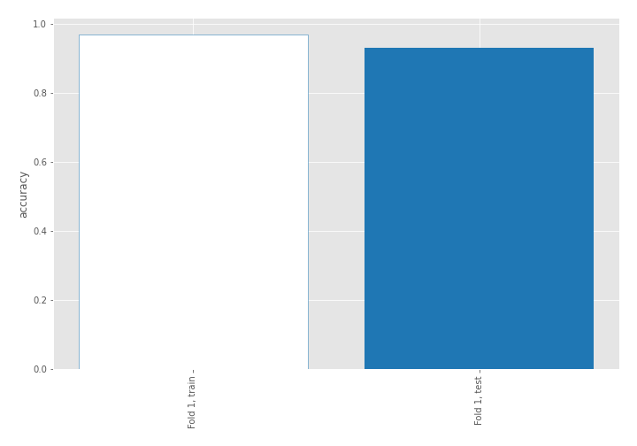

## Coefficients
| feature                           |   Learner_1 |
|:----------------------------------|------------:|
| return_skew2                      |    0.889534 |
| return_mean1                      |    0.821646 |
| return_autocorrelation_2_lag1     |    0.816542 |
| return_autocorrelation_2_lag3     |    0.772122 |
| sqreturn_correlation_ts1_lag_0    |    0.72307  |
| return_correlation_ts1_lag_0      |    0.72307  |
| sqreturn_correlation_ts1_lag_3    |    0.573562 |
| return_correlation_ts1_lag_3      |    0.573562 |
| return_autocorrelation_1_lag3     |    0.560048 |
| sqreturn_correlation_ts1_lag_1    |    0.546924 |
| return_correlation_ts1_lag_1      |    0.546924 |
| sqreturn_correlation_ts2_lag_3    |    0.53283  |
| return_correlation_ts2_lag_3      |    0.53283  |
| return_correlation_ts2_lag_1      |    0.531345 |
| sqreturn_correlation_ts2_lag_1    |    0.531345 |
| return_autocorrelation_2_lag2     |    0.515349 |
| sqreturn_correlation_ts1_lag_2    |    0.383224 |
| return_correlation_ts1_lag_2      |    0.383224 |
| return_autocorrelation_1_lag1     |    0.371782 |
| return_sd1                        |    0.216804 |
| return_autocorrelation_1_lag2     |    0.203755 |
| return_correlation_ts2_lag_2      |    0.137145 |
| sqreturn_correlation_ts2_lag_2    |    0.137145 |
| return_sd2                        |   -0.130996 |
| return_skew1                      |   -0.237773 |
| return_mean2                      |   -0.24212  |
| sqreturn_autocorrelation_ts2_lag3 |   -0.829797 |
| intercept                         |   -0.83886  |
| price2_granger_cause_price1       |   -0.889974 |
| sqreturn_autocorrelation_ts1_lag3 |   -1.01143  |
| sqreturn_autocorrelation_ts2_lag2 |   -1.16471  |
| sqreturn_autocorrelation_ts1_lag2 |   -1.37961  |
| sqreturn_autocorrelation_ts1_lag1 |   -1.54695  |
| price1_granger_cause_price2       |   -1.67609  |
| sqreturn_autocorrelation_ts2_lag1 |   -1.69211  |
| return_kurtosis2                  |   -2.39819  |
| return_kurtosis1                  |   -2.75364  |

## Permutation-based Importance
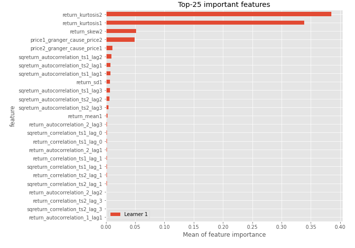
## Confusion Matrix

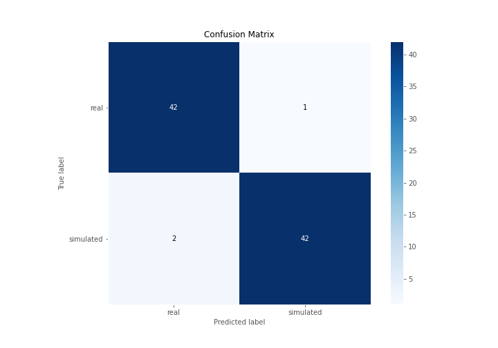

## Normalized Confusion Matrix

## ROC Curve

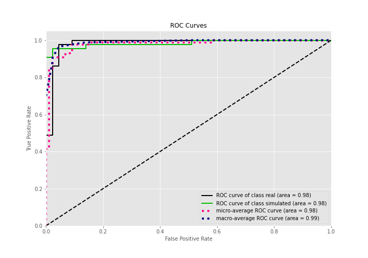

## Kolmogorov-Smirnov Statistic

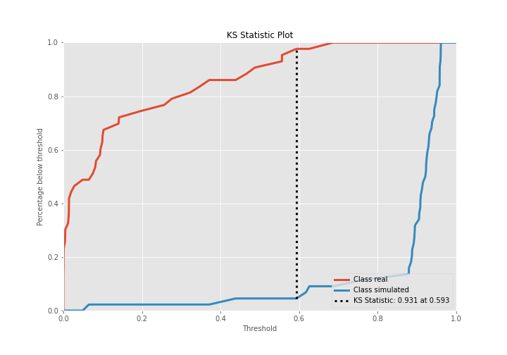

## Precision-Recall Curve

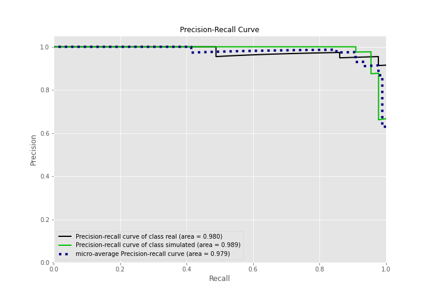

## Calibration Curve

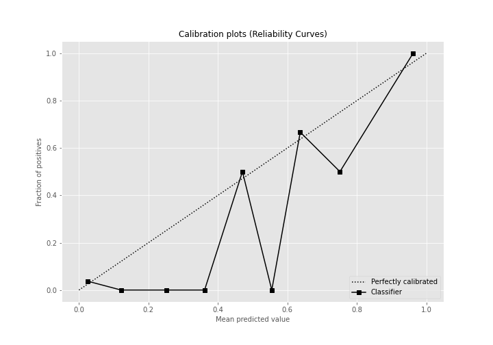

## Cumulative Gains Curve

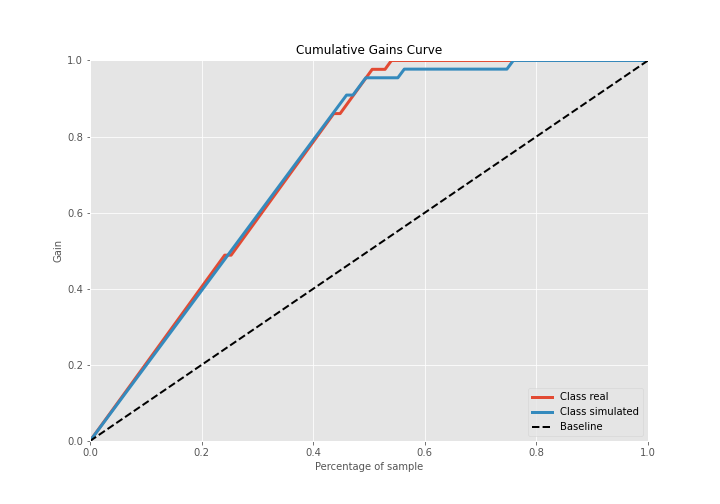

## Lift Curve

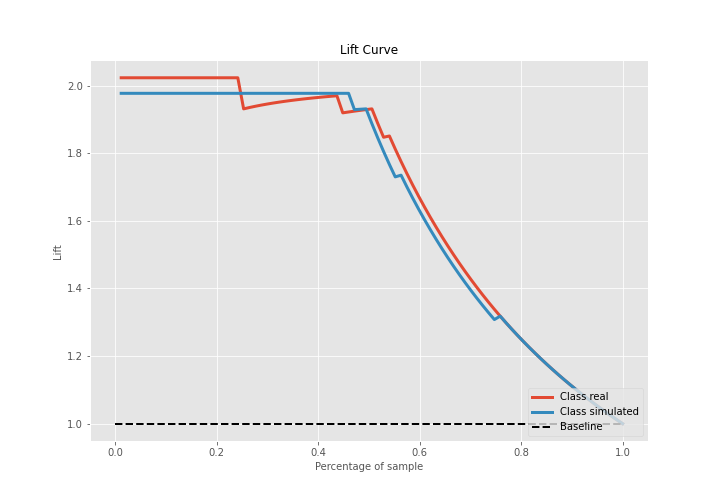

## SHAP Importance
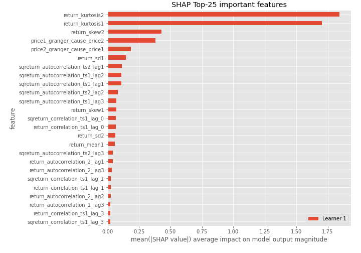

## SHAP Dependence plots

### Dependence (Fold 1)
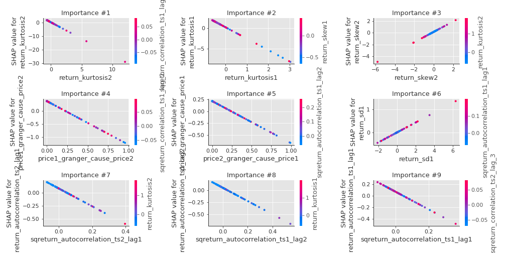

## SHAP Decision plots

### Top-10 Worst decisions for class 0 (Fold 1)
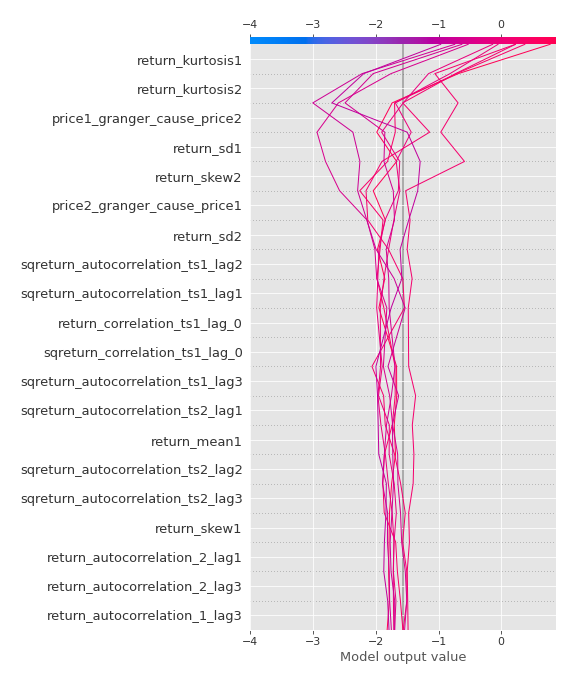
### Top-10 Best decisions for class 0 (Fold 1)
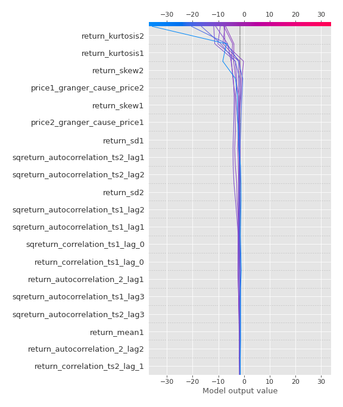
### Top-10 Worst decisions for class 1 (Fold 1)
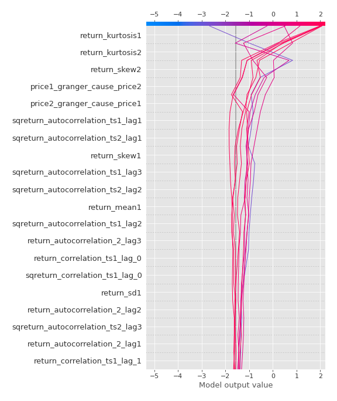
### Top-10 Best decisions for class 1 (Fold 1)
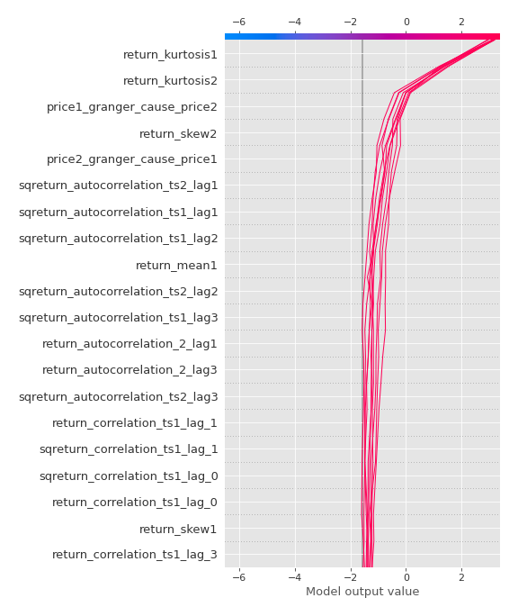

[<< Go back](../README.md)
