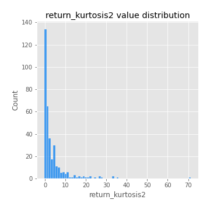

# Exploratory Data Analysis

[<< Go back](../README.md)
## Feature : target
- **Feature type** : categorical
- **Missing** : 0.0%
- **Unique** : 2
- **Count** :347
- **Unique** :2
- **Top** :simulated
- **Freq** :176

## Feature : return_mean1
- **Feature type** : continous
- **Missing** : 0.0%
- **Unique** : 347
- **Count** :347.0
- **Mean** :0.0899332644337657
- **Std** :0.0876486509640203
- **Min** :-0.17686457077756634
- **25%th Percentile** : 0.03485568115871613
- **50%th Percentile** : 0.08224244238770097
- **75%th Percentile** : 0.13717755646338942
- **Max** :0.37175100008111034

## Feature : return_mean2
- **Feature type** : continous
- **Missing** : 0.0%
- **Unique** : 347
- **Count** :347.0
- **Mean** :0.05159026501341235
- **Std** :0.09635560336847669
- **Min** :-0.24205418062825398
- **25%th Percentile** : -0.001022701017365671
- **50%th Percentile** : 0.04817986844639543
- **75%th Percentile** : 0.10376553834359777
- **Max** :0.46071094335846496

## Feature : return_sd1
- **Feature type** : continous
- **Missing** : 0.0%
- **Unique** : 347
- **Count** :347.0
- **Mean** :1.8733755718533702
- **Std** :0.557822418364046
- **Min** :0.7470080772831957
- **25%th Percentile** : 1.6975652767055474
- **50%th Percentile** : 1.8610729693477237
- **75%th Percentile** : 1.9490776153696512
- **Max** :6.495661311240861

## Feature : return_sd2
- **Feature type** : continous
- **Missing** : 0.0%
- **Unique** : 347
- **Count** :347.0
- **Mean** :1.8804762912730155
- **Std** :0.7160881486919151
- **Min** :0.8592887433004143
- **25%th Percentile** : 1.639490206260767
- **50%th Percentile** : 1.803663407154682
- **75%th Percentile** : 1.8963303998231984
- **Max** :6.737618636746393

## Feature : return_skew1
- **Feature type** : continous
- **Missing** : 0.0%
- **Unique** : 347
- **Count** :347.0
- **Mean** :-0.06708171326963971
- **Std** :0.5960544586596747
- **Min** :-3.530116233761814
- **25%th Percentile** : -0.20589038258921455
- **50%th Percentile** : -0.024195746237563966
- **75%th Percentile** : 0.12588825021687267
- **Max** :2.5845963767725557

## Feature : return_skew2
- **Feature type** : continous
- **Missing** : 0.0%
- **Unique** : 347
- **Count** :347.0
- **Mean** :-0.15298716571726942
- **Std** :0.6532957968927777
- **Min** :-5.778144124281153
- **25%th Percentile** : -0.28092796734967196
- **50%th Percentile** : -0.05081969374083018
- **75%th Percentile** : 0.09644764598869277
- **Max** :2.242019525651531

## Feature : return_kurtosis1
- **Feature type** : continous
- **Missing** : 0.0%
- **Unique** : 347
- **Count** :347.0
- **Mean** :3.339843919072903
- **Std** :5.912936749132097
- **Min** :-0.42634077901082357
- **25%th Percentile** : 0.19722089903988382
- **50%th Percentile** : 1.0149258344963719
- **75%th Percentile** : 3.5326987255989466
- **Max** :36.91113889081053

## Feature : return_kurtosis2
- **Feature type** : continous
- **Missing** : 0.0%
- **Unique** : 347
- **Count** :347.0
- **Mean** :3.643021783164825
- **Std** :6.667356387697333
- **Min** :-0.3987684565833245
- **25%th Percentile** : 0.36381235042908067
- **50%th Percentile** : 1.495181828389176
- **75%th Percentile** : 4.259122866012727
- **Max** :71.39844769176813

## Feature : return_autocorrelation_1_lag1
- **Feature type** : continous
- **Missing** : 0.0%
- **Unique** : 347
- **Count** :347.0
- **Mean** :-0.003514026475971179
- **Std** :0.05668899142968816
- **Min** :-0.2135576224968752
- **25%th Percentile** : -0.03519373291171997
- **50%th Percentile** : 0.004010943415189421
- **75%th Percentile** : 0.03303330378477225
- **Max** :0.12810656890648087

## Feature : return_autocorrelation_1_lag2
- **Feature type** : continous
- **Missing** : 0.0%
- **Unique** : 347
- **Count** :347.0
- **Mean** :-0.0004659430869588756
- **Std** :0.0508808421750691
- **Min** :-0.13309283796645122
- **25%th Percentile** : -0.0329912998067401
- **50%th Percentile** : -0.0005711566725760009
- **75%th Percentile** : 0.027998447741254873
- **Max** :0.1561488228015672

## Feature : return_autocorrelation_1_lag3
- **Feature type** : continous
- **Missing** : 0.0%
- **Unique** : 347
- **Count** :347.0
- **Mean** :0.0035292729173222056
- **Std** :0.052043771730316414
- **Min** :-0.1940836867390813
- **25%th Percentile** : -0.029773709138589337
- **50%th Percentile** : 0.007017437159672194
- **75%th Percentile** : 0.04055906579612098
- **Max** :0.17805869530681923

## Feature : return_autocorrelation_2_lag1
- **Feature type** : continous
- **Missing** : 0.0%
- **Unique** : 347
- **Count** :347.0
- **Mean** :0.0030849181580685663
- **Std** :0.06511068531404049
- **Min** :-0.25075531010123286
- **25%th Percentile** : -0.0319457540503182
- **50%th Percentile** : 0.007095138458740832
- **75%th Percentile** : 0.043938164911055996
- **Max** :0.31863413537898483

## Feature : return_autocorrelation_2_lag2
- **Feature type** : continous
- **Missing** : 0.0%
- **Unique** : 347
- **Count** :347.0
- **Mean** :0.011043533730942077
- **Std** :0.055414502539059246
- **Min** :-0.15323211089747296
- **25%th Percentile** : -0.0250651437742216
- **50%th Percentile** : 0.008681952157616557
- **75%th Percentile** : 0.04777870412948525
- **Max** :0.20974504043791217

## Feature : return_autocorrelation_2_lag3
- **Feature type** : continous
- **Missing** : 0.0%
- **Unique** : 347
- **Count** :347.0
- **Mean** :0.012125780773820974
- **Std** :0.05301842103782534
- **Min** :-0.1344316177078651
- **25%th Percentile** : -0.025040708238853696
- **50%th Percentile** : 0.015573547370177427
- **75%th Percentile** : 0.05010031301985639
- **Max** :0.1637332614843921

## Feature : return_correlation_ts1_lag_0
- **Feature type** : continous
- **Missing** : 0.0%
- **Unique** : 347
- **Count** :347.0
- **Mean** :0.35180811423171
- **Std** :0.11692326433635956
- **Min** :-0.027089510445801036
- **25%th Percentile** : 0.3044127310202992
- **50%th Percentile** : 0.3670440650392536
- **75%th Percentile** : 0.4109920846500222
- **Max** :0.7041861626832071

## Feature : return_correlation_ts1_lag_1
- **Feature type** : continous
- **Missing** : 0.0%
- **Unique** : 347
- **Count** :347.0
- **Mean** :0.0033938730582809542
- **Std** :0.05344741267966343
- **Min** :-0.16985510949917193
- **25%th Percentile** : -0.02852698182517964
- **50%th Percentile** : 0.004834508797279217
- **75%th Percentile** : 0.0397479480926422
- **Max** :0.13696150035249852

## Feature : return_correlation_ts1_lag_2
- **Feature type** : continous
- **Missing** : 0.0%
- **Unique** : 347
- **Count** :347.0
- **Mean** :0.007822985627318497
- **Std** :0.04985015861438481
- **Min** :-0.21653581047581763
- **25%th Percentile** : -0.024239866213693784
- **50%th Percentile** : 0.010439191803824624
- **75%th Percentile** : 0.04300712102099158
- **Max** :0.13982415300162906

## Feature : return_correlation_ts1_lag_3
- **Feature type** : continous
- **Missing** : 0.0%
- **Unique** : 347
- **Count** :347.0
- **Mean** :0.008322635517767454
- **Std** :0.052409255223268135
- **Min** :-0.1270218498974763
- **25%th Percentile** : -0.023459139011152978
- **50%th Percentile** : 0.006822967160541652
- **75%th Percentile** : 0.04495697437644472
- **Max** :0.1636773216468148

## Feature : return_correlation_ts2_lag_1
- **Feature type** : continous
- **Missing** : 0.0%
- **Unique** : 347
- **Count** :347.0
- **Mean** :0.0027305425034647368
- **Std** :0.0541265878610525
- **Min** :-0.2081139431093261
- **25%th Percentile** : -0.029021112816225283
- **50%th Percentile** : 0.005394848123650844
- **75%th Percentile** : 0.03764503675818491
- **Max** :0.17208763791364762

## Feature : return_correlation_ts2_lag_2
- **Feature type** : continous
- **Missing** : 0.0%
- **Unique** : 347
- **Count** :347.0
- **Mean** :0.009402115904587961
- **Std** :0.05042490896518551
- **Min** :-0.127729253666667
- **25%th Percentile** : -0.026694191589819078
- **50%th Percentile** : 0.012708782754349552
- **75%th Percentile** : 0.04423343418838328
- **Max** :0.20772887392904255

## Feature : return_correlation_ts2_lag_3
- **Feature type** : continous
- **Missing** : 0.0%
- **Unique** : 347
- **Count** :347.0
- **Mean** :0.005665475678443948
- **Std** :0.05363116726211732
- **Min** :-0.17564076057312866
- **25%th Percentile** : -0.027439573865008143
- **50%th Percentile** : 0.007498703630364946
- **75%th Percentile** : 0.04390285963077187
- **Max** :0.1708763071339724

## Feature : sqreturn_autocorrelation_ts1_lag1
- **Feature type** : continous
- **Missing** : 0.0%
- **Unique** : 347
- **Count** :347.0
- **Mean** :0.04415218909128483
- **Std** :0.09236755126593406
- **Min** :-0.10785629860214797
- **25%th Percentile** : -0.01713286051247622
- **50%th Percentile** : 0.02197247203768061
- **75%th Percentile** : 0.07984953986941637
- **Max** :0.4439086285737898

## Feature : sqreturn_autocorrelation_ts1_lag2
- **Feature type** : continous
- **Missing** : 0.0%
- **Unique** : 347
- **Count** :347.0
- **Mean** :0.043516569831311074
- **Std** :0.09577123627627199
- **Min** :-0.0926557123555796
- **25%th Percentile** : -0.01628200831772368
- **50%th Percentile** : 0.019599690132157725
- **75%th Percentile** : 0.0661901525911979
- **Max** :0.540735851444759

## Feature : sqreturn_autocorrelation_ts1_lag3
- **Feature type** : continous
- **Missing** : 0.0%
- **Unique** : 347
- **Count** :347.0
- **Mean** :0.034906000626855394
- **Std** :0.08263330863349522
- **Min** :-0.09733698671638326
- **25%th Percentile** : -0.01577061317229194
- **50%th Percentile** : 0.012885014751173963
- **75%th Percentile** : 0.058851978541940846
- **Max** :0.44755937369538146

## Feature : sqreturn_autocorrelation_ts2_lag1
- **Feature type** : continous
- **Missing** : 0.0%
- **Unique** : 347
- **Count** :347.0
- **Mean** :0.04663687526999501
- **Std** :0.08931119259907866
- **Min** :-0.09376824087932215
- **25%th Percentile** : -0.011789258971207184
- **50%th Percentile** : 0.022529642572539425
- **75%th Percentile** : 0.08257826763413148
- **Max** :0.4190090519891419

## Feature : sqreturn_autocorrelation_ts2_lag2
- **Feature type** : continous
- **Missing** : 0.0%
- **Unique** : 347
- **Count** :347.0
- **Mean** :0.044209692456702525
- **Std** :0.0929586521413392
- **Min** :-0.11591235504716528
- **25%th Percentile** : -0.010328844191341724
- **50%th Percentile** : 0.02216808949020806
- **75%th Percentile** : 0.06254450960019704
- **Max** :0.5373432415582473

## Feature : sqreturn_autocorrelation_ts2_lag3
- **Feature type** : continous
- **Missing** : 0.0%
- **Unique** : 347
- **Count** :347.0
- **Mean** :0.026944246452681637
- **Std** :0.07331238046120779
- **Min** :-0.09988667100009041
- **25%th Percentile** : -0.019026465312325533
- **50%th Percentile** : 0.009021562115445775
- **75%th Percentile** : 0.05294185498610907
- **Max** :0.31225727797735664

## Feature : sqreturn_correlation_ts1_lag_0
- **Feature type** : continous
- **Missing** : 0.0%
- **Unique** : 347
- **Count** :347.0
- **Mean** :0.35180811423171
- **Std** :0.11692326433635956
- **Min** :-0.027089510445801036
- **25%th Percentile** : 0.3044127310202992
- **50%th Percentile** : 0.3670440650392536
- **75%th Percentile** : 0.4109920846500222
- **Max** :0.7041861626832071

## Feature : sqreturn_correlation_ts1_lag_1
- **Feature type** : continous
- **Missing** : 0.0%
- **Unique** : 347
- **Count** :347.0
- **Mean** :0.0033938730582809542
- **Std** :0.05344741267966343
- **Min** :-0.16985510949917193
- **25%th Percentile** : -0.02852698182517964
- **50%th Percentile** : 0.004834508797279217
- **75%th Percentile** : 0.0397479480926422
- **Max** :0.13696150035249852

## Feature : sqreturn_correlation_ts1_lag_2
- **Feature type** : continous
- **Missing** : 0.0%
- **Unique** : 347
- **Count** :347.0
- **Mean** :0.007822985627318497
- **Std** :0.04985015861438481
- **Min** :-0.21653581047581763
- **25%th Percentile** : -0.024239866213693784
- **50%th Percentile** : 0.010439191803824624
- **75%th Percentile** : 0.04300712102099158
- **Max** :0.13982415300162906

## Feature : sqreturn_correlation_ts1_lag_3
- **Feature type** : continous
- **Missing** : 0.0%
- **Unique** : 347
- **Count** :347.0
- **Mean** :0.008322635517767454
- **Std** :0.052409255223268135
- **Min** :-0.1270218498974763
- **25%th Percentile** : -0.023459139011152978
- **50%th Percentile** : 0.006822967160541652
- **75%th Percentile** : 0.04495697437644472
- **Max** :0.1636773216468148

## Feature : sqreturn_correlation_ts2_lag_1
- **Feature type** : continous
- **Missing** : 0.0%
- **Unique** : 347
- **Count** :347.0
- **Mean** :0.0027305425034647368
- **Std** :0.0541265878610525
- **Min** :-0.2081139431093261
- **25%th Percentile** : -0.029021112816225283
- **50%th Percentile** : 0.005394848123650844
- **75%th Percentile** : 0.03764503675818491
- **Max** :0.17208763791364762

## Feature : sqreturn_correlation_ts2_lag_2
- **Feature type** : continous
- **Missing** : 0.0%
- **Unique** : 347
- **Count** :347.0
- **Mean** :0.009402115904587961
- **Std** :0.05042490896518551
- **Min** :-0.127729253666667
- **25%th Percentile** : -0.026694191589819078
- **50%th Percentile** : 0.012708782754349552
- **75%th Percentile** : 0.04423343418838328
- **Max** :0.20772887392904255

## Feature : sqreturn_correlation_ts2_lag_3
- **Feature type** : continous
- **Missing** : 0.0%
- **Unique** : 347
- **Count** :347.0
- **Mean** :0.005665475678443948
- **Std** :0.05363116726211732
- **Min** :-0.17564076057312866
- **25%th Percentile** : -0.027439573865008143
- **50%th Percentile** : 0.007498703630364946
- **75%th Percentile** : 0.04390285963077187
- **Max** :0.1708763071339724

## Feature : price2_granger_cause_price1
- **Feature type** : continous
- **Missing** : 0.0%
- **Unique** : 347
- **Count** :347.0
- **Mean** :0.28717690231108567
- **Std** :0.28903080554952404
- **Min** :3.901011378388478e-09
- **25%th Percentile** : 0.03128715824710516
- **50%th Percentile** : 0.17894439525606434
- **75%th Percentile** : 0.49983704518629146
- **Max** :0.9928216378135891

## Feature : price1_granger_cause_price2
- **Feature type** : continous
- **Missing** : 0.0%
- **Unique** : 347
- **Count** :347.0
- **Mean** :0.20003862739929035
- **Std** :0.26244752491222334
- **Min** :4.109943885494529e-11
- **25%th Percentile** : 0.0012592698710339363
- **50%th Percentile** : 0.05842970145901395
- **75%th Percentile** : 0.3396176278995825
- **Max** :0.9677499172353743

[<< Go back](../README.md)
