# Summary of 2_DecisionTree

[<< Go back](../README.md)

## Decision Tree
- **n_jobs**: -1
- **criterion**: gini
- **max_depth**: 3
- **explain_level**: 2

## Validation
 - **validation_type**: split
 - **train_ratio**: 0.75
 - **shuffle**: True
 - **stratify**: True

## Optimized metric
accuracy

## Training time

7.8 seconds

## Metric details
|           |    score |   threshold |
|:----------|---------:|------------:|
| logloss   | 0.378735 |  nan        |
| auc       | 0.948996 |  nan        |
| f1        | 0.91954  |    0.508264 |
| accuracy  | 0.91954  |    0.508264 |
| precision | 0.971429 |    0.964286 |
| recall    | 1        |    0        |
| mcc       | 0.839323 |    0.508264 |

## Confusion matrix (at threshold=0.508264)
|                      |   Predicted as real |   Predicted as simulated |
|:---------------------|--------------------:|-------------------------:|
| Labeled as real      |                  40 |                        4 |
| Labeled as simulated |                   3 |                       40 |

## Learning curves
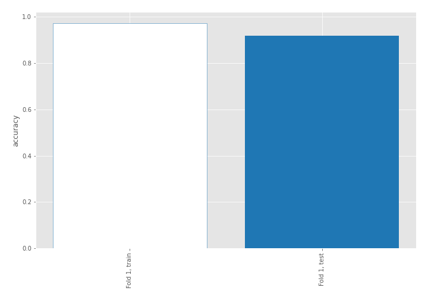

## Decision Tree 

### Tree #1
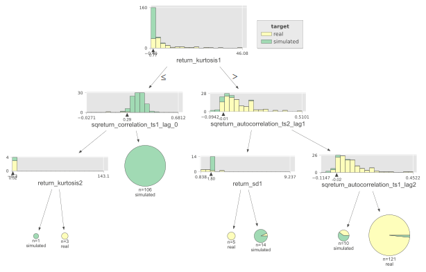

### Rules

if (return_kurtosis1 > 0.769) and (sqreturn_autocorrelation_ts2_lag1 > -0.007) and (sqreturn_autocorrelation_ts1_lag2 > -0.018) then class: real (proba: 98.35%) | based on 121 samples

if (return_kurtosis1 <= 0.769) and (sqreturn_correlation_ts1_lag_0 > 0.286) then class: simulated (proba: 100.0%) | based on 106 samples

if (return_kurtosis1 > 0.769) and (sqreturn_autocorrelation_ts2_lag1 <= -0.007) and (return_sd1 > 1.799) then class: simulated (proba: 92.86%) | based on 14 samples

if (return_kurtosis1 > 0.769) and (sqreturn_autocorrelation_ts2_lag1 > -0.007) and (sqreturn_autocorrelation_ts1_lag2 <= -0.018) then class: simulated (proba: 60.0%) | based on 10 samples

if (return_kurtosis1 > 0.769) and (sqreturn_autocorrelation_ts2_lag1 <= -0.007) and (return_sd1 <= 1.799) then class: real (proba: 100.0%) | based on 5 samples

if (return_kurtosis1 <= 0.769) and (sqreturn_correlation_ts1_lag_0 <= 0.286) and (return_kurtosis2 > 0.519) then class: real (proba: 100.0%) | based on 3 samples

if (return_kurtosis1 <= 0.769) and (sqreturn_correlation_ts1_lag_0 <= 0.286) and (return_kurtosis2 <= 0.519) then class: simulated (proba: 100.0%) | based on 1 samples

## Permutation-based Importance
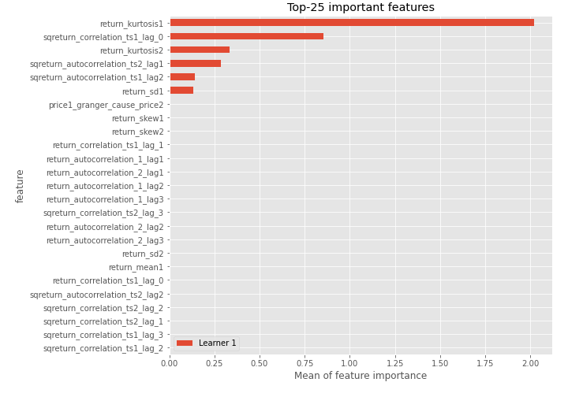
## Confusion Matrix

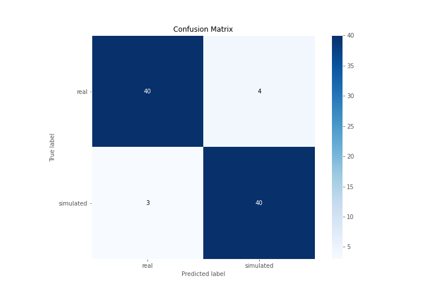

## Normalized Confusion Matrix

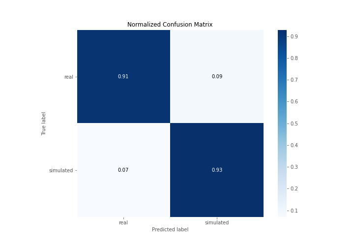

## ROC Curve

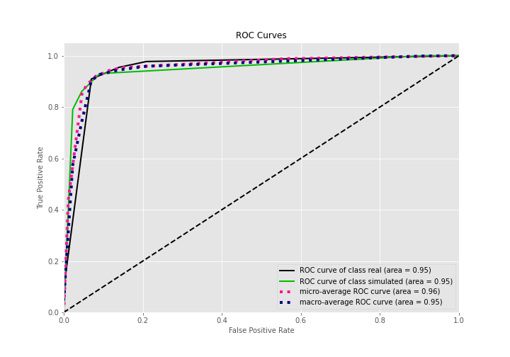

## Kolmogorov-Smirnov Statistic

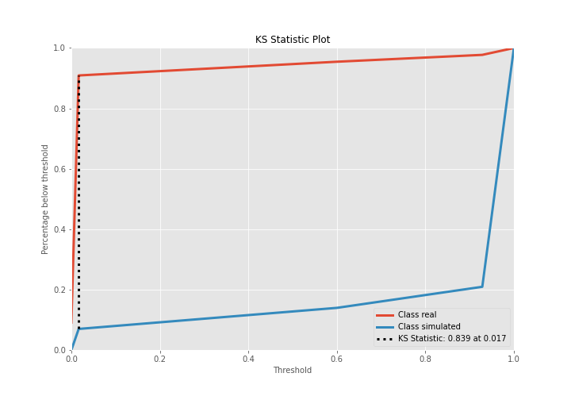

## Precision-Recall Curve

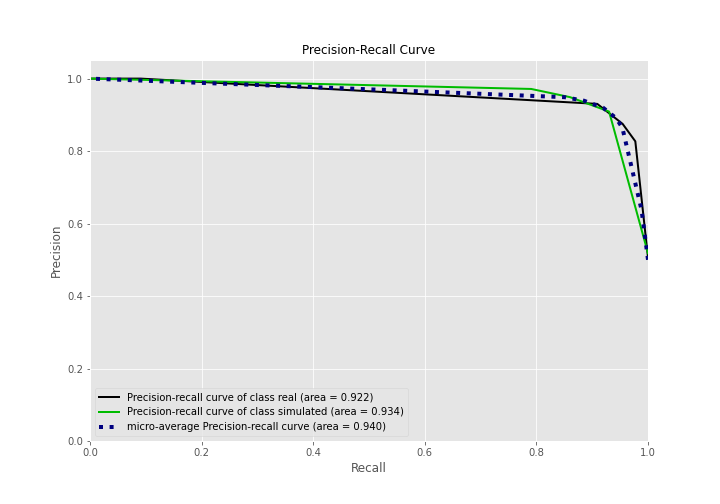

## Calibration Curve

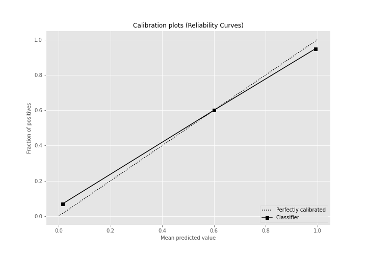

## Cumulative Gains Curve

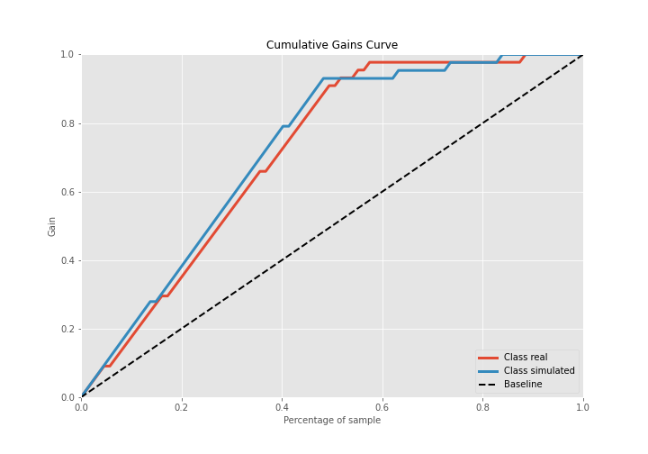

## Lift Curve

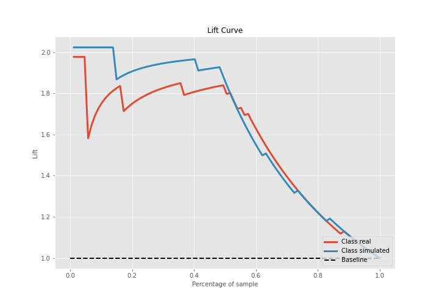

## SHAP Importance
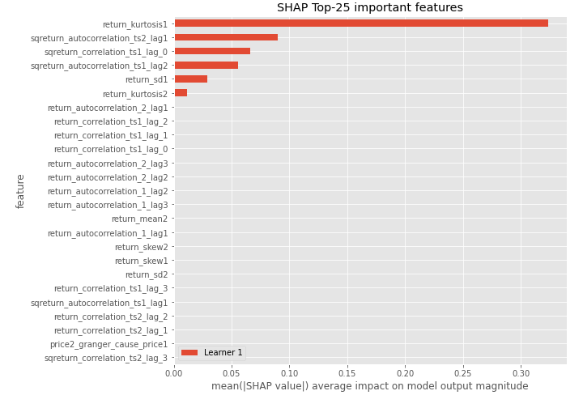

## SHAP Dependence plots

### Dependence (Fold 1)
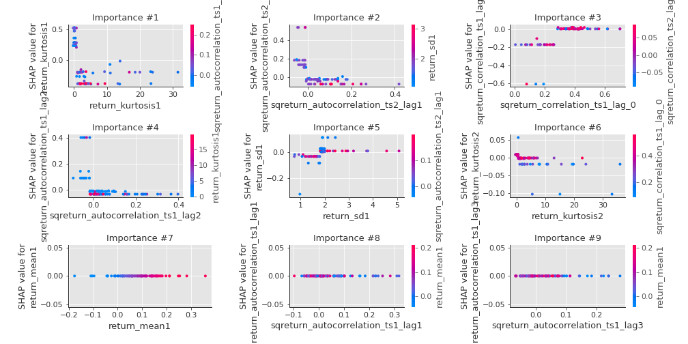

## SHAP Decision plots

### Top-10 Worst decisions for class 0 (Fold 1)
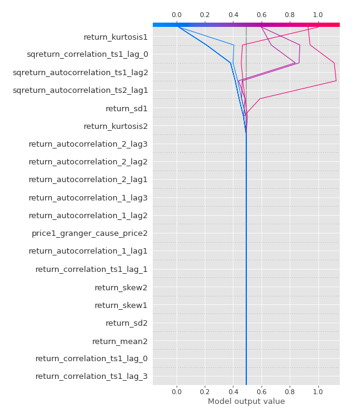
### Top-10 Best decisions for class 0 (Fold 1)
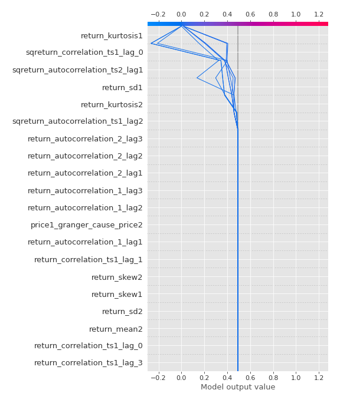
### Top-10 Worst decisions for class 1 (Fold 1)
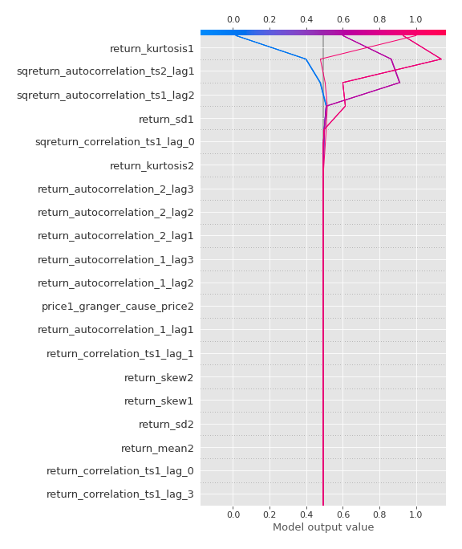
### Top-10 Best decisions for class 1 (Fold 1)
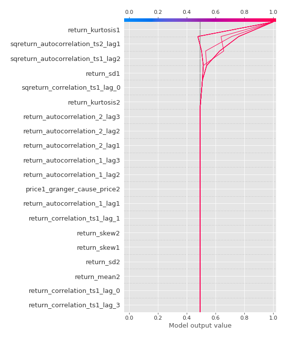

[<< Go back](../README.md)
