# Exploratory Data Analysis

[<< Go back](../README.md)
## Feature : target
- **Feature type** : categorical
- **Missing** : 0.0%
- **Unique** : 2
- **Count** :347
- **Unique** :2
- **Top** :real
- **Freq** :176

## Feature : return_mean1
- **Feature type** : continous
- **Missing** : 0.0%
- **Unique** : 347
- **Count** :347.0
- **Mean** :0.08313881161616338
- **Std** :0.08557984751539963
- **Min** :-0.22632637961920957
- **25%th Percentile** : 0.03167023719857962
- **50%th Percentile** : 0.07780617186527064
- **75%th Percentile** : 0.1334615437541985
- **Max** :0.37175100008111034

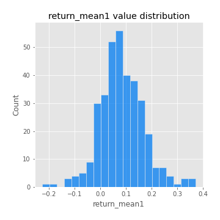
## Feature : return_mean2
- **Feature type** : continous
- **Missing** : 0.0%
- **Unique** : 347
- **Count** :347.0
- **Mean** :0.05107662370944628
- **Std** :0.09505479090567515
- **Min** :-0.24205418062825398
- **25%th Percentile** : 0.0012978981071361914
- **50%th Percentile** : 0.054204099096103874
- **75%th Percentile** : 0.09862599115031898
- **Max** :0.49567035843335516

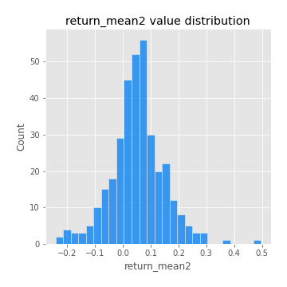
## Feature : return_sd1
- **Feature type** : continous
- **Missing** : 0.0%
- **Unique** : 347
- **Count** :347.0
- **Mean** :1.921699411811333
- **Std** :0.7496809183917638
- **Min** :0.7470080772831957
- **25%th Percentile** : 1.6733509823646724
- **50%th Percentile** : 1.8674331730020133
- **75%th Percentile** : 1.9639980479263504
- **Max** :9.236766377527575

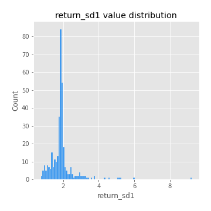
## Feature : return_sd2
- **Feature type** : continous
- **Missing** : 0.0%
- **Unique** : 347
- **Count** :347.0
- **Mean** :1.8955241177310755
- **Std** :0.7452142822040171
- **Min** :0.8455946193085045
- **25%th Percentile** : 1.620532093518578
- **50%th Percentile** : 1.8114310782757608
- **75%th Percentile** : 1.8988208686779888
- **Max** :6.737618636746393

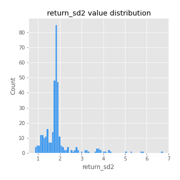
## Feature : return_skew1
- **Feature type** : continous
- **Missing** : 0.0%
- **Unique** : 347
- **Count** :347.0
- **Mean** :-0.09315666099019947
- **Std** :0.6241658094806778
- **Min** :-3.530116233761814
- **25%th Percentile** : -0.22778694068386585
- **50%th Percentile** : -0.0555669120603265
- **75%th Percentile** : 0.1128717814356157
- **Max** :2.5845963767725557

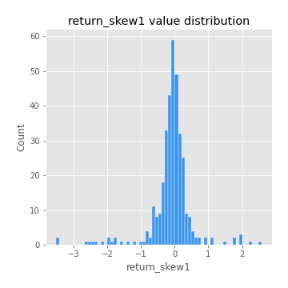
## Feature : return_skew2
- **Feature type** : continous
- **Missing** : 0.0%
- **Unique** : 347
- **Count** :347.0
- **Mean** :-0.17121459818581355
- **Std** :0.847450681996974
- **Min** :-8.801502855292393
- **25%th Percentile** : -0.31107179502400456
- **50%th Percentile** : -0.06021178705422198
- **75%th Percentile** : 0.12679029830246086
- **Max** :2.2606839051517187

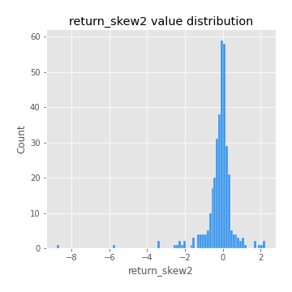
## Feature : return_kurtosis1
- **Feature type** : continous
- **Missing** : 0.0%
- **Unique** : 347
- **Count** :347.0
- **Mean** :3.652803291428626
- **Std** :6.337297073650466
- **Min** :-0.40015619251972767
- **25%th Percentile** : 0.20222930855635868
- **50%th Percentile** : 1.2496593623026109
- **75%th Percentile** : 3.991611060155577
- **Max** :46.07507808162177

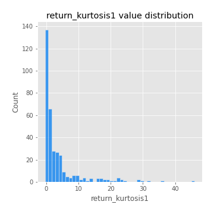
## Feature : return_kurtosis2
- **Feature type** : continous
- **Missing** : 0.0%
- **Unique** : 347
- **Count** :347.0
- **Mean** :4.455485959601242
- **Std** :10.47063468931103
- **Min** :-0.4848881727361385
- **25%th Percentile** : 0.3278517428560008
- **50%th Percentile** : 1.6425831371067878
- **75%th Percentile** : 4.58402629538977
- **Max** :143.10871011533666

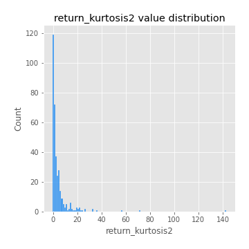
## Feature : return_autocorrelation_1_lag1
- **Feature type** : continous
- **Missing** : 0.0%
- **Unique** : 347
- **Count** :347.0
- **Mean** :-0.004345772213344486
- **Std** :0.05747301351178628
- **Min** :-0.19339575314049967
- **25%th Percentile** : -0.03375720633927746
- **50%th Percentile** : 0.003957927248054291
- **75%th Percentile** : 0.034518639864715484
- **Max** :0.12810656890648087

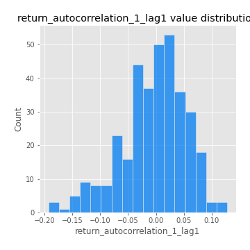
## Feature : return_autocorrelation_1_lag2
- **Feature type** : continous
- **Missing** : 0.0%
- **Unique** : 347
- **Count** :347.0
- **Mean** :-0.002123840823907885
- **Std** :0.05135799741327936
- **Min** :-0.13996496919499263
- **25%th Percentile** : -0.03624730064290761
- **50%th Percentile** : -0.0005784876361107017
- **75%th Percentile** : 0.03086059039798443
- **Max** :0.17388054605203646

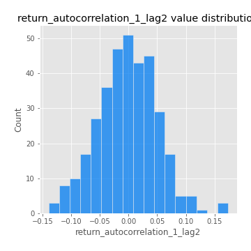
## Feature : return_autocorrelation_1_lag3
- **Feature type** : continous
- **Missing** : 0.0%
- **Unique** : 347
- **Count** :347.0
- **Mean** :0.007007825123109208
- **Std** :0.04831322897651136
- **Min** :-0.15117275786205733
- **25%th Percentile** : -0.02242272006936217
- **50%th Percentile** : 0.006847832043309474
- **75%th Percentile** : 0.03702234923881739
- **Max** :0.17805869530681923

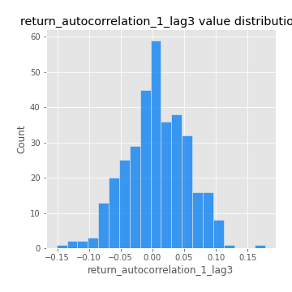
## Feature : return_autocorrelation_2_lag1
- **Feature type** : continous
- **Missing** : 0.0%
- **Unique** : 347
- **Count** :347.0
- **Mean** :0.0017364924217653718
- **Std** :0.0669784258895775
- **Min** :-0.25075531010123286
- **25%th Percentile** : -0.0357240663942695
- **50%th Percentile** : 0.009429740404403763
- **75%th Percentile** : 0.04429965333775168
- **Max** :0.31863413537898483

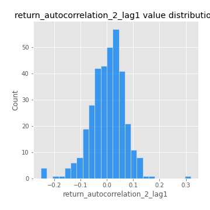
## Feature : return_autocorrelation_2_lag2
- **Feature type** : continous
- **Missing** : 0.0%
- **Unique** : 347
- **Count** :347.0
- **Mean** :0.006739987661742962
- **Std** :0.05577527169731992
- **Min** :-0.15323211089747296
- **25%th Percentile** : -0.03300450467360328
- **50%th Percentile** : 0.01001902404661531
- **75%th Percentile** : 0.04454918480675042
- **Max** :0.20974504043791217

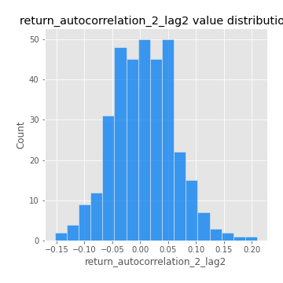
## Feature : return_autocorrelation_2_lag3
- **Feature type** : continous
- **Missing** : 0.0%
- **Unique** : 347
- **Count** :347.0
- **Mean** :0.007207278365116549
- **Std** :0.052675902272487446
- **Min** :-0.14200107169559698
- **25%th Percentile** : -0.02674639794007584
- **50%th Percentile** : 0.007217671331191975
- **75%th Percentile** : 0.04435651674798646
- **Max** :0.1419999376914021

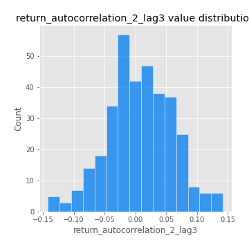
## Feature : return_correlation_ts1_lag_0
- **Feature type** : continous
- **Missing** : 0.0%
- **Unique** : 347
- **Count** :347.0
- **Mean** :0.34485523120496175
- **Std** :0.11798279975566225
- **Min** :-0.027089510445801036
- **25%th Percentile** : 0.28474784222741945
- **50%th Percentile** : 0.35843153577359194
- **75%th Percentile** : 0.40899110167705227
- **Max** :0.7041861626832071

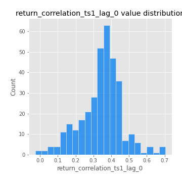
## Feature : return_correlation_ts1_lag_1
- **Feature type** : continous
- **Missing** : 0.0%
- **Unique** : 347
- **Count** :347.0
- **Mean** :0.006948810377957219
- **Std** :0.05406621690051967
- **Min** :-0.15776193292681923
- **25%th Percentile** : -0.027532083060081577
- **50%th Percentile** : 0.01184076810127964
- **75%th Percentile** : 0.04397991610744499
- **Max** :0.15620361221311613

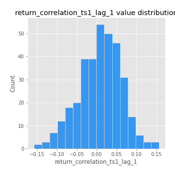
## Feature : return_correlation_ts1_lag_2
- **Feature type** : continous
- **Missing** : 0.0%
- **Unique** : 347
- **Count** :347.0
- **Mean** :0.0068424043073205335
- **Std** :0.046641575124631844
- **Min** :-0.11523251525020971
- **25%th Percentile** : -0.024475296775775653
- **50%th Percentile** : 0.006932522837678447
- **75%th Percentile** : 0.038418599700069396
- **Max** :0.13451659887544612

## Feature : return_correlation_ts1_lag_3
- **Feature type** : continous
- **Missing** : 0.0%
- **Unique** : 347
- **Count** :347.0
- **Mean** :0.010722030606440407
- **Std** :0.04928798013542274
- **Min** :-0.1270218498974763
- **25%th Percentile** : -0.021217935630986964
- **50%th Percentile** : 0.010351947554316066
- **75%th Percentile** : 0.04474038565010591
- **Max** :0.1636773216468148

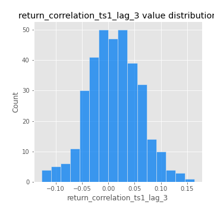
## Feature : return_correlation_ts2_lag_1
- **Feature type** : continous
- **Missing** : 0.0%
- **Unique** : 347
- **Count** :347.0
- **Mean** :0.0017790636207764478
- **Std** :0.05480416695575925
- **Min** :-0.20093919236581337
- **25%th Percentile** : -0.03137524088930134
- **50%th Percentile** : 0.005324970425334172
- **75%th Percentile** : 0.040153616033420395
- **Max** :0.11556235671885211

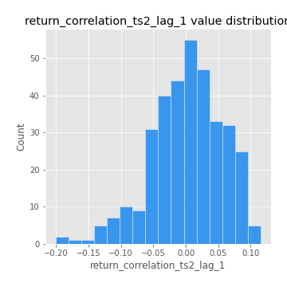
## Feature : return_correlation_ts2_lag_2
- **Feature type** : continous
- **Missing** : 0.0%
- **Unique** : 347
- **Count** :347.0
- **Mean** :0.005080141033331794
- **Std** :0.049329672549459525
- **Min** :-0.15299951737180204
- **25%th Percentile** : -0.028127506257502943
- **50%th Percentile** : 0.0018815406597969967
- **75%th Percentile** : 0.03832121316941903
- **Max** :0.20772887392904255

## Feature : return_correlation_ts2_lag_3
- **Feature type** : continous
- **Missing** : 0.0%
- **Unique** : 347
- **Count** :347.0
- **Mean** :0.006894172985835607
- **Std** :0.0524329980617968
- **Min** :-0.17564076057312866
- **25%th Percentile** : -0.02405753606385238
- **50%th Percentile** : 0.012997641470095127
- **75%th Percentile** : 0.046348606182203655
- **Max** :0.1369357222202695

## Feature : sqreturn_autocorrelation_ts1_lag1
- **Feature type** : continous
- **Missing** : 0.0%
- **Unique** : 347
- **Count** :347.0
- **Mean** :0.046081297084552025
- **Std** :0.09114403801234996
- **Min** :-0.11573115205104206
- **25%th Percentile** : -0.012127553408692981
- **50%th Percentile** : 0.02459550803438465
- **75%th Percentile** : 0.08077604747526154
- **Max** :0.4439086285737898

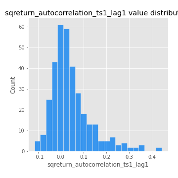
## Feature : sqreturn_autocorrelation_ts1_lag2
- **Feature type** : continous
- **Missing** : 0.0%
- **Unique** : 347
- **Count** :347.0
- **Mean** :0.039879064106322915
- **Std** :0.08460604938647807
- **Min** :-0.11466109115449515
- **25%th Percentile** : -0.012069220561378942
- **50%th Percentile** : 0.021384477358926204
- **75%th Percentile** : 0.06899509530633788
- **Max** :0.4522162366773919

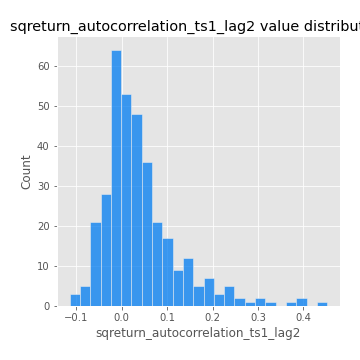
## Feature : sqreturn_autocorrelation_ts1_lag3
- **Feature type** : continous
- **Missing** : 0.0%
- **Unique** : 347
- **Count** :347.0
- **Mean** :0.028538792644025566
- **Std** :0.07295961210318733
- **Min** :-0.10475689558835152
- **25%th Percentile** : -0.01776853149687492
- **50%th Percentile** : 0.014269743043924777
- **75%th Percentile** : 0.05576378630224357
- **Max** :0.41030914918857014

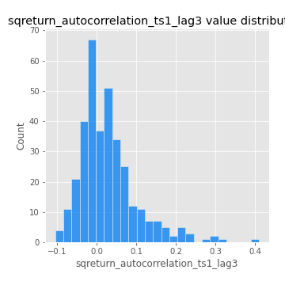
## Feature : sqreturn_autocorrelation_ts2_lag1
- **Feature type** : continous
- **Missing** : 0.0%
- **Unique** : 347
- **Count** :347.0
- **Mean** :0.05080885946508435
- **Std** :0.08897617357123887
- **Min** :-0.09416423459811524
- **25%th Percentile** : -0.008654210633543592
- **50%th Percentile** : 0.031192427314539892
- **75%th Percentile** : 0.0849836873620033
- **Max** :0.510085647437958

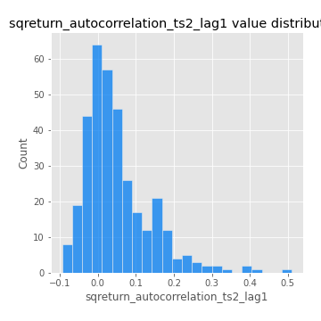
## Feature : sqreturn_autocorrelation_ts2_lag2
- **Feature type** : continous
- **Missing** : 0.0%
- **Unique** : 347
- **Count** :347.0
- **Mean** :0.03859589821475544
- **Std** :0.08660721112672329
- **Min** :-0.12128128744734872
- **25%th Percentile** : -0.01434594572612936
- **50%th Percentile** : 0.015009649875009542
- **75%th Percentile** : 0.05633977268270404
- **Max** :0.45676817892778204

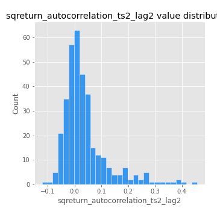
## Feature : sqreturn_autocorrelation_ts2_lag3
- **Feature type** : continous
- **Missing** : 0.0%
- **Unique** : 347
- **Count** :347.0
- **Mean** :0.02702127721188128
- **Std** :0.07187241611725992
- **Min** :-0.11013094740353686
- **25%th Percentile** : -0.018736827818046004
- **50%th Percentile** : 0.011418032065381584
- **75%th Percentile** : 0.04944481630922454
- **Max** :0.31225727797735664

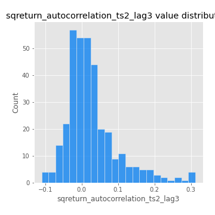
## Feature : sqreturn_correlation_ts1_lag_0
- **Feature type** : continous
- **Missing** : 0.0%
- **Unique** : 347
- **Count** :347.0
- **Mean** :0.34485523120496175
- **Std** :0.11798279975566225
- **Min** :-0.027089510445801036
- **25%th Percentile** : 0.28474784222741945
- **50%th Percentile** : 0.35843153577359194
- **75%th Percentile** : 0.40899110167705227
- **Max** :0.7041861626832071

## Feature : sqreturn_correlation_ts1_lag_1
- **Feature type** : continous
- **Missing** : 0.0%
- **Unique** : 347
- **Count** :347.0
- **Mean** :0.006948810377957219
- **Std** :0.05406621690051967
- **Min** :-0.15776193292681923
- **25%th Percentile** : -0.027532083060081577
- **50%th Percentile** : 0.01184076810127964
- **75%th Percentile** : 0.04397991610744499
- **Max** :0.15620361221311613

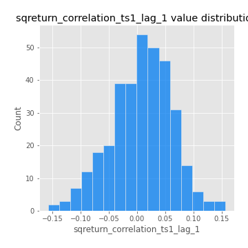
## Feature : sqreturn_correlation_ts1_lag_2
- **Feature type** : continous
- **Missing** : 0.0%
- **Unique** : 347
- **Count** :347.0
- **Mean** :0.0068424043073205335
- **Std** :0.046641575124631844
- **Min** :-0.11523251525020971
- **25%th Percentile** : -0.024475296775775653
- **50%th Percentile** : 0.006932522837678447
- **75%th Percentile** : 0.038418599700069396
- **Max** :0.13451659887544612

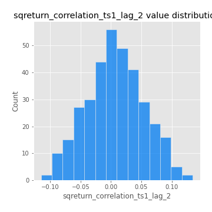
## Feature : sqreturn_correlation_ts1_lag_3
- **Feature type** : continous
- **Missing** : 0.0%
- **Unique** : 347
- **Count** :347.0
- **Mean** :0.010722030606440407
- **Std** :0.04928798013542274
- **Min** :-0.1270218498974763
- **25%th Percentile** : -0.021217935630986964
- **50%th Percentile** : 0.010351947554316066
- **75%th Percentile** : 0.04474038565010591
- **Max** :0.1636773216468148

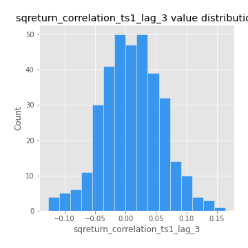
## Feature : sqreturn_correlation_ts2_lag_1
- **Feature type** : continous
- **Missing** : 0.0%
- **Unique** : 347
- **Count** :347.0
- **Mean** :0.0017790636207764478
- **Std** :0.05480416695575925
- **Min** :-0.20093919236581337
- **25%th Percentile** : -0.03137524088930134
- **50%th Percentile** : 0.005324970425334172
- **75%th Percentile** : 0.040153616033420395
- **Max** :0.11556235671885211

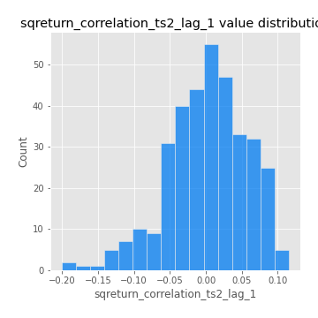
## Feature : sqreturn_correlation_ts2_lag_2
- **Feature type** : continous
- **Missing** : 0.0%
- **Unique** : 347
- **Count** :347.0
- **Mean** :0.005080141033331794
- **Std** :0.049329672549459525
- **Min** :-0.15299951737180204
- **25%th Percentile** : -0.028127506257502943
- **50%th Percentile** : 0.0018815406597969967
- **75%th Percentile** : 0.03832121316941903
- **Max** :0.20772887392904255

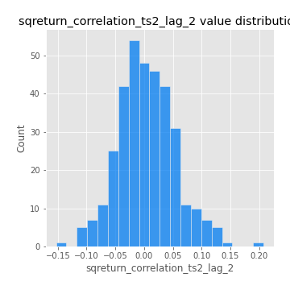
## Feature : sqreturn_correlation_ts2_lag_3
- **Feature type** : continous
- **Missing** : 0.0%
- **Unique** : 347
- **Count** :347.0
- **Mean** :0.006894172985835607
- **Std** :0.0524329980617968
- **Min** :-0.17564076057312866
- **25%th Percentile** : -0.02405753606385238
- **50%th Percentile** : 0.012997641470095127
- **75%th Percentile** : 0.046348606182203655
- **Max** :0.1369357222202695

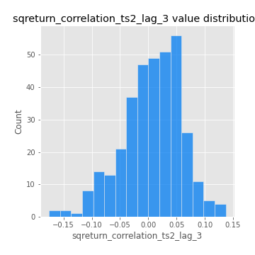
## Feature : price2_granger_cause_price1
- **Feature type** : continous
- **Missing** : 0.0%
- **Unique** : 347
- **Count** :347.0
- **Mean** :0.2713417503481279
- **Std** :0.28065792721023636
- **Min** :7.831100549119084e-07
- **25%th Percentile** : 0.023676831864883438
- **50%th Percentile** : 0.16843713293279852
- **75%th Percentile** : 0.4733236509677635
- **Max** :0.9995976251376163

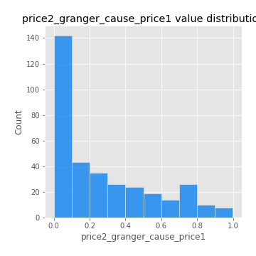
## Feature : price1_granger_cause_price2
- **Feature type** : continous
- **Missing** : 0.0%
- **Unique** : 347
- **Count** :347.0
- **Mean** :0.20964185806704874
- **Std** :0.26346230124210607
- **Min** :1.3477723684591404e-10
- **25%th Percentile** : 0.0029932522852951374
- **50%th Percentile** : 0.08219965029328882
- **75%th Percentile** : 0.34350420929145625
- **Max** :0.9951398266867577

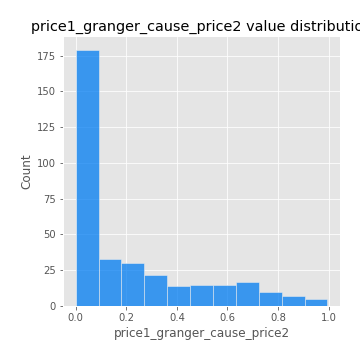

[<< Go back](../README.md)
