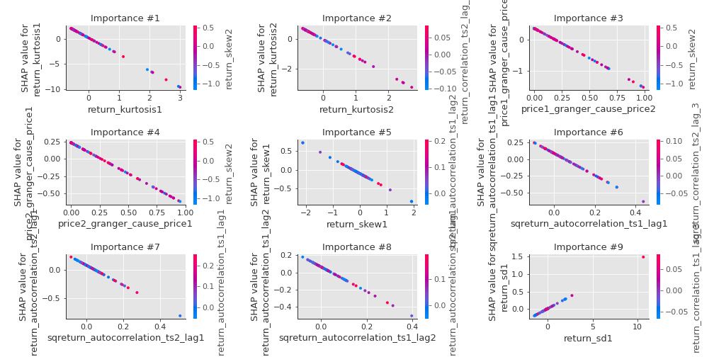

# Summary of 3_Linear

[<< Go back](../README.md)

## Logistic Regression (Linear)
- **n_jobs**: -1
- **explain_level**: 2

## Validation
 - **validation_type**: split
 - **train_ratio**: 0.75
 - **shuffle**: True
 - **stratify**: True

## Optimized metric
accuracy

## Training time

8.2 seconds

## Metric details
|           |    score |     threshold |
|:----------|---------:|--------------:|
| logloss   | 0.177334 | nan           |
| auc       | 0.99418  | nan           |
| f1        | 0.965517 |   0.693692    |
| accuracy  | 0.965517 |   0.693692    |
| precision | 1        |   0.693692    |
| recall    | 1        |   1.78634e-06 |
| mcc       | 0.933333 |   0.693692    |

## Confusion matrix (at threshold=0.693692)
|                      |   Predicted as real |   Predicted as simulated |
|:---------------------|--------------------:|-------------------------:|
| Labeled as real      |                  42 |                        0 |
| Labeled as simulated |                   3 |                       42 |

## Learning curves

## Coefficients
| feature                           |   Learner_1 |
|:----------------------------------|------------:|
| return_autocorrelation_2_lag1     |   0.815574  |
| return_mean1                      |   0.799045  |
| sqreturn_correlation_ts1_lag_1    |   0.784099  |
| return_correlation_ts1_lag_1      |   0.784099  |
| return_correlation_ts1_lag_0      |   0.767628  |
| sqreturn_correlation_ts1_lag_0    |   0.767628  |
| return_autocorrelation_1_lag2     |   0.694039  |
| return_autocorrelation_2_lag2     |   0.678869  |
| sqreturn_correlation_ts2_lag_1    |   0.649518  |
| return_correlation_ts2_lag_1      |   0.649518  |
| return_autocorrelation_1_lag1     |   0.567402  |
| sqreturn_correlation_ts2_lag_2    |   0.548371  |
| return_correlation_ts2_lag_2      |   0.548371  |
| sqreturn_correlation_ts2_lag_3    |   0.516777  |
| return_correlation_ts2_lag_3      |   0.516777  |
| sqreturn_correlation_ts1_lag_2    |   0.48845   |
| return_correlation_ts1_lag_2      |   0.48845   |
| return_autocorrelation_2_lag3     |   0.459793  |
| return_autocorrelation_1_lag3     |   0.404274  |
| sqreturn_correlation_ts1_lag_3    |   0.217151  |
| return_correlation_ts1_lag_3      |   0.217151  |
| return_skew2                      |   0.140746  |
| return_sd1                        |   0.138619  |
| return_sd2                        |  -0.0907219 |
| return_mean2                      |  -0.207828  |
| return_skew1                      |  -0.385973  |
| intercept                         |  -0.498748  |
| price2_granger_cause_price1       |  -0.885946  |
| return_kurtosis2                  |  -1.17955   |
| sqreturn_autocorrelation_ts2_lag3 |  -1.24202   |
| sqreturn_autocorrelation_ts1_lag3 |  -1.29901   |
| sqreturn_autocorrelation_ts1_lag2 |  -1.44826   |
| sqreturn_autocorrelation_ts2_lag2 |  -1.45628   |
| sqreturn_autocorrelation_ts1_lag1 |  -1.64622   |
| sqreturn_autocorrelation_ts2_lag1 |  -1.75019   |
| price1_granger_cause_price2       |  -1.874     |
| return_kurtosis1                  |  -3.26727   |

## Permutation-based Importance

## Confusion Matrix

## Normalized Confusion Matrix

## ROC Curve

## Kolmogorov-Smirnov Statistic

## Precision-Recall Curve

## Calibration Curve

## Cumulative Gains Curve

## Lift Curve

## SHAP Importance

## SHAP Dependence plots

### Dependence (Fold 1)

## SHAP Decision plots

### Top-10 Worst decisions for class 0 (Fold 1)

### Top-10 Best decisions for class 0 (Fold 1)

### Top-10 Worst decisions for class 1 (Fold 1)

### Top-10 Best decisions for class 1 (Fold 1)

[<< Go back](../README.md)
